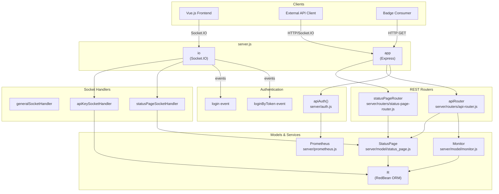
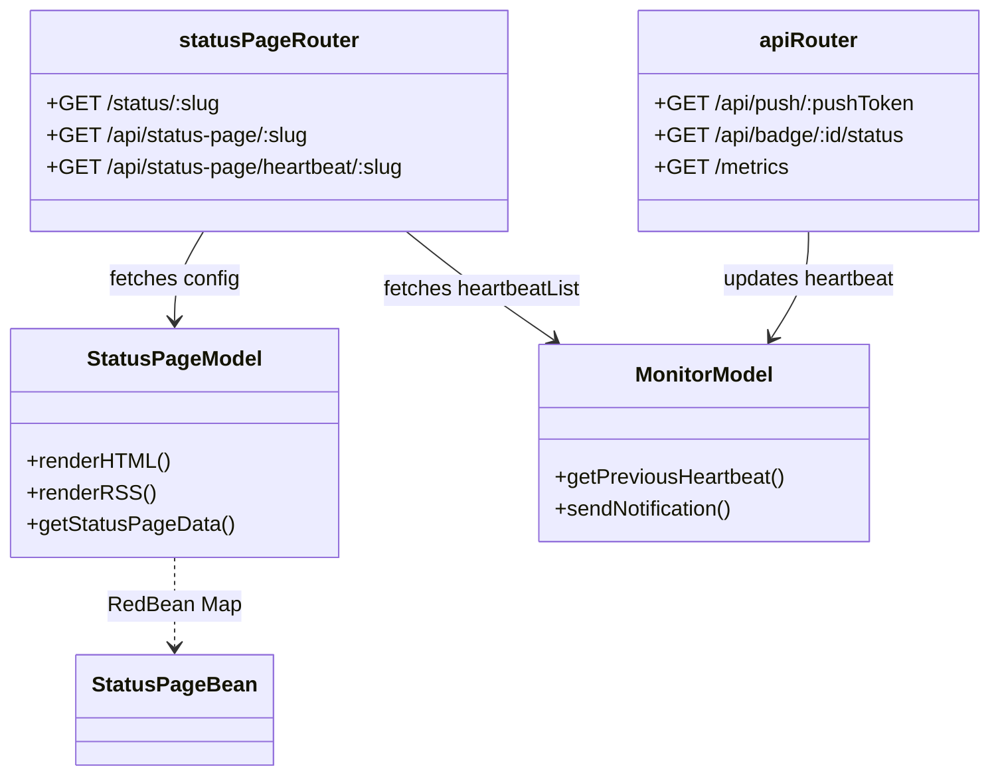

# API Reference

Relevant source files

The following files were used as context for generating this wiki page:

- [server/auth.js](server/auth.js)
- [server/image-data-uri.js](server/image-data-uri.js)
- [server/jobs.js](server/jobs.js)
- [server/jobs/clear-old-data.js](server/jobs/clear-old-data.js)
- [server/jobs/incremental-vacuum.js](server/jobs/incremental-vacuum.js)
- [server/model/status_page.js](server/model/status_page.js)
- [server/prometheus.js](server/prometheus.js)
- [server/rate-limiter.js](server/rate-limiter.js)
- [server/routers/api-router.js](server/routers/api-router.js)
- [server/routers/status-page-router.js](server/routers/status-page-router.js)
- [server/socket-handlers/api-key-socket-handler.js](server/socket-handlers/api-key-socket-handler.js)
- [server/socket-handlers/status-page-socket-handler.js](server/socket-handlers/status-page-socket-handler.js)
- [src/pages/StatusPage.vue](src/pages/StatusPage.vue)

Uptime Kuma provides programmatic access through two primary interfaces: a **Socket.IO API** for real-time bidirectional communication (used by the web UI), and a **REST API** for specific public endpoints, push monitors, badges, heartbeats, and integrations.

This page provides an overview of both API interfaces, authentication methods, and usage patterns. For detailed event and endpoint listings, see:
- **[Socket.IO Events](#9.1)** — Complete reference of WebSocket-based API events including monitor management, notification operations, and real-time data streams.
- **[REST API Endpoints](#9.2)** — HTTP endpoints for status pages, push monitors, badges, heartbeats, and Prometheus metrics.

## API Architecture Overview

Uptime Kuma's API architecture consists of two distinct interfaces:

1.  **Socket.IO API (Primary)** — WebSocket-based real-time communication for all CRUD operations on monitors, notifications, settings, and status pages. This is the interface used by the Vue.js frontend and supports full authentication with JWT tokens.
2.  **REST API (Secondary)** — HTTP endpoints for public-facing features like badge generation, status page data, push monitor updates, and Prometheus metrics. Most endpoints do not require authentication except for `/metrics`.

**API Interface Architecture**

Sources:
- [server/routers/api-router.js:22-26]() - Express router and Socket.IO instance initialization
- [server/socket-handlers/status-page-socket-handler.js:32]() - Status page socket handler entry point
- [server/socket-handlers/api-key-socket-handler.js:16]() - API key socket handler entry point
- [server/auth.js:155]() - `apiAuth` middleware definition
- [server/prometheus.js:12]() - Prometheus metrics service

## Authentication Methods

Uptime Kuma supports three authentication methods depending on the interface:

| Authentication Method | Used By | Implementation | Format |
| :--- | :--- | :--- | :--- |
| **JWT Token** | Socket.IO API | `loginByToken`, `login` events | `Authorization: Bearer <token>` |
| **API Key** | REST API | `verifyAPIKey` function | `Authorization: Basic base64(user:uk{id}_{key})` |
| **Basic Auth** | REST API | `userAuthorizer` function | `Authorization: Basic base64(user:pass)` |

### JWT Token Authentication (Socket.IO)
The Socket.IO interface uses JWT tokens. After connecting, clients authenticate via the `login` event (username/password) or `loginByToken`. The server verifies these credentials against the `user` table [server/auth.js:20]().

### API Key Authentication (REST)
API keys allow programmatic access to protected REST endpoints like `/metrics`. Keys are generated via the `addAPIKey` socket event [server/socket-handlers/api-key-socket-handler.js:18](), which creates a cryptographically secure key using `nanoid(40)` [server/socket-handlers/api-key-socket-handler.js:22](). 

**API Key Format:** `uk{id}_{clearKey}`.
The server verifies the key by extracting the ID, fetching the hashed key from the `api_key` table, and verifying it using `passwordHash.verify()` [server/auth.js:47-62]().

Sources:
- [server/auth.js:15-34]() - `login` function implementation
- [server/auth.js:41-63]() - `verifyAPIKey` logic
- [server/socket-handlers/api-key-socket-handler.js:18-52]() - `addAPIKey` event handler

## REST API Overview

The REST API provides endpoints for external integrations and public data.

### Push Monitors
The `/api/push/:pushToken` endpoint allows "Push" type monitors to report their status [server/routers/api-router.js:47](). It supports reporting status (`up`/`down`), custom messages, and response times (ping) [server/routers/api-router.js:49-53](). It automatically updates the heartbeat and triggers notifications if the status changes [server/routers/api-router.js:102-123]().

### Status Badges
Uptime Kuma generates SVG badges using the `badge-maker` library [server/routers/api-router.js:16](). Endpoints are available for:
- **Status**: `/api/badge/:id/status` [server/routers/api-router.js:148]()
- **Uptime**: `/api/badge/:id/uptime/:duration?` [server/routers/api-router.js:231]()
- **Ping**: `/api/badge/:id/ping/:duration?` [server/routers/api-router.js:359]()
- **Status Page Overall Status**: `/api/status-page/:slug/badge` [server/routers/status-page-router.js:170]()

### Status Pages
Status pages are served via the `/status/:slug` route [server/routers/status-page-router.js:16](). They support Server-Side Rendering (SSR) to inject metadata, OG tags, and preload data for SEO and performance [server/model/status_page.js:160-200](). They also provide RSS feeds via `/status/:slug/rss` [server/routers/status-page-router.js:22]().

**REST Request Entity Mapping**

Sources:
- [server/routers/api-router.js:47-146]() - Push API implementation
- [server/routers/api-router.js:148-180]() - Status badge implementation
- [server/routers/status-page-router.js:16-20]() - Status page route
- [server/model/status_page.js:160-200]() - Status page HTML rendering logic
- [server/routers/status-page-router.js:64-110]() - Heartbeat polling for status pages

## Rate Limiting and Caching

To ensure system stability, Uptime Kuma employs rate limiting and caching strategies:

*   **Rate Limiting**: Applied to login attempts (`loginRateLimiter`), API requests (`apiRateLimiter`), and 2FA verification (`twoFaRateLimiter`) [server/rate-limiter.js:50-75]().
*   **Caching**: The REST API uses `apicache` middleware [server/routers/api-router.js:24]().
    *   Status pages and badges are typically cached for 5 minutes [server/routers/status-page-router.js:16]().
    *   Heartbeat data for status pages is cached for 1 minute [server/routers/status-page-router.js:64]().
    *   Status page manifests are cached for 1440 minutes (24 hours) [server/routers/status-page-router.js:113]().

Sources:
- [server/auth.js:81-97]() - `apiAuthorizer` with rate limiting
- [server/rate-limiter.js:50-75]() - Rate limiter definitions
- [server/routers/api-router.js:24]() - Cache middleware initialization
- [server/routers/status-page-router.js:13]() - Status page cache middleware

## Background Jobs

The system runs internal maintenance tasks via a cron-based job system [server/jobs.js:6-19]():
- **`clear-old-data`**: Removes heartbeats and daily stats older than the configured retention period (default 365 days) [server/jobs/clear-old-data.js:7-13](). It also executes `PRAGMA optimize` for SQLite [server/jobs/clear-old-data.js:52]().
- **`incremental-vacuum`**: Optimizes the SQLite database every 5 minutes [server/jobs.js:15]().

Sources:
- [server/jobs.js:1-19]() - Background job definitions
- [server/jobs/clear-old-data.js:13-60]() - Data retention logic
