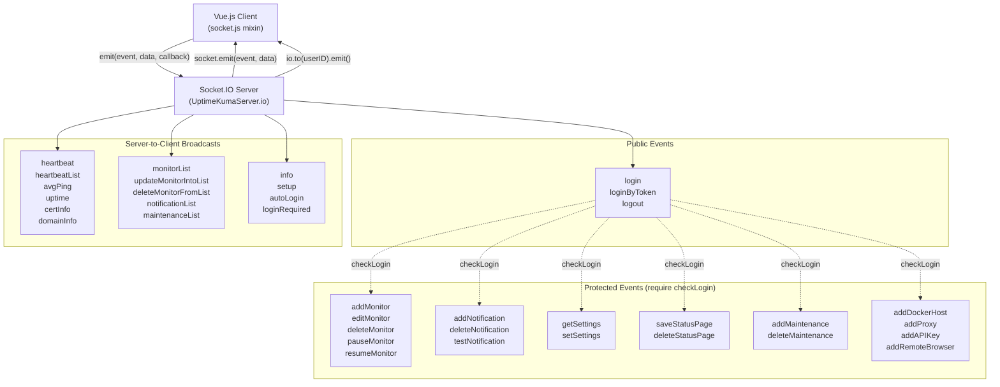
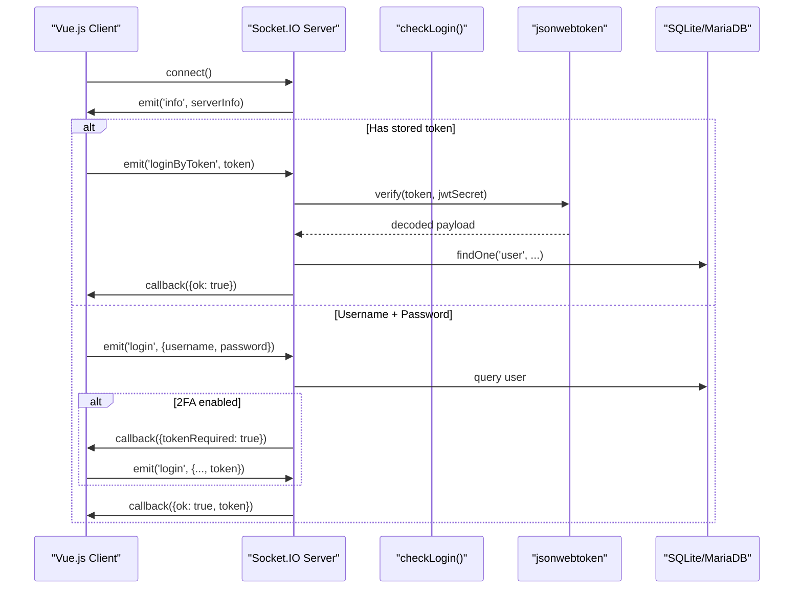
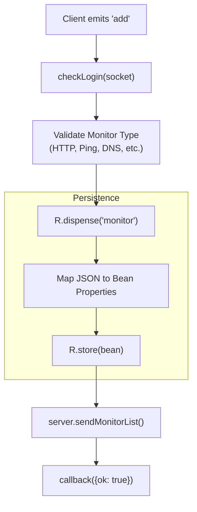
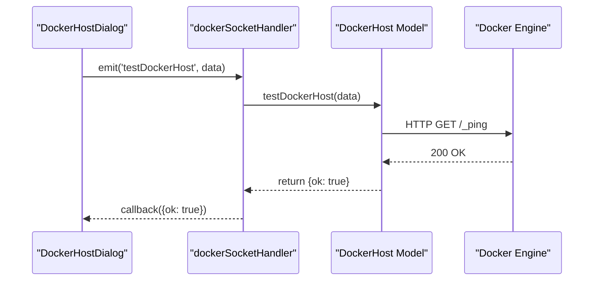

# Socket.IO Events

Relevant source files

The following files were used as context for generating this wiki page:

- [package-lock.json](package-lock.json)
- [package.json](package.json)
- [server/database.js](server/database.js)
- [server/model/monitor.js](server/model/monitor.js)
- [server/server.js](server/server.js)
- [server/socket-handlers/cloudflared-socket-handler.js](server/socket-handlers/cloudflared-socket-handler.js)
- [server/socket-handlers/database-socket-handler.js](server/socket-handlers/database-socket-handler.js)
- [server/socket-handlers/general-socket-handler.js](server/socket-handlers/general-socket-handler.js)
- [server/socket-handlers/proxy-socket-handler.js](server/socket-handlers/proxy-socket-handler.js)
- [server/uptime-kuma-server.js](server/uptime-kuma-server.js)
- [server/util-server.js](server/util-server.js)
- [src/components/PublicGroupList.vue](src/components/PublicGroupList.vue)
- [src/components/settings/ReverseProxy.vue](src/components/settings/ReverseProxy.vue)
- [src/icon.js](src/icon.js)
- [src/layouts/Layout.vue](src/layouts/Layout.vue)
- [src/main.js](src/main.js)
- [src/mixins/socket.js](src/mixins/socket.js)
- [src/pages/EditMonitor.vue](src/pages/EditMonitor.vue)
- [src/pages/Settings.vue](src/pages/Settings.vue)
- [src/router.js](src/router.js)

This document provides a comprehensive reference for all Socket.IO events used in Uptime Kuma's real-time communication layer. Socket.IO enables bidirectional communication between the Vue.js frontend and the Express.js backend, supporting real-time monitor updates, authentication, and system management.

For information about REST API endpoints, see [9.2 REST API Endpoints](). For general architecture of the real-time communication system, see [2.3 Real-Time Communication]().

---

## Event Categories and Flow

Uptime Kuma's Socket.IO implementation organizes events into distinct categories based on functionality. All events flow through a central Socket.IO server instance managed by the `UptimeKumaServer` class [server/uptime-kuma-server.js:144-155]().

**Event Lifecycle Diagram**

**Sources**: [src/mixins/socket.js:122-212](), [server/uptime-kuma-server.js:144-155](), [server/server.js:163-187]()

---

## Connection and Authentication Events

### Client → Server Authentication Events

| Event | Parameters | Purpose | Requires Auth |
|-------|-----------|---------|---------------|
| `login` | `{username, password, token?}` | Authenticate with credentials [server/server.js:132-132]() | No |
| `loginByToken` | `token` | Authenticate using JWT token [src/mixins/socket.js:140-140]() | No |
| `logout` | none | End session and clear token [src/mixins/socket.js:31-31]() | No |
| `prepare2FA` | `currentPassword` | Generate 2FA secret [server/server.js:176-176]() | Yes |
| `save2FA` | `currentPassword` | Enable 2FA for account | Yes |

**Authentication Flow**

**Sources**: [src/mixins/socket.js:130-145](), [server/server.js:105-116](), [server/util-server.js:60-62]()

### Server → Client Authentication Events

| Event | Data | Purpose |
|-------|------|---------|
| `autoLogin` | none | `disableAuth` is enabled [src/mixins/socket.js:130-135]() |
| `loginRequired` | none | User must authenticate [src/mixins/socket.js:137-145]() |
| `setup` | none | Server requires initial database setup [src/mixins/socket.js:126-128]() |

**Sources**: [src/mixins/socket.js:126-145]()

---

## Monitor Management Events

Monitor events handle the lifecycle of heartbeat checks. These are processed via the `Monitor` model [server/model/monitor.js:76-76]().

### Client → Server Monitor Events

| Event | Parameters | Purpose |
|-------|-----------|---------|
| `add` | `monitor, callback` | Create new monitor [server/model/monitor.js:117-213]() |
| `editMonitor` | `monitor, callback` | Update existing monitor [server/model/monitor.js:117-213]() |
| `getMonitor` | `monitorID, callback` | Retrieve monitor details [server/model/monitor.js:85-108]() |
| `pauseMonitor` | `monitorID, callback` | Stop heartbeat checks |
| `resumeMonitor` | `monitorID, callback` | Resume heartbeat checks |
| `deleteMonitor` | `monitorID, callback` | Remove monitor and history |

**Monitor Creation Flow**

**Sources**: [server/model/monitor.js:117-213](), [src/pages/EditMonitor.vue:31-114](), [server/uptime-kuma-server.js:112-135]()

### Server → Client Monitor Events

| Event | Data Structure | Purpose |
|-------|---------------|---------|
| `monitorList` | `{[id]: monitorObject}` | Full list sync [src/mixins/socket.js:147-150]() |
| `updateMonitorIntoList` | `{[id]: monitorObject}` | Incremental update [src/mixins/socket.js:152-157]() |
| `deleteMonitorFromList` | `monitorID` | Remove from client state [src/mixins/socket.js:159-163]() |
| `monitorTypeList` | `{[type]: metadata}` | Supported monitor types [src/mixins/socket.js:165-167]() |

**Sources**: [src/mixins/socket.js:147-167]()

---

## Heartbeat and Real-Time Data Streams

The server streams real-time data to the client to update charts and status indicators without page refreshes.

### Server → Client Real-Time Events

| Event | Data Structure | Update Frequency |
|-------|---------------|------------------|
| `heartbeat` | `{monitorID, status, msg, ping, time}` | Every check [src/mixins/socket.js:204-213]() |
| `heartbeatList` | `{monitorID: [heartbeats]}` | On connection [src/mixins/socket.js:205-207]() |
| `avgPing` | `{monitorID: value}` | Periodic calculation |
| `uptime` | `{monitorID: {24h, 30d}}` | Periodic calculation |
| `certInfo` | `{monitorID: tlsInfo}` | On SSL check [src/mixins/socket.js:246-248]() |

**Heartbeat Data Handling**
The client maintains a buffer of the last 150 heartbeats per monitor for the `HeartbeatBar` component [src/mixins/socket.js:211-213]().

**Sources**: [src/mixins/socket.js:204-267](), [server/model/monitor.js:85-108]()

---

## Settings and Configuration

Global settings are managed via the `Settings` class [server/settings.js]() and synced through these events.

### Client → Server Settings Events

| Event | Parameters | Purpose |
|-------|-----------|---------|
| `getSettings` | `callback` | Fetch all server settings [src/pages/Settings.vue:156-193]() |
| `setSettings` | `settings, password, callback` | Update settings [src/pages/Settings.vue:208-218]() |

**Settings Synchronization**
When `setSettings` is successful, the server broadcasts an updated `info` event to all clients to ensure UI consistency [server/server.js:166-166]().

**Sources**: [src/pages/Settings.vue:155-218](), [server/socket-handlers/general-socket-handler.js:44-54]()

---

## Infrastructure Management

Events for managing external resources like Docker hosts, Proxies, and Remote Browsers.

### Client → Server Management Events

| Event | Parameters | Purpose |
|-------|-----------|---------|
| `addDockerHost` | `host, id, callback` | Register Docker daemon [server/docker.js:68-110]() |
| `testDockerHost` | `host, callback` | Verify connection [server/docker.js:21-61]() |
| `addProxy` | `proxy, id, callback` | Register proxy server |
| `addRemoteBrowser` | `browser, id, callback` | Register Playwright browser |

**Docker Host Connection Test**

**Sources**: [server/docker.js:21-110](), [src/mixins/socket.js:196-202](), [server/server.js:184-184]()

---

## Maintenance and API Keys

| Event Category | Events | Purpose |
|----------------|--------|---------|
| **Maintenance** | `addMaintenance`, `deleteMaintenance`, `getMaintenanceList` | Schedule downtime [src/mixins/socket.js:169-171]() |
| **API Keys** | `addAPIKey`, `deleteAPIKey`, `getAPIKeyList` | Manage programmatic access [src/mixins/socket.js:173-175]() |

**Sources**: [src/mixins/socket.js:169-175](), [server/server.js:185-186]()
