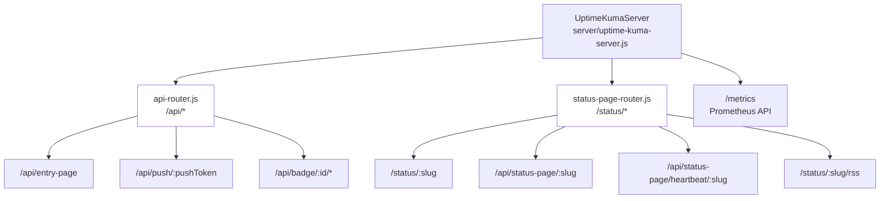
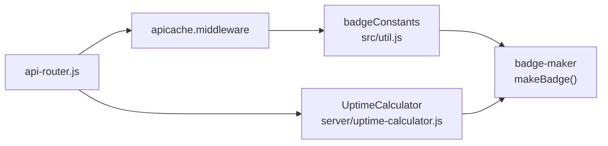
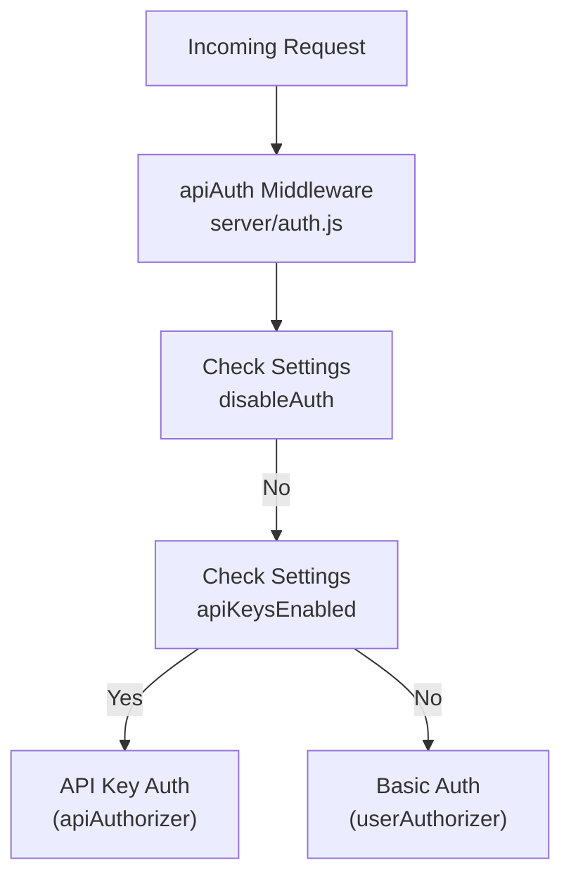

# REST API Endpoints

Relevant source files

The following files were used as context for generating this wiki page:

- [extra/download-dist.js](extra/download-dist.js)
- [extra/push-examples/bash-curl/index.sh](extra/push-examples/bash-curl/index.sh)
- [extra/push-examples/docker/index.sh](extra/push-examples/docker/index.sh)
- [extra/push-examples/javascript-fetch/index.js](extra/push-examples/javascript-fetch/index.js)
- [extra/push-examples/php/index.php](extra/push-examples/php/index.php)
- [extra/push-examples/powershell/index.ps1](extra/push-examples/powershell/index.ps1)
- [extra/push-examples/python/index.py](extra/push-examples/python/index.py)
- [extra/push-examples/typescript-fetch/index.ts](extra/push-examples/typescript-fetch/index.ts)
- [extra/uptime-kuma-push/.gitignore](extra/uptime-kuma-push/.gitignore)
- [extra/uptime-kuma-push/Dockerfile](extra/uptime-kuma-push/Dockerfile)
- [extra/uptime-kuma-push/build.js](extra/uptime-kuma-push/build.js)
- [server/auth.js](server/auth.js)
- [server/image-data-uri.js](server/image-data-uri.js)
- [server/jobs.js](server/jobs.js)
- [server/jobs/clear-old-data.js](server/jobs/clear-old-data.js)
- [server/jobs/incremental-vacuum.js](server/jobs/incremental-vacuum.js)
- [server/model/status_page.js](server/model/status_page.js)
- [server/modules/apicache/apicache.js](server/modules/apicache/apicache.js)
- [server/modules/apicache/index.js](server/modules/apicache/index.js)
- [server/modules/apicache/memory-cache.js](server/modules/apicache/memory-cache.js)
- [server/prometheus.js](server/prometheus.js)
- [server/rate-limiter.js](server/rate-limiter.js)
- [server/routers/api-router.js](server/routers/api-router.js)
- [server/routers/status-page-router.js](server/routers/status-page-router.js)
- [server/socket-handlers/api-key-socket-handler.js](server/socket-handlers/api-key-socket-handler.js)
- [server/socket-handlers/status-page-socket-handler.js](server/socket-handlers/status-page-socket-handler.js)
- [src/pages/StatusPage.vue](src/pages/StatusPage.vue)
- [test/prepare-test-server.js](test/prepare-test-server.js)

## Purpose and Scope

This document covers the **HTTP REST API endpoints** exposed by Uptime Kuma's Express server. These endpoints are primarily designed for:
- **Public access** (status badges, status pages, RSS feeds)
- **Push monitors** (receiving heartbeat data from external sources via tokens)
- **Prometheus metrics** (monitoring Uptime Kuma itself)
- **API Key access** (programmatic access to certain administrative functions)

For **authenticated administrative operations** via the web interface, see [Socket.IO Events](9.1) which covers the primary bidirectional API used by the Vue frontend.

---

## REST API Architecture

Uptime Kuma uses Express routers to organize REST endpoints. The main API router handles public endpoints and push monitor functionality, while the status page router handles server-side rendering and data fetching for status pages.

### Router Mounting Structure

**Sources:** [server/routers/api-router.js:22-28](), [server/routers/status-page-router.js:11-39]()

---

## Push Monitor Endpoint

The push monitor endpoint allows external systems (like cron jobs or backup scripts) to send heartbeat data to Uptime Kuma.

### Endpoint Specification

| Property | Value |
|----------|-------|
| **Path** | `/api/push/:pushToken` |
| **Methods** | `ALL` (GET, POST, etc.) |
| **Authentication** | Token-based (`pushToken` in URL) |

### Request Flow and Data Processing

When a request hits this endpoint, the system performs the following logic:

1. **Monitor Lookup**: Finds an active monitor matching the `pushToken` using `R.findOne` [server/routers/api-router.js:62-66]().
2. **Ping Validation**: Ensures the `ping` value (if provided) is between 0 and 100,000,000,000 ms [server/routers/api-router.js:55-60]().
3. **Heartbeat Creation**: Dispenses a new `heartbeat` bean using `R.dispense("heartbeat")` and calculates the duration since the last beat [server/routers/api-router.js:72-82]().
4. **Status Determination**: Checks for maintenance mode via `Monitor.isUnderMaintenance` or calculates UP/DOWN status based on `maxretries` and `upsideDown` settings [server/routers/api-router.js:84-89]().
5. **Uptime Calculation**: Updates the `UptimeCalculator` via `uptimeCalculator.update` and stores the beat [server/routers/api-router.js:92-125]().
6. **Real-time Updates**: Emits the beat via Socket.IO to the user's room and updates Prometheus metrics [server/routers/api-router.js:127-135]().

**Sources:** [server/routers/api-router.js:47-146]()

---

## Badge Endpoints

Badge endpoints generate SVG badges using the `badge-maker` library. These are intended for embedding in READMEs or external dashboards.

### Available Badges

| Path | Description | Cache |
|------|-------------|-------|
| `/api/badge/:id/status` | Current status (Up/Down/Maintenance) | 5 min |
| `/api/badge/:id/uptime/:duration?` | Uptime percentage (e.g., 24h, 30d) | 5 min |
| `/api/badge/:id/ping/:duration?` | Average ping over duration | 5 min |
| `/api/badge/:id/cert-exp` | Days until certificate expiry | 5 min |

### Badge Logic Entity Space

**Sources:** [server/routers/api-router.js:148-163](), [src/util.js:98-115]()

---

## Status Page Endpoints

Status pages are served via the `status-page-router.js`. They support both server-side rendering (SSR) and client-side polling.

### Server-Side Rendering (SSR)
The `/status/:slug` endpoint uses `cheerio` to inject data into the `index.html` template before sending it to the client. This includes:
- **Preload Data**: Injecting a `<script id="preload-data">` containing the status page configuration and current monitor states via `StatusPage.renderHTML` [server/model/status_page.js:160-195]().
- **SEO Metadata**: Updating `<title>` and `<meta name="description">` [server/model/status_page.js:168-170]().
- **Analytics**: Injecting scripts for providers using `analytics.getAnalyticsScript` [server/model/status_page.js:179-182]().

### RSS Feeds
The `/status/:slug/rss` endpoint generates a valid RSS 2.0 feed using the `feed` library via `StatusPage.renderRSS`, listing recent monitor down events and incidents [server/model/status_page.js:79-119]().

### Data Polling
Clients use `/api/status-page/heartbeat/:slug` to fetch the latest 100 heartbeats and 24-hour uptime for all monitors visible on that specific status page [server/routers/status-page-router.js:64-110]().

**Sources:** [server/routers/status-page-router.js:16-36](), [server/model/status_page.js:57-71]()

---

## Prometheus Metrics

Uptime Kuma provides a `/metrics` endpoint for Prometheus scraping, managed by the `Prometheus` class.

### Metrics Implementation
The `Prometheus` class (defined in `server/prometheus.js`) manages several Gauges:
- `monitor_status`: (1=UP, 0=DOWN, 2=PENDING, 3=MAINTENANCE) [server/prometheus.js:92-96]().
- `monitor_response_time`: Response time in ms [server/prometheus.js:86-90]().
- `monitor_cert_days_remaining`: Days until SSL expiry [server/prometheus.js:62-66]().
- `monitor_uptime_ratio`: Ratio over 1d, 30d, and 1y windows [server/prometheus.js:74-78]().

### Label Sanitization
Labels (like monitor names or tags) are sanitized to comply with Prometheus requirements using `sanitizeForPrometheus(text)`, which removes non-alphanumeric characters and ensures labels don't start with numbers [server/prometheus.js:105-109]().

**Sources:** [server/prometheus.js:12-97]()

---

## Authentication and API Keys

REST API endpoints use different authentication strategies depending on the resource.

### Authentication Middleware

### API Key Verification
API keys are prefixed with `uk[ID]_` where `[ID]` is the database ID of the key record. The `verifyAPIKey` function extracts this ID to look up the hashed key in the `api_key` table and verifies the remaining string against the stored hash using `passwordHash.verify` [server/auth.js:41-63]().

**Sources:** [server/auth.js:155-176](), [server/socket-handlers/api-key-socket-handler.js:18-45]()

---

## Caching Strategy

Uptime Kuma uses a custom `apicache` implementation to improve performance on high-traffic public endpoints.

- **Status Pages**: 5-minute TTL [server/routers/status-page-router.js:16]().
- **Badges**: 5-minute TTL [server/routers/api-router.js:148]().
- **Manifests**: 1440-minute (24h) TTL [server/routers/status-page-router.js:113]().
- **Heartbeat Polling**: 1-minute TTL [server/routers/status-page-router.js:64]().

The cache is programmatically cleared when administrative actions occur (e.g., deleting an API key or updating a status page) via `apicache.clear()` [server/socket-handlers/api-key-socket-handler.js:78](), [server/socket-handlers/api-key-socket-handler.js:103]().

**Sources:** [server/routers/api-router.js:10](), [server/modules/apicache/apicache.js:59-82]()
