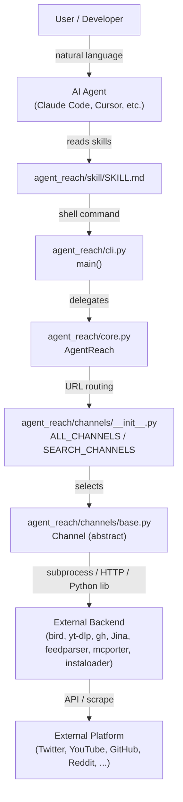
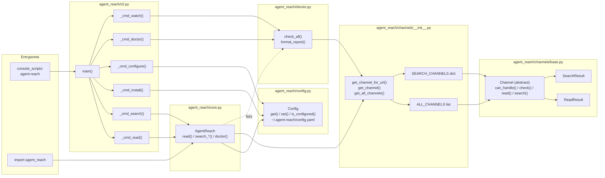

# 개요

<details>
<summary>관련 소스 파일</summary>

다음 파일들은 이 위키 페이지를 생성할 때 컨텍스트로 사용되었습니다:

- [README.md](README.md)
- [agent_reach/__init__.py](agent_reach/__init__.py)
- [docs/README_en.md](docs/README_en.md)
- [llms.txt](llms.txt)
- [pyproject.toml](pyproject.toml)
- [tests/test_cli.py](tests/test_cli.py)

</details>


이 페이지는 Agent Reach가 무엇인지, 어떤 문제를 해결하는지, 핵심 설계 철학은 무엇인지, 그리고 코드베이스의 최상위 구조가 어떻게 되어 있는지를 다룹니다. 설치 단계는 [시작하기](#1.2)를, 내부 모듈 아키텍처는 [아키텍처](#1.1)를 참조하세요.

---

## Agent Reach란 무엇인가?

Agent Reach는 AI 에이전트(Claude Code, Cursor, OpenClaw, Windsurf 등)가 여러 플랫폼의 인터넷 콘텐츠에 구조화된 접근을 하게 해 주는 Python CLI 패키지(`agent-reach`)입니다. 이 패키지는 플랫폼별 API 키나 유료 구독 없이도 에이전트가 호출할 수 있는 단일하고 일관된 셸 인터페이스를 제공합니다 [pyproject.toml:1-17]().

이 패키지가 해결하는 핵심 문제는 인터넷의 각 플랫폼마다 접근 장벽이 다르다는 점입니다. 유료 API, IP 기반 차단, 로그인 벽, 안티 스크래핑 조치가 여기에 해당합니다. Agent Reach가 없다면 에이전트 운영자는 각 플랫폼에 맞는 도구를 찾아 설치하고, 설정하고, 오류를 처리해야 합니다 [README.md:19-37](). Agent Reach는 이런 도구들을 미리 선택하고 연결하고 관리하므로, `agent-reach read <url>` 또는 `agent-reach search-twitter "query"` 같은 단일 명령이 내부 플랫폼과 무관하게 작동합니다 [docs/README_en.md:19-34]().

이 패키지는 명시적으로 **프레임워크가 아니라 스캐폴딩**으로 설명됩니다. 즉, 운영자를 대신해 도구 선택과 설정 결정을 내리지만, 각 백엔드는 채널 파일 하나만 바꾸면 교체할 수 있습니다 [README.md:155-163]().

출처: [README.md:19-37](), [docs/README_en.md:19-34](), [README.md:155-163](), [pyproject.toml:1-17]()

---

## 설계 철학

| 원칙 | 구현 |
|-----------|---------------|
| **필수 API 비용 0원** | 기본 백엔드는 모두 무료입니다: Jina Reader, `bird` CLI, `yt-dlp`, `feedparser`, `gh` CLI, `instaloader`, `mcporter`를 통한 Exa [README.md:53-61]() |
| **플러그형 채널** | 각 플랫폼은 `agent_reach/channels/` 안의 독립적인 Python 파일이며 `Channel` 추상 기본 클래스를 구현합니다 [README.md:165-184]() |
| **교체 가능한 백엔드** | 더 나은 백엔드가 등장하면 바뀌는 것은 채널 파일 하나뿐입니다 [README.md:165-168]() |
| **AI 에이전트 우선** | 주요 소비자는 `SKILL.md`를 읽고 셸 명령을 실행하는 AI 에이전트이며, 사람이 CLI 명령을 직접 실행하는 것이 아닙니다 [README.md:151-153]() |
| **자격 증명 지역성** | 쿠키와 토큰은 `0o600` 권한으로 `~/.agent-reach/config.yaml`에만 저장됩니다 [README.md:88-91]() |
| **단계적 설정** | 채널은 설정 복잡도에 따라 분류됩니다(무설정, 자격 증명 필요, MCP 서비스 필요) [docs/README_en.md:81-81]() |

출처: [README.md:53-61](), [README.md:165-184](), [README.md:151-153](), [README.md:88-91](), [docs/README_en.md:81-81]()

---

## 지원 플랫폼

Agent Reach는 설정 요구사항에 따라 분류된 다양한 글로벌 및 중국 특화 플랫폼을 지원합니다.

| 플랫폼 | 백엔드 | 계층 | 읽기 | 검색 |
|----------|---------|------|------|--------|
| Any web URL | Jina Reader (`r.jina.ai`) | 0 — zero config | ✅ | — |
| YouTube | `yt-dlp` | 0 — zero config | ✅ | ✅ |
| RSS / Atom | `feedparser` | 0 — zero config | ✅ | — |
| GitHub | `gh` CLI | 0 — zero config (public) | ✅ | ✅ |
| WeChat Articles | `wechat-article-for-ai` | 0 — zero config | ✅ | ✅ |
| Weibo | `mcp-server-weibo` | 0 — zero config | ✅ | ✅ |
| V2EX | Public JSON API | 0 — zero config | ✅ | ✅ |
| Xueqiu (雪球) | Public JSON API | 0 — zero config | ✅ | ✅ |
| Twitter / X | `bird` CLI | 0/1 — cookies unlock search | ✅ | ✅ |
| Bilibili | `yt-dlp` | 0/1 — proxy for servers | ✅ | ✅ |
| Reddit | Reddit JSON API | 1 — proxy for servers | ✅ | ✅ |
| Exa (web search) | `mcporter` → `exa-mcp` | 1 — auto-configured | — | ✅ |
| XiaoHongShu | `mcporter` → `xiaohongshu-mcp` | 2 — Docker + cookies | ✅ | ✅ |
| Douyin | `mcporter` → `douyin-mcp-server` | 2 — MCP setup | ✅ | — |
| LinkedIn | `mcporter` → `linkedin-scraper-mcp` | 2 — MCP setup | ✅ | ✅ |
| Boss直聘 | `mcporter` → `mcp-bosszp` | 2 — MCP + QR login | ✅ | ✅ |
| Xiaoyuzhou | Groq Whisper | 2 — Free API Key | ✅ | — |

출처: [README.md:65-85](), [docs/README_en.md:60-81]()

---

## 시스템 구성 요소

**사용자에서 플랫폼까지의 최상위 흐름:**



출처: [README.md:129-136](), [README.md:155-184](), [agent_reach/cli.py:53-53](), [agent_reach/core.py:7-7]()

---

**핵심 Python 패키지 모듈과 그 책임:**



출처: [pyproject.toml:52-53](), [agent_reach/__init__.py:7-9](), [agent_reach/cli.py:7-8](), [agent_reach/core.py:7-7](), [tests/test_cli.py:7-32]()

---

## 채널 계층 분류

채널은 동작하기 전에 무엇이 필요한지에 따라 세 계층으로 분류됩니다:

| 계층 | 레이블 | 필요한 것 | 예시 |
|------|-------|----------------|---------|
| 0 | Zero config | `pip install agent-reach` 외에는 아무것도 필요하지 않음 | `web.py`, `youtube.py`, `rss.py`, `github.py` (public) |
| 1 | Needs credential or proxy | Browser cookies or a residential proxy | `twitter.py` (search), `reddit.py`, `bilibili.py` (server) |
| 2 | Needs MCP service or full setup | Docker, `mcporter`, QR code login, etc. | `xiaohongshu.py`, `wechat.py`, `douyin.py`, `linkedin.py` |

`agent-reach doctor` 명령은 계층과 현재 설정을 기반으로 각 채널의 상태(`ok` / `warn` / `off`)를 보고합니다 [README.md:61-61](). 자세한 내용은 [Diagnostics and Monitoring](#2.5)을 참조하세요.

출처: [README.md:67-85](), [docs/README_en.md:62-81](), [tests/test_cli.py:26-32]()

---

## 저장소에 무엇이 있나

```
agent_reach/
├── cli.py              # CLI entrypoint, argument parsing, subcommand dispatch
├── core.py             # AgentReach class — primary programmatic API
├── config.py           # Config class — reads/writes ~/.agent-reach/config.yaml
├── doctor.py           # check_all(), format_report() — channel health checks
├── channels/
│   ├── __init__.py     # ALL_CHANNELS list, SEARCH_CHANNELS dict, routing functions
│   ├── base.py         # Channel ABC, ReadResult, SearchResult dataclasses
│   ├── web.py          # WebChannel — Jina Reader backend
│   ├── twitter.py      # TwitterChannel — bird CLI backend
│   ├── youtube.py      # YouTubeChannel — yt-dlp backend
│   ├── bilibili.py     # BilibiliChannel — yt-dlp backend
│   ├── github.py       # GitHubChannel — gh CLI backend
│   ├── reddit.py       # RedditChannel — Reddit JSON API
│   ├── rss.py          # RSSChannel — feedparser backend
│   ├── exa_search.py   # ExaSearchChannel — mcporter + exa-mcp
│   ├── xiaohongshu.py  # XiaoHongShuChannel — mcporter + xiaohongshu-mcp
│   ├── wechat.py       # WeChatChannel — wechat-article-for-ai + miku_ai
│   ├── weibo.py        # WeiboChannel — mcp-server-weibo
│   └── ...             # Other platform channels (Douyin, V2EX, Xueqiu, etc.)
├── skill/
│   └── SKILL.md        # Installed into AI agent skills directory
└── guides/             # Documentation assets
```

출처: [README.md:170-184](), [docs/README_en.md:64-79](), [pyproject.toml:67-70]()

---

## 관련 페이지

| 주제 | 페이지 |
|-------|------|
| End-to-end architecture, channel routing, `ReadResult`/`SearchResult` | [Architecture](#1.1) |
| Install, `agent-reach install`, `agent-reach doctor` | [Getting Started](#1.2) |
| All CLI subcommands and flags | [CLI Reference](#2) |
| Channel abstract base class and per-channel docs | [Channels](#3) |
| `Config` class, `config.yaml`, credential management | [Configuration](#4) |
| `SKILL.md` and agent integration model | [AI Agent Integration](#5) |
