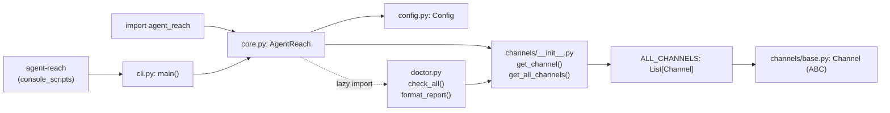
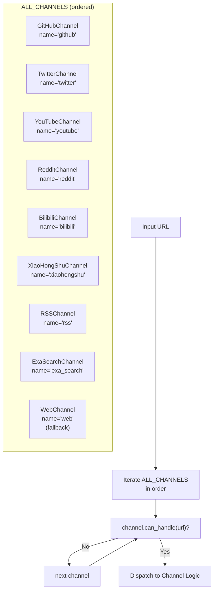
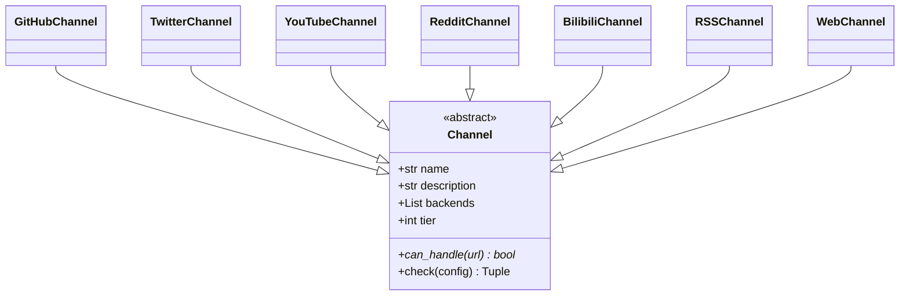

# 아키텍처

관련 소스 파일

다음 파일들은 이 위키 페이지를 생성할 때 컨텍스트로 사용되었습니다:

- [agent_reach/channels/__init__.py](agent_reach/channels/__init__.py)
- [agent_reach/channels/base.py](agent_reach/channels/base.py)
- [agent_reach/channels/bilibili.py](agent_reach/channels/bilibili.py)
- [agent_reach/channels/reddit.py](agent_reach/channels/reddit.py)
- [agent_reach/channels/rss.py](agent_reach/channels/rss.py)
- [agent_reach/channels/v2ex.py](agent_reach/channels/v2ex.py)
- [agent_reach/channels/web.py](agent_reach/channels/web.py)
- [agent_reach/core.py](agent_reach/core.py)

이 페이지는 Agent Reach의 내부 아키텍처를 설명합니다. `AgentReach` 클래스, 채널 레지스트리, URL 디스패치, 계층 분류, 결과 타입이 시스템 안에서 어떻게 맞물리는지를 다룹니다. 설치와 첫 사용은 [시작하기](#1.2)를, 채널별 세부 사항은 [채널](#3)을 참조하세요.

---

## 개요

Agent Reach는 얇은 라우팅 계층입니다. 역할은 URL 또는 검색 쿼리를 받아 올바른 플랫폼별 채널로 전달하고, 정규화된 결과를 반환하는 것입니다. 어떤 채널도 다른 채널에 대해 알지 않습니다. 코어 자체에는 플랫폼 로직이 없습니다.

**핵심 설계 특성:**

- 각 플랫폼은 공유되는 추상 인터페이스를 구현하는 하나의 Python 파일(`agent_reach/channels/*.py`)입니다.
- URL 디스패치는 `can_handle()` 일치가 발견될 때까지 정렬된 목록(`ALL_CHANNELS`)을 순회하는 방식으로 수행됩니다.
- 어떤 채널이 사용하는 백엔드 도구든 시스템의 다른 부분을 건드리지 않고 바꿀 수 있습니다.

---

## 패키지 구조

**다이어그램: 모듈 의존성**

출처: [agent_reach/core.py:31-43](), [agent_reach/channels/__init__.py:29-66](), [agent_reach/channels/base.py:1-37]()

---

## `AgentReach` 클래스

[agent_reach/core.py:23-43]()의 `AgentReach`는 주요 상태 점검 및 설정 진입점입니다. `Config` 인스턴스를 보유하고 시스템 준비 상태를 감사하는 메서드를 제공합니다.

| 메서드 | 위임 대상 | 비고 |
|---|---|---|
| `__init__(config)` | `Config()` | 설정을 초기화합니다 [agent_reach/core.py:31-32]() |
| `doctor()` | `check_all(self.config)` | 채널 상태의 `Dict[str, dict]`를 반환합니다 [agent_reach/core.py:34-37]() |
| `doctor_report()` | `format_report(...)` | 에이전트를 위한 사람이 읽을 수 있는 문자열을 반환합니다 [agent_reach/core.py:39-42]() |

읽기와 검색의 경우, Agent Reach는 에이전트가 시스템의 `SKILL.md`에 정의된 상위 도구를 직접 사용하도록 권장합니다 [agent_reach/core.py:27-28]().

출처: [agent_reach/core.py:23-43]()

---

## 채널 레지스트리

**다이어그램: ALL_CHANNELS 디스패치(클래스 이름에서 채널 이름으로)**

레지스트리는 [agent_reach/channels/__init__.py:29-46]()에 정의되어 있습니다. 이 목록은 순서가 중요합니다. **첫 번째 일치가 승리**합니다. `WebChannel`은 `can_handle()`가 모든 URL에 대해 `True`를 반환하므로 마지막에 배치되며, 보편적 폴백 역할을 합니다 [agent_reach/channels/web.py:13-14]().

### 레지스트리 접근 함수

| 함수 | 목적 |
|---|---|
| `get_channel(name)` | `name` 속성으로 채널을 조회합니다 [agent_reach/channels/__init__.py:49-54]() |
| `get_all_channels()` | 전체 `ALL_CHANNELS` 목록을 반환합니다 [agent_reach/channels/__init__.py:57-59]() |

출처: [agent_reach/channels/__init__.py:29-66]()

---

## `Channel` 추상 기본 클래스

모든 채널은 [agent_reach/channels/base.py:18-37]()의 `Channel`을 상속합니다. 이 클래스는 플랫폼 탐지와 상태 점검을 위한 계약을 정의합니다.

**다이어그램: Channel ABC와 구현체들**

### 필수 메서드

- `can_handle(url) → bool` — 이 채널이 이 URL 패턴을 소유한다면 `True`를 반환합니다. 반드시 구현해야 합니다 [agent_reach/channels/base.py:27-29]().

### 기본 동작

- `check(config) → (status, message)` — 상위 도구의 상태를 반환합니다. 기본값은 `self.backends`를 확인하는 것입니다 [agent_reach/channels/base.py:31-36]().

### 클래스 수준 속성

| 속성 | 타입 | 목적 |
|---|---|---|
| `name` | `str` | 고유 식별자(예: `"youtube"`) [agent_reach/channels/base.py:21]() |
| `description` | `str` | 사람이 읽을 수 있는 플랫폼 설명 [agent_reach/channels/base.py:22]() |
| `backends` | `List[str]` | 사용되는 외부 도구 이름(예: `["yt-dlp"]`) [agent_reach/channels/base.py:23]() |
| `tier` | `int` | 설정 복잡도(0=무설정, 1=키 필요, 2=설정 필요) [agent_reach/channels/base.py:24]() |

출처: [agent_reach/channels/base.py:18-37]()

---

## 계층 분류

각 `Channel` 서브클래스의 `tier` 정수는 어느 정도의 설정이 필요한지를 분류합니다 [agent_reach/channels/base.py:24]().

| 계층 | 의미 | 예시 채널 |
|---|---|---|
| `0` | 무설정 — `pip install` 후 바로 동작 | `WebChannel` [agent_reach/channels/web.py:11](), `RSSChannel` [agent_reach/channels/rss.py:11](), `V2EXChannel` [agent_reach/channels/v2ex.py:24]() |
| `1` | 무료 키 또는 약간의 설정 필요 | `RedditChannel` [agent_reach/channels/reddit.py:27](), `BilibiliChannel` [agent_reach/channels/bilibili.py:44]() |
| `2` | 계정, 쿠키, 또는 Docker 필요 | `XiaoHongShuChannel`, `LinkedInChannel` |

출처: [agent_reach/channels/base.py:24](), [agent_reach/channels/reddit.py:27](), [agent_reach/channels/bilibili.py:44]()

---

## 표준화된 출력

Agent Reach는 백엔드로의 직접 호출을 지원하지만, 내부 `doctor` 시스템은 상태 보고를 표준화합니다.

**`check()` 상태** ([agent_reach/channels/base.py:34]()):

| 상태 | 의미 |
|---|---|
| `ok` | 백엔드 도구가 설치되어 있고 접근 가능합니다 |
| `warn` | 도구는 설치되어 있지만 설정이 필요합니다(예: 쿠키/프록시) |
| `off` | 도구가 없거나 의존성이 충족되지 않았습니다 |
| `error` | 점검 중 예기치 않은 실패가 발생했습니다 |

예를 들어 `RedditChannel`은 JSON API에 접근할 수 없고 프록시도 설정되어 있지 않으면 `warn`을 반환합니다 [agent_reach/channels/reddit.py:41-45]().

출처: [agent_reach/channels/base.py:31-36](), [agent_reach/channels/reddit.py:34-45]()

---

## URL 라우팅 로직

URL이 처리될 때 시스템은 [agent_reach/channels/__init__.py]()의 `ALL_CHANNELS`를 순회합니다.

1. **GitHub**: `github.com`과 일치합니다 [agent_reach/channels/github.py]().
2. **Reddit**: `reddit.com` 또는 `redd.it`과 일치합니다 [agent_reach/channels/reddit.py:29-32]().
3. **Bilibili**: `bilibili.com` 또는 `b23.tv`와 일치합니다 [agent_reach/channels/bilibili.py:46-49]().
4. **RSS**: `/feed`, `.xml`, 또는 `atom` 같은 패턴과 일치합니다 [agent_reach/channels/rss.py:13-14]().
5. **Web (폴백)**: 그 외 모든 것에 대해 `True`를 반환합니다 [agent_reach/channels/web.py:13-14]().

출처: [agent_reach/channels/__init__.py:29-46](), [agent_reach/channels/web.py:13-14](), [agent_reach/channels/reddit.py:29-32]()

---

## 설정 통합

`AgentReach.__init__`는 선택적 `Config` 인스턴스를 받습니다. 전달되지 않으면 새 인스턴스를 생성합니다 [agent_reach/core.py:31-32](). 이 설정은 각 채널의 `check()` 메서드로 전달되어 `bilibili_proxy`나 `reddit_proxy` 같은 특정 키가 존재하는지 확인합니다 [agent_reach/channels/bilibili.py:55](), [agent_reach/channels/reddit.py:35]().

출처: [agent_reach/core.py:31-32](), [agent_reach/channels/bilibili.py:51-80](), [agent_reach/channels/reddit.py:34-45]()
