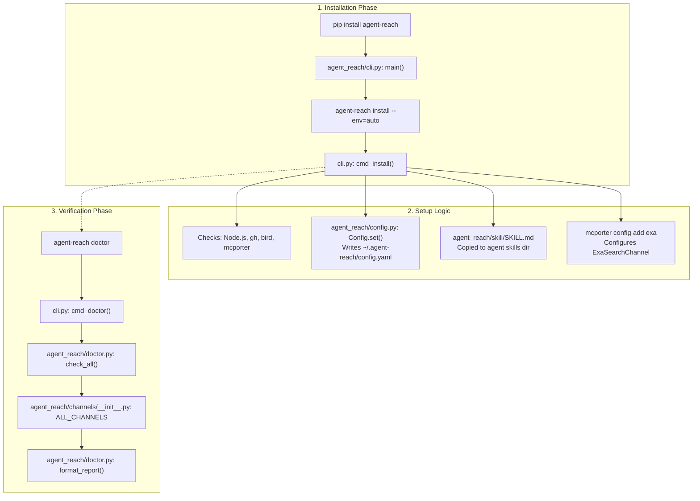
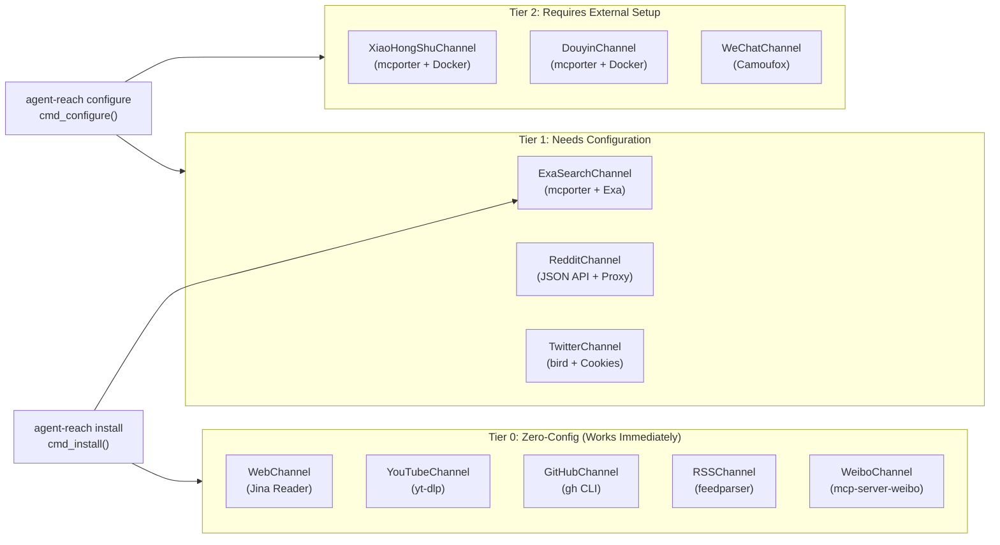

# 시작하기

<details>
<summary>관련 소스 파일</summary>

다음 파일들은 이 위키 페이지를 생성할 때 컨텍스트로 사용되었습니다:

- [README.md](README.md)
- [docs/install.md](docs/install.md)

</details>


이 페이지는 Agent Reach를 설치하고 동작시키기 위한 3단계 과정을 다룹니다. Python 패키지를 설치하고, 자동 설정 명령을 실행하고, 내장 진단 도구로 채널 상태를 확인하는 순서입니다.

Agent Reach가 무엇인지, 왜 존재하는지에 대한 개념적 개요는 [개요]()를 참조하세요. 모든 플래그를 포함한 전체 CLI 참조는 [CLI 참조]()를 보세요. 쿠키, 프록시, 토큰 같은 개별 자격 증명 설정은 [설정]()을 참조하세요.

---

## 사전 요구 사항

| 요구 사항 | 최소 조건 | 참고 |
|---|---|---|
| Python | 3.10+ | `pyproject.toml`에서 요구됩니다 |
| pip / pipx | 최신 버전 | CLI 격리를 위해 `pipx`가 권장됩니다 |
| 인터넷 접속 | 필요 | 여러 백엔드가 외부 HTTP 호출을 수행합니다 |

일부 채널은 `agent-reach install` 중에 추가 시스템 의존성을 자동으로 설치합니다. 여기에는 Node.js(`bird`용), `gh` CLI, `mcporter`, `instaloader`가 포함됩니다. 이를 자동 설치하고 싶지 않다면 `--safe` 모드를 사용하세요.

출처: [pyproject.toml:21-21](), [docs/install.md:53-69]()

---

## 1단계: 패키지 설치

Agent Reach를 설치하는 권장 방법은 `pipx`를 사용하는 것입니다. 이렇게 하면 CLI와 그 의존성이 전역 Python 환경과 분리됩니다.

```bash
# Recommended: pipx
pipx install https://github.com/Panniantong/agent-reach/archive/main.zip

# Alternative: Standard pip (inside a venv)
python3 -m venv ~/.agent-reach-venv
source ~/.agent-reach-venv/bin/activate
pip install https://github.com/Panniantong/agent-reach/archive/main.zip
```

이 작업은 `agent_reach` Python 패키지를 설치하고 `agent-reach` 콘솔 스크립트 엔트리포인트를 등록합니다. 이 엔트리포인트는 `agent_reach/cli.py`의 `main()` 함수에 매핑됩니다.

출처: [docs/install.md:53-64](), [pyproject.toml:35-36]()

---

## 2단계: 자동 설정 실행

패키지를 설치한 뒤에는 필요한 시스템 수준 의존성과 설정 파일을 구성하기 위해 설치 명령을 실행해야 합니다.

```bash
agent-reach install --env=auto
```

이 명령은 [agent_reach/cli.py]()의 `cmd_install()`이 처리합니다. `--env=auto` 플래그는 설치 프로그램이 환경(로컬 머신 vs. 서버)을 감지하고 적절한 설치 전략을 적용하게 합니다.

**`agent-reach install --env=auto`가 하는 일:**

| 작업 | 세부 내용 |
|---|---|
| **환경 감지** | 로컬에서 실행 중인지 서버에서 실행 중인지 확인해 프록시/의존성 로직을 조정합니다. |
| **시스템 의존성 설치** | Node.js, `gh` CLI, `bird`(npm을 통해), `mcporter`를 자동 설치합니다. |
| **Exa 검색 구성** | 의미 검색을 위해 `mcporter` 연결을 `mcp.exa.ai`로 설정합니다. |
| **SKILL.md 등록** | `agent_reach/skill/SKILL.md`를 에이전트의 skills 디렉터리(예: `~/.openclaw/skills/`)로 복사합니다. |
| **채널 테스트** | 등록된 모든 채널에 대해 초기 상태 점검을 수행합니다. |

**설치 모드 변형:**

| 명령 | 동작 |
|---|---|
| `agent-reach install --env=auto` | 전체 자동 설정(인터넷과 표준 권한 필요). |
| `agent-reach install --env=auto --safe` | **Safe Mode**: 누락된 의존성을 점검하고 보고하지만 시스템 패키지는 설치하지 않습니다. |
| `agent-reach install --env=auto --dry-run` | **Dry Run**: 변경 없이 모든 작업(파일 쓰기, 설치)을 미리 봅니다. |

출처: [agent_reach/cli.py:151-203](), [docs/install.md:49-89](), [README.md:126-136]()

---

## 3단계: Doctor로 검증

설치가 끝나면 `doctor` 명령으로 모든 통합의 상태를 확인합니다.

```bash
agent-reach doctor
```

이 명령은 [agent_reach/cli.py]()의 `cmd_doctor()`가 처리하며, [agent_reach/doctor.py]()의 `check_all()`과 `format_report()`를 호출합니다. `ALL_CHANNELS`의 모든 채널을 순회하며 운영 상태를 판별합니다.

**예시 출력:**

```text
👁️  Agent Reach Status
========================================

✅ Ready to use:
  ✅ GitHub repos and code — public repos readable and searchable
  ✅ Twitter/X tweets — readable. Cookie unlocks search and posting
  ✅ YouTube video subtitles — yt-dlp
  ⚠️  Bilibili video info — server IPs may be blocked, configure proxy
  ✅ RSS/Atom feeds — feedparser
  ✅ Web pages (any URL) — Jina Reader API

🔍 Search (configure to unlock):
  ⬜ Web semantic search — configure Exa MCP

🔧 Configurable:
  ⬜ Reddit posts and comments — search via Exa (free). Reading needs proxy
  ⬜ XiaoHongShu notes — needs cookie. Export from browser

Status: 6/9 channels available
```

**상태 표시 기호:**

| 기호 | 의미 |
|---|---|
| ✅ | **OK**: 채널이 동작 중이며 모든 의존성을 찾았습니다. |
| ⚠️ | **Warning**: 채널이 부분적으로만 동작합니다(예: 서버에서는 Bilibili에 프록시가 필요할 수 있음). |
| ⬜ / ❌ | **Off/Error**: 채널이 설정되지 않았거나 필요한 의존성/쿠키가 없습니다. |

출처: [agent_reach/cli.py:302-308](), [agent_reach/doctor.py:13-72](), [README.md:61-61]()

---

## 설정 흐름 다이어그램

**다이어그램: 설치 단계를 코드 엔티티에 매핑**



출처: [agent_reach/cli.py:151-203](), [agent_reach/doctor.py:13-72](), [docs/install.md:49-96]()

---

## 설치 후 채널 가용성

`agent-reach install --env=auto`를 실행한 뒤에는 설정 요구사항에 따라 채널이 세 계층으로 분류됩니다.

**다이어그램: 채널 계층과 그 백엔드 의존성**



| 계층 | 채널 | 필요한 것 |
|---|---|---|
| **0 — 무설정** | `Web`, `YouTube`, `GitHub`, `RSS`, `Weibo`, `V2EX` | 아무것도 필요하지 않습니다. 설치 직후 바로 동작합니다. |
| **1 — 설정 필요** | `Exa`, `Reddit`, `Twitter`, `Bilibili` | 쿠키, 프록시, API 키를 위한 `agent-reach configure`가 필요합니다. |
| **2 — 외부 설정** | `XiaoHongShu`, `Douyin`, `LinkedIn`, `BossZhipin` | MCP 서버용 Docker 또는 특정 브라우저 로그인 단계가 필요합니다. |

출처: [README.md:65-85](), [agent_reach/channels/__init__.py:12-42](), [docs/install.md:105-189]()

---

## 빠른 참조: 실행할 것

```bash
# 1. Install the package
pip install https://github.com/Panniantong/agent-reach/archive/main.zip

# 2. Auto-setup (installs deps, registers skill, configures Exa)
agent-reach install --env=auto

# 3. Check which channels are working
agent-reach doctor

# 4. (Optional) Test reading a URL
agent-reach read https://github.com/Panniantong/agent-reach

# 5. (Optional) Test search
agent-reach search "LLM framework comparison"
```

---

## 다음 단계

초기 설정이 끝나면 다음을 할 수 있습니다:

- **추가 채널 잠금 해제**: `agent-reach doctor`의 안내에 따라 쿠키나 프록시를 설정하세요. [4.1 Cookie Export Guide]()와 [4.2 Proxy Configuration]()을 참조하세요.
- **MCP 서비스 구성**: XiaoHongShu, Weibo, Douyin에 필요합니다. [4.3 mcporter Setup]()을 참조하세요.
- **AI 에이전트와 통합**: 에이전트가 등록된 `SKILL.md`에 접근할 수 있는지 확인하세요. [5. AI Agent Integration]()을 참조하세요.

출처: [docs/install.md:97-155](), [README.md:140-153]()
