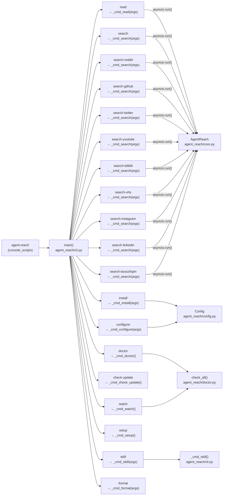
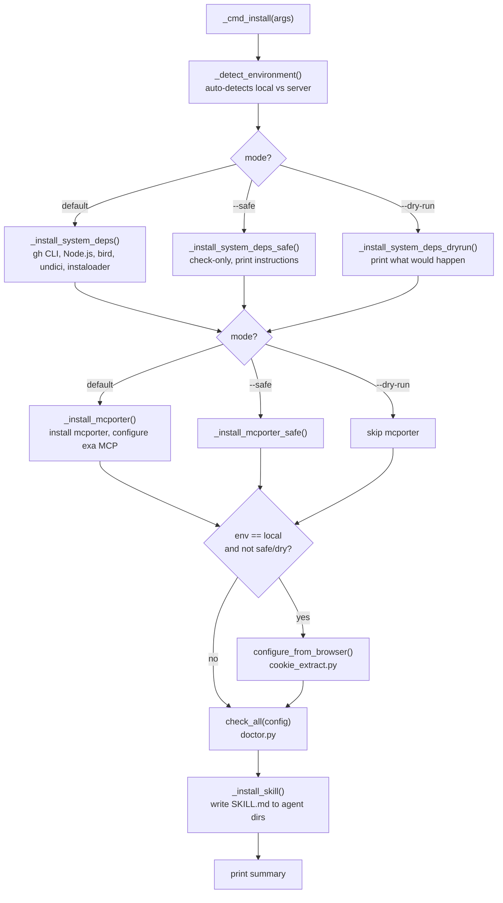
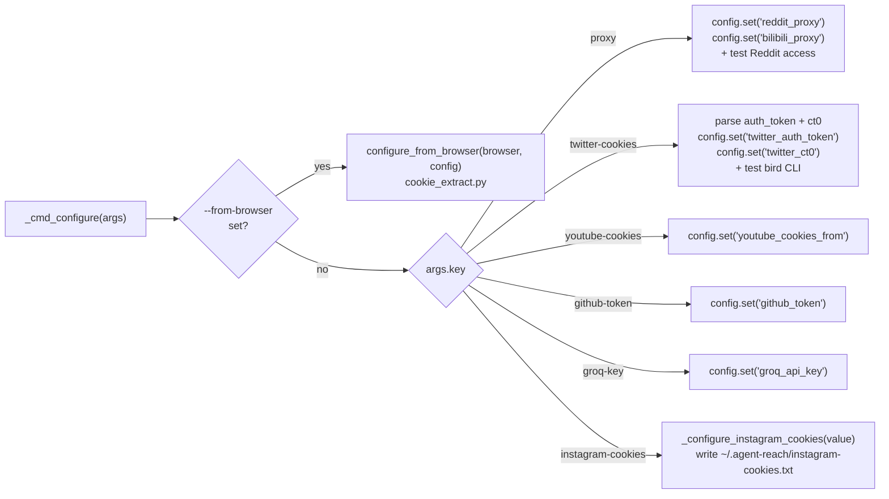

# CLI 참조

<details>
<summary>관련 소스 파일</summary>

다음 파일들은 이 위키 페이지를 생성할 때 컨텍스트로 사용되었습니다:

- [agent_reach/cli.py](agent_reach/cli.py)

</details>


이 페이지는 `agent-reach` 명령줄 인터페이스를 문서화합니다. `agent_reach/cli.py`의 `main()` 진입점, 서브커맨드가 어떻게 파싱되고 디스패치되는지, 전역 플래그, 그리고 각 인자와 함께 제공되는 전체 서브커맨드 집합을 다룹니다.

각 명령이 호출할 때 채널별로 무엇을 하는지는 [채널](#3)을 참조하세요. 설정 파일과 자격 증명 저장소는 [설정](#4)을 보세요. 첫 실행 가이드는 [시작하기](#1.2)를 참조하세요.

---

## 진입점

이 패키지는 `agent-reach`라는 단일 콘솔 스크립트를 등록하며, `pyproject.toml`에 선언된 대로 `agent_reach.cli:main`에 매핑됩니다. `main()` 함수 [agent_reach/cli.py:47-146]()는 각 명령마다 하나의 서브파서를 가진 `argparse.ArgumentParser`를 만들고, `sys.argv`를 파싱한 뒤 `_cmd_*` 핸들러 함수로 디스패치합니다.

Windows에서는 `main()`이 그 밖의 어떤 일보다 먼저 `sys.stdout`과 `sys.stderr`를 UTF-8로 패치합니다 [agent_reach/cli.py:21-36](). 그래서 이모지와 CJK 문자가 좁은 시스템 인코딩에서 오류를 일으키지 않습니다.

Loguru 로깅은 기본적으로 비활성화되어 있습니다. `-v` / `--verbose`를 넘기면 `_configure_logging()`를 통해 `INFO` 레벨로 다시 활성화됩니다 [agent_reach/cli.py:39-45]().

---

## 명령 디스패치

**다이어그램: `main()` → 핸들러 함수 디스패치**



출처: [agent_reach/cli.py:47-146]()

---

## 전역 플래그

이 플래그들은 최상위 `agent-reach` 파서에 적용되며 서브커맨드 이름 앞에 와야 합니다.

| 플래그 | 타입 | 기본값 | 설명 |
|------|------|---------|-------------|
| `-v`, `--verbose` | bool 플래그 | off | stderr에서 loguru `INFO` 로그를 활성화합니다 |
| `--version` | action | — | `Agent Reach vX.Y.Z`를 출력하고 종료합니다 |

출처: [agent_reach/cli.py:54-55]()

---

## 명령 요약

| 명령 | 핸들러 | 설명 |
|---------|-------------|-------------|
| `read <url>` | `_cmd_read()` | 어떤 URL에서든 콘텐츠를 읽습니다 |
| `search <query>` | `_cmd_search()` | Exa를 통한 웹 검색 |
| `search-twitter <query>` | `_cmd_search()` | Twitter/X 검색 |
| `search-reddit <query>` | `_cmd_search()` | Reddit 검색 |
| `search-github <query>` | `_cmd_search()` | GitHub 검색 |
| `search-youtube <query>` | `_cmd_search()` | YouTube 검색 |
| `search-bilibili <query>` | `_cmd_search()` | Bilibili 검색 |
| `search-xhs <query>` | `_cmd_search()` | XiaoHongShu 검색 |
| `search-instagram <query>` | `_cmd_search()` | Instagram 검색 |
| `search-linkedin <query>` | `_cmd_search()` | LinkedIn 검색 |
| `search-bosszhipin <query>` | `_cmd_search()` | Boss直聘 검색 |
| `install` | `_cmd_install()` | 의존성 감지를 포함한 원샷 설치 프로그램 |
| `configure` | `_cmd_configure()` | 설정 값을 지정하거나 브라우저에서 자동 추출 |
| `setup` | `_cmd_setup()` | 대화형 설정 마법사 |
| `doctor` | `_cmd_doctor()` | 플랫폼 가용성과 상태를 점검 |
| `skill` | `_cmd_skill()` | AI 에이전트를 위한 SKILL.md 설치 또는 제거 |
| `format` | `_cmd_format()` | 플랫폼 API 출력 정리 및 포맷팅(예: XHS) |
| `watch` | `_cmd_watch()` | 예약 작업용 빠른 상태 + 업데이트 점검 |
| `check-update` | `_cmd_check_update()` | 새 버전과 변경 사항 확인 |
| `uninstall` | `_cmd_uninstall()` | 설정, 토큰, skill 파일 제거 |
| `version` | inline | 버전 표시 |

출처: [agent_reach/cli.py:58-113]()

---

## `read`

```
agent-reach read <url> [--json]
```

[agent_reach/cli.py:904-927]()의 `_cmd_read(args)`로 디스패치되며, 이 함수는 `AgentReach.read(url)`을 호출합니다. 올바른 채널은 URL을 기준으로 `get_channel_for_url()`가 선택합니다. 출력은 제목, URL, 작성자, 본문을 포함한 사람이 읽기 쉬운 다중 행 형식을 기본으로 하며, `--json`은 원시 결과 dict를 `json.dumps`한 값으로 전환합니다.

| 인자 | 필수 | 설명 |
|----------|----------|-------------|
| `url` | 예 | 어떤 URL이든 가능하며 채널 선택은 자동입니다 |
| `--json` | 아니오 | 포맷된 텍스트 대신 JSON 객체로 출력합니다 |

오류가 발생하면 `_cmd_read()`는 400 Bad Request(잘못된 URL), 연결 오류, 타임아웃을 인식하고, 각각에 대해 특정 메시지를 출력한 뒤 `sys.exit(1)`을 호출합니다.

출처: [agent_reach/cli.py:51-54](), [agent_reach/cli.py:904-927]()

---

## 검색 명령

모든 `search-*` 서브커맨드는 하나의 `_cmd_search(args)` 핸들러 [agent_reach/cli.py:930-996]()로 모이며, 이 함수는 `args.command`에 따라 분기합니다. 각 명령은 `AgentReach`의 대응 메서드(예: `search_reddit()`, `search_twitter()`)를 호출합니다.

모든 검색 명령에 공통인 플래그:

| 플래그 | 기본값 | 설명 |
|------|---------|-------------|
| `-n`, `--num` | varies | 반환할 결과의 최대 개수 |

플랫폼별 플래그:

| 명령 | 추가 플래그 | 설명 |
|---------|------------|-------------|
| `search-reddit` | `--sub <subreddit>` | 결과를 하나의 subreddit으로 제한 |
| `search-github` | `--lang <language>` | 프로그래밍 언어로 필터링 |

명령별 기본 `-n` 값:

| 명령 | 기본 `-n` |
|---------|-------------|
| `search` | 5 |
| `search-twitter` | 10 |
| `search-reddit` | 10 |
| `search-github` | 5 |
| `search-youtube` | 5 |
| `search-bilibili` | 5 |
| `search-xhs` | 10 |
| `search-instagram` | 10 |
| `search-linkedin` | 10 |
| `search-bosszhipin` | 10 |

출력 형식: 제목, URL, 스니펫, 그리고(GitHub의 경우) star/fork/language 메타데이터를 포함한 번호 매기기 목록입니다.

출처: [agent_reach/cli.py:56-105](), [agent_reach/cli.py:930-996]()

---

## `install`

```
agent-reach install [--env {local,server,auto}] [--proxy URL] [--safe] [--dry-run]
```

**다이어그램: `_cmd_install()` 실행 흐름**



| 플래그 | 기본값 | 설명 |
|------|---------|-------------|
| `--env` | `auto` | `local`, `server`, 또는 `auto`(`_detect_environment()` 호출) |
| `--proxy` | `""` | `Config`에 `reddit_proxy`와 `bilibili_proxy`를 설정 |
| `--safe` | off | 모든 자동 설치를 건너뛰고 수동 안내만 출력 |
| `--dry-run` | off | 무엇이 수행될지 출력하고 변경은 하지 않음 |

`_detect_environment()` [agent_reach/cli.py:595-633]()는 환경 신호(SSH 세션, Docker, DISPLAY 없음, 클라우드 VM 마커)를 점수화하여 점수가 2 이상이면 `"server"`, 아니면 `"local"`을 반환합니다.

`_install_skill()` [agent_reach/cli.py:302-340]()은 번들된 패키지 데이터의 `SKILL.md`를 기존 에이전트 skill 디렉터리(`~/.openclaw/skills`, `~/.claude/skills`, `~/.agents/skills`)에 쓰고, 없으면 `~/.openclaw/skills/agent-reach`를 생성하는 쪽으로 폴백합니다.

출처: [agent_reach/cli.py:151-300](), [agent_reach/cli.py:302-340](), [agent_reach/cli.py:343-577](), [agent_reach/cli.py:595-633]()

---

## `configure`

```
agent-reach configure <key> <value>
agent-reach configure --from-browser {chrome,firefox,edge,brave,opera}
```

`_cmd_configure(args)`가 처리합니다 [agent_reach/cli.py:636-769]().

**다이어그램: `_cmd_configure()` 키 디스패치**



**설정 가능한 키:**

| 키 | 설정되는 구성 필드 | 참고 |
|-----|---------------------|-------|
| `proxy` | `reddit_proxy`, `bilibili_proxy` | 설정 후 Reddit을 자동 테스트합니다 |
| `twitter-cookies` | `twitter_auth_token`, `twitter_ct0` | `"auth_token=X; ct0=Y"` 또는 두 개의 bare token을 받습니다. bird CLI를 자동 테스트합니다 |
| `youtube-cookies` | `youtube_cookies_from` | yt-dlp에 전달되는 브라우저 이름 |
| `github-token` | `github_token` | 개인 액세스 토큰 |
| `groq-key` | `groq_api_key` | Groq Whisper 전사 키 |
| `xhs-cookies` | `xhs_cookies` | XiaoHongShu용 쿠키 |

Instagram 쿠키는 주 YAML 설정과 별도로 전용 파일 [agent_reach/cli.py:790-813]()의 `~/.agent-reach/instagram-cookies.txt`에 `0o600` 모드로 기록됩니다.

출처: [agent_reach/cli.py:73-83](), [agent_reach/cli.py:636-813]()

---

## `setup`

```
agent-reach setup
```

`_cmd_setup()`가 처리합니다 [agent_reach/cli.py:816-901](). `configure`와 같은 키들 - Exa API key, GitHub token, Reddit proxy, Groq key - 을 설명과 함께 안내하는 대화형 프롬프트 기반 마법사지만, 이미 설정된 키는 건너뜁니다. 주로 안내형 경험을 선호하는 사람을 위한 것이며, AI 에이전트는 `configure`를 직접 사용하는 것이 좋습니다.

출처: [agent_reach/cli.py:816-901]()

---

## `doctor`

```
agent-reach doctor
```

`_cmd_doctor()`가 처리합니다 [agent_reach/cli.py:771-776](). `agent_reach.doctor`의 `check_all(config)`를 호출한 뒤 결과 dict를 `format_report()`에 넘겨 출력합니다. 각 채널은 ok / warn / off 상태 표시와 짧은 메시지와 함께 표시됩니다.

상태 점검 로직의 자세한 문서는 [Diagnostics and Monitoring](#2.5)를 참조하세요.

출처: [agent_reach/cli.py:771-776]()

---

## `watch`

```
agent-reach watch
```

`_cmd_watch()`가 처리합니다 [agent_reach/cli.py:1055-1119](). 크론 작업용으로 설계되었습니다. `check_all()`을 실행하고, GitHub Releases API에 최신 버전도 질의합니다. 모든 채널이 정상이고 버전도 최신이면 단일 `"全部正常"` 줄을 출력하고 종료합니다. 그렇지 않으면 문제와 가능한 업데이트에 대한 전체 보고서를 출력합니다.

출처: [agent_reach/cli.py:1055-1119]()

---

## `check-update`

```
agent-reach check-update
```

`_cmd_check_update()`가 처리합니다 [agent_reach/cli.py:998-1052](). `https://api.github.com/repos/Panniantong/Agent-Reach/releases/latest`를 조회합니다. 더 새로운 `tag_name`이 발견되면 릴리스 노트(처음 20줄)와 업그레이드 명령을 출력합니다. 아직 릴리스가 없으면 최신 커밋 SHA, 날짜, 메시지를 대신 보여줍니다.

출처: [agent_reach/cli.py:998-1052]()

---

## 출력 형식 참고

- 모든 `read` 출력은 `stdout`으로 갑니다. 오류는 `sys.exit(1)`과 함께 `stderr`로 갑니다.
- 모든 `search-*` 출력은 번호 매기기 목록으로 `stdout`에 갑니다. `--json` 플래그는 `read`에서만 사용할 수 있습니다.
- `doctor`, `watch`, `check-update`는 직접 `stdout`에 씁니다.
- `install`과 `configure`는 이모지 표시(`✅`, `⬜`, `⚠️`, `❌`, `📥`)가 붙은 단계별 상태 줄을 출력합니다.

출처: [agent_reach/cli.py:904-996]()
