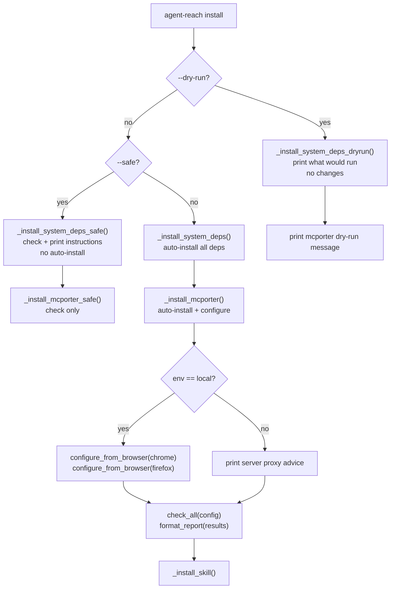
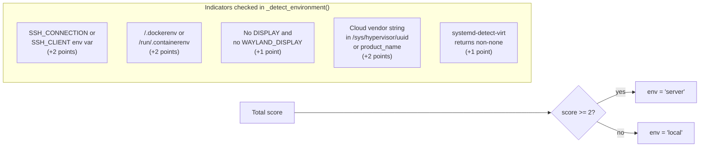
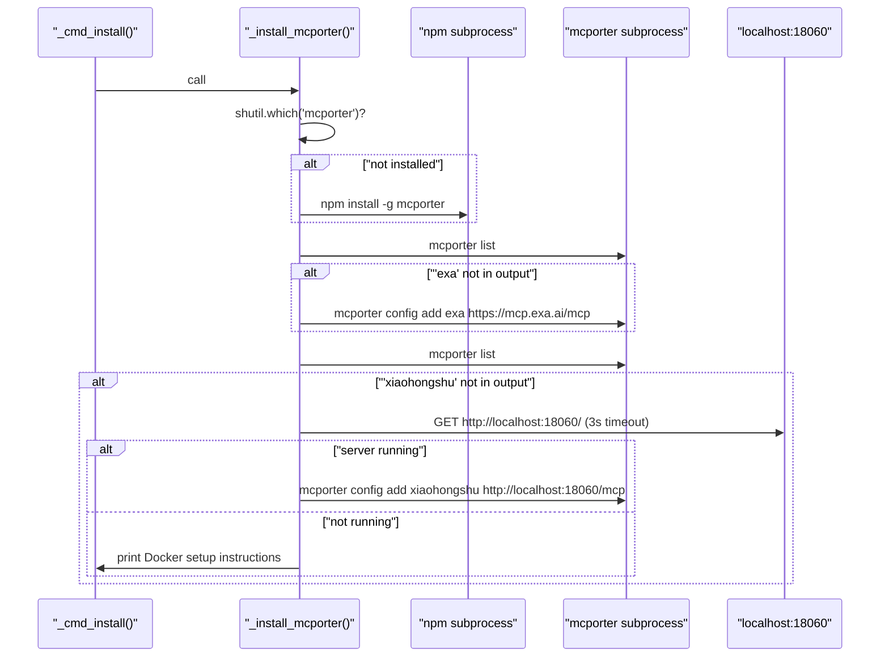
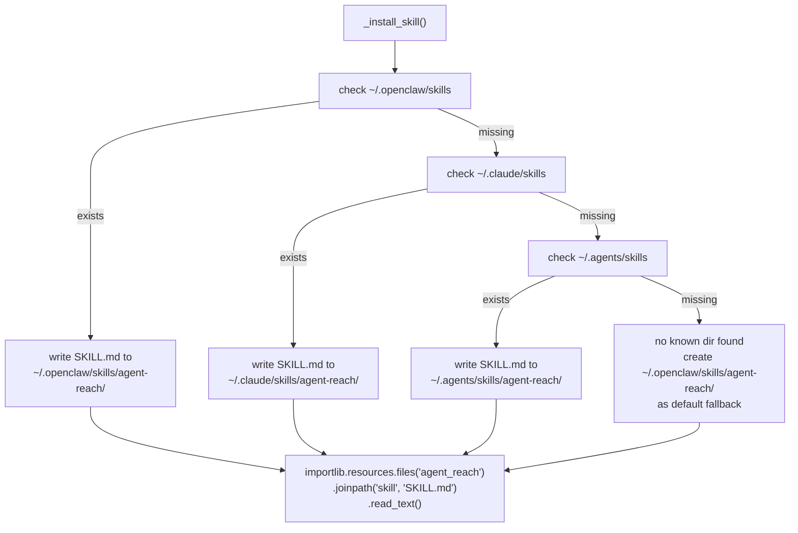

# 설치 명령

<details>
<summary>관련 소스 파일</summary>

다음 파일들은 이 위키 페이지를 생성할 때 컨텍스트로 사용되었습니다:

- [agent_reach/cli.py](agent_reach/cli.py)
- [docs/install.md](docs/install.md)

</details>


이 페이지는 `agent-reach install` 서브커맨드를 문서화합니다. 플래그, 감지하고 설치하는 시스템 의존성, 운영 모드를 결정하는 방식, 그리고 `SKILL.md`를 AI 에이전트 skill 디렉터리에 등록하는 과정을 다룹니다.

전체 CLI 구조와 사용 가능한 모든 서브커맨드는 [CLI 참조](2)를, 설치 후 자격 증명 설정은 [Configure Command](2.4)를, 설치 후 채널 상태 이해는 [Diagnostics and Monitoring](2.5)를 참조하세요.

---

## 개요

`install` 명령은 Agent Reach 채널 백엔드에 필요한 모든 시스템 수준 의존성을 부트스트랩하는 단발성 결정론적 설치 프로그램입니다. `agent_reach/cli.py`에 정의되어 있으며 다음과 같이 호출합니다:

```bash
agent-reach install [--env=local|server|auto] [--safe] [--dry-run] [--proxy URL]
```

플래그는 운영 모드와 환경 컨텍스트를 제어합니다:

| 플래그 | 동작 |
|---|---|
| `--env=auto`(기본값) | 머신이 로컬 컴퓨터인지 서버인지 자동 감지합니다 [agent_reach/cli.py:63-64]() |
| `--env=local` | 로컬 컴퓨터 모드를 강제합니다(브라우저 쿠키 가져오기를 시도합니다) [agent_reach/cli.py:63-64]() |
| `--env=server` | 서버 모드를 강제합니다(쿠키 가져오기를 건너뛰고 프록시 조언을 출력합니다) [agent_reach/cli.py:63-64]() |
| `--safe` | 설치 여부를 점검하고 부족한 항목에 대한 지침을 출력합니다. 변경은 하지 않습니다 [agent_reach/cli.py:67-68]() |
| `--dry-run` | *실제로* 무엇이 수행될지 출력합니다. 어떤 변경도 하지 않습니다 [agent_reach/cli.py:69-70]() |
| `--proxy URL` | 즉시 `Config`의 `reddit_proxy`와 `bilibili_proxy`에 프록시 값을 씁니다 [agent_reach/cli.py:187-194]() |

출처: [agent_reach/cli.py:61-70](), [agent_reach/cli.py:187-194]()

---

## 운영 모드

설치 로직은 제공된 플래그를 바탕으로 명확한 결정 트리를 따릅니다.

**운영 모드 결정 로직**



출처: [agent_reach/cli.py:151-299]()

---

## 환경 자동 감지

`--env=auto`(기본값)가 전달되면 `_detect_environment()`는 여러 OS 수준 신호를 살펴 로컬 워크스테이션인지 원격 서버/컨테이너인지 구분합니다.

**`_detect_environment()` 점수화 로직**



출처: [agent_reach/cli.py:595-633]()

---

## 시스템 의존성

`_install_system_deps()`는 순서대로 도구를 확인하고 설치합니다. 각 도구는 설치를 시도하기 전에 `shutil.which()`로 검증됩니다.

**의존성 설치 맵**

| 도구 | 바이너리 확인 | 설치 방법 | 목적 |
|---|---|---|---|
| `gh` CLI | `shutil.which("gh")` | APT(Linux) / Homebrew(macOS) | GitHub 채널 백엔드 [agent_reach/cli.py:346-372]() |
| Node.js | `shutil.which("node")` | NodeSource curl 스크립트 + `apt-get install nodejs` | `mcporter`와 `bird`에 필요 [agent_reach/cli.py:374-406]() |
| `bird` CLI | `shutil.which("bird")` | `npm install -g @steipete/bird` | Twitter 채널 백엔드 [agent_reach/cli.py:408-422]() |
| `undici` | `npm list -g undici` | `npm install -g undici` | Node.js `fetch()`의 프록시 지원 [agent_reach/cli.py:424-439]() |
| `instaloader` | `shutil.which("instaloader")` | `pip install instaloader` | Instagram 채널 백엔드 [agent_reach/cli.py:441-454]() |

출처: [agent_reach/cli.py:343-454]()

### Safe Mode 구현

`_install_system_deps_safe()`는 같은 의존성 목록을 순회하지만 어떤 설치 명령도 실행하지 않습니다. 누락된 도구마다 `bird` CLI의 경우 `npm install -g @steipete/bird` 같은 수동 설치 힌트를 출력합니다.

출처: [agent_reach/cli.py:457-485]()

### Dry-Run Mode 구현

`_install_system_deps_dryrun()`은 `shutil.which()` 검사를 수행하고 각 도구에 대해 `✅ already installed, skip` 또는 `📥 would install via: <method>`를 출력합니다. 어떤 서브프로세스 호출도 하지 않습니다.

출처: [agent_reach/cli.py:488-506]()

---

## mcporter 설정

시스템 의존성 다음 단계로 `_install_mcporter()`는 Exa 검색과 XiaoHongShu 채널에서 사용하는 MCP 브리지인 `mcporter`를 설치하고 구성합니다.

**`_install_mcporter()` 순서**



출처: [agent_reach/cli.py:509-576]()

Exa MCP 엔드포인트(`https://mcp.exa.ai/mcp`)는 이미 존재하지 않으면 항상 구성됩니다 [agent_reach/cli.py:541-544](). XiaoHongShu MCP(`http://localhost:18060/mcp`)는 해당 주소에서 응답하는 Docker 컨테이너가 감지될 때만 등록됩니다 [agent_reach/cli.py:556-568]().

---

## 브라우저 쿠키 자동 가져오기

`env=local`일 때(단, safe 또는 dry-run 모드가 아닐 때) 설치 프로그램은 `configure_from_browser()`를 통해 로컬 브라우저에서 쿠키를 가져오려고 시도합니다.

```python
# Implementation detail in _cmd_install
if env == "local" and not safe_mode and not dry_run:
    from agent_reach.cookie_extract import configure_from_browser
    configure_from_browser("chrome", config)
    configure_from_browser("firefox", config)
```

성공한 경우만 출력됩니다. 두 브라우저 모두 쿠키를 제공하지 못하면 `agent-reach configure`를 통한 수동 설정을 제안하는 메시지가 표시됩니다.

출처: [agent_reach/cli.py:237-268]()

---

## SKILL.md 등록

설치의 마지막 단계는 `_install_skill()`이며, 이는 `SKILL.md` 파일을 인식된 AI 에이전트 skill 디렉터리에 씁니다.

**`_install_skill()` 디렉터리 탐색 순서**



skill 파일 내용은 패키지 데이터에서 `importlib.resources`를 사용해 읽습니다 [agent_reach/cli.py:305-307](). 일치하는 디렉터리가 여러 개 있으면 존재하는 것들은 모두 갱신됩니다 [agent_reach/cli.py:311-332]().

출처: [agent_reach/cli.py:302-340]()

---

## 전체 설치 순서 요약

| 단계 | `--dry-run` | `--safe` | 기본 |
|---|---|---|---|
| 시스템 의존성 | `[dry-run] would install` 출력 | 설치 힌트 출력 | 서브프로세스로 설치 |
| `mcporter` | `[dry-run] would install` 출력 | 수동 힌트 출력 | 설치 + 구성 |
| 쿠키 | `[dry-run] would try` 출력 | 수동 힌트 출력 | Chrome/Firefox에서 자동 추출 |
| 채널 점검 | 건너뜀 | `check_all()` 실행 | `check_all()` 실행 |
| `SKILL.md` | 건너뜀 | `_install_skill()` 실행 | `_install_skill()` 실행 |

출처: [agent_reach/cli.py:179-299]()
