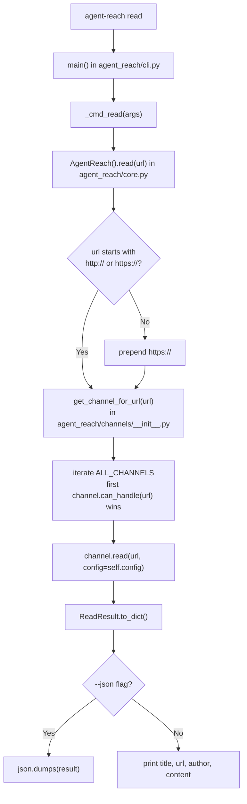
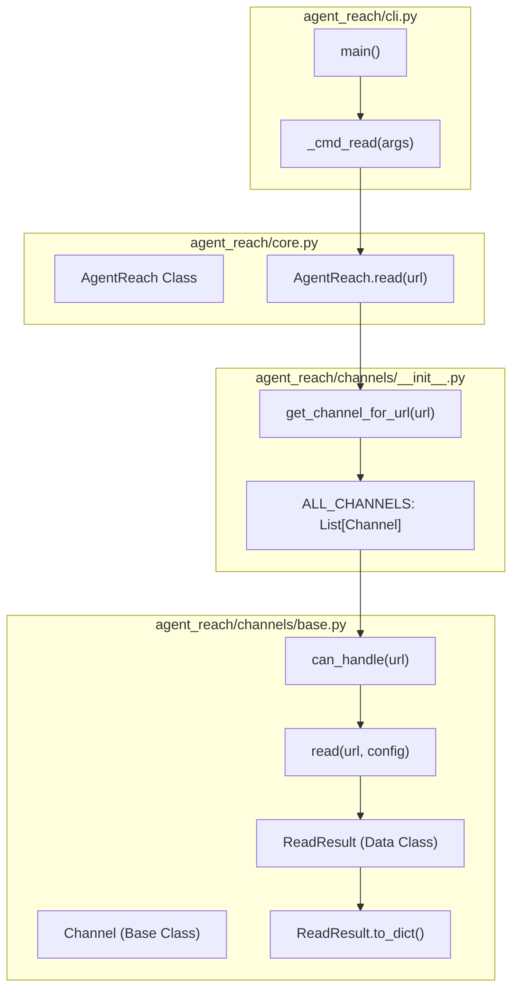

# 콘텐츠 읽기

<details>
<summary>관련 소스 파일</summary>

다음 파일들은 이 위키 페이지를 생성할 때 컨텍스트로 사용되었습니다:

- [agent_reach/channels/__init__.py](agent_reach/channels/__init__.py)
- [agent_reach/channels/v2ex.py](agent_reach/channels/v2ex.py)
- [agent_reach/cli.py](agent_reach/cli.py)

</details>


이 페이지는 `agent-reach read <url>` 명령을 문서화합니다. 플래그, 출력 형식, URL 정규화 동작, 그리고 각 URL을 어느 백엔드가 처리할지를 결정하는 내부 채널 디스패치 메커니즘을 다룹니다. 검색 명령에 대한 문서는 **2.3 Search Commands**를, 개별 채널 백엔드에 대한 문서는 **3. Channels**를 참조하세요.

---

## 명령 구문

```bash
agent-reach read <url> [--json]
```

| 플래그 | 설명 |
|------|-------------|
| `url` | 읽을 임의의 URL입니다. 스킴(`https://`)은 선택 사항입니다. |
| `--json` | 기본 사람이 읽기 쉬운 출력 대신 JSON 객체를 출력합니다. |
| `-v` / `--verbose` | 채널 백엔드의 내부 로그 출력을 표시합니다. |

출처: [agent_reach/cli.py:50-56](), [agent_reach/cli.py:118-122]()

---

## 내부 실행 흐름

`agent-reach read`가 호출되면 CLI는 인자를 파싱하고 네트워크 작업을 `AgentReach` 코어 클래스에 위임합니다. 코어 클래스는 URL을 정규화하고, 적절한 핸들러를 찾기 위해 `ALL_CHANNELS` 레지스트리를 순회합니다.

**디스패치 다이어그램: `agent-reach read` 내부**



출처: [agent_reach/cli.py:120-147](), [agent_reach/core.py:31-46](), [agent_reach/channels/__init__.py:29-46]()

---

## URL 정규화

채널 디스패치 전에 `AgentReach.read()`는 입력이 유효한 절대 URL인지 확인합니다. `http://` 또는 `https://`로 시작하지 않는 URL에는 `https://`를 앞에 붙입니다. 덕분에 에이전트는 `v2ex.com/t/123456` 같은 bare domain도 전달할 수 있습니다.

출처: [agent_reach/core.py:41-42]()

---

## 채널 디스패치

`get_channel_for_url(url)` 함수(`channels/__init__.py`에서 `core.py`로 별칭됨)는 특정 우선순위 순서로 `ALL_CHANNELS` 리스트를 순회합니다. `can_handle(url)`가 `True`를 반환하는 첫 번째 채널이 선택됩니다. `WebChannel`은 Jina Reader를 사용하는 범용 폴백으로 리스트 끝에 배치됩니다.

**채널 레지스트리 순서 (ALL_CHANNELS)**

```mermaid
flowchart LR
    URL["Input URL"] --> G["GitHubChannel"]
    G -- "no match" --> T["TwitterChannel"]
    T -- "no match" --> Y["YouTubeChannel"]
    Y -- "no match" --> R["RedditChannel"]
    R -- "no match" --> Bi["BilibiliChannel"]
    Bi -- "no match" --> X["XiaoHongShuChannel"]
    X -- "no match" --> Dy["DouyinChannel"]
    Dy -- "no match" --> Li["LinkedInChannel"]
    Li -- "no match" --> Wc["WeChatChannel"]
    Wc -- "no match" --> Wb["WeiboChannel"]
    Wb -- "no match" --> Xyz["XiaoyuzhouChannel"]
    Xyz -- "no match" --> V2["V2EXChannel"]
    V2 -- "no match" --> Xq["XueqiuChannel"]
    Xq -- "no match" --> Rss["RSSChannel"]
    Rss -- "no match" --> Exa["ExaSearchChannel"]
    Exa -- "no match" --> W["WebChannel (fallback)"]
```



출처: [agent_reach/channels/__init__.py:29-46](), [agent_reach/core.py:44-45]()

---

## URL-채널 매핑

다음 표는 각 채널의 `can_handle()` 구현을 기준으로 어떤 URL 패턴을 처리하는지 요약합니다.

| 채널 클래스 | 처리하는 URL 패턴 | 주요 백엔드 |
|---|---|---|
| `GitHubChannel` | `github.com/*` | `gh` CLI |
| `TwitterChannel` | `twitter.com/*`, `x.com/*` | `bird` CLI |
| `YouTubeChannel` | `youtube.com/*`, `youtu.be/*` | `yt-dlp` |
| `RedditChannel` | `reddit.com/*` | Reddit JSON API |
| `BilibiliChannel` | `bilibili.com/*`, `b23.tv/*` | `yt-dlp` |
| `XiaoHongShuChannel` | `xiaohongshu.com/*`, `xhslink.com/*` | `mcporter` + `xiaohongshu-mcp` |
| `V2EXChannel` | `v2ex.com/*` | V2EX Public API |
| `RSSChannel` | 피드 URL(콘텐츠/확장자로 감지) | `feedparser` |
| `WebChannel` | 모든 URL | Jina Reader (`r.jina.ai`) |

출처: [agent_reach/channels/v2ex.py:30-33](), [agent_reach/channels/__init__.py:29-46]()

---

## 출력 형식

### 기본값(사람이 읽기 쉬운 형식)
CLI는 AI 에이전트 소비나 터미널 읽기에 최적화된 포맷된 뷰를 출력합니다:
```text
📖 <title>
🔗 <url>
👤 <author>       ← only printed when present

<content>
```
`author` 필드는 선택 사항이며, 채널이 `ReadResult`에 값을 채워 넣을 때만 표시됩니다.

### JSON (`--json`)
구조화된 JSON 객체를 출력합니다. 프로그래밍 통합이나 에이전트가 특정 메타데이터 필드를 파싱해야 할 때 더 적합합니다.
```json
{
  "title": "Example Title",
  "url": "https://example.com",
  "author": "Author Name",
  "content": "Full article content...",
  "platform": "web"
}
```

출처: [agent_reach/cli.py:103-105]()

---

## 코드 엔티티 맵

이 다이어그램은 자연어 개념과 읽기 로직을 구현하는 구체적 코드 엔티티를 연결합니다.

**다이어그램: read 파이프라인에 사용되는 기호**



출처: [agent_reach/cli.py:120-147](), [agent_reach/core.py:31-46](), [agent_reach/channels/base.py:7-20]()

---

## 오류 처리

CLI는 읽기 작업이 실패할 때 명확한 피드백을 주기 위해 특정 오류 매핑을 구현합니다:

| 예외 패턴 | CLI 출력 메시지 |
|---|---|
| HTTP 400 / "Bad Request" | `❌ Invalid URL: <url>` |
| `ConnectionError` / `Timeout` | `❌ Could not connect to: <url>` |
| 표준 예외 | `❌ Error: <error_message>` |

출처: [agent_reach/cli.py:128-145]()
