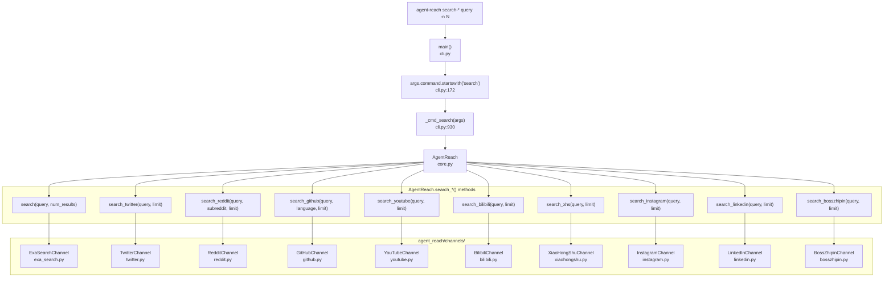
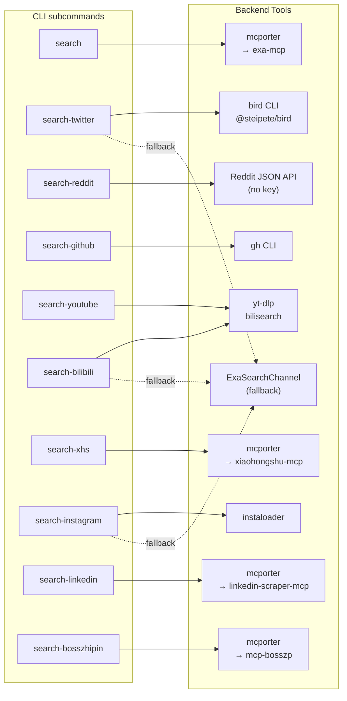

# 검색 명령

<details>
<summary>관련 소스 파일</summary>

다음 파일들은 이 위키 페이지를 생성할 때 컨텍스트로 사용되었습니다:

- [agent_reach/channels/__init__.py](agent_reach/channels/__init__.py)
- [agent_reach/channels/v2ex.py](agent_reach/channels/v2ex.py)
- [agent_reach/cli.py](agent_reach/cli.py)

</details>


이 페이지는 `agent-reach` CLI가 제공하는 모든 `search-*` 서브커맨드를 문서화합니다. 각 명령의 구문, 플래그, 기본 동작, 그리고 어떤 백엔드 채널을 호출하는지를 다룹니다. 특정 URL을 읽는 방법(검색 쿼리를 보내는 것과는 다름)은 [2.2]()를, 개별 채널이 내부적으로 어떻게 동작하는지는 [3]()를 참조하세요.

---

## 개요

모든 검색 명령은 같은 패턴을 따릅니다:

```bash
agent-reach <search-subcommand> "<query>" [flags]
```

모든 명령은 자유 형식 쿼리(여러 단어는 따옴표로 감쌀 필요가 없으며 CLI가 합칩니다)와 결과 개수를 제어하는 공통 `-n` 플래그를 받습니다.

디스패치 로직은 [agent_reach/cli.py:930-995]()의 `_cmd_search()`에 있습니다. 여기서는 `core.py`의 `AgentReach`를 인스턴스화하고, 적절한 `search_*` 메서드를 호출한 뒤, 번호 매긴 결과를 stdout에 출력합니다.

**각 결과의 출력 형식(모든 명령):**

```text
1. <title>
   🔗 <url>
   <snippet, up to 200 chars>
   ⭐ <stars>  🍴 <forks>  📝 <language>   ← GitHub only
```

출처: [agent_reach/cli.py:930-995](), [agent_reach/skill/SKILL.md:46-61]()

---

## 명령 참조

### 서브커맨드 요약

| 서브커맨드 | 기본 `-n` | 플랫폼별 플래그 | 백엔드 |
|---|---|---|---|
| `search` | 5 | — | `ExaSearchChannel` (mcporter → exa-mcp) |
| `search-twitter` | 10 | — | `TwitterChannel` → `bird` CLI |
| `search-reddit` | 10 | `--sub <subreddit>` | `RedditChannel` → Reddit JSON API |
| `search-github` | 5 | `--lang <language>` | `GitHubChannel` → `gh` CLI |
| `search-youtube` | 5 | — | `YouTubeChannel` → `yt-dlp` |
| `search-bilibili` | 5 | — | `BilibiliChannel` → `bilisearch` |
| `search-xhs` | 10 | — | `XiaoHongShuChannel` → mcporter |
| `search-instagram` | 10 | — | `InstagramChannel` → `instaloader` |
| `search-linkedin` | 10 | — | `LinkedInChannel` → mcporter |
| `search-bosszhipin` | 10 | — | `BossZhipinChannel` → mcporter |

출처: [agent_reach/cli.py:55-105](), [agent_reach/channels/__init__.py:29-46]()

---

### 공통 플래그: `-n / --num`

모든 검색 서브커맨드는 반환할 결과 수를 제어하는 `-n`(또는 `--num`)을 받습니다.

```bash
agent-reach search "rust async runtime" -n 10
agent-reach search-reddit "homelab" -n 20
```

이 값은 하위 `AgentReach.search_*()` 메서드에 `limit`(또는 `num_results`) 인자로 그대로 전달됩니다.

출처: [agent_reach/cli.py:58-105]()

---

### `search` — 일반 웹 검색

```bash
agent-reach search "<query>" [-n N]
```

`AgentReach.search()`로 라우팅되며, 이는 `ExaSearchChannel`로 위임됩니다. mcporter를 사용해 `mcp.exa.ai`의 Exa MCP 서버를 호출합니다. API 키는 필요하지 않습니다(`agent-reach install` 이후 무료 티어, 무설정).

출처: [agent_reach/cli.py:56-59](), [agent_reach/cli.py:941-942]()

---

### `search-twitter` — Twitter/X 검색

```bash
agent-reach search-twitter "<query>" [-n N]
```

`AgentReach.search_twitter()` → `TwitterChannel`로 라우팅됩니다. 주 백엔드는 `bird` CLI(npm 패키지 `@steipete/bird`)이며, 이때 `AUTH_TOKEN`과 `CT0` 쿠키를 설정해야 합니다. `bird`가 실패하면 `TwitterChannel`은 `ExaSearchChannel`로 폴백합니다.

먼저 Twitter 쿠키를 설정하세요:
```bash
agent-reach configure twitter-cookies "auth_token=xxx; ct0=yyy; ..."
```

출처: [agent_reach/cli.py:73-75](), [agent_reach/cli.py:948]()

---

### `search-reddit` — Reddit 검색

```bash
agent-reach search-reddit "<query>" [--sub <subreddit>] [-n N]
```

`AgentReach.search_reddit()` → `RedditChannel`로 라우팅됩니다. Reddit JSON API를 사용하며(API 키 없음), 선택적인 `--sub` 플래그로 검색을 특정 subreddit으로 제한할 수 있습니다.

```bash
agent-reach search-reddit "async python" --sub learnpython -n 5
```

> **참고:** Reddit은 많은 서버/데이터센터 IP를 차단합니다. VPS 환경에서는 주거용 프록시를 설정하세요: `agent-reach configure proxy http://user:pass@ip:port`. 자세한 내용은 [4.2]()를 보세요.

출처: [agent_reach/cli.py:61-64](), [agent_reach/cli.py:944]()

---

### `search-github` — GitHub 저장소 검색

```bash
agent-reach search-github "<query>" [--lang <language>] [-n N]
```

`AgentReach.search_github()` → `GitHubChannel` → `gh` CLI로 라우팅됩니다. 선택적인 `--lang` 플래그는 프로그래밍 언어로 결과를 필터링합니다.

```bash
agent-reach search-github "vector database" --lang rust -n 5
```

GitHub 검색 결과에는 스니펫 아래에 star, fork, language 메타데이터가 추가로 표시됩니다.

출처: [agent_reach/cli.py:66-70](), [agent_reach/cli.py:946](), [agent_reach/cli.py:992-995]()

---

### `search-youtube` — YouTube 검색

```bash
agent-reach search-youtube "<query>" [-n N]
```

`AgentReach.search_youtube()` → `YouTubeChannel` → `yt-dlp`로 라우팅됩니다. 비디오 제목, URL, 설명을 반환합니다.

출처: [agent_reach/cli.py:77-80](), [agent_reach/cli.py:950]()

---

### `search-bilibili` — Bilibili 검색

```bash
agent-reach search-bilibili "<query>" [-n N]
```

`AgentReach.search_bilibili()` → `BilibiliChannel`로 라우팅됩니다. `yt-dlp`의 `bilisearch` 기능을 사용합니다. Bilibili의 서버 측 IP 차단이 방해하면 `ExaSearchChannel`로 폴백합니다.

> **참고:** Bilibili는 서버 IP를 차단합니다. VPS 사용 시 프록시 사용을 권장합니다. [4.2]()를 보세요.

출처: [agent_reach/cli.py:82-85](), [agent_reach/cli.py:952]()

---

### `search-xhs` — XiaoHongShu (小红书) 검색

```bash
agent-reach search-xhs "<query>" [-n N]
```

`AgentReach.search_xhs()` → `XiaoHongShuChannel` → mcporter → xiaohongshu-mcp(Docker, `localhost:18060`)로 라우팅됩니다. Docker 기반 MCP 서버가 실행 중이고 mcporter에 등록되어 있어야 합니다.

출처: [agent_reach/cli.py:87-90](), [agent_reach/cli.py:954]()

---

### `search-instagram` — Instagram 검색

```bash
agent-reach search-instagram "<query>" [-n N]
```

`AgentReach.search_instagram()` → `InstagramChannel` → `instaloader`로 라우팅됩니다. instaloader가 설정되어 있지 않거나 인증되지 않았으면 `ExaSearchChannel`로 폴백합니다.

출처: [agent_reach/cli.py:92-95](), [agent_reach/cli.py:956]()

---

### `search-linkedin` — LinkedIn 검색

```bash
agent-reach search-linkedin "<query>" [-n N]
```

`AgentReach.search_linkedin()` → `LinkedInChannel` → mcporter → linkedin-scraper-mcp로 라우팅됩니다. linkedin-scraper-mcp 서비스가 실행 중이고 등록되어 있어야 합니다.

출처: [agent_reach/cli.py:97-100](), [agent_reach/cli.py:958]()

---

### `search-bosszhipin` — Boss直聘 채용 검색

```bash
agent-reach search-bosszhipin "<query>" [-n N]
```

`AgentReach.search_bosszhipin()` → `BossZhipinChannel` → mcporter → mcp-bosszp로 라우팅됩니다. 유효한 QR 코드 로그인 세션과 함께 mcp-bosszp 서비스가 실행 중이어야 합니다.

출처: [agent_reach/cli.py:102-105](), [agent_reach/cli.py:960]()

---

## 내부 디스패치 흐름

**다이어그램: Search Command Dispatch - CLI에서 채널까지**



출처: [agent_reach/cli.py:172-173](), [agent_reach/cli.py:930-963]()

---

## 백엔드 및 폴백 맵

**다이어그램: Search Channel → Backend Tool → External Platform**



출처: [agent_reach/cli.py:930-963](), [agent_reach/skill/SKILL.md:46-61]()

---

## 명령별 설정 요구 사항

| 서브커맨드 | 계층 | 필요한 설정 |
|---|---|---|
| `search` | 무설정 | `agent-reach install`로 자동 구성되는 `mcporter` + `exa` MCP |
| `search-reddit` | 무설정(로컬); 서버에서는 프록시 필요 | 자격 증명 없음; VPS에서는 선택적 프록시 |
| `search-github` | 무설정 | `gh` CLI; 더 높은 rate limit을 위한 선택적 토큰 |
| `search-youtube` | 무설정 | `yt-dlp`(자동 설치됨) |
| `search-bilibili` | 무설정(로컬); 서버에서는 프록시 필요 | 선택적 프록시 |
| `search-twitter` | 자격 증명 필요 | `bird` CLI + Twitter 쿠키(`AUTH_TOKEN`, `CT0`) |
| `search-xhs` | 설정 필요 | Docker + `xiaohongshu-mcp` + `mcporter` |
| `search-instagram` | 자격 증명 필요 | `instaloader` + Instagram 세션 쿠키 |
| `search-linkedin` | 설정 필요 | `linkedin-scraper-mcp` + `mcporter` + 브라우저 로그인 |
| `search-bosszhipin` | 설정 필요 | `mcp-bosszp` + `mcporter` + QR 코드 로그인 |

자격 증명 설정은 [2.4]()를, 프록시 설정은 [4.2]()를, mcporter 설정은 [4.3]()을 참조하세요.

출처: [agent_reach/cli.py:55-105](), [agent_reach/channels/__init__.py:29-46]()
