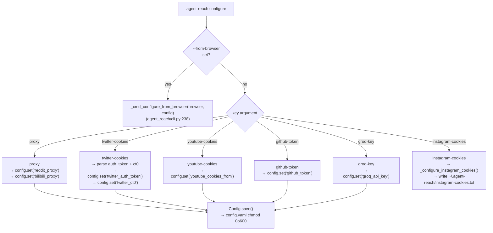
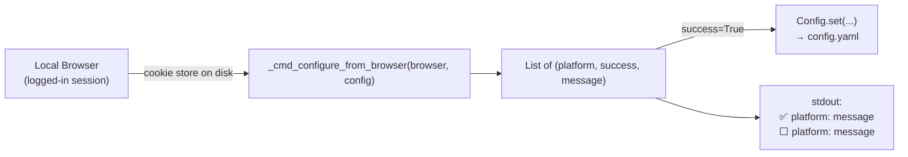
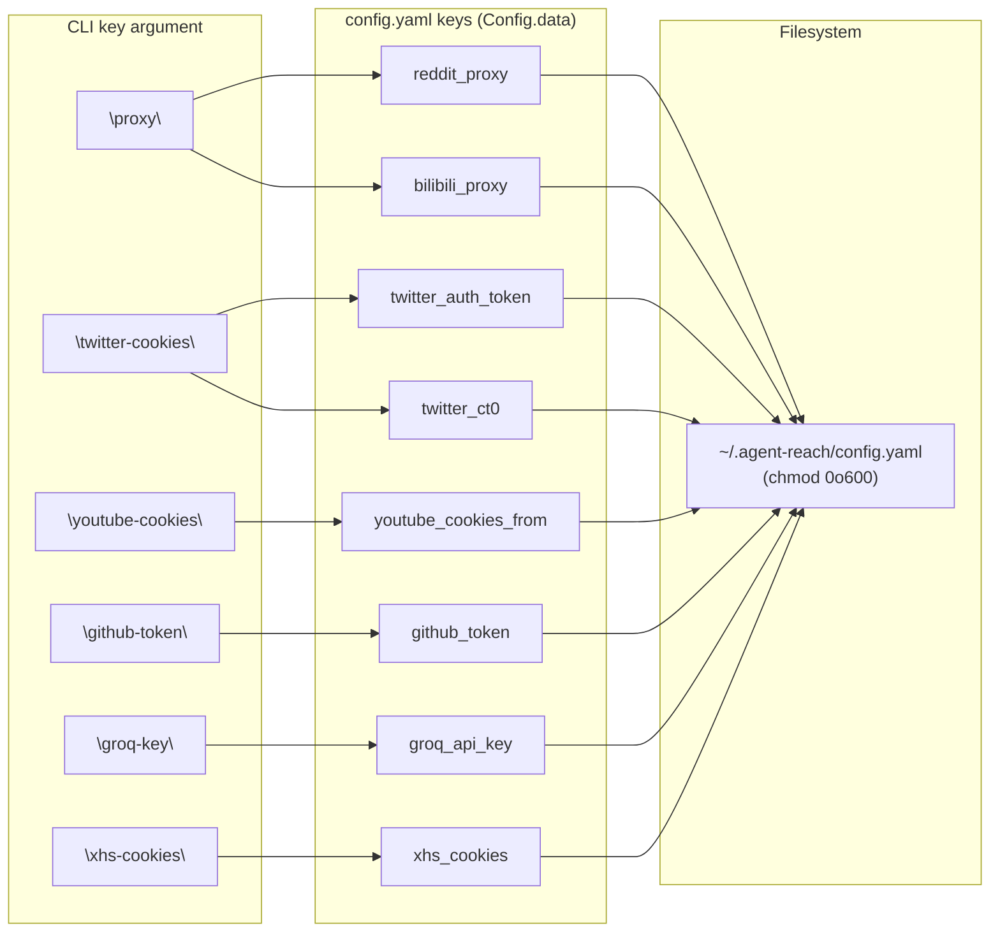

# Configure Command

<details>
<summary>관련 소스 파일</summary>

다음 파일들은 이 위키 페이지를 생성할 때 컨텍스트로 사용되었습니다:

- [agent_reach/cli.py](agent_reach/cli.py)
- [agent_reach/config.py](agent_reach/config.py)
- [agent_reach/guides/setup-twitter.md](agent_reach/guides/setup-twitter.md)
- [agent_reach/integrations/mcp_server.py](agent_reach/integrations/mcp_server.py)
- [docs/troubleshooting.md](docs/troubleshooting.md)

</details>


`configure` 명령은 채널이 특정 플랫폼에 접근하는 데 필요한 자격 증명과 설정을 저장합니다. 값은 제한된 파일 권한으로 `~/.agent-reach/config.yaml`에 기록됩니다. 이 페이지는 설정 가능한 모든 키, 허용되는 형식, 그리고 자동 브라우저 추출 옵션을 문서화합니다.

기본 저장 메커니즘에 대한 자세한 내용은 [설정](#4)을, 브라우저에서 쿠키를 내보내는 방법은 [Cookie Export Guide](#4.1)를, 프록시 관련 세부 사항(왜 필요한지, 채널별 동작)은 [Proxy Configuration](#4.2)를 참조하세요.

---

## 명령 구문

```bash
agent-reach configure <key> <value>
agent-reach configure --from-browser <browser>
```

`key` 인자는 허용되는 이름의 고정 집합으로 제한됩니다 [agent_reach/cli.py:73-78](). `value` 인자는 공백으로 구분된 하나 이상의 토큰을 받으며, 명령 핸들러가 이를 처리합니다 [agent_reach/cli.py:79]().

**Key Mapping: CLI name → Internal config key(s)**

| CLI `key` | 저장되는 내부 config key(s) | 저장 위치 |
|---|---|---|
| `proxy` | `reddit_proxy`, `bilibili_proxy` | `config.yaml` |
| `github-token` | `github_token` | `config.yaml` |
| `groq-key` | `groq_api_key` | `config.yaml` |
| `twitter-cookies` | `twitter_auth_token`, `twitter_ct0` | `config.yaml` |
| `youtube-cookies` | `youtube_cookies_from` | `config.yaml` |
| `xhs-cookies` | `xhs_cookies` | `config.yaml` |
| `instagram-cookies` | _(file-based)_ | `~/.agent-reach/instagram-cookies.txt` |

출처: [agent_reach/cli.py:72-82](), [agent_reach/cli.py:636-813](), [agent_reach/config.py:15-28]()

---

## 값 저장 방식

Instagram 쿠키를 제외한 모든 값은 `Config.set()`을 통해 기록되며, 이 메서드는 YAML로 직렬화한 뒤 즉시 파일 권한을 `0o600`(소유자 읽기/쓰기 전용)으로 설정합니다 [agent_reach/config.py:49-62](). 이후 읽기 시에는 `Config.get()`이 먼저 YAML 파일을 확인하고, 없으면 같은 이름의 대문자 환경 변수로 폴백합니다 [agent_reach/config.py:69-78]().

**Configure command: code flow**



출처: [agent_reach/cli.py:636-768](), [agent_reach/config.py:49-62](), [agent_reach/config.py:69-78]()

---

## 설정 가능한 키

### `proxy`

서버 측 IP 차단을 우회하기 위해 Reddit 및 Bilibili 채널이 사용하는 주거용 프록시를 설정합니다.

```bash
agent-reach configure proxy http://user:pass@ip:port
```

내부적으로 `reddit_proxy`와 `bilibili_proxy` 모두에 같은 값을 설정합니다 [agent_reach/cli.py:679-684](). 저장 후에는 프록시를 통해 `https://www.reddit.com/r/test.json`에 실시간 테스트 요청을 보내 연결성을 검증합니다 [agent_reach/cli.py:686-699]().

출처: [agent_reach/cli.py:679-699]()

---

### `twitter-cookies`

`bird` CLI 백엔드에 Twitter 세션 자격 증명을 제공합니다. 두 가지 입력 형식을 허용합니다 [agent_reach/cli.py:701-725]():

| 형식 | 예시 |
|---|---|
| 전체 쿠키 헤더 문자열 | `"auth_token=abc123; ct0=xyz789; ..."` |
| 공백으로 구분된 두 토큰 | `AUTH_TOKEN_VALUE CT0_VALUE` |

파서는 `auth_token=`과 `ct0=` 접두사를 찾거나 공백으로 분리합니다. 설정이 성공하려면 `twitter_auth_token`과 `twitter_ct0` 둘 다 있어야 합니다 [agent_reach/cli.py:727-735](). 저장 후에는 `bird check` 또는 테스트 검색을 호출해 자격 증명을 검증합니다 [agent_reach/cli.py:737-752]().

출처: [agent_reach/cli.py:701-752](), [agent_reach/guides/setup-twitter.md:31-46]()

---

### `youtube-cookies`

`yt-dlp`의 `--cookies-from-browser` 플래그에 사용할 브라우저 이름을 설정합니다 [agent_reach/cli.py:754-757](). 이 설정은 연령 제한 또는 멤버 전용 콘텐츠 다운로드를 가능하게 합니다.

```bash
agent-reach configure youtube-cookies chrome
```

값은 `config.yaml`에 `youtube_cookies_from`으로 저장됩니다.

출처: [agent_reach/cli.py:754-757]()

---

### `github-token`

GitHub personal access token을 `github_token`으로 저장합니다 [agent_reach/cli.py:759-761](). 이렇게 하면 `GitHubChannel`의 GitHub API rate limit이 상승합니다.

```bash
agent-reach configure github-token ghp_xxxxxxxxxxxx
```

출처: [agent_reach/cli.py:759-761](), [agent_reach/config.py:27]()

---

### `groq-key`

Groq API 키를 `groq_api_key`로 저장합니다 [agent_reach/cli.py:763-765](). 이 키는 `XiaoYuzhouChannel`이 Groq API를 통해 Whisper 전사에 사용할 때 쓰입니다.

```bash
agent-reach configure groq-key gsk_xxxxxxxxxxxx
```

출처: [agent_reach/cli.py:763-765](), [agent_reach/config.py:26]()

---

### `instagram-cookies`

다른 키들과 달리 Instagram 쿠키는 `config.yaml`에 저장되지 않습니다. 대신 raw 쿠키 헤더 문자열로 `~/.agent-reach/instagram-cookies.txt`에 `0o600` 권한으로 기록됩니다 [agent_reach/cli.py:790-813]().

```bash
agent-reach configure instagram-cookies "sessionid=xxx; csrftoken=yyy; ds_user_id=zzz"
```

`_configure_instagram_cookies()` 함수는 기록하기 전에 `sessionid`가 존재하는지 검증합니다 [agent_reach/cli.py:799-803]().

출처: [agent_reach/cli.py:767-768](), [agent_reach/cli.py:790-813]()

---

## `--from-browser` 옵션

로컬에 설치된 브라우저에서 쿠키를 자동 추출해 지원되는 모든 플랫폼을 한 번에 설정합니다 [agent_reach/cli.py:80-82]().

```bash
agent-reach configure --from-browser chrome
```

허용 값: `chrome`, `firefox`, `edge`, `brave`, `opera`. 이는 `_cmd_configure_from_browser()`로 전달되며, 이 함수는 `cookie_extract` 모듈을 사용해 브라우저 프로필에서 데이터를 가져옵니다 [agent_reach/cli.py:238-266]().

**`--from-browser` 데이터 흐름**



출처: [agent_reach/cli.py:238-266](), [agent_reach/cli.py:644-666]()

---

## 내부 설정 키 참조

`Config` 클래스는 자체 내부 키 이름을 사용합니다. 아래 표는 CLI 인자를 `config.yaml` 키에 매핑합니다.



출처: [agent_reach/cli.py:679-768](), [agent_reach/config.py:15-28]()

---

## 환경 변수 폴백

`Config.get()`은 먼저 config 파일을 확인한 뒤, 같은 이름을 대문자로 바꾼 환경 변수로 폴백합니다 [agent_reach/config.py:69-78]().

| 내부 키 | 환경 변수 |
|---|---|
| `reddit_proxy` | `REDDIT_PROXY` |
| `bilibili_proxy` | `BILIBILI_PROXY` |
| `twitter_auth_token` | `TWITTER_AUTH_TOKEN` |
| `twitter_ct0` | `TWITTER_CT0` |
| `github_token` | `GITHUB_TOKEN` |
| `groq_api_key` | `GROQ_API_KEY` |

출처: [agent_reach/config.py:69-78](), [docs/troubleshooting.md:11-17]()

---

## 설정 후 검증

`configure`를 실행한 뒤에는 `agent-reach doctor`를 사용해 채널 상태가 바뀌었는지 확인하세요. `Config.is_configured()` 메서드는 기능에 필요한 모든 키가 존재하는지 검사합니다 [agent_reach/config.py:90-94]().

| 기능 이름 | 필요한 키 |
|---|---|
| `twitter_xreach` | `twitter_auth_token`, `twitter_ct0` |
| `reddit_proxy` | `reddit_proxy` |
| `github_token` | `github_token` |
| `groq_whisper` | `groq_api_key` |

출처: [agent_reach/config.py:22-28](), [agent_reach/config.py:90-94]()
