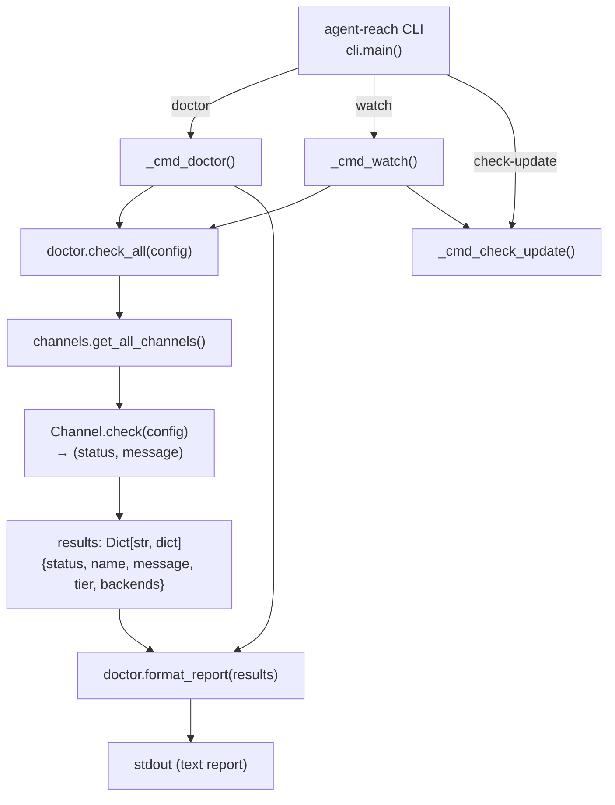
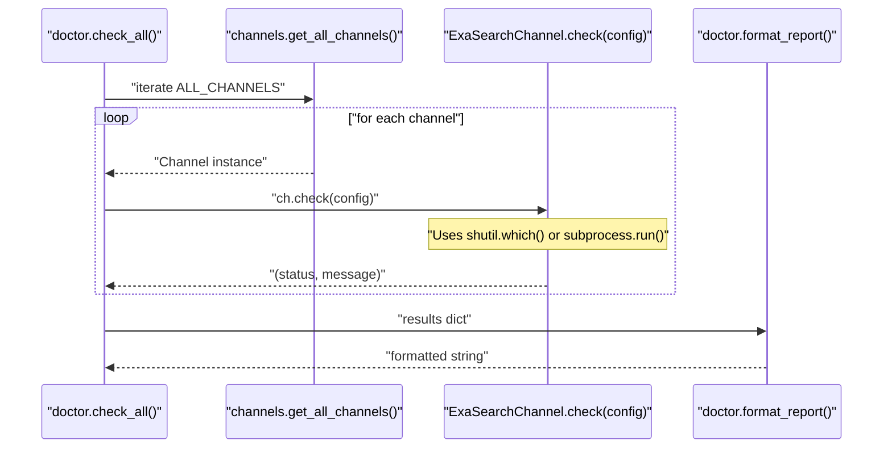
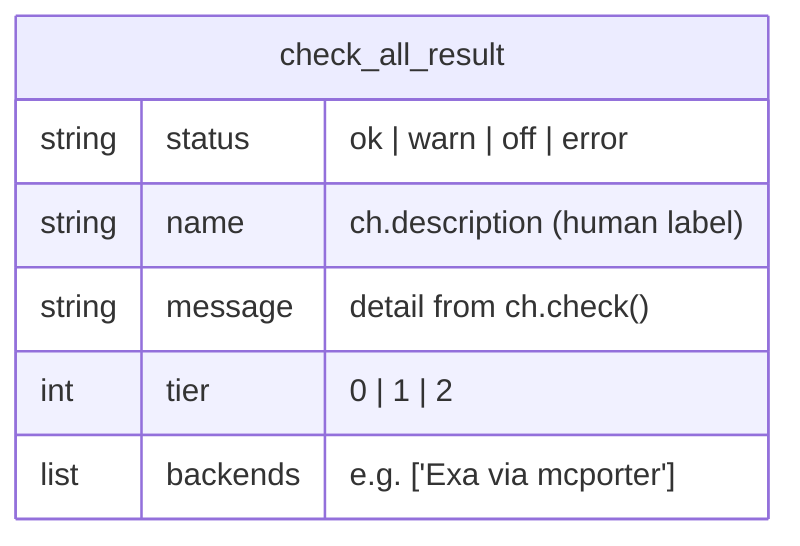

# 진단 및 모니터링

<details>
<summary>관련 소스 파일</summary>

다음 파일들은 이 위키 페이지를 생성할 때 컨텍스트로 사용되었습니다:

- [agent_reach/channels/exa_search.py](agent_reach/channels/exa_search.py)
- [agent_reach/config.py](agent_reach/config.py)
- [agent_reach/doctor.py](agent_reach/doctor.py)
- [agent_reach/guides/setup-twitter.md](agent_reach/guides/setup-twitter.md)
- [agent_reach/integrations/mcp_server.py](agent_reach/integrations/mcp_server.py)
- [docs/troubleshooting.md](docs/troubleshooting.md)
- [docs/update.md](docs/update.md)
- [tests/test_doctor.py](tests/test_doctor.py)

</details>


이 페이지는 Agent Reach 설치 상태를 점검하고 모니터링하는 데 사용하는 세 가지 명령, 즉 `agent-reach doctor`, `agent-reach watch`, `agent-reach check-update`를 다룹니다. 이 명령들은 어떤 채널이 동작하는지 식별하고, 설정 문제를 감지하며, 패키지 업데이트를 확인하게 해 줍니다.

`doctor`가 표시한 문제를 해결하기 위한 자격 증명과 프록시 설정 방법은 [Configure Command](#2.4)를 참조하세요. `doctor` 출력에서 언급되는 채널 계층 시스템의 배경은 [Channel Architecture](#3.1)를 보세요.

---

## 개요

**진단 흐름 다이어그램**



출처: [agent_reach/doctor.py:1-24](), [agent_reach/doctor.py:27-104]()

---

## `agent-reach doctor`

### 목적

`doctor`는 등록된 모든 채널에 대해 상태 점검을 수행하고 계층화된 상태 보고서를 출력합니다. 설치 문제를 진단하고 채널이 올바르게 설정되었는지 검증하는 데 사용하는 मुख्य 도구입니다.

### 구현

명령 핸들러는 `_cmd_doctor()`입니다. 이 함수는 다음을 수행합니다:

1. `~/.agent-reach/config.yaml`을 불러오기 위해 `Config()`를 인스턴스화합니다.
2. `agent_reach/doctor.py`의 `check_all(config)`를 호출합니다.
3. 결과를 `format_report(results)`에 전달하고 출력합니다.

`check_all()`은 [agent_reach/doctor.py:12-24]()에 정의되어 있습니다. `get_all_channels()`이 반환하는 모든 채널(`ALL_CHANNELS` 리스트)을 순회하면서 각 채널의 `ch.check(config)`를 호출하고, 결과 dict를 구성합니다:

```python
results[ch.name] = {
    "status": status,      # "ok" | "warn" | "off" | "error"
    "name": ch.description,
    "message": message,
    "tier": ch.tier,
    "backends": ch.backends,
}
```

`format_report()`는 [agent_reach/doctor.py:27-104]()에 정의되어 있습니다. 채널을 계층별로 묶고, `rich` 마크업을 사용해 이모지 상태 표시와 함께 각 그룹을 렌더링합니다 [agent_reach/doctor.py:35-85]().

### 상태 표시기

| 상태 값 | 표시 기호 | 의미 |
|---|---|---|
| `ok` | ✅ | 채널이 완전히 동작합니다 [agent_reach/doctor.py:48]() |
| `warn` | [!] (노란색) | 채널이 부분적으로만 사용 가능합니다(예: 백엔드는 있지만 인증되지 않음) [agent_reach/doctor.py:50]() |
| `off` | [X] (빨간색) / -- | 채널을 사용할 수 없습니다. 의존성이 없거나 설정되지 않았습니다 [agent_reach/doctor.py:52]() |
| `error` | [X] (빨간색) | 점검 중 예기치 않은 오류가 발생했습니다 [agent_reach/doctor.py:52]() |

### 보고서 구조

`format_report()`는 `tier`를 기준으로 채널을 세 섹션으로 묶습니다:

| 계층 | 섹션 레이블 | 의미 |
|---|---|---|
| `0` | ✅ 装好即用 | 무설정 - 설치 직후 바로 동작합니다 [agent_reach/doctor.py:43]() |
| `1` | 搜索（mcporter 即可解锁）| `mcporter`와 Exa MCP가 필요합니다 [agent_reach/doctor.py:58]() |
| `2` | 配置后可用 | 사용자별 인증 또는 선택적 서드파티 서비스가 필요합니다 [agent_reach/doctor.py:70]() |

하단 요약 줄은 활성 채널 수를 셉니다. 예: `状态：7/12 个渠道可用` [agent_reach/doctor.py:82]().

`format_report()`는 또한 **보안 점검** [agent_reach/doctor.py:87-102]()을 포함합니다. `~/.agent-reach/config.yaml`이 그룹 또는 다른 사용자에게 읽기 가능하면(즉, Unix에서 권한이 `0o600`보다 넓으면) 경고가 보고서에 추가됩니다.

### 채널 점검 흐름

**Channel.check() 디스패치 다이어그램**



출처: [agent_reach/doctor.py:12-24](), [agent_reach/channels/exa_search.py:18-39](), [agent_reach/doctor.py:27-104]()

---

## `agent-reach watch`

### 목적

`watch`는 **예약 작업**(예: cron job)에서 호출하도록 설계된 경량 명령입니다. 상태 점검과 업데이트 점검을 한 번에 실행하고, 기계가 읽을 수 있는 요약을 출력합니다.

의도된 AI 에이전트 작업 흐름은 업데이트 가이드 [docs/update.md:19-51]()에 설명되어 있습니다:

- 출력에 `全部正常`이 포함되면 → 알림이 필요 없으며 조용히 종료합니다.
- 출력에 `❌`, `⚠️`, 또는 `🆕`(새 버전)이 포함되면 → 보고서를 사용자에게 보여 주고 수정 또는 업그레이드를 제안합니다.

### 구현

핸들러는 다음을 결합합니다:
1. `agent_reach/doctor.py`의 `check_all(config)` + `format_report(results)` - `doctor`와 동일한 로직입니다.
2. `check-update` - GitHub releases API와 버전 비교를 수행합니다.

모든 채널이 `ok`이고 업데이트가 없으면 출력은 자동화 스크립트가 정상 상태를 감지하게 해 줍니다.

---

## `agent-reach check-update`

### 목적

`check-update`는 독립 실행형 버전 점검을 수행합니다. 로컬에 설치된 버전과 GitHub API의 최신 릴리스를 비교합니다 [docs/update.md:31-33]().

### 업데이트 흐름

새 버전이 감지되면 다음 단계를 권장합니다 [docs/update.md:37-76]():

1. **업데이트 설치**: `pip install --upgrade https://github.com/Panniantong/agent-reach/archive/main.zip` [docs/update.md:40]().
2. **검증**: `agent-reach doctor`를 실행해 업데이트 중 채널이 깨지지 않았는지 확인합니다 [docs/update.md:47]().
3. **Skills 업데이트**: `agent-reach install --skill-only`를 실행해 에이전트 디렉터리의 `SKILL.md` 파일을 새로 고칩니다 [docs/update.md:57]().

---

## 문제 해결 가이드

진단으로 식별되는 일반적인 문제:

### bird CLI 연결 실패(Twitter)
**증상**: `bird search` 또는 `doctor`가 Twitter에 대해 실패를 보고합니다.
**원인**:
- `AUTH_TOKEN` 또는 `CT0`가 없습니다 [docs/troubleshooting.md:5-7]().
- 네트워크 차단(프록시 필요) [docs/troubleshooting.md:7-8]().
**해결**:
- 쿠키 구성: `agent-reach configure twitter-cookies "JSON"` [agent_reach/guides/setup-twitter.md:43]().
- 프록시 설정: `export HTTP_PROXY="..."` [docs/troubleshooting.md:11-15]().
- 폴백: bird를 사용할 수 없으면 Twitter 검색에 `ExaSearchChannel`을 사용합니다 [docs/troubleshooting.md:29-36]().

### mcporter 설정
**증상**: 계층 1 검색 채널이 `off`로 표시됩니다.
**수정**:
- `mcporter` 설치: `npm install -g mcporter` [agent_reach/channels/exa_search.py:23]().
- Exa 엔드포인트 추가: `mcporter config add exa https://mcp.exa.ai/mcp` [agent_reach/channels/exa_search.py:24]().

---

## 데이터 구조

**`check_all()` 결과 dict 스키마**



출처: [agent_reach/doctor.py:12-24](), [agent_reach/channels/exa_search.py:9-13]()

---

## 테스트

doctor 모듈의 단위 테스트는 [tests/test_doctor.py]()에 있습니다.

| 테스트 | 검증 내용 |
|---|---|
| `test_check_all_collects_channel_results` | `check_all`이 `Channel.check()`의 데이터를 올바르게 집계하는지 검증합니다 [tests/test_doctor.py:29-64](). |
| `test_format_report` | `rich` 마크업 포맷팅과 계층 그룹화 로직을 검증합니다 [tests/test_doctor.py:66-102](). |

출처: [tests/test_doctor.py:28-102]()
