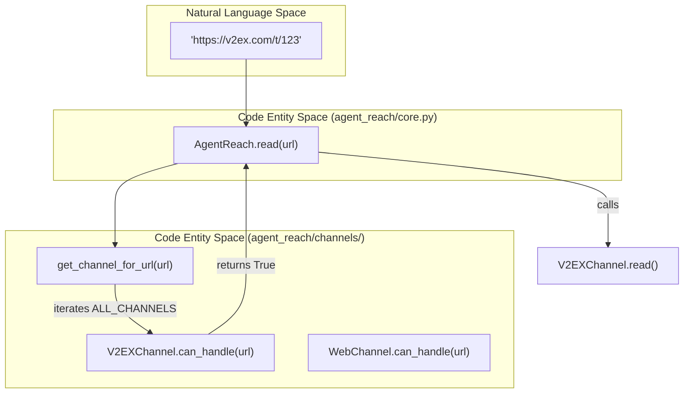
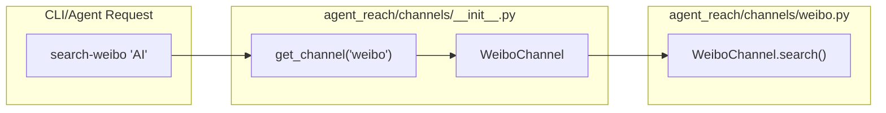

# 채널

<details>
<summary>관련 소스 파일</summary>

다음 파일들은 이 위키 페이지를 생성할 때 컨텍스트로 사용되었습니다:

- [agent_reach/channels/__init__.py](agent_reach/channels/__init__.py)
- [agent_reach/channels/v2ex.py](agent_reach/channels/v2ex.py)
- [agent_reach/channels/weibo.py](agent_reach/channels/weibo.py)
- [agent_reach/channels/xueqiu.py](agent_reach/channels/xueqiu.py)
- [tests/test_channel_contracts.py](tests/test_channel_contracts.py)
- [tests/test_channels.py](tests/test_channels.py)

</details>


이 페이지는 채널이 무엇인지, 런타임에서 어떻게 등록되고 선택되는지, 그리고 계층 요구사항과 함께 지원되는 플랫폼 전체 목록이 무엇인지를 설명합니다. 추상 `Channel` 기본 클래스 인터페이스와 `ReadResult`/`SearchResult` 데이터 구조는 [Channel Architecture](#3.1)를 참조하세요. 채널별 세부 사항은 [Twitter Channel](#3.2)부터 [Chinese Platform Channels](#3.10)까지의 섹션을 보세요.

---

## 채널이란 무엇인가?

**채널**은 `agent_reach/channels/` 안에 있는 Python 모듈로, 단일 외부 도구 또는 API를 감싸고 표준화된 작업을 노출합니다:

- **`can_handle(url)`** — 채널이 주어진 URL을 처리할 수 있으면 `True`를 반환합니다.
- **`check(config)`** — 의존성(CLI, API, 쿠키)이 사용 가능한지 확인하는 상태 점검을 수행합니다.
- **`read(url)`** — 특정 URL에서 구조화된 콘텐츠를 가져와 반환합니다.
- **`search(query)`** — 플랫폼을 검색하고 결과 순위 목록을 반환합니다.

모든 채널은 [agent_reach/channels/base.py]()에 정의된 `Channel` 추상 기본 클래스를 구현합니다. 각 채널은 정확히 하나의 플랫폼 또는 도구를 담당합니다. 기본 도구가 바뀌면 해당 채널 파일만 바꾸면 됩니다.

출처: [agent_reach/channels/__init__.py:7-25](), [agent_reach/channels/base.py:1-20]()

---

## 채널 레지스트리

모든 채널은 `agent_reach/channels/__init__.py`에 등록됩니다. `ALL_CHANNELS` 리스트의 순서가 URL 라우팅 우선순위를 결정합니다.

**`ALL_CHANNELS`** - 순서가 있는 라우팅 리스트:

```python
ALL_CHANNELS: List[Channel] = [
    GitHubChannel(),
    TwitterChannel(),
    YouTubeChannel(),
    RedditChannel(),
    BilibiliChannel(),
    XiaoHongShuChannel(),
    DouyinChannel(),
    LinkedInChannel(),
    WeChatChannel(),
    WeiboChannel(),
    XiaoyuzhouChannel(),
    V2EXChannel(),
    XueqiuChannel(),
    RSSChannel(),
    ExaSearchChannel(),
    WebChannel(),
]
```

출처: [agent_reach/channels/__init__.py:29-46]()

---

## URL 라우팅과 조회

`AgentReach.read(url)`가 호출되면 `ALL_CHANNELS`를 순회하면서 해당 URL을 맡겠다고 하는 첫 번째 채널을 선택합니다.

**그림 1: 자연어 공간에서 코드 엔티티 공간으로의 URL 디스패치 경로**



**그림 2: 플랫폼별 검색을 위한 이름 기반 채널 조회**



출처: [agent_reach/channels/__init__.py:49-54](), [tests/test_channels.py:16-30](), [tests/test_channel_contracts.py:108-128]()

---

## 계층 분류

채널은 설정 요구사항에 따라 계층으로 분류됩니다.

| 계층 | 레이블 | 의미 | 예시 |
|------|-------|---------|---------|
| 0 | 무설정 | 공개 API 또는 표준 CLI를 통해 바로 동작 | `V2EXChannel`, `XueqiuChannel`, `WebChannel`, `RSSChannel` |
| 1 | 키/설정 필요 | API 키(Exa) 또는 특정 CLI 브리지(mcporter)가 필요 | `ExaSearchChannel`, `WeiboChannel`, `DouyinChannel`, `RedditChannel` |
| 2 | 계정 필요 | 인증된 쿠키 또는 세션 토큰이 필요 | `XiaoHongShuChannel`, `InstagramChannel`, `LinkedInChannel`, `BossZhipinChannel` |

출처: [agent_reach/channels/v2ex.py:24](), [agent_reach/channels/xueqiu.py:55](), [agent_reach/channels/weibo.py:13](), [tests/test_channel_contracts.py:14-19]()

---

## 지원 플랫폼

| 플랫폼 | 채널 클래스 | 채널 이름 | 계층 | 주요 백엔드 |
|----------|--------------|--------------|------|-----------------|
| 🌐 Web | `WebChannel` | `web` | 0 | Jina Reader |
| 📦 GitHub | `GitHubChannel` | `github` | 0 | `gh` CLI |
| 🐦 Twitter/X | `TwitterChannel` | `twitter` | 0/1 | `bird` CLI |
| 📺 YouTube | `YouTubeChannel` | `youtube` | 0 | `yt-dlp` |
| 📖 Reddit | `RedditChannel` | `reddit` | 1 | JSON API |
| 📺 Bilibili | `BilibiliChannel` | `bilibili` | 0/1 | `yt-dlp` |
| 📕 XiaoHongShu | `XiaoHongShuChannel` | `xiaohongshu` | 2 | `mcporter` + `xiaohongshu-mcp` |
| 🎵 Douyin | `DouyinChannel` | `douyin` | 1 | `mcporter` + `douyin-mcp-server` |
| 💼 LinkedIn | `LinkedInChannel` | `linkedin` | 2 | `mcporter` + `linkedin-scraper-mcp` |
| 💬 WeChat | `WeChatChannel` | `wechat` | 1 | `wechat-article-for-ai` |
| 微博 Weibo | `WeiboChannel` | `weibo` | 1 | `mcporter` + `mcp-server-weibo` |
| 🎙️ 小宇宙 | `XiaoyuzhouChannel` | `xiaoyuzhou` | 1 | `Groq Whisper` |
| 🟢 V2EX | `V2EXChannel` | `v2ex` | 0 | Public API |
| 📈 雪球 | `XueqiuChannel` | `xueqiu` | 0 | Public API |
| 🔍 Exa Search | `ExaSearchChannel` | `exa_search` | 1 | `mcporter` + `exa-mcp` |

출처: [agent_reach/channels/__init__.py:29-46](), [agent_reach/channels/weibo.py:9-13](), [agent_reach/channels/v2ex.py:20-24](), [agent_reach/channels/xueqiu.py:51-55]()

---

## 상세 채널 문서

- [Channel Architecture](#3.1) - 기본 인터페이스와 결과 타입.
- [Twitter Channel](#3.2) - `bird` CLI를 사용하는 Twitter 전용 로직.
- [YouTube and Bilibili Channels](#3.3) - `yt-dlp`를 사용하는 비디오 플랫폼.
- [GitHub Channel](#3.4) - `gh` CLI를 통한 코드 및 저장소 읽기.
- [Reddit Channel](#3.5) - JSON API를 통한 커뮤니티 읽기.
- [Web and RSS Channels](#3.6) - 폴백 웹 읽기와 피드 파싱.
- [XiaoHongShu Channel](#3.7) - 소셜 커머스 플랫폼 통합.
- [Exa Search Channel](#3.8) - 의미 기반 웹 검색 통합.
- [Instagram, LinkedIn, and Boss直聘 Channels](#3.9) - 전문 및 소셜 네트워킹.
- [Chinese Platform Channels](#3.10) - Weibo, Douyin, WeChat, Xiaoyuzhou, V2EX, and Xueqiu.
