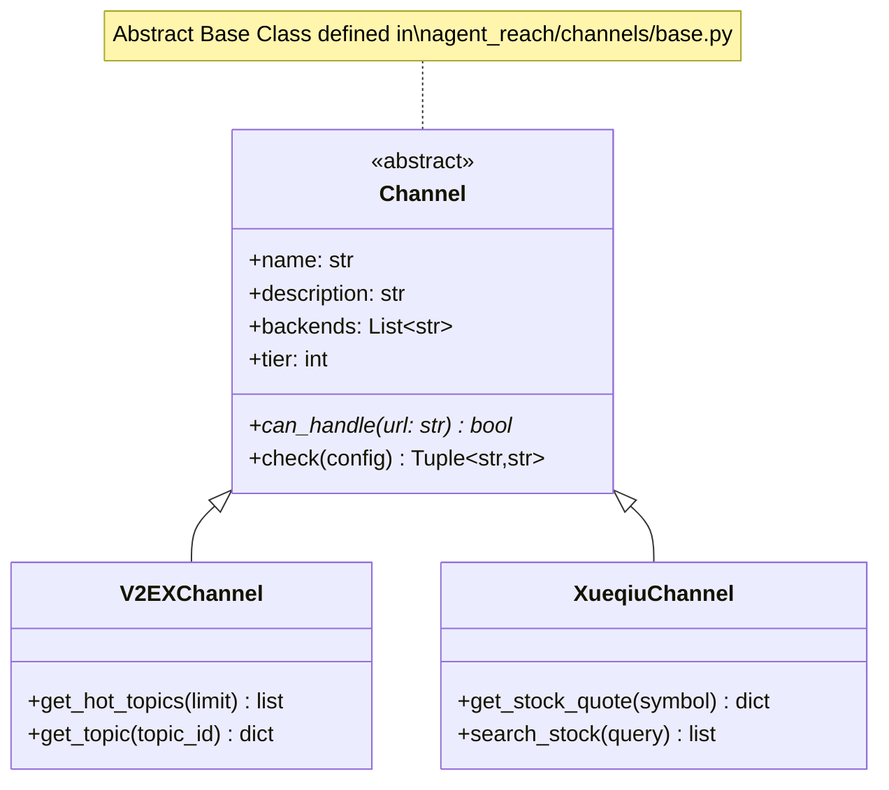
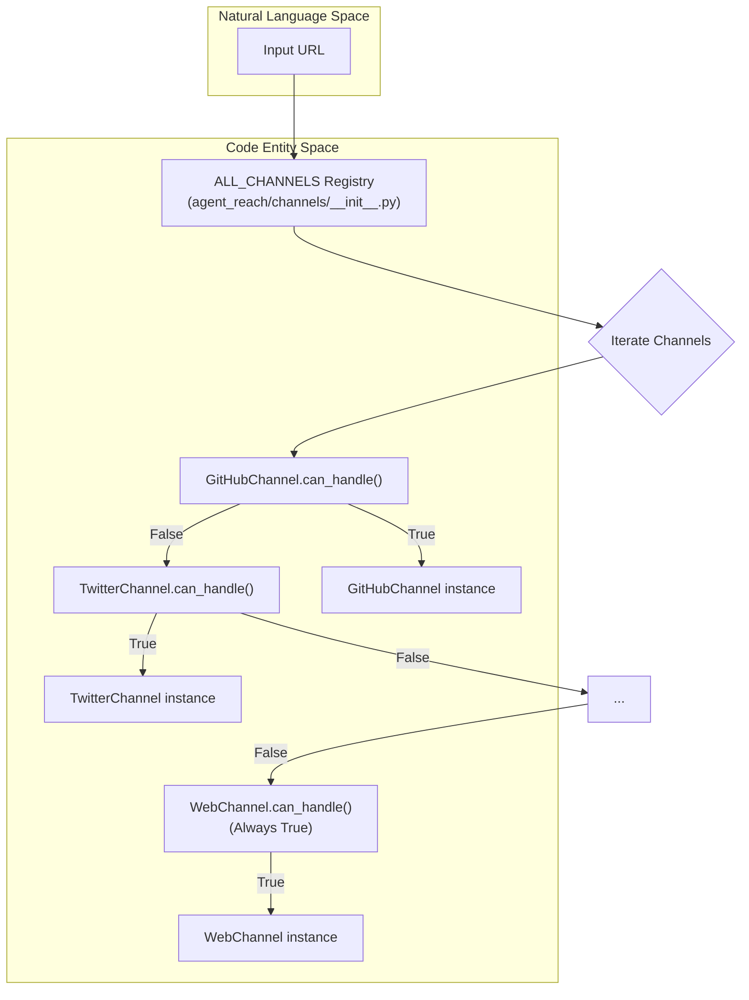

# 채널 아키텍처

관련 소스 파일

다음 파일들은 이 위키 페이지를 생성할 때 컨텍스트로 사용되었습니다:

- [agent_reach/channels/__init__.py](agent_reach/channels/__init__.py)
- [agent_reach/channels/base.py](agent_reach/channels/base.py)
- [agent_reach/channels/bilibili.py](agent_reach/channels/bilibili.py)
- [agent_reach/channels/reddit.py](agent_reach/channels/reddit.py)
- [agent_reach/channels/rss.py](agent_reach/channels/rss.py)
- [agent_reach/channels/v2ex.py](agent_reach/channels/v2ex.py)
- [agent_reach/channels/web.py](agent_reach/channels/web.py)
- [agent_reach/channels/weibo.py](agent_reach/channels/weibo.py)
- [agent_reach/channels/xueqiu.py](agent_reach/channels/xueqiu.py)
- [tests/test_channel_contracts.py](tests/test_channel_contracts.py)
- [tests/test_channels.py](tests/test_channels.py)

이 페이지는 채널 하위 시스템의 내부 아키텍처를 문서화합니다. `Channel` 추상 기본 클래스, `ReadResult`와 `SearchResult` 데이터 구조, 그리고 요청을 올바른 구현체로 라우팅하는 레지스트리(`ALL_CHANNELS`, `SEARCH_CHANNELS`)를 다룹니다.

---

## 개요

Agent Reach의 모든 플랫폼 통합은 `Channel`입니다. 이는 공통 인터페이스를 구현하고 특정 외부 백엔드 도구 또는 API를 감싸는 클래스입니다. 채널 시스템에는 세 가지 책임이 있습니다:

1.  **URL 라우팅** - `can_handle()`를 통해 주어진 URL을 어떤 채널이 처리할지 결정합니다.
2.  **상태 보고** - `check()`를 통해 채널의 의존성(CLI, API, 설정)이 충족되었는지 보고합니다.
3.  **데이터 가져오기** - 플랫폼별 데이터에 구조화된 접근을 제공합니다(예: `get_hot_topics`, `get_stock_quote`).

모든 채널은 `agent_reach/channels/` 아래에 있습니다. 추상 계약은 `agent_reach/channels/base.py`에 정의되어 있고, 모든 것을 연결하는 레지스트리는 `agent_reach/channels/__init__.py`에 있습니다.

출처: [agent_reach/channels/base.py:1-11](), [agent_reach/channels/__init__.py:1-7]()

---

## `Channel` 추상 기본 클래스

**파일:** [agent_reach/channels/base.py:18-37]()

모든 채널은 `Channel`을 상속하며, `can_handle` 추상 메서드를 구현해야 합니다.

### 클래스 수준 속성

| 속성 | 타입 | 목적 |
| :--- | :--- | :--- |
| `name` | `str` | 고유 식별자(예: `"youtube"`, `"v2ex"`) [agent_reach/channels/base.py:21]() |
| `description` | `str` | 플랫폼을 사람이 읽을 수 있게 요약한 설명 [agent_reach/channels/base.py:22]() |
| `backends` | `List[str]` | 사용되는 외부 도구 이름(예: `["yt-dlp"]`) [agent_reach/channels/base.py:23]() |
| `tier` | `int` | 설정 복잡도: `0`=무설정, `1`=키 필요, `2`=설정 필요 [agent_reach/channels/base.py:24]() |

### 핵심 메서드

**`can_handle(url: str) -> bool`**  
이 채널이 주어진 URL의 책임자라면 `True`를 반환합니다. 일반적으로 `urlparse`를 통해 URL의 도메인을 검사합니다. [agent_reach/channels/base.py:27-29]()

**`check(config=None) -> Tuple[str, str]`**  
`(status, message)` 튜플을 반환합니다. `status`는 `"ok"`, `"warn"`, `"off"`, `"error"` 중 하나입니다. 기본 구현은 `"ok"`를 반환하고 백엔드 목록을 표시합니다. 서브클래스는 `shutil.which`를 사용한 능동적 연결 테스트나 도구 존재 여부 점검으로 이를 재정의합니다. [agent_reach/channels/base.py:31-36]()

---

**다이어그램: Channel 클래스 인터페이스와 데이터 흐름**

출처: [agent_reach/channels/base.py:18-37](), [agent_reach/channels/v2ex.py:20-24](), [agent_reach/channels/xueqiu.py:51-55]()

---

## 데이터 구조

기본 `Channel` 클래스가 라우팅과 상태를 위한 인터페이스를 제공하는 반면, 구체적인 채널들은 AI 소비를 위한 구조화된 데이터를 반환하는 메서드를 구현합니다.

### 표준화된 결과
채널은 종종 딕셔너리 목록이나 특정 객체를 반환합니다. 예를 들면:
*   **V2EX**: `title`, `url`, `replies`, `content`를 가진 토픽 딕셔너리를 반환합니다(컨텍스트 효율성을 위해 200자까지 잘림). [agent_reach/channels/v2ex.py:52-75]()
*   **Xueqiu**: `symbol`, `current`, `percent`, `market_capital`이 포함된 주식 시세를 반환합니다. [agent_reach/channels/xueqiu.py:85-114]()

---

## 채널 레지스트리

### `ALL_CHANNELS` - URL 라우팅 메커니즘

`ALL_CHANNELS`는 [agent_reach/channels/__init__.py:29-46]()에 정의된 인스턴스화된 `Channel` 객체의 순서가 있는 리스트입니다. 시스템이 이 리스트를 순회하면서 **첫 번째 일치**를 반환하므로 순서가 매우 중요합니다. `WebChannel`은 항상 마지막에 있어 범용 폴백 역할을 합니다.

**레지스트리 순서:**
1.  `GitHubChannel`
2.  `TwitterChannel`
3.  `YouTubeChannel`
4.  `RedditChannel`
5.  `BilibiliChannel`
6.  `XiaoHongShuChannel`
7.  ... (다른 특정 플랫폼들) ...
8.  `RSSChannel`
9.  `ExaSearchChannel`
10. `WebChannel` (폴백)

### 레지스트리 함수

| 함수 | 시그니처 | 목적 |
| :--- | :--- | :--- |
| `get_channel` | `(name: str) -> Optional[Channel]` | `channel.name`으로 조회합니다 [agent_reach/channels/__init__.py:49-54]() |
| `get_all_channels` | `() -> List[Channel]` | 전체 `ALL_CHANNELS` 리스트를 반환합니다 [agent_reach/channels/__init__.py:57-59]() |

---

**다이어그램: URL 라우팅에서 코드 엔티티로**

출처: [agent_reach/channels/__init__.py:29-54](), [agent_reach/channels/web.py:13-14]()

---

## 계층 분류

각 `Channel` 클래스의 `tier` 속성은 필요한 설정 수준을 나타냅니다.

| 계층 | 의미 | 예시 |
| :--- | :--- | :--- |
| **0** | **무설정**: 기본 제공 상태로 동작하거나 공개 API를 사용합니다. | `V2EXChannel` [v2ex.py:24](), `XueqiuChannel` [xueqiu.py:55](), `WebChannel` [web.py:11]() |
| **1** | **설정/키 필요**: 바이너리(예: `yt-dlp`) 또는 무료 API 키가 필요합니다. | `YouTubeChannel` [test_channel_contracts.py:34](), `RedditChannel` [reddit.py:27](), `BilibiliChannel` [bilibili.py:44]() |
| **2** | **복잡한 설정**: MCP 서버, 쿠키, 브라우저 자동화가 필요합니다. | `XiaoHongShuChannel` (MCP 필요) |

출처: [agent_reach/channels/base.py:24](), [agent_reach/channels/v2ex.py:24](), [agent_reach/channels/reddit.py:27]()

---

## 구현 세부 사항: 상태 점검

`check()` 메서드는 `agent-reach doctor` 명령이 환경 준비 상태를 검증할 때 사용합니다.

*   **도구 탐지**: `shutil.which`를 사용해 `yt-dlp`나 `mcporter` 같은 바이너리를 찾습니다. [agent_reach/channels/bilibili.py:52](), [agent_reach/channels/weibo.py:21]()
*   **연결성 프로빙**: `V2EXChannel`, `XueqiuChannel` 같은 채널은 작은 JSON 가져오기를 시도해 API 접근 가능 여부를 검증합니다. [agent_reach/channels/v2ex.py:39-46](), [agent_reach/channels/xueqiu.py:71-79]()
*   **프록시 인식**: `RedditChannel`, `BilibiliChannel` 같은 채널은 지역 차단을 우회하기 위해 `Config` 또는 환경 변수에 프록시가 설정되어 있는지 확인합니다. [agent_reach/channels/reddit.py:34-45](), [agent_reach/channels/bilibili.py:55-69]()

출처: [agent_reach/channels/base.py:31-36](), [agent_reach/channels/v2ex.py:39-46](), [agent_reach/channels/bilibili.py:51-80]()
