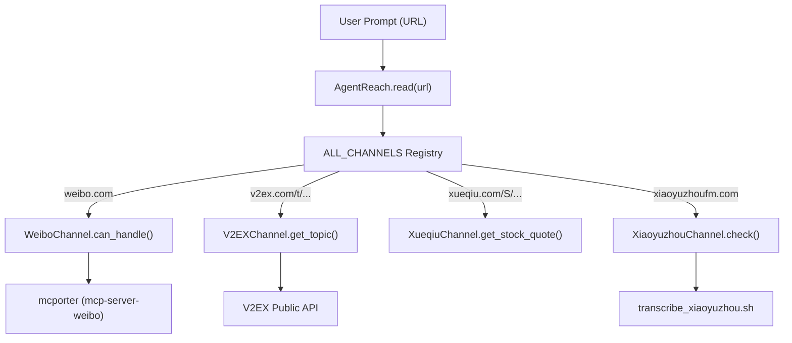
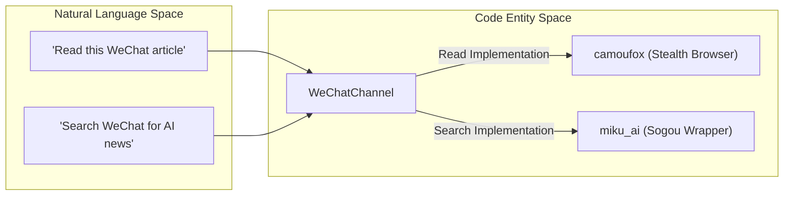

# 중국 플랫폼 채널

관련 소스 파일

다음 파일들은 이 위키 페이지를 생성할 때 컨텍스트로 사용되었습니다:

- [agent_reach/channels/__init__.py](agent_reach/channels/__init__.py)
- [agent_reach/channels/v2ex.py](agent_reach/channels/v2ex.py)
- [agent_reach/channels/wechat.py](agent_reach/channels/wechat.py)
- [agent_reach/channels/weibo.py](agent_reach/channels/weibo.py)
- [agent_reach/channels/xiaoyuzhou.py](agent_reach/channels/xiaoyuzhou.py)
- [agent_reach/channels/xueqiu.py](agent_reach/channels/xueqiu.py)
- [agent_reach/scripts/transcribe_xiaoyuzhou.sh](agent_reach/scripts/transcribe_xiaoyuzhou.sh)
- [tests/test_channel_contracts.py](tests/test_channel_contracts.py)
- [tests/test_channels.py](tests/test_channels.py)

이 페이지는 Agent Reach가 지원하는 특화된 중국 플랫폼 채널을 문서화합니다. 이 채널들은 주요 중국 소셜 미디어, 콘텐츠, 금융 플랫폼과 깊게 통합되어 있으며, `mcporter`를 통한 Model Context Protocol(MCP) 또는 특수 스크래핑/전사 파이프라인을 사용해 안티 크롤링 조치를 우회하고 구조화된 데이터를 AI 에이전트에게 제공합니다.

### 채널 개요와 계층

중국 플랫폼 채널은 설정 요구사항에 따라 다음 계층으로 분류됩니다:
*   **Tier 0 (무설정):** 공개 API를 사용하며, 설치 즉시 동작합니다(예: V2EX, Xueqiu).
*   **Tier 1 (설정 필요):** 외부 CLI 도구나 API 키가 필요합니다(예: Weibo, Douyin, Xiaoyuzhou).
*   **Tier 2 (고급):** 특수 브라우저 환경이나 여러 의존성이 필요합니다(예: WeChat).

---

### WeiboChannel

`WeiboChannel`은 시나 웨이보(Sina Weibo)의 인기 콘텐츠와 사용자 타임라인에 접근을 제공합니다. `mcporter`를 통해 Agent Reach에 연결되는 `mcp-server-weibo` 백엔드에 의존합니다.

*   **구현:** 요청을 `mcp-server-weibo` MCP 서버로 디스패치합니다 [agent_reach/channels/weibo.py:12-13]().
*   **기능:** 인기 검색(`hot_search`), 사용자 검색, 사용자 상태 업데이트/댓글 가져오기를 지원합니다 [agent_reach/channels/weibo.py:48-49]().
*   **데이터 흐름:**
    1.  `can_handle`가 `weibo.com` 또는 `weibo.cn` 도메인을 확인합니다 [agent_reach/channels/weibo.py:15-18]().
    2.  `check()`가 `mcporter`가 설치되어 있는지와 `weibo` config가 등록되어 있는지 검증합니다 [agent_reach/channels/weibo.py:21-40]().
    3.  도구 가용성을 보장하기 위해 `mcporter list weibo`를 통해 명령을 실행합니다 [agent_reach/channels/weibo.py:44-49]().

**출처:** [agent_reach/channels/weibo.py:1-53]()

---

### DouyinChannel

`DouyinChannel`은 ByteDance의 Douyin 플랫폼에서 비디오 메타데이터를 추출합니다.

*   **구현:** `mcporter` 브리지를 통해 `douyin-mcp-server`를 활용합니다 [agent_reach/channels/__init__.py:19]().
*   **핵심 함수:** `parse_douyin_video_info`는 비디오 URL을 구조화된 메타데이터로 해석하는 데 사용하는 주요 도구입니다 [tests/test_channel_contracts.py:91]().
*   **검증:** `check()` 메서드는 진단 중 라이브 사이트에 접속해 rate limit을 유발하지 않도록 `mcporter list douyin`을 사용해 파싱 도구의 존재를 확인합니다 [tests/test_channel_contracts.py:71-106]().

**출처:** [agent_reach/channels/__init__.py:19-36](), [tests/test_channel_contracts.py:71-106]()

---

### WeChatChannel

`WeChatChannel`은 WeChat 공식 계정(公众号) 기사를 읽고 검색하는 이중 기능 시스템을 제공합니다.

*   **구현:**
    *   **읽기:** WeChat의 엄격한 안티 봇 탐지를 우회하기 위해 **Camoufox** 스텔스 브라우저를 사용하는 `wechat-article-for-ai`를 사용합니다 [agent_reach/channels/wechat.py:16]().
    *   **검색:** Sogou 기반 WeChat 기사 검색을 위해 `miku_ai`를 통합합니다 [agent_reach/channels/wechat.py:16]().
*   **라우팅:** `mp.weixin.qq.com`과 `weixin.qq.com`에 매칭됩니다 [agent_reach/channels/wechat.py:19-22]().
*   **의존성 관리:** `check()` 메서드는 `camoufox`와 `miku_ai` Python 패키지의 존재 여부에 따라 어떤 기능(읽기/검색)이 활성화되어 있는지 식별합니다 [agent_reach/channels/wechat.py:28-48]().

**출처:** [agent_reach/channels/wechat.py:1-58]()

---

### XiaoyuzhouChannel

`XiaoyuzhouChannel`은 Xiaoyuzhou(小宇宙) 팟캐스트 플랫폼을 위한 정교한 전사 파이프라인을 구현합니다.

*   **백엔드 파이프라인:** 오디오 처리에는 `ffmpeg`를, 고속 전사에는 **Groq Whisper** API를 사용합니다 [agent_reach/channels/xiaoyuzhou.py:13]().
*   **로직 흐름(`transcribe_xiaoyuzhou.sh`):**
    1.  **파싱:** `grep`을 사용해 쇼 페이지에서 직접 오디오 URL(m4a/mp3)을 추출합니다 [agent_reach/scripts/transcribe_xiaoyuzhou.sh:35-44]().
    2.  **트랜스코딩:** `ffmpeg`를 사용해 파일 크기를 최소화하기 위해 오디오를 저비트레이트(64k) 모노 MP3로 변환합니다 [agent_reach/scripts/transcribe_xiaoyuzhou.sh:62-66]().
    3.  **청크 분할:** Groq의 25MB 제한을 맞추기 위해 파일을 20MB 세그먼트로 나눕니다 [agent_reach/scripts/transcribe_xiaoyuzhou.sh:69-88]().
    4.  **전사:** HTTP 429 rate limit에 대한 자동 재시도 로직과 함께 청크를 Groq의 `whisper-large-v3`로 보냅니다 [agent_reach/scripts/transcribe_xiaoyuzhou.sh:93-141]().
    5.  **병합:** 전사 결과를 Markdown 문서로 합칩니다 [agent_reach/scripts/transcribe_xiaoyuzhou.sh:144-160]().

**출처:** [agent_reach/channels/xiaoyuzhou.py:1-55](), [agent_reach/scripts/transcribe_xiaoyuzhou.sh:1-168]()

---

### V2EXChannel

공개 API를 사용해 V2EX 개발자 커뮤니티와 상호작용하는 Tier 0 채널입니다.

*   **핵심 함수:**
    *   `get_hot_topics()`: 상위 20개 인기 게시물을 가져옵니다 [agent_reach/channels/v2ex.py:52-75]().
    *   `get_node_topics(node_name)`: 특정 노드(예: `python`, `jobs`)를 탐색합니다 [agent_reach/channels/v2ex.py:77-108]().
    *   `get_topic(topic_id)`: 전체 게시물 내용과 첫 페이지의 답글을 가져옵니다 [agent_reach/channels/v2ex.py:110-161]().
*   **구현:** JSON 데이터를 가져오기 위해 사용자 정의 User-Agent가 있는 표준 `urllib.request`를 사용합니다 [agent_reach/channels/v2ex.py:9-17]().

**출처:** [agent_reach/channels/v2ex.py:1-204](), [tests/test_channels.py:33-198]()

---

### XueqiuChannel

`XueqiuChannel`은 Xueqiu(雪球) 플랫폼의 금융 데이터와 커뮤니티 게시물을 제공합니다.

*   **세션 관리:** API 호출 전에 홈페이지를 방문해 `CookieJar`를 채우는 `_ensure_cookies()`를 구현하여 플랫폼이 요청을 허용하도록 합니다 [agent_reach/channels/xueqiu.py:18-33]().
*   **기능:**
    *   `get_stock_quote(symbol)`: SH/SZ/HK/US 주식의 실시간 가격, 변동, 거래량을 제공합니다 [agent_reach/channels/xueqiu.py:85-114]().
    *   `get_hot_posts()`: HTML 제거를 거친 인기 커뮤니티 토론을 가져옵니다 [agent_reach/channels/xueqiu.py:141-169]().
    *   `get_hot_stocks()`: 인기 순위(人气榜)를 반환합니다 [agent_reach/channels/xueqiu.py:171-196]().

**출처:** [agent_reach/channels/xueqiu.py:1-197]()

---

### 시스템 아키텍처: 자연어에서 코드 엔티티로

다음 다이어그램은 중국 플랫폼에 대한 사용자 의도가 특정 코드 엔티티로 어떻게 디스패치되는지 보여줍니다.

**다이어그램 1: 중국 콘텐츠에 대한 URL 디스패치**
이 다이어그램은 `ALL_CHANNELS` 레지스트리가 특정 URL을 적절한 Channel 클래스에 어떻게 라우팅하는지 보여줍니다.

**출처:** [agent_reach/channels/__init__.py:29-46](), [agent_reach/channels/v2ex.py:30-33](), [agent_reach/channels/xueqiu.py:61-65]()

**다이어그램 2: WeChat 읽기/검색 파이프라인**
이 다이어그램은 WeChat에 대한 자연어 요구사항이 `WeChatChannel`에서 사용되는 구체적 백엔드로 어떻게 매핑되는지 보여줍니다.

**출처:** [agent_reach/channels/wechat.py:13-17](), [agent_reach/channels/wechat.py:40-48]()

### 비교 표: 중국 플랫폼 기능

| 채널 | 백엔드 | 계층 | 핵심 기능 | 설정 키 |
| :--- | :--- | :--- | :--- | :--- |
| **Weibo** | `mcp-server-weibo` | 1 | 인기 검색 / 사용자 타임라인 | N/A (MCP) |
| **Douyin** | `douyin-mcp-server` | 1 | 비디오 파싱 | N/A (MCP) |
| **WeChat** | `camoufox` / `miku_ai` | 2 | 스텔스 기사 읽기 | N/A |
| **Xiaoyuzhou** | `ffmpeg` + `Groq` | 1 | 팟캐스트 전사 | `groq_api_key` |
| **V2EX** | Public API | 0 | 노드 및 토픽 탐색 | N/A |
| **Xueqiu** | Public API | 0 | 주식 시세 및 인기 게시물 | N/A |

**출처:** [agent_reach/channels/__init__.py:29-46](), [agent_reach/channels/xiaoyuzhou.py:10-14](), [agent_reach/channels/wechat.py:13-17]()
