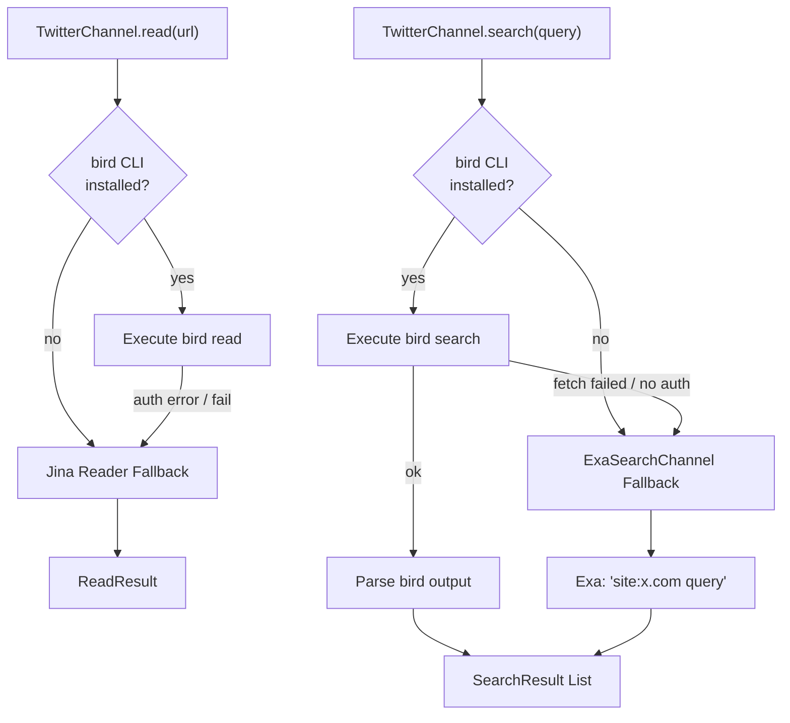
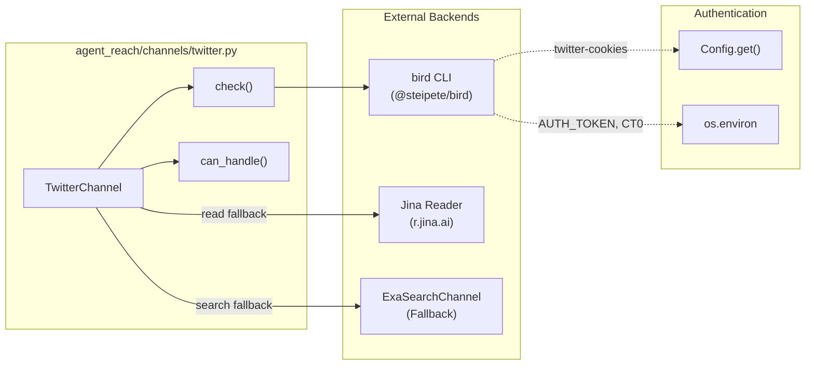

# Twitter Channel

<details>
<summary>관련 소스 파일</summary>

다음 파일들은 이 위키 페이지를 생성할 때 컨텍스트로 사용되었습니다:

- [agent_reach/channels/twitter.py](agent_reach/channels/twitter.py)
- [agent_reach/config.py](agent_reach/config.py)
- [agent_reach/guides/setup-twitter.md](agent_reach/guides/setup-twitter.md)
- [agent_reach/integrations/mcp_server.py](agent_reach/integrations/mcp_server.py)
- [docs/troubleshooting.md](docs/troubleshooting.md)
- [tests/test_twitter_channel.py](tests/test_twitter_channel.py)

</details>


이 페이지는 Twitter/X 콘텐츠를 읽고 검색하는 채널 구현체인 `TwitterChannel`을 문서화합니다. `bird` CLI 주요 백엔드, Jina Reader와 Exa 폴백 경로, 쿠키 인증(`AUTH_TOKEN`, `CT0`), Node.js fetch 프록시 주입 메커니즘을 다룹니다.

---

## 개요

`TwitterChannel`은 [agent_reach/channels/twitter.py:9-51]()에 정의되어 있으며, `x.com`과 `twitter.com`의 모든 URL을 처리합니다 [agent_reach/channels/twitter.py:15-18](). 이는 **계층 1**로 분류됩니다 [agent_reach/channels/twitter.py:13-13](). 기본 읽기는 Jina Reader로 폴백할 수 있지만, 검색과 타임라인 접근 같은 고급 기능은 `bird` CLI 백엔드에 의존합니다.

| 속성 | 값 |
|---|---|
| `name` | `"twitter"` [agent_reach/channels/twitter.py:10-10]() |
| `tier` | `1` [agent_reach/channels/twitter.py:13-13]() |
| `backends` | `bird CLI` [agent_reach/channels/twitter.py:12-12]() |
| URL match | `x.com`, `twitter.com` [agent_reach/channels/twitter.py:18-18]() |

**설정별 기능 가용성:**

| 상태 | 단일 트윗 읽기 | 검색 | 타임라인 |
|---|---|---|---|
| bird 없음, 쿠키 없음 | ⚠️ (Jina 폴백) | ⚠️ (Exa 폴백) | ❌ |
| bird 설치됨, 쿠키 없음 | ⚠️ (인증 필요) | ⚠️ (인증 필요) | ❌ |
| bird + 유효한 쿠키 | ✅ | ✅ | ✅ |

출처: [agent_reach/channels/twitter.py:9-51](), [agent_reach/guides/setup-twitter.md:1-12]()

---

## 아키텍처

`TwitterChannel`은 모든 작업에서 `bird` CLI를 우선 사용합니다. `bird`가 없거나 실패하면, 콘텐츠 추출에는 Jina Reader를, 검색 쿼리에는 `ExaSearchChannel`을 사용하는 계층형 폴백 전략을 사용합니다.

**다이어그램: TwitterChannel - 백엔드와 폴백 경로**



출처: [agent_reach/channels/twitter.py:20-35](), [agent_reach/guides/setup-twitter.md:3-9](), [docs/troubleshooting.md:29-36]()

---

**다이어그램: 코드 엔티티와 그 역할**



출처: [agent_reach/channels/twitter.py:9-51](), [agent_reach/config.py:22-28](), [agent_reach/guides/setup-twitter.md:52-59]()

---

## 인증

`TwitterChannel`은 `bird` CLI가 Twitter API와 상호작용하기 위해 두 개의 특정 쿠키 값이 필요합니다. 이 값들은 환경 변수 또는 내부 설정 시스템을 통해 처리됩니다.

| 쿠키 이름 | config key | 환경 변수 |
|---|---|---|
| `auth_token` | `twitter_auth_token` | `AUTH_TOKEN` |
| `ct0` | `twitter_ct0` | `CT0` |

`Config` 클래스는 레거시 키 `twitter_xreach`를 이 토큰들로 매핑합니다 [agent_reach/config.py:25-25](). 사용자는 다음과 같이 설정할 수 있습니다:

```bash
agent-reach configure twitter-cookies "auth_token=xxx; ct0=yyy"
```

이 명령은 쿠키 문자열 또는 JSON에서 필요한 토큰을 추출합니다 [agent_reach/channels/twitter.py:43-43](), [agent_reach/guides/setup-twitter.md:42-44]().

출처: [agent_reach/config.py:25-25](), [agent_reach/channels/twitter.py:38-48](), [agent_reach/guides/setup-twitter.md:35-46]()

---

## 상태 점검 및 진단

`check()` 함수는 `shutil.which`를 사용해 `bird` 또는 `birdx` 바이너리를 찾으며 환경을 검증합니다 [agent_reach/channels/twitter.py:21-21]().

1. **바이너리 없음:** `bird`와 `birdx` 둘 다 없으면, `@steipete/bird` 설치 지침과 함께 `warn` 상태를 반환합니다 [agent_reach/channels/twitter.py:22-26]().
2. **자격 증명 없음:** `bird check`를 실행합니다 [agent_reach/channels/twitter.py:29-32](). 출력에 "Missing credentials"가 포함되면 `AUTH_TOKEN`과 `CT0`를 설정하라고 안내합니다 [agent_reach/channels/twitter.py:37-44]().
3. **연결 실패:** 서브프로세스 호출 중 일반 예외가 발생하면 "connection failed" 경고를 반환합니다 [agent_reach/channels/twitter.py:49-50]().

`agent-reach doctor` 명령은 이러한 결과를 집계해 시스템 상태 개요를 제공합니다 [agent_reach/integrations/mcp_server.py:47-48]().

출처: [agent_reach/channels/twitter.py:20-50](), [tests/test_twitter_channel.py:16-71]()

---

## 프록시 지원과 Node.js fetch()

`bird` CLI는 Node.js 애플리케이션입니다. 흔한 문제는 Node.js `fetch()`가 일부 버전에서 `HTTP_PROXY` 같은 시스템 환경 변수를 자동으로 따르지 않는다는 점입니다.

### "fetch failed" 문제
프록시가 필요한 환경(예: 방화벽 뒤)에서 실행하면, 셸에 `HTTP_PROXY`가 설정되어 있어도 `bird`가 "fetch failed" 오류를 반환할 수 있습니다 [docs/troubleshooting.md:3-7]().

### 문제 해결 절차
1. **수동 프록시 export:** 명령을 실행하기 전에 `HTTP_PROXY`와 `HTTPS_PROXY`를 명시적으로 export합니다 [docs/troubleshooting.md:11-17]().
2. **전역 프록시 도구:** `proxychains`나 `tun2socks` 같은 도구로 `bird` 실행을 감쌉니다 [docs/troubleshooting.md:19-28]().
3. **Exa 폴백:** 프록시 문제를 해결할 수 없으면, 시스템은 Exa 검색을 무설정 대안으로 사용하도록 설계되어 있습니다 [docs/troubleshooting.md:29-36]().

출처: [docs/troubleshooting.md:1-44](), [agent_reach/guides/setup-twitter.md:67-82]()

---

## MCP를 통한 통합

Twitter 채널의 상태는 Model Context Protocol(MCP) 서버를 통해 AI 에이전트에 노출됩니다. `get_status` 도구를 사용하면 에이전트가 검색이나 읽기 작업을 시도하기 전에 Twitter 백엔드가 올바르게 설정되어 있는지 확인할 수 있습니다.

```python
@server.list_tools()
async def list_tools():
    return [
        Tool(name="get_status",
             description="Get Agent Reach status: which channels are installed and active.",
             inputSchema={"type": "object", "properties": {}}),
    ]
```

출처: [agent_reach/integrations/mcp_server.py:36-43](), [agent_reach/integrations/mcp_server.py:47-48]()
