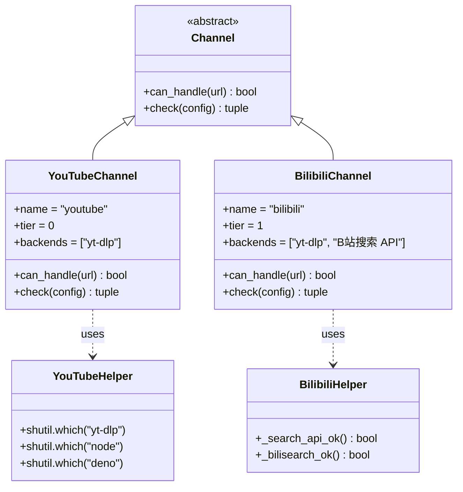
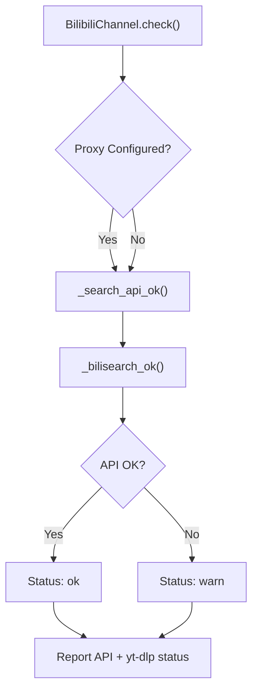

# YouTube 및 Bilibili 채널

관련 소스 파일

다음 파일들은 이 위키 페이지를 생성할 때 컨텍스트로 사용되었습니다:

- [agent_reach/channels/base.py](agent_reach/channels/base.py)
- [agent_reach/channels/bilibili.py](agent_reach/channels/bilibili.py)
- [agent_reach/channels/douyin.py](agent_reach/channels/douyin.py)
- [agent_reach/channels/github.py](agent_reach/channels/github.py)
- [agent_reach/channels/reddit.py](agent_reach/channels/reddit.py)
- [agent_reach/channels/rss.py](agent_reach/channels/rss.py)
- [agent_reach/channels/web.py](agent_reach/channels/web.py)
- [agent_reach/channels/youtube.py](agent_reach/channels/youtube.py)

이 페이지는 Agent Reach의 두 주요 비디오 플랫폼 채널인 `YouTubeChannel`과 `BilibiliChannel`을 문서화합니다. 둘 다 비디오 메타데이터와 자막 추출을 위한 핵심 백엔드로 `yt-dlp`를 활용합니다. 아키텍처는 유사하지만, Bilibili는 프록시 설정을 통한 서버 측 IP 차단 처리와 이중 전략 검색 접근을 위한 특수 로직을 포함합니다.

---

## 개요

| 속성 | `YouTubeChannel` | `BilibiliChannel` |
|---|---|---|
| 파일 | [agent_reach/channels/youtube.py:9-45]() | [agent_reach/channels/bilibili.py:40-81]() |
| 클래스 | `YouTubeChannel` | `BilibiliChannel` |
| `name` | `"youtube"` | `"bilibili"` |
| `tier` | `0` (무설정) | `1` (프록시/점검 필요) |
| 백엔드 | `yt-dlp` | `yt-dlp`, Bilibili Search API |
| `can_handle` 도메인 | `youtube.com`, `youtu.be` | `bilibili.com`, `b23.tv` |
| 프록시 지원 | 없음 | 있음 (`bilibili_proxy`) |

두 채널 모두 `agent_reach/channels/base.py` [agent_reach/channels/base.py:18-37]()에 정의된 `Channel` 기본 클래스의 서브클래스입니다.

출처: [agent_reach/channels/youtube.py:9-19](), [agent_reach/channels/bilibili.py:40-50]()

---

## 아키텍처

다음 다이어그램은 비디오 처리에 대한 자연어 요구사항이 이를 구현하는 구체적인 코드 엔티티에 어떻게 매핑되는지 보여줍니다.

**다이어그램: 비디오 채널 코드 엔티티**

출처: [agent_reach/channels/youtube.py:9-45](), [agent_reach/channels/bilibili.py:40-81](), [agent_reach/channels/base.py:18-37]()

---

## YouTube 채널

`YouTubeChannel`은 `yt-dlp`를 사용해 비디오 정보와 자막을 추출하는 데 집중합니다. YouTube의 중요한 요구사항은 JavaScript 런타임이 존재해야 한다는 점인데, `yt-dlp`가 서명 챌린지를 해결하려면 이것이 필요합니다.

### 런타임 요구 사항
`check()` 메서드 [agent_reach/channels/youtube.py:20-44]()는 여러 단계의 검증을 수행합니다:
1. **바이너리 확인**: 시스템 PATH에 `yt-dlp`가 있는지 확인합니다 [agent_reach/channels/youtube.py:21-22]().
2. **JS 런타임 확인**: `node` 또는 `deno`를 찾습니다 [agent_reach/channels/youtube.py:24-29]().
3. **설정 확인**: Deno 없이 Node.js를 사용할 경우, `~/.config/yt-dlp/config`에서 `--js-runtimes node` 플래그를 확인합니다 [agent_reach/channels/youtube.py:32-43]().

출처: [agent_reach/channels/youtube.py:20-44]()

---

## Bilibili 채널

`BilibiliChannel`은 비디오 콘텐츠와 검색 기능을 처리합니다. Bilibili의 안티 크롤러 조치를 우회하기 위해 프록시 설정이 자주 필요하므로 `tier 1`로 분류됩니다 [agent_reach/channels/bilibili.py:44]().

### 검색 구현
Bilibili 검색은 가장 좋은 사용 가능한 방법을 결정하기 위해 계층형 감지 시스템을 사용합니다:
- **Bilibili Search API**: `/x/web-interface/search/all/v2` 엔드포인트를 사용합니다 [agent_reach/channels/bilibili.py:13]().
- **yt-dlp bilisearch**: `yt-dlp` 내부의 `bilisearch` 추출기를 사용합니다 [agent_reach/channels/bilibili.py:32]().

### 연결성 감지
`check()` 함수 [agent_reach/channels/bilibili.py:51-80]()는 세부 검사를 수행합니다:
- **_search_api_ok()**: `urllib.request`를 사용해 Bilibili 검색 API로 직접 요청을 시도합니다 [agent_reach/channels/bilibili.py:16-24]().
- **_bilisearch_ok()**: IP 차단으로 흔히 발생하는 HTTP 412(Precondition Failed) 오류를 확인하기 위해 `yt-dlp --flat-playlist -j bilisearch1:test`를 실행합니다 [agent_reach/channels/bilibili.py:27-37]().

**다이어그램: Bilibili 연결성 로직**

출처: [agent_reach/channels/bilibili.py:51-80](), [agent_reach/channels/bilibili.py:16-37]()

---

## IP 차단과 프록시

Bilibili는 데이터센터 IP 주소를 자주 차단합니다. 이를 완화하기 위해 `BilibiliChannel`은 전용 프록시 설정을 지원합니다.

### 프록시 해석
채널은 다음 순서로 프록시를 찾습니다 [agent_reach/channels/bilibili.py:55]():
1. `config.get("bilibili_proxy")` (`agent-reach configure`로 설정)
2. `os.environ.get("BILIBILI_PROXY")`

프록시가 감지되면 `check()` 메시지는 비디오 읽기가 구성된 프록시를 사용한다는 점을 확인해 줍니다 [agent_reach/channels/bilibili.py:65-66]().

### 검색 폴백
`yt-dlp`의 `bilisearch`가 실패하고 HTTP 412를 반환하면, 채널은 검색이 Bilibili Search API로 기본 전환될 것이라고 사용자에게 경고합니다 [agent_reach/channels/bilibili.py:76-77](). 더 넓은 검색 맥락에서는 Agent Reach가 `site:bilibili.com` 쿼리에 대해 `ExaSearchChannel`로도 폴백할 수 있습니다.

출처: [agent_reach/channels/bilibili.py:55-78](), [agent_reach/channels/reddit.py:35-44]()

---

## 자막 및 정보 추출

두 채널 모두 비디오 데이터 추출의 무거운 작업을 `yt-dlp`에 의존합니다.

| 기능 | 구현 세부 사항 |
|---|---|
| **비디오 정보** | `yt-dlp --dump-json`으로 추출 |
| **자막** | `--write-auto-sub` 및 `--sub-lang` 플래그로 가져옴 |
| **형식** | `zh-Hans`, `zh`, `en` 우선 |

`YouTubeChannel`은 비디오 정보와 자막을 모두 추출할 수 있다고 명시하며 [agent_reach/channels/youtube.py:44](), `BilibiliChannel`은 목적을 "B站视频和字幕"로 설명합니다 [agent_reach/channels/bilibili.py:42]().

출처: [agent_reach/channels/youtube.py:44](), [agent_reach/channels/bilibili.py:42-43]()
