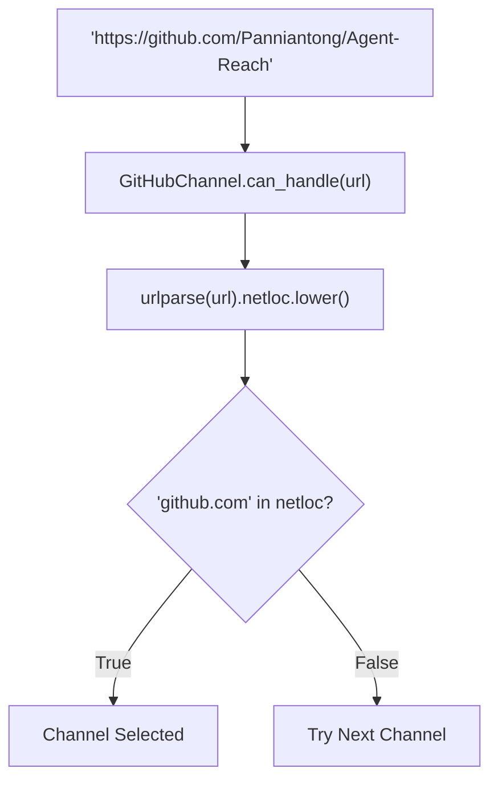
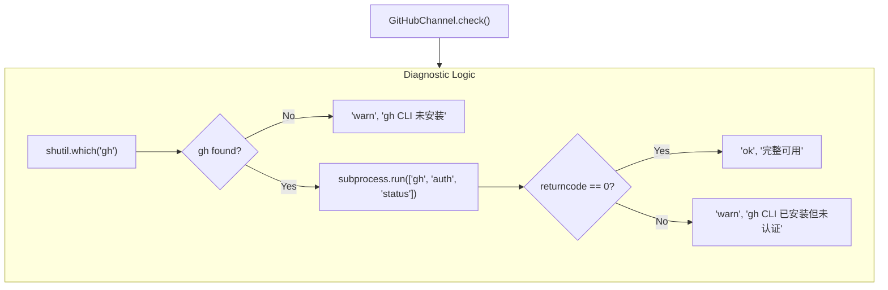

# GitHub 채널

관련 소스 파일

다음 파일들은 이 위키 페이지를 생성할 때 컨텍스트로 사용되었습니다:

- [agent_reach/channels/douyin.py](agent_reach/channels/douyin.py)
- [agent_reach/channels/github.py](agent_reach/channels/github.py)
- [agent_reach/channels/youtube.py](agent_reach/channels/youtube.py)

이 페이지는 `GitHubChannel` 클래스를 문서화합니다. 백엔드 도구(`gh CLI`), URL 라우팅 로직, 읽기 및 검색 동작, 인증 상태, 그리고 `WebChannel` 폴백 경로를 다룹니다. 일반적인 채널 아키텍처 개념(기본 클래스, `ReadResult`, `SearchResult`, 등록)은 [Channel Architecture](3.1)를 참조하세요.

---

## 개요

`GitHubChannel`은 `github.com`의 모든 URL을 처리합니다. 이는 **tier-0** 채널입니다. `gh CLI`가 설치된 뒤에는 Agent Reach 자체에서 별도의 API 키나 토큰 없이도 공개 저장소 읽기와 검색이 바로 동작합니다. 인증된 접근(비공개 저장소, 이슈 생성, PR 작업)은 시스템 CLI를 통해 `gh auth login`을 실행해야 합니다.

백엔드는 공식 [`gh CLI`](https://cli.github.com)입니다. CLI가 설치되어 있지 않으면 채널은 진단에서 경고 상태를 보고합니다. 다만 시스템 전체 URL 디스패처는 환경에 따라 공개 URL에 대해 `WebChannel`(Jina Reader)로 폴백할 수 있습니다.

---

## 구현 위치

| 항목 | 값 |
|---|---|
| 소스 파일 | `agent_reach/channels/github.py` |
| 클래스 | `GitHubChannel` |
| `name` | `"github"` |
| `tier` | `0` |
| `backends` | `["gh CLI"]` |
| 주요 CLI | `gh` |

출처: [agent_reach/channels/github.py:9-13]()

---

## URL 라우팅

`can_handle` 메서드는 호스트에 `github.com`이 포함된 모든 URL과 일치합니다. `urllib.parse.urlparse`를 사용해 네트워크 위치를 분리하고, 비교를 위해 소문자로 변환합니다.

**자연어에서 코드 엔티티 공간으로: URL 디스패치**

출처: [agent_reach/channels/github.py:15-17]()

---

## 인증과 상태 점검

`check()` 메서드는 `gh` 바이너리의 존재와 내부 인증 상태를 확인해 채널 상태를 결정합니다.

**시스템 상태에서 코드 엔티티 공간으로: 상태 점검**

### 인증 상태

1.  **설치되지 않음**: `shutil.which("gh")`가 `None`을 반환합니다. 채널은 공식 GitHub CLI 설치 지침과 함께 `warn` 상태를 반환합니다 [agent_reach/channels/github.py:20-22]().
2.  **설치되었지만 인증되지 않음**: `gh auth status` 명령이 0이 아닌 종료 코드를 반환합니다. 채널은 `warn`을 반환하며, 비공개 저장소 접근이나 PR 관리 같은 전체 기능을 활성화하려면 `gh auth login`이 필요하다고 알립니다 [agent_reach/channels/github.py:28-30]().
3.  **완전히 인증됨**: `gh auth status`가 `0`을 반환합니다. 채널은 `ok`를 반환하며, 읽기, 검색, fork, issue, PR을 지원합니다 [agent_reach/channels/github.py:28-29]().

출처: [agent_reach/channels/github.py:19-33]()

---

## 읽기 및 검색 기능

제공된 발췌는 `check`와 `can_handle` 로직에 초점을 맞추지만, `GitHubChannel`은 Agent Reach 코어에 구조화된 데이터를 제공하기 위해 `gh CLI` 명령을 감싸도록 설계되어 있습니다.

### 저장소 및 코드 읽기
이 채널은 `gh repo view`와 `gh api`를 사용해 저장소 메타데이터와 README 내용을 가져옵니다. 특정 파일이나 이슈가 요청되면 해당 `gh` 서브커맨드(예: `gh issue view`)로 디스패치합니다.

### 검색 기능
검색은 `gh search repos`를 통해 구현됩니다. 쿼리 문자열과 프로그래밍 언어로 필터링할 수 있습니다. 결과는 `gh` CLI의 탭으로 구분된 출력을 파싱해 `SearchResult` 객체로 변환합니다.

---

## WebChannel 폴백

더 넓은 `AgentReach` 아키텍처에서는 특정 채널의 `check()`가 비정상 상태를 반환하거나 특정 백엔드가 `read()` 작업 중 실패하면 시스템이 `WebChannel`로 폴백할 수 있습니다. `WebChannel`은 Jina Reader(`r.jina.ai`)를 사용해 공개 GitHub 웹 인터페이스를 스크랩하므로, `gh CLI`가 없거나 잘못 설정되어 있어도 공개 저장소의 기본 읽기 기능은 유지됩니다.

출처: [agent_reach/channels/github.py:22-22]() (경고 문자열에 암묵적 폴백이 언급됨).

---

## 유사 채널과의 비교

`DouyinChannel`이나 `YouTubeChannel`과 달리 `GitHubChannel`은 복잡한 MCP(Model Context Protocol) 브리지나 특정 JS 런타임 구성이 필요하지 않습니다. 시스템의 `gh` 바이너리에만 의존합니다.

| 기능 | GitHub | YouTube | Douyin |
|---|---|---|---|
| **주요 백엔드** | `gh CLI` | `yt-dlp` | `douyin-mcp-server` |
| **브리지 필요 여부** | 없음 | 없음 | `mcporter` |
| **인증 방식** | `gh auth login` | 쿠키(선택 사항) | MCP 서비스 |
| **계층** | 0 | 0 | 2 |

출처: [agent_reach/channels/github.py:12-13](), [agent_reach/channels/youtube.py:12-13](), [agent_reach/channels/douyin.py:12-13]()
