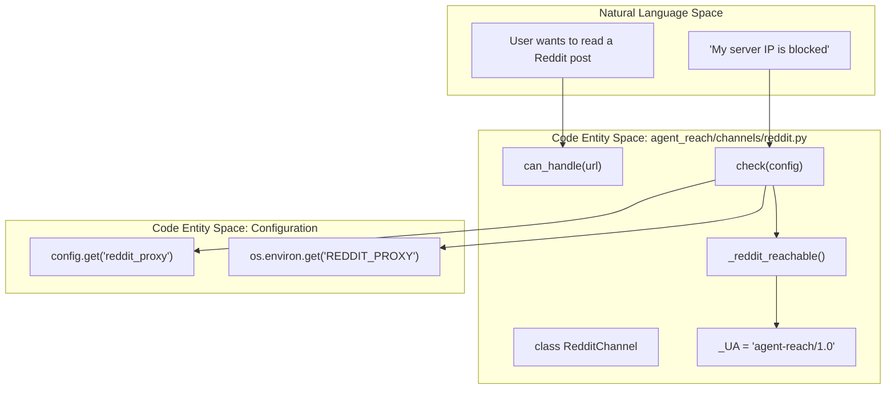
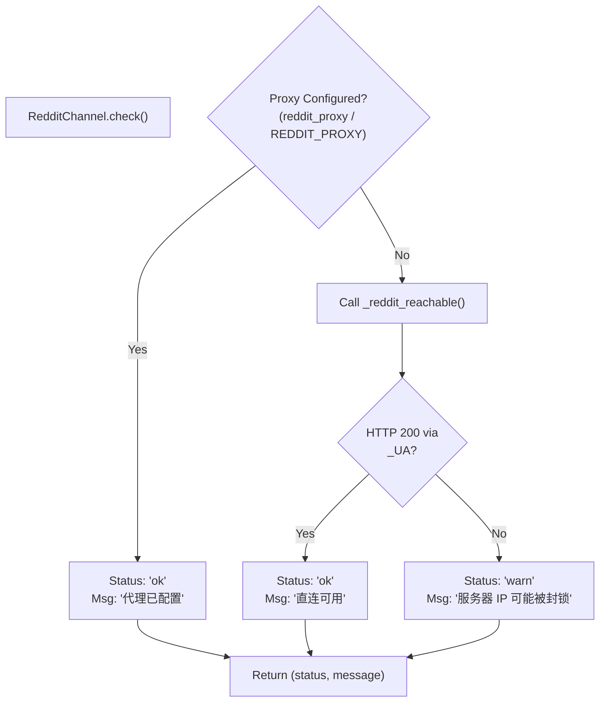

# Reddit 채널

<details>
<summary>관련 소스 파일</summary>

다음 파일들은 이 위키 페이지를 생성할 때 컨텍스트로 사용되었습니다:

- [agent_reach/channels/base.py](agent_reach/channels/base.py)
- [agent_reach/channels/bilibili.py](agent_reach/channels/bilibili.py)
- [agent_reach/channels/reddit.py](agent_reach/channels/reddit.py)
- [agent_reach/channels/rss.py](agent_reach/channels/rss.py)
- [agent_reach/channels/web.py](agent_reach/channels/web.py)
- [agent_reach/guides/setup-reddit.md](agent_reach/guides/setup-reddit.md)

</details>


이 페이지는 `RedditChannel`을 문서화합니다. Reddit URL을 어떻게 라우팅하는지, Reddit 공개 JSON API를 사용해 콘텐츠를 어떻게 가져오는지, 서버 환경에서 필요한 프록시 요구 사항, 그리고 연결성 점검을 어떻게 처리하는지를 다룹니다. 일반적인 채널 아키텍처는 [Channel Architecture](#3.1)를, 프록시 설정 세부 사항은 [Proxy Configuration](#4.2)를 참조하세요.

---

## 개요

`RedditChannel`은 Reddit 게시물과 댓글에 접근할 수 있게 해 주는 **Tier 1** 채널입니다. 표준 Reddit URL에 `.json`을 덧붙여 접근하는 Reddit의 공개 JSON API를 사용하므로, 기본 읽기 접근에는 공식 API 키나 OAuth 자격 증명이 필요하지 않습니다.

| 속성 | 값 |
|---|---|
| 클래스 | `RedditChannel` |
| 파일 | `agent_reach/channels/reddit.py` |
| 계층 | 1 (무료 키/설정 필요 - 프록시가 자주 필요함) |
| 백엔드 | `JSON API`, `Exa` |
| URL 패턴 | `reddit.com`, `redd.it` |

채널 자체는 API 키가 필요하지 않지만, Reddit은 데이터센터와 서버 IP 대역을 `403 Forbidden` 오류로 강하게 차단합니다. 따라서 클라우드 환경에서는 안정적인 동작을 위해 주거용 또는 ISP 프록시가 자주 필요합니다.

출처: [agent_reach/channels/reddit.py:24-27](), [agent_reach/guides/setup-reddit.md:3-6]()

---

## URL 처리

### URL 매칭

`can_handle()` 메서드는 netloc에 `reddit.com` 또는 `redd.it`가 포함되는지 확인해 Reddit URL을 식별합니다.

[agent_reach/channels/reddit.py:29-33]()

### JSON API 사용

채널은 대상 URL 뒤에 `.json`을 덧붙여 공개 API와 상호작용합니다. 예를 들어 연결성을 확인할 때는 다음을 요청합니다:
`https://www.reddit.com/r/linux.json?limit=1`

요청에는 Reddit의 엣지 보안에서 즉시 거부되지 않도록 유효한 `User-Agent`(여기서는 `agent-reach/1.0`으로 정의됨)가 포함되어야 합니다.

출처: [agent_reach/channels/reddit.py:8-15]()

---

## 아키텍처와 데이터 흐름

다음 다이어그램은 `RedditChannel`이 자연어 공간(사용자 요청)에서 코드 엔티티 공간(API 및 Config 엔티티)으로 어떻게 연결되는지 보여줍니다.

**다이어그램: Reddit 채널 로직 흐름**



출처: [agent_reach/channels/reddit.py:8-45]()

---

## 프록시 설정

Reddit의 안티 봇 조치는 비주거용 IP에 대해 종종 `403` 또는 `429` 오류를 반환합니다. 이 채널은 이러한 차단을 우회하기 위해 특정 `reddit_proxy` 설정을 지원합니다.

### 설정 해석
`check()` 메서드는 다음 순서로 프록시를 해석합니다:
1. `agent-reach` 설정 파일의 `reddit_proxy` 키
2. `REDDIT_PROXY` 환경 변수

[agent_reach/channels/reddit.py:35]()

### CLI를 통한 설정
사용자는 다음 명령으로 프록시를 설정할 수 있습니다:
```bash
agent-reach configure proxy http://user:pass@ip:port
```

출처: [agent_reach/channels/reddit.py:35-44](), [agent_reach/guides/setup-reddit.md:28-30]()

---

## 연결성 및 상태 점검

`check()` 메서드는 현재 환경에서 Reddit JSON API에 접근 가능한지 판단하기 위해 실시간 프로브를 수행합니다.

**다이어그램: 상태 점검 결정 트리**



### 연결성 로직
`_reddit_reachable()` 함수는 10초 타임아웃으로 샘플 subreddit JSON 엔드포인트에 `urllib.request` 요청을 시도합니다. 응답 상태가 `200`인지 구체적으로 검증합니다.

출처: [agent_reach/channels/reddit.py:12-20](), [agent_reach/channels/reddit.py:34-45]()

---

## 검색 및 콘텐츠 추출

`RedditChannel`은 플랫폼 식별과 연결성은 담당하지만, 실제 검색 기능은 **Exa** 백엔드에 위임됩니다.

- **읽기:** 특정 URL이 제공되면, 채널은 구성된 프록시를 사용한 JSON API로 게시물 본문과 재귀적인 댓글 스레드를 추출합니다.
- **검색:** `agent-reach search-reddit`는 Exa를 통해 쿼리를 라우팅하여 Reddit 검색 인덱스에 직접 연결하지 않고도 관련 Reddit 콘텐츠를 찾습니다. 직접 검색 인덱스는 종종 더 제한적입니다.

출처: [agent_reach/channels/reddit.py:26](), [agent_reach/channels/reddit.py:37-40](), [agent_reach/guides/setup-reddit.md:6]()

---

## 구현 세부 사항

### 재귀적 댓글 추출
기반 구현(`backends = ["JSON API"]`로 참조됨)은 Reddit 댓글의 재귀적 구조를 처리합니다. JSON 트리를 순회해 중첩 구조를 AI 에이전트가 읽기 쉬운 형식으로 평탄화하며, 일반적으로 다음을 포함합니다:
- 게시물 제목과 self-text
- 작성자와 업보트 점수
- 댓글 계층(명확성을 위해 들여쓰기)

### 오류 처리
이 채널은 네트워크 실패와 IP 차단을 구분하도록 설계되었습니다. `_reddit_reachable()`가 실패하면 `doctor` 명령은(`check()`를 통해) 문제를 해결하는 데 필요한 구체적인 CLI 명령을 제공합니다.

출처: [agent_reach/channels/reddit.py:12-20](), [agent_reach/channels/reddit.py:41-44]()
