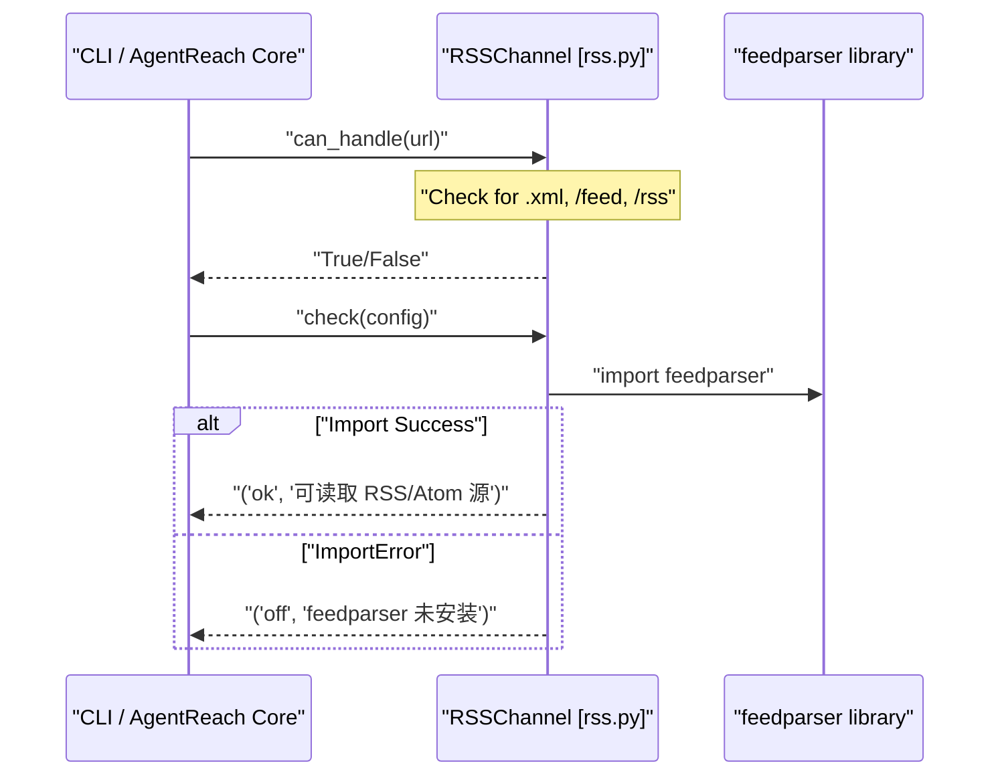

# Web 및 RSS 채널

<details>
<summary>관련 소스 파일</summary>

다음 파일들은 이 위키 페이지를 생성할 때 컨텍스트로 사용되었습니다:

- [agent_reach/channels/base.py](agent_reach/channels/base.py)
- [agent_reach/channels/bilibili.py](agent_reach/channels/bilibili.py)
- [agent_reach/channels/reddit.py](agent_reach/channels/reddit.py)
- [agent_reach/channels/rss.py](agent_reach/channels/rss.py)
- [agent_reach/channels/web.py](agent_reach/channels/web.py)

</details>


이 페이지는 두 개의 무설정 채널인 `WebChannel`([agent_reach/channels/web.py:7]())과 `RSSChannel`([agent_reach/channels/rss.py:7]())을 문서화합니다. 둘 다 **Tier 0**(무설정)으로 분류되며, API 키나 환경 설정 없이 설치 직후 바로 동작합니다.

`WebChannel`은 시스템의 범용 폴백입니다. 다른 어떤 채널도 주장하지 않는 URL을 처리합니다. `RSSChannel`은 패턴 감지를 통해 RSS 및 Atom 피드 URL을 처리합니다.

---

## WebChannel

`WebChannel`은 [Jina Reader](https://r.jina.ai) HTTP 서비스를 백엔드로 사용합니다. 복잡한 HTML을 깔끔하고 LLM 친화적인 Markdown으로 변환하는 프록시 역할을 합니다.

### 범용 폴백으로서의 역할
`ALL_CHANNELS` 레지스트리에서 `WebChannel`은 마지막 항목으로 배치됩니다. `can_handle` 메서드 [agent_reach/channels/web.py:13-14]()는 어떤 입력에도 `True`를 반환하므로, `TwitterChannel`이나 `GitHubChannel` 같은 특수 채널이 URL과 일치하지 않더라도 시스템은 Jina Reader를 통해 읽기를 시도합니다.

### 구현과 진단
- **백엔드**: `Jina Reader` [agent_reach/channels/web.py:10]().
- **동작 방식**: 대상 URL 앞에 `https://r.jina.ai/`를 붙이고 HTTP GET 요청을 수행합니다.
- **상태 점검**: `check()` 메서드 [agent_reach/channels/web.py:16-17]()는 로컬 바이너리나 자격 증명이 아니라 공개 웹 서비스를 사용하므로 항상 `ok`를 반환합니다.

### 다른 채널에서의 폴백 사용
여러 특수 채널은 주 백엔드(예: CLI 도구)가 없을 때 `WebChannel` 로직을 사용합니다:
- **GitHubChannel**: `gh` CLI가 인증되지 않았을 때 `WebChannel`로 폴백합니다.
- **BilibiliChannel**: 주로 `yt-dlp`를 사용하지만, 일반적인 웹 기능으로 `WebChannel`을 인정합니다 [agent_reach/channels/bilibili.py:43]().
- **RedditChannel**: JSON API가 차단되고 프록시도 설정되지 않았을 때 보조 방법으로 `WebChannel`(Jina)을 사용합니다 [agent_reach/channels/reddit.py:26]().

**다이어그램 1: WebChannel 디스패치와 폴백 라우팅**

```mermaid
graph TD
    "URL_Input" --> "Router[get_channel_for_url]"
    "Router[get_channel_for_url]" -->|"Match Found"| "Specialized_Channel[e.g. TwitterChannel]"
    "Router[get_channel_for_url]" -->|"No Match"| "WebChannel[agent_reach/channels/web.py]"
    
    "Specialized_Channel[e.g. TwitterChannel]" -->|"Success"| "ReadResult"
    "Specialized_Channel[e.g. TwitterChannel]" -->|"Auth/Binary Fail"| "WebChannel[agent_reach/channels/web.py]"
    
    "WebChannel[agent_reach/channels/web.py]" --> "Jina_Reader_API[https://r.jina.ai/URL]"
    "Jina_Reader_API[https://r.jina.ai/URL]" --> "ReadResult"
```
출처: [agent_reach/channels/web.py:7-17](), [agent_reach/channels/base.py:18-37]()

---

## RSSChannel

`RSSChannel`은 신디케이션된 콘텐츠에 구조화된 접근을 제공합니다. `feedparser` 라이브러리를 감싸 XML 기반 피드를 표준화된 형식으로 처리합니다.

### URL 감지 로직
`can_handle` 메서드 [agent_reach/channels/rss.py:13-14]()는 파싱을 시도하기 전에 URL에 대해 문자열 기반 패턴 매칭을 수행해 잠재적인 피드를 식별합니다. 다음을 찾습니다:
- 경로 세그먼트: `/feed`, `/rss`, `atom`
- 파일 확장자: `.xml`

### 백엔드 요구 사항
이 채널은 `feedparser` Python 패키지에 의존합니다. `check()` 메서드 [agent_reach/channels/rss.py:16-21]()는 이 의존성이 있는지 확인합니다:
- **상태 `ok`**: `feedparser`가 성공적으로 import됨.
- **상태 `off`**: `feedparser`가 없어서 사용자가 `pip install feedparser`를 실행해야 함.

### 데이터 흐름
`read(url)`가 호출되면 채널은 XML을 가져와 엔트리를 파싱하고 `ReadResult`를 구성합니다. 피드에 여러 항목이 있으면, 보통 최신 업데이트의 간결한 개요를 제공하기 위해 제목과 요약의 Markdown 목록을 생성합니다.

**다이어그램 2: RSSChannel 코드 엔티티 상호작용**


출처: [agent_reach/channels/rss.py:1-22]()

---

## 일반 채널 비교

| 기능 | WebChannel | RSSChannel |
| :--- | :--- | :--- |
| **클래스** | `WebChannel` [agent_reach/channels/web.py:7]() | `RSSChannel` [agent_reach/channels/rss.py:7]() |
| **계층** | 0 (무설정) | 0 (무설정) |
| **주요 백엔드** | Jina Reader(HTTP) | `feedparser`(Python Lib) |
| **트리거 패턴** | `True`(범용 폴백) | `.xml`, `/feed`, `/rss`, `atom` |
| **표준 출력** | 전체 페이지 Markdown | 피드 항목 목록 / 요약 |
| **프록시 지원** | 전역 시스템 프록시 | 전역 시스템 프록시 |

출처: [agent_reach/channels/web.py:1-18](), [agent_reach/channels/rss.py:1-22](), [agent_reach/channels/base.py:21-24]()
