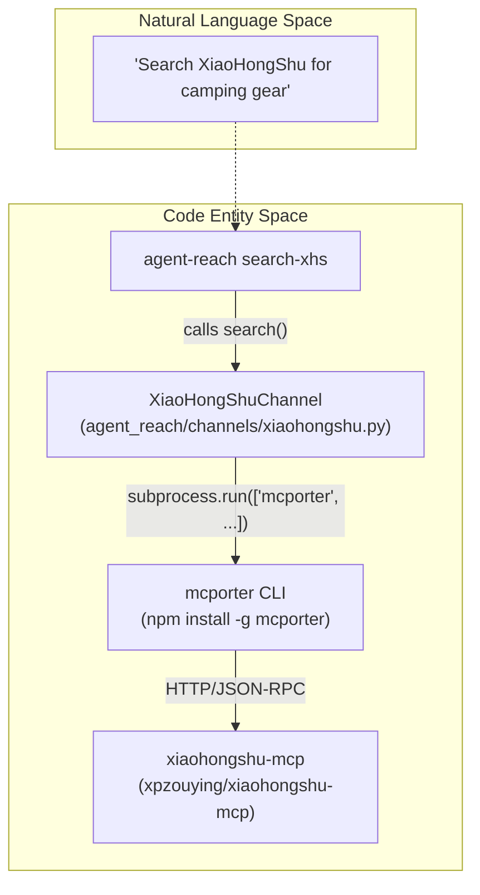
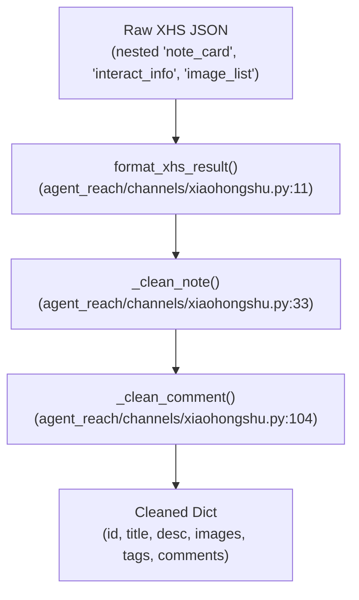
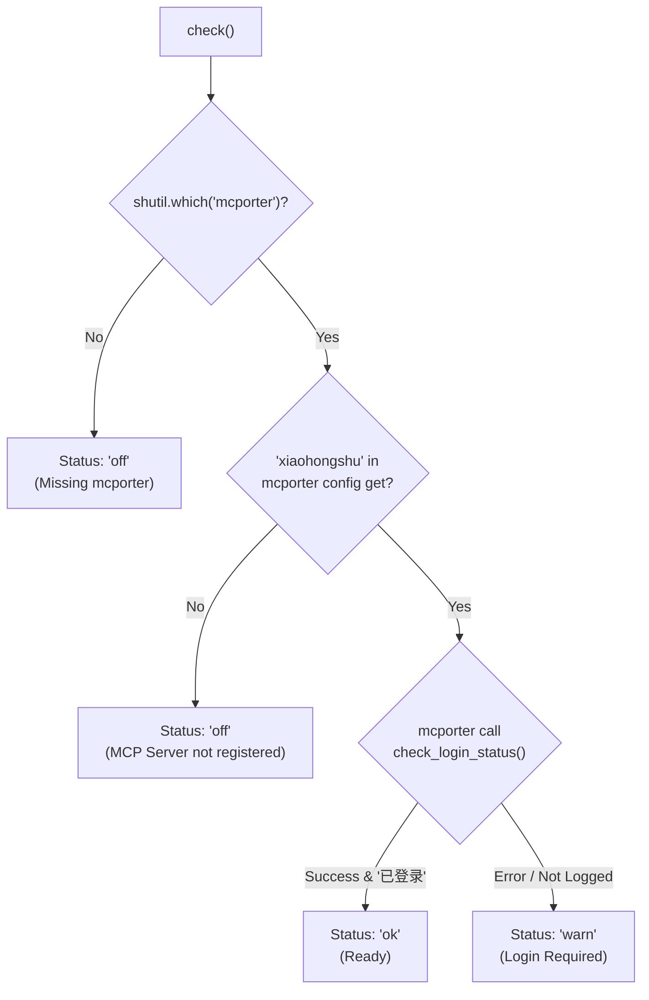

# XiaoHongShu 채널

관련 소스 파일

다음 파일들은 이 위키 페이지를 생성할 때 컨텍스트로 사용되었습니다:

- [agent_reach/channels/xiaohongshu.py](agent_reach/channels/xiaohongshu.py)
- [agent_reach/guides/setup-exa.md](agent_reach/guides/setup-exa.md)
- [agent_reach/guides/setup-wechat.md](agent_reach/guides/setup-wechat.md)
- [agent_reach/guides/setup-xiaohongshu.md](agent_reach/guides/setup-xiaohongshu.md)
- [tests/test_skill_command.py](tests/test_skill_command.py)
- [tests/test_xhs_format.py](tests/test_xhs_format.py)

이 페이지는 `XiaoHongShuChannel`의 백엔드 스택, 인증 모델, 데이터 정제 로직, Docker 기반 설정, 상태 점검 진단을 문서화합니다. 모든 채널이 구현하는 일반 채널 인터페이스는 [Channel Architecture]()를, `mcporter` 설정은 [mcporter Setup]()을 참조하세요.

---

## 개요

`XiaoHongShuChannel`은 로컬에서 실행되는 MCP 서버를 통해 Agent Reach를 XiaoHongShu(小红书) 플랫폼과 연결합니다. 이는 **tier-2 채널**로, 동작하기 전에 명시적인 설정(Docker + mcporter)이 필요합니다.

| 속성 | 값 |
|---|---|
| 클래스 | `XiaoHongShuChannel` [agent_reach/channels/xiaohongshu.py:163]() |
| `name` | `"xiaohongshu"` [agent_reach/channels/xiaohongshu.py:164]() |
| `description` | `"小红书笔记"` [agent_reach/channels/xiaohongshu.py:165]() |
| `backends` | `["xiaohongshu-mcp"]` [agent_reach/channels/xiaohongshu.py:166]() |
| `tier` | `2` [agent_reach/channels/xiaohongshu.py:167]() |
| Supported Domains | `xiaohongshu.com`, `xhslink.com` [agent_reach/channels/xiaohongshu.py:172]() |

출처: [agent_reach/channels/xiaohongshu.py:163-172]()

---

## 백엔드 아키텍처

이 채널은 `mcporter`(Model Context Protocol 브리지)를 사용해 Docker에서 실행되는 Go 기반 서비스인 `xiaohongshu-mcp`와 통신합니다. 이 서비스는 플랫폼 상호작용을 위한 헤드리스 브라우저를 캡슐화합니다.

**시스템 엔티티 매핑:**

출처: [agent_reach/channels/xiaohongshu.py:174-210](), [agent_reach/guides/setup-xiaohongshu.md:4-15]()

---

## 데이터 흐름과 포맷팅

이 채널의 핵심 구성 요소는 `format_xhs_result`입니다. 이 함수는 XHS 내부 API가 반환하는 장황한 JSON을 공격적으로 줄여 AI 에이전트의 토큰 소비를 최소화합니다.

**데이터 변환 흐름:**

### 핵심 포맷 규칙
- **유지되는 필드**: `id`, `note_id`, `xsec_token`, `title`, `desc`, `type`, `time`. [agent_reach/channels/xiaohongshu.py:44-46]()
- **이미지 처리**: `image_list` 또는 `images_list`에서 원본 URL만 추출하고 `width`, `height`, `trace_id` 같은 메타데이터는 버립니다. [agent_reach/channels/xiaohongshu.py:70-82]()
- **참여 정보**: `interact_info`(좋아요, 저장, 댓글, 공유)를 최상위 딕셔너리로 평탄화합니다. [agent_reach/channels/xiaohongshu.py:59-64]()
- **중복 제거**: `at_user_list`, `geo_info`, `audit_info`, 그리고 `nickname`과 `user_id`를 제외한 중첩 작성자 메타데이터를 제거합니다. [tests/test_xhs_format.py:73-83]()

출처: [agent_reach/channels/xiaohongshu.py:11-117](), [tests/test_xhs_format.py:9-130]()

---

## 상태 점검 및 진단

`check()` 메서드는 브리지 도구의 존재, 특정 MCP 서버의 등록 여부, 그리고 XHS 계정의 실제 로그인 상태라는 세 수준에서 환경을 검증합니다.

**진단 로직:**

출처: [agent_reach/channels/xiaohongshu.py:174-214]()

### 로그인 상태 파싱
헬퍼 `_mcporter_status_ok`는 Windows PowerShell이 때때로 앞에 붙이는 UTF-8 BOM 문자를 제거하는 등 `mcporter` 출력을 파싱할 때의 플랫폼별 특이사항을 처리합니다. [agent_reach/channels/xiaohongshu.py:126-146]()

---

## 설정과 요구 사항

### Docker 설정
`xiaohongshu-mcp` 이미지는 주로 `amd64`용으로 빌드됩니다. ARM64(Apple Silicon)의 경우, 채널은 `_docker_run_hint()`를 통해 `--platform linux/amd64` 플래그 사용을 안내합니다. [agent_reach/channels/xiaohongshu.py:148-161]()

### 영구 저장소
컨테이너가 재시작될 때마다 QR 코드를 다시 스캔하지 않으려면, 사용자는 세션 쿠키를 유지하기 위해 볼륨을 `/app/data`에 마운트해야 합니다. [agent_reach/guides/setup-xiaohongshu.md:57-65]()

### xsec_token 요구 사항
직접 노트를 가져오는(`read()`) 경우, 플랫폼은 `xsec_token`을 요구합니다. URL에 이 값이 없으면 채널은 MCP 서버를 통해 최근 피드를 나열하여 일치하는 `note_id`를 찾는 방식으로 이를 해결하려고 시도합니다.

출처: [agent_reach/guides/setup-xiaohongshu.md:1-92](), [agent_reach/channels/xiaohongshu.py:148-161]()
