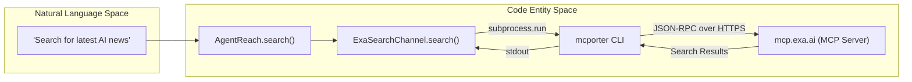
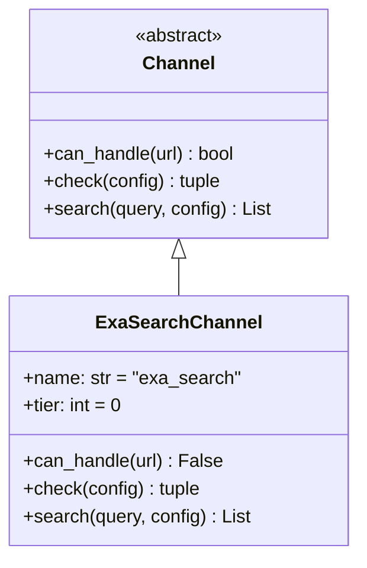

# Exa 검색 채널

<details>
<summary>관련 소스 파일</summary>

다음 파일들은 이 위키 페이지를 생성할 때 컨텍스트로 사용되었습니다:

- [agent_reach/channels/exa_search.py](agent_reach/channels/exa_search.py)
- [agent_reach/doctor.py](agent_reach/doctor.py)
- [agent_reach/guides/setup-exa.md](agent_reach/guides/setup-exa.md)
- [agent_reach/guides/setup-wechat.md](agent_reach/guides/setup-wechat.md)
- [agent_reach/guides/setup-xiaohongshu.md](agent_reach/guides/setup-xiaohongshu.md)

</details>


이 페이지는 `agent_reach/channels/exa_search.py`에 구현된 의미 기반 웹 검색 채널인 `ExaSearchChannel`을 문서화합니다. 이 채널이 일급 검색 채널이자 채널 간 검색 폴백으로서 수행하는 역할, `mcporter` + Exa MCP 백엔드, 그리고 무설정 설정을 다룹니다.

`ExaSearchChannel`이 따르는 추상 채널 인터페이스는 **3.1 Channel Architecture**를, `mcporter` 설정 세부 사항은 **4.3 mcporter Setup**을 참조하세요.

---

## 개요

`ExaSearchChannel`은 `mcporter` CLI를 통해 Exa MCP 서버(`mcp.exa.ai`)에 연결해 의미 기반 웹 검색을 제공합니다. 이는 **검색 전용** 채널로, `can_handle()`는 항상 `False`를 반환합니다 [agent_reach/channels/exa_search.py:15-16](). 덕분에 URL 읽기를 절대 가로채지 않습니다. `mcporter` 브리지를 제외하면 API 키나 복잡한 로컬 설정이 필요하지 않으므로 **Tier 0**(무설정)으로 분류됩니다 [agent_reach/channels/exa_search.py:13]().

| 속성 | 값 |
|---|---|
| `name` | `exa_search` [agent_reach/channels/exa_search.py:10]() |
| `description` | 전 웹 의미 검색 [agent_reach/channels/exa_search.py:11]() |
| `backends` | `["Exa via mcporter"]` [agent_reach/channels/exa_search.py:12]() |
| `tier` | `0` [agent_reach/channels/exa_search.py:13]() |
| `can_handle()` | 항상 `False` [agent_reach/channels/exa_search.py:16]() |
| API key required | 아니오 [agent_reach/guides/setup-exa.md:31]() |

출처: [agent_reach/channels/exa_search.py:9-16](), [agent_reach/guides/setup-exa.md:29-31]()

---

## 시스템에서의 역할

`ExaSearchChannel`은 두 가지 주요 기능을 수행합니다:

1.  **주 검색 제공자**: 일반 웹 쿼리에 대해 `agent-reach search`를 통해 직접 호출됩니다.
2.  **채널 간 폴백**: Twitter, Bilibili, Instagram, LinkedIn 같은 다른 채널이 자체 검색 메커니즘에 실패하거나 차단될 때 사용됩니다(예: Bilibili 서버 IP 차단) [agent_reach/guides/setup-exa.md:4-8]().

**Exa를 통한 검색 기능:**
-   **일반 웹**: AI 기반 의미 검색.
-   **Reddit**: `site:reddit.com`으로 타겟팅 [agent_reach/guides/setup-exa.md:6]().
-   **Twitter/X**: `site:x.com`으로 타겟팅 [agent_reach/guides/setup-exa.md:7]().

출처: [agent_reach/guides/setup-exa.md:3-8]()

---

## 아키텍처와 데이터 흐름

이 채널은 `mcporter` CLI 프로세스를 통해서만 Exa와 통신합니다. 이 프로세스는 `https://mcp.exa.ai/mcp`에 있는 공식 Exa MCP 엔드포인트로 가는 브리지 역할을 합니다 [agent_reach/guides/setup-exa.md:20]().

### 검색 실행 흐름



출처: [agent_reach/channels/exa_search.py:18-39](), [agent_reach/guides/setup-exa.md:13-21]()

### 클래스 구조와 인터페이스



출처: [agent_reach/channels/exa_search.py:9-16]()

---

## 상태 점검 및 진단

`check()` 메서드는 환경을 검증하기 위해 `agent-reach doctor`에서 사용됩니다 [agent_reach/doctor.py:15-16](). `mcporter` 바이너리의 존재 여부와 `exa` 서버의 등록 여부를 모두 확인합니다.

| 조건 | 상태 | 메시지 / 동작 |
|---|---|---|
| `mcporter` 없음 | `"off"` | `mcporter` 설치를 안내합니다 [agent_reach/channels/exa_search.py:21-25]() |
| `mcporter config list`에 `exa` 없음 | `"off"` | `mcporter config add exa https://mcp.exa.ai/mcp`를 안내합니다 [agent_reach/channels/exa_search.py:33-36]() |
| 모든 검사 통과 | `"ok"` | "전 웹 의미 검색 사용 가능(무료, API Key 불필요)" [agent_reach/channels/exa_search.py:32]() |
| 서브프로세스 실패 | `"off"` | "mcporter 연결 이상" [agent_reach/channels/exa_search.py:38]() |

출처: [agent_reach/channels/exa_search.py:18-39](), [agent_reach/doctor.py:44-53]()

---

## 설정과 구성

설정은 보통 `agent-reach install --env=auto`가 자동으로 처리합니다 [agent_reach/guides/setup-exa.md:11]().

### 수동 설정
수동 개입이 필요한 경우, 다음 단계로 Exa MCP 서버를 등록합니다:

1.  **브리지 설치**: `npm install -g mcporter` [agent_reach/guides/setup-exa.md:14-15]()
2.  **서버 등록**: `mcporter config add exa https://mcp.exa.ai/mcp` [agent_reach/guides/setup-exa.md:20]()
3.  **검증**: `agent-reach doctor | grep "Search"` [agent_reach/guides/setup-exa.md:25]()

### 구현 세부 사항: `check()`
구현은 바이너리를 찾기 위해 `shutil.which`를, `mcporter` 구성을 점검하기 위해 `subprocess.run`을 사용합니다:

```python
# [agent_reach/channels/exa_search.py:19-31]
mcporter = shutil.which("mcporter")
if not mcporter:
    return "off", "需要 mcporter + Exa MCP..."
r = subprocess.run(
    [mcporter, "config", "list"], capture_output=True,
    encoding="utf-8", errors="replace", timeout=5
)
if "exa" in r.stdout.lower():
    return "ok", "全网语义搜索可用..."
```

출처: [agent_reach/channels/exa_search.py:18-31](), [agent_reach/guides/setup-exa.md:13-27]()

---

## 제한 사항과 동작

-   **검색 전용**: `ExaSearchChannel`은 `read()`를 구현하지 않습니다. 호출하려 하면 `can_handle`이 `False`를 반환하므로 오류가 나거나 `WebChannel`로 폴백됩니다 [agent_reach/channels/exa_search.py:15-16]().
-   **API 키 없음**: Exa가 제공하는 공식 MCP 엔드포인트(`mcp.exa.ai`)는 현재 브리지를 위해 API 키가 필요하지 않습니다 [agent_reach/guides/setup-exa.md:31]().
-   **의존성**: `mcporter`를 실행하기 위해 Node.js가 설치되어 있어야 합니다 [agent_reach/channels/exa_search.py:23]().

출처: [agent_reach/channels/exa_search.py:15-25](), [agent_reach/guides/setup-exa.md:29-32]()
