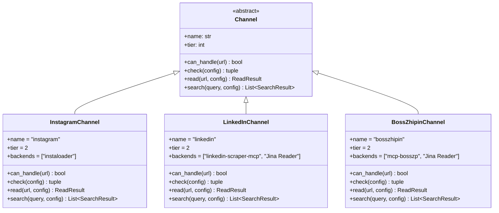

# Instagram, LinkedIn, and Boss直聘 채널

관련 소스 파일

다음 파일들은 이 위키 페이지를 생성할 때 컨텍스트로 사용되었습니다:

- [CHANGELOG.md](CHANGELOG.md)
- [agent_reach/channels/linkedin.py](agent_reach/channels/linkedin.py)

이 페이지는 Agent Reach의 세 가지 **tier-2** 채널인 `InstagramChannel`, `LinkedInChannel`, `BossZhipinChannel`을 문서화합니다. 세 채널 모두 기본 설치 외에 추가 설정이 필요합니다. 각 채널은 같은 일반 패턴을 따릅니다. 주 백엔드(instaloader 또는 mcporter+MCP)를 시도하고, 실패하면 Jina Reader로 폴백하며, 주 백엔드가 없을 때는 검색을 `ExaSearchChannel`에 위임합니다.

일반 채널 아키텍처(추상 기본 클래스, `ReadResult`, `SearchResult`, 계층 수준)는 [3.1]()를, `mcporter` 설정 세부 사항은 [4.3]()를, 쿠키 내보내기 절차는 [4.1]()를 참조하세요.

---

## 개요

| 채널 | 클래스 | 파일 | 주요 백엔드 | 폴백 | 계층 |
|---|---|---|---|---|---|
| Instagram | `InstagramChannel` | [agent_reach/channels/instagram.py:17-22]() | `instaloader`(Python lib) | Jina Reader | 2 |
| LinkedIn | `LinkedInChannel` | [agent_reach/channels/linkedin.py:9-13]() | `mcporter` → `linkedin-scraper-mcp` | Jina Reader | 2 |
| Boss直聘 | `BossZhipinChannel` | [agent_reach/channels/bosszhipin.py:62-67]() | `mcporter` → `mcp-bosszp` | Jina Reader | 2 |

**Tier 2**는 "설정 필요"를 의미합니다. 즉, 채널이 기본 상태로는 동작하지 않습니다. 각 채널의 `check()` 메서드는 현재 상태를 보고하고 설정 지침을 출력합니다. 버전 1.1.0 시점의 Instagram 채널은 공격적인 안티 스크래핑 조치 때문에 일시적으로 제거되었습니다 [CHANGELOG.md:31-34]().

출처: [agent_reach/channels/instagram.py:17-22](), [agent_reach/channels/linkedin.py:9-13](), [agent_reach/channels/bosszhipin.py:62-67](), [CHANGELOG.md:31-34]()

---

## 백엔드 및 디스패치 다이어그램

**다이어그램: 채널 디스패치와 폴백 경로**

```mermaid
flowchart TD
    readURL["agent-reach read <url>"]
    searchQuery["agent-reach search-instagram/linkedin/bosszhipin"]

    subgraph "InstagramChannel (instagram.py)"
        ig_can["can_handle(): instagram.com or instagr.am"]
        ig_read["read()"]
        ig_instaloader["_read_instaloader()"]
        ig_jina["_read_jina()"]
        ig_search["search()"]
        ig_post["_read_post_sync()"]
        ig_profile["_read_profile_sync()"]
    end

    subgraph "LinkedInChannel (linkedin.py)"
        li_can["can_handle(): linkedin.com"]
        li_read["read()"]
        li_mcp_check["_mcporter_has_linkedin()"]
        li_profile_mcp["_read_profile_mcp()"]
        li_company_mcp["_read_company_mcp()"]
        li_job_mcp["_read_job_mcp()"]
        li_jina["_read_jina()"]
        li_search["search()"]
        li_search_mcp["_search_mcp()"]
    end

    subgraph "BossZhipinChannel (bosszhipin.py)"
        bz_can["can_handle(): zhipin.com or boss.com"]
        bz_read["read()"]
        bz_jina["_read_jina()"]
        bz_search["search()"]
        bz_mcp_check["_mcporter_has_bosszhipin()"]
        bz_search_mcp["_search_mcp()"]
        bz_parse["_parse_jobs()"]
    end

    subgraph "External Backends"
        instaloader["instaloader (Python lib)"]
        mcporter_li["mcporter → linkedin-scraper-mcp"]
        mcporter_bz["mcporter → mcp-bosszp"]
        jina_reader["Jina Reader (r.jina.ai)"]
        exa["ExaSearchChannel"]
    end

    readURL --> ig_can & li_can & bz_can
    searchQuery --> ig_search & li_search & bz_search

    ig_read --> ig_instaloader --> instaloader
    ig_instaloader -->|"URL has /p/ or /reel/"| ig_post
    ig_instaloader -->|"other paths"| ig_profile
    ig_instaloader -->|"ImportError or timeout"| ig_jina
    ig_jina --> jina_reader
    ig_search --> exa

    li_read --> li_mcp_check
    li_mcp_check -->|"ok"| li_profile_mcp & li_company_mcp & li_job_mcp
    li_profile_mcp & li_company_mcp & li_job_mcp --> mcporter_li
    li_mcp_check -->|"not configured"| li_jina
    li_profile_mcp & li_company_mcp & li_job_mcp -->|"exception"| li_jina
    li_jina --> jina_reader
    li_search --> li_search_mcp --> mcporter_li
    li_search -->|"MCP unavailable"| exa

    bz_read --> bz_jina --> jina_reader
    bz_search --> bz_mcp_check
    bz_mcp_check -->|"ok"| bz_search_mcp --> mcporter_bz
    bz_search_mcp --> bz_parse
    bz_mcp_check -->|"not configured"| exa
```

출처: [agent_reach/channels/instagram.py:50-58](), [agent_reach/channels/linkedin.py:15-17](), [agent_reach/channels/linkedin.py:19-41](), [CHANGELOG.md:36-51]()

---

## InstagramChannel

**파일:** [agent_reach/channels/instagram.py]()

### 동작 방식

`InstagramChannel`은 역사적으로 `instaloader` Python 라이브러리를 주요 백엔드로 사용했습니다. `read()` 메서드는 해당 모듈을 import할 수 있는지 확인하고, 불가능하면 곧바로 Jina Reader로 폴백합니다. `instaloader`가 사용 가능하면 `_read_instaloader()`는 동기 instaloader API를 **15초 타임아웃**이 있는 `ThreadPoolExecutor`로 감싸 차단을 방지합니다.

`_sync_read` 내부의 URL 라우팅:
- `/p/` 또는 `/reel/`이 포함된 URL → `_read_post_sync()`
- 그 외 모든 경로 → `_read_profile_sync()`

executor에서 예외나 타임아웃이 발생하면 자동으로 `_read_jina()`로 폴백됩니다. **참고:** 이 채널은 상위 버전 1.1.0 changelog에서 제거 표시되었는데, 그 이유는 상위 소스의 파괴적 변경 때문입니다 [CHANGELOG.md:31-34]().

### 인증

인증은 `_sync_read` 내부에서 `~/.agent-reach/instagram-cookies.txt`의 쿠키 파일로부터 로드됩니다. 채널은 세미콜론으로 구분된 헤더 문자열을 dict로 파싱한 뒤 `L.context.load_session(username, cookies)`를 호출합니다.

출처: [agent_reach/channels/instagram.py:27-48](), [CHANGELOG.md:31-34]()

### 검색

`InstagramChannel.search()`에는 네이티브 검색 기능이 없습니다. 항상 쿼리 `"site:instagram.com {query}"`로 `ExaSearchChannel`에 위임합니다.

출처: [agent_reach/channels/instagram.py:243-248]()

---

## LinkedInChannel

**파일:** [agent_reach/channels/linkedin.py]()

### 동작 방식

`LinkedInChannel`은 `mcporter`를 사용해 로컬에서 실행 중인 `linkedin-scraper-mcp` MCP 서버와 통신합니다. 어떤 MCP 호출도 시도하기 전에 `check()`를 통해 가용성을 확인하는데, 이는 `mcporter config list`를 실행하고 출력에 `"linkedin"`이 있는지 확인합니다 [agent_reach/channels/linkedin.py:29-34]().

기능은 다음을 포함합니다:
- [linkedin-scraper-mcp](https://github.com/stickerdaniel/linkedin-mcp-server)을 통해 사람 프로필, 회사 페이지, 채용 세부 정보를 읽기 [CHANGELOG.md:37]().
- MCP가 설정되지 않았을 때 Jina Reader로 폴백 [CHANGELOG.md:39]().
- Exa 폴백과 함께 MCP를 통한 사람 및 채용 검색 [CHANGELOG.md:38]().

### 검색

`LinkedInChannel`은 전용 CLI 서브커맨드 `search-linkedin`을 지원합니다 [CHANGELOG.md:56]().

### `check()` 상태 매트릭스

| 조건 | 상태 | 메시지 |
|---|---|---|
| `mcporter`를 찾을 수 없음 | `off` | Jina를 통한 기본 콘텐츠. `mcporter` + `linkedin-scraper-mcp`가 필요함 [agent_reach/channels/linkedin.py:20-27]() |
| `mcporter`는 있지만 config에 `linkedin`이 없음 | `off` | LinkedIn MCP가 설정되지 않음. `mcporter config add...`를 실행 [agent_reach/channels/linkedin.py:37-41]() |
| `mcporter config list`에서 `linkedin`이 발견됨 | `ok` | 전체 기능(프로필, 회사, 채용 검색) [agent_reach/channels/linkedin.py:33-34]() |

출처: [agent_reach/channels/linkedin.py:9-41](), [CHANGELOG.md:36-43]()

---

## Boss直聘Channel

**파일:** [agent_reach/channels/bosszhipin.py]()

### 동작 방식

`BossZhipinChannel`은 `mcporter`와 `mcp-bosszp` 백엔드를 사용합니다.
- **로그인:** [mcp-bosszp](https://github.com/mucsbr/mcp-bosszp)를 통한 QR 코드 로그인 [CHANGELOG.md:45]().
- **검색:** MCP를 통한 채용 검색과 채용 담당자 인사 [CHANGELOG.md:46]().
- **읽기:** 채용 페이지 읽기를 위해 Jina Reader로 폴백 [CHANGELOG.md:47]().

### 검색

`BossZhipinChannel`은 전용 CLI 서브커맨드 `search-bosszhipin`을 지원합니다 [CHANGELOG.md:56]().

출처: [CHANGELOG.md:44-51](), [CHANGELOG.md:56-60]()

---

## 비교 다이어그램

**다이어그램: 채널 클래스 구조와 핵심 메서드**

출처: [agent_reach/channels/instagram.py:17-22](), [agent_reach/channels/linkedin.py:9-13](), [CHANGELOG.md:36-51]()

---

## 모듈 수준 헬퍼

**`linkedin.py`**:
- `check()` — 설정을 검증하기 위해 `shutil.which("mcporter")`와 `subprocess.run([mcporter, "config", "list"])`를 사용합니다 [agent_reach/channels/linkedin.py:19-32]().

출처: [agent_reach/channels/linkedin.py:19-41]()
