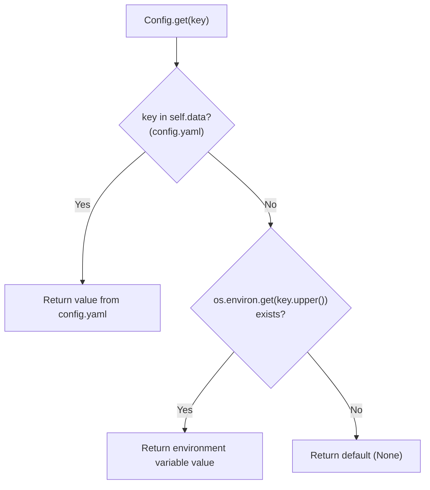
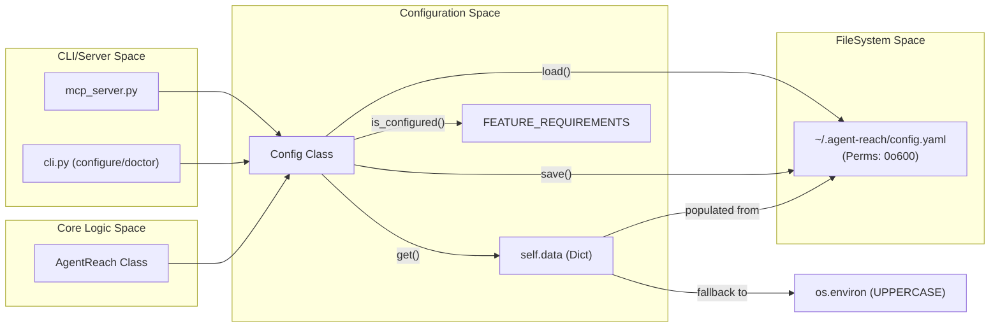

# 설정

<details>
<summary>관련 소스 파일</summary>

다음 파일들은 이 위키 페이지를 생성할 때 컨텍스트로 사용되었습니다:

- [agent_reach/config.py](agent_reach/config.py)
- [agent_reach/guides/setup-twitter.md](agent_reach/guides/setup-twitter.md)
- [agent_reach/integrations/mcp_server.py](agent_reach/integrations/mcp_server.py)
- [docs/troubleshooting.md](docs/troubleshooting.md)

</details>


이 페이지는 Agent Reach의 설정 시스템을 문서화합니다. 설정이 어디에 저장되는지, `Config` 클래스가 이를 어떻게 관리하는지, 그리고 값이 런타임에 어떻게 해석되는지를 다룹니다. 특정 설정 작업에 대한 단계별 지침은 다음 하위 페이지를 참조하세요:

- Twitter, Instagram, XiaoHongShu, Bilibili의 쿠키 내보내기 → [Cookie Export Guide](#4.1)
- Reddit, Bilibili 및 기타 차단된 플랫폼의 프록시 설정 → [Proxy Configuration](#4.2)
- XiaoHongShu, LinkedIn, Exa, Boss直聘용 mcporter 설정 → [mcporter Setup](#4.3)

---

## 저장 위치

모든 설정은 다음 단일 YAML 파일에 저장됩니다:

```
~/.agent-reach/config.yaml
```

디렉터리와 파일은 [agent_reach/config.py:37-39]()의 `_ensure_dir()`가 첫 사용 시 자동으로 생성합니다. 파일은 내부에 저장된 자격 증명을 보호하기 위해 **모드 `0o600`**(소유자 읽기/쓰기 전용)으로 기록됩니다.

**출처:** [agent_reach/config.py:18-19](), [agent_reach/config.py:49-59]()

---

## `Config` 클래스

[agent_reach/config.py:15-110]()의 `Config` 클래스는 시스템 내 모든 설정에 대한 단일 접근 지점입니다. 이 클래스는 [agent_reach/integrations/mcp_server.py:34]()의 `AgentReach`와 여러 CLI 명령에서 직접 인스턴스화됩니다.

**다이어그램: Config 클래스 구조**

```mermaid
classDiagram
    class "Config" {
        +CONFIG_DIR: Path
        +CONFIG_FILE: Path
        +FEATURE_REQUIREMENTS: dict
        +config_path: Path
        +data: dict
        +load()
        +save()
        +get(key, default) Any
        +set(key, value)
        +delete(key)
        +is_configured(feature) bool
        +get_configured_features() dict
        +to_dict() dict
        -_ensure_dir()
    }
```

**출처:** [agent_reach/config.py:15-110]()

### 핵심 메서드

| 메서드 | 설명 |
|---|---|
| `load()` | `yaml.safe_load`를 사용해 `config.yaml`을 `self.data`로 읽습니다. 파일이 없으면 `self.data`는 `{}`로 설정됩니다. [agent_reach/config.py:41-47]() |
| `save()` | 제한된 권한을 보장하기 위해 `os.open`과 `stat.S_IRUSR | stat.S_IWUSR`를 사용해 `self.data`를 `config.yaml`에 `yaml.dump`로 기록합니다. [agent_reach/config.py:49-68]() |
| `get(key, default)` | `self.data`에서 값을 가져오고, 없으면 대문자 환경 변수, 그다음 `default` 순으로 폴백합니다. [agent_reach/config.py:69-78]() |
| `set(key, value)` | `self.data`에 키를 쓰고 `save()`를 호출합니다. [agent_reach/config.py:80-83]() |
| `delete(key)` | `self.data`에서 키를 제거하고 `save()`를 호출합니다. [agent_reach/config.py:85-88]() |
| `is_configured(feature)` | `FEATURE_REQUIREMENTS`에 정의된 해당 기능의 필수 키가 모두 존재하고 비어 있지 않으면 `True`를 반환합니다. [agent_reach/config.py:90-93]() |
| `to_dict()` | 민감한 키("key", "token", "password", "proxy"를 포함하는 키)를 로그나 표시 중 개인정보 보호를 위해 잘라내는 마스킹된 `self.data` 복사본을 반환합니다. [agent_reach/config.py:102-110]() |

**출처:** [agent_reach/config.py:41-110]()

---

## 값 해석 순서

`get(key)`가 호출되면 값은 다음 우선순위로 해석됩니다:

**다이어그램: `Config.get()`의 값 해석**



즉 `config.yaml`이 항상 환경 변수보다 우선합니다. 환경 변수는 CI/CD 환경이나 설정 파일을 사용하고 싶지 않은 사용자를 위한 폴백입니다.

**출처:** [agent_reach/config.py:69-78]()

---

## 기능 요구 사항 맵

`Config.FEATURE_REQUIREMENTS`는 **기능 이름**을 해당 기능이 활성 상태로 간주되기 위해 존재해야 하는 **config key**에 매핑하는 정적 딕셔너리입니다. 이는 `is_configured(feature)`에서 사용되며 `agent-reach doctor`의 상태 보고를 구동합니다.

| 기능 이름 | 필요한 config key | 사용처 |
|---|---|---|
| `exa_search` | `exa_api_key` | `ExaSearchChannel` |
| `reddit_proxy` | `reddit_proxy` | `RedditChannel` |
| `twitter_xreach` | `twitter_auth_token`, `twitter_ct0` | `TwitterChannel`(`bird` CLI를 통해) |
| `groq_whisper` | `groq_api_key` | `XiaoyuzhouChannel` / 비디오 전사 |
| `github_token` | `github_token` | `GitHubChannel` |

**출처:** [agent_reach/config.py:22-28]()

---

## 보안과 권한

`save()` 메서드는 자격 증명 저장에 보안 우선 접근법을 구현합니다. `os.open`에 `os.O_WRONLY | os.O_CREAT | os.O_TRUNC` 플래그와 `stat.S_IRUSR | stat.S_IWUSR` 모드(8진수 `0o600`)를 사용합니다. 이를 통해 파일이 처음부터 제한된 권한으로 생성되어 자격 증명이 잠시라도 전 세계에 읽히는 레이스 컨디션을 방지합니다.

Windows나 `os.open` 플래그가 완전히 지원되지 않는 엣지 케이스에서는 시스템이 표준 `open()` 호출로 폴백합니다.

**출처:** [agent_reach/config.py:52-68]()

---

## Config 라이프사이클 다이어그램

**다이어그램: `Config`가 어떻게 생성되고 모듈 전반에서 사용되는가**



**출처:** [agent_reach/config.py:15-110](), [agent_reach/integrations/mcp_server.py:32-34]()
