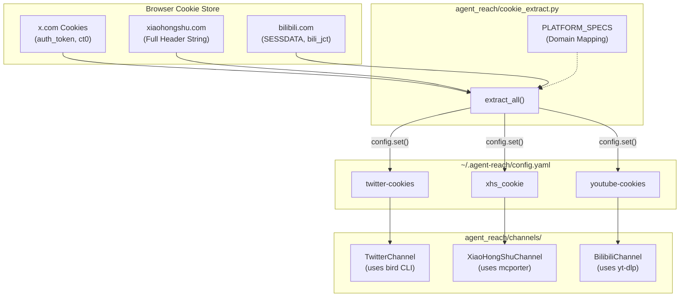

# 쿠키 내보내기 가이드

<details>
<summary>관련 소스 파일</summary>

다음 파일들은 이 위키 페이지를 생성할 때 컨텍스트로 사용되었습니다:

- [agent_reach/cookie_extract.py](agent_reach/cookie_extract.py)
- [docs/cookie-export.md](docs/cookie-export.md)

</details>


이 페이지는 로컬 머신에서 브라우저 세션 쿠키를 내보내 Agent Reach에 공급하는 방법을 설명합니다. Agent Reach가 브라우저에 직접 접근할 수 없는 서버에서 실행될 때, 또는 기존 브라우저 세션을 사용해 특정 채널의 인증을 자동화하고 싶을 때 필요합니다.

Agent Reach는 로컬 환경을 위한 내장 자동 추출 도구(`--from-browser`)와 서버 환경을 위한 수동 방법을 제공합니다.

---

## 쿠키가 필요한 경우

모든 채널이 쿠키를 필요로 하지는 않습니다. 아래 표는 플랫폼과 필요한 config key, 그리고 이를 사용하는 채널을 매핑합니다:

| 플랫폼 | Config Key | 채널 클래스 | 해제되는 기능 |
|---|---|---|---|
| Twitter / X | `twitter-cookies` | `TwitterChannel` | 검색, 타임라인, 인증된 읽기 |
| XiaoHongShu | `xhs_cookie` | `XiaoHongShuChannel` | 노트 가져오기, 검색 |
| Instagram | `instagram-cookies` | `InstagramChannel` | 비공개 콘텐츠, 프로필 읽기 |
| Bilibili | `youtube-cookies` | `BilibiliChannel` | 연령 제한 및 멤버 전용 콘텐츠 |

출처: [agent_reach/cookie_extract.py:16-35](), [docs/cookie-export.md:24-31]()

---

## 방법 1: 자동 추출(로컬 전용)

Agent Reach를 브라우저와 같은 머신에서 실행 중이라면, CLI를 통해 내장 `cookie_extract.py` 모듈을 사용할 수 있습니다.

**명령:**
```bash
agent-reach configure --from-browser chrome
```
*지원 브라우저: chrome, firefox, edge, brave, opera.*

### 구현 세부 사항
`configure_from_browser` 함수 [agent_reach/cookie_extract.py:166-172]()는 `browser_cookie3` 라이브러리를 사용해 로컬 쿠키 저장소에 접근합니다. 

**데이터 흐름(자동 추출):**
1. `extract_all(browser)` [agent_reach/cookie_extract.py:38-48]()는 `PLATFORM_SPECS` [agent_reach/cookie_extract.py:16-35]()를 순회합니다.
2. 브라우저의 `cookie_jar`를 도메인 기준으로 필터링합니다(예: `.x.com`, `.xiaohongshu.com`) [agent_reach/cookie_extract.py:88-91]().
3. Twitter의 경우 `auth_token`과 `ct0`를 특별히 추출합니다 [agent_reach/cookie_extract.py:20-20]().
4. XiaoHongShu의 경우 모든 도메인 쿠키를 하나의 헤더 문자열로 모읍니다 [agent_reach/cookie_extract.py:101-107]().
5. **동기화 로직:** 추출 후 `_sync_bird_env` [agent_reach/cookie_extract.py:141-146]()가 Twitter 자격 증명을 `~/.config/bird/credentials.env`에 기록해 `bird` CLI 백엔드가 즉시 인증되도록 합니다.

출처: [agent_reach/cookie_extract.py:38-163]()

---

## 방법 2: Cookie-Editor 확장(서버에 권장)

이 방법은 Agent가 원격 서버에서 실행될 때 가장 적합합니다.

**단계:**
1. **Cookie-Editor**(Chrome/Firefox/Edge)를 설치합니다.
2. 사이트(예: `https://x.com`)로 이동해 로그인합니다.
3. 확장 아이콘 클릭 → **Export** → **Header String**.
4. 서버에서 설정 명령을 실행합니다:
   ```bash
   agent-reach configure twitter-cookies "auth_token=xxx; ct0=yyy; ..."
   ```

출처: [docs/cookie-export.md:6-22]()

---

## 방법 3: Browser DevTools(수동)

1. 사이트를 열고 **F12**를 누릅니다(Network 탭).
2. 페이지를 새로고침한 뒤 아무 요청이나 선택합니다.
3. **Request Headers**에서 `Cookie:` 헤더를 찾습니다.
4. 값을 복사해 `agent-reach configure`에 제공합니다.

출처: [docs/cookie-export.md:32-43]()

---

## 기술 매핑: 브라우저에서 코드 엔티티로

다음 다이어그램은 추출된 브라우저 데이터가 내부 설정 키에 어떻게 매핑되고, 결국 특정 Channel 클래스에서 어떻게 사용되는지 보여줍니다.

**다이어그램: 쿠키 데이터 흐름에서 채널 엔티티로**



출처: [agent_reach/cookie_extract.py:16-48](), [agent_reach/cookie_extract.py:166-206]()

---

## 플랫폼별 세부 사항

### Twitter / X
Twitter 인증에는 `auth_token`과 `ct0`가 필요합니다. 설정되면 Agent Reach는 이를 다음 위치로 자동 동기화합니다:
- `~/.config/bird/credentials.env`: `bird` Node.js CLI가 사용합니다 [agent_reach/cookie_extract.py:141-156]().
- `~/.config/xfetch/session.json`: 레거시 호환성 [agent_reach/cookie_extract.py:115-135]().

### XiaoHongShu(XHS)
XHS는 완전한 쿠키 문자열을 요구합니다. 이는 config의 `xhs_cookie` 아래에 저장됩니다 [agent_reach/cookie_extract.py:204-204](). 서버 환경에서는 이 문자열이 종종 `xiaohongshu-mcp` Docker 컨테이너에 전달됩니다 [docs/cookie-export.md:29-30]().

### Bilibili
Bilibili는 `SESSDATA`와 `bili_jct`를 사용합니다. 두 채널이 공통 쿠키 처리 메커니즘을 공유하는 `yt-dlp` 백엔드를 사용하므로, 이 값들은 `youtube-cookies` 키 아래에 저장됩니다 [agent_reach/cookie_extract.py:30-34](), [docs/cookie-export.md:30-30]().

---

## 보안과 권한
- **파일 권한:** 쿠키가 포함된 설정 파일은 `0o600`(소유자만 읽기/쓰기)으로 설정됩니다 [agent_reach/cookie_extract.py:135-135](), [agent_reach/cookie_extract.py:156-156]().
- **전용 계정:** 주 계정 리스크를 방지하기 위해 쿠키 내보내기에는 보조 "봇" 계정을 사용하는 것이 강력히 권장됩니다 [docs/install.md:82-84]().

출처: [agent_reach/cookie_extract.py:135-156](), [docs/install.md:82-84]()
