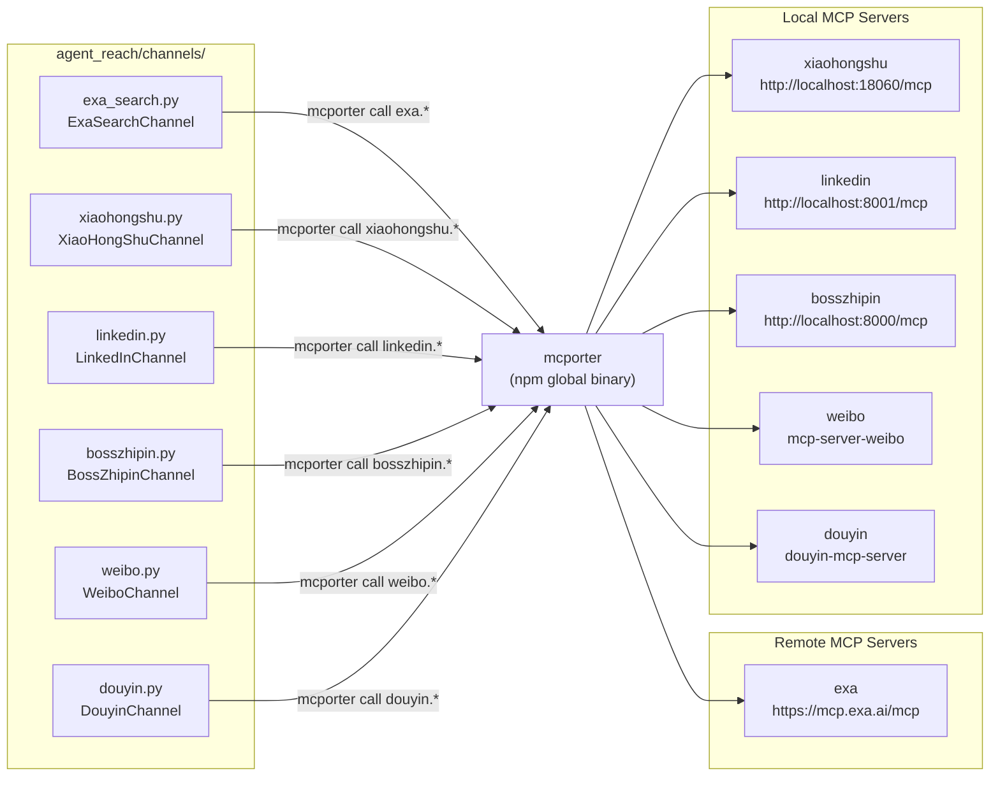
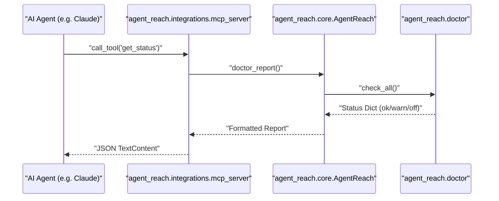

# mcporter 설정

<details>
<summary>관련 소스 파일</summary>

다음 파일들은 이 위키 페이지를 생성할 때 컨텍스트로 사용되었습니다:

- [agent_reach/config.py](agent_reach/config.py)
- [agent_reach/guides/setup-twitter.md](agent_reach/guides/setup-twitter.md)
- [agent_reach/integrations/__init__.py](agent_reach/integrations/__init__.py)
- [agent_reach/integrations/mcp_server.py](agent_reach/integrations/mcp_server.py)
- [config/mcporter.json](config/mcporter.json)
- [docs/troubleshooting.md](docs/troubleshooting.md)

</details>


이 페이지는 `mcporter`가 무엇인지, Agent Reach가 이를 MCP 브리지로 어떻게 사용하는지, `config/mcporter.json` 설정 구조가 무엇인지, 그리고 각 의존 채널에 대한 설정 단계를 다룹니다. 또한 내부 진단을 노출하는 Agent Reach MCP 서버도 문서화합니다.

Agent Reach 자격 증명과 설정의 보다 넓은 구성은 [Configuration]()을, `mcporter`를 사용하는 개별 채널(XiaoHongShu, Exa, LinkedIn, Boss直聘, Weibo, Douyin)에 대한 자세한 내용은 [Channels]()를 참조하세요.

---

## mcporter란 무엇인가

`mcporter`는 셸 프로세스와 하나 이상의 **MCP 서버**(Model Context Protocol 서버) 사이의 브리지 역할을 하는 명령줄 도구(`npm install -g mcporter`)입니다. Agent Reach의 채널 구현은 이를 하위 프로세스로 호출해 원격 또는 로컬 MCP 서버가 노출하는 도구를 사용합니다.

Agent Reach가 `mcporter`를 통해 수행하는 두 가지 핵심 작업:

| 명령 | 목적 |
|---|---|
| `mcporter list` | 구성된 MCP 서버 이름 전체를 나열합니다. 서버 등록 여부 확인에 사용됩니다 |
| `mcporter call <expr>` | 구성된 MCP 서버의 도구를 호출합니다. 예: `exa.web_search_exa(query: "foo")` |
| `mcporter config add <name> <url>` | 이름으로 MCP 서버 엔드포인트를 등록합니다 |

`mcporter`는 npm을 통해 설치되며, `mcporter` 의존 채널이 동작하려면 `PATH`에 있어야 합니다. `ExaSearchChannel`과 `XiaoHongShuChannel`은 둘 다 `shutil.which("mcporter")`를 사용해 이를 감지합니다.

출처: [agent_reach/channels/exa_search.py:21-29](), [agent_reach/channels/xiaohongshu.py:22-31](), [docs/troubleshooting.md:29-36]()

---

## 설정 파일

저장소에는 `config/mcporter.json`에 참고용 설정이 함께 제공됩니다 [config/mcporter.json:1-11](). 이 파일은 `mcpServers` 키를 사용해 이름이 있는 MCP 서버 엔드포인트를 선언합니다.

```json
{
  "mcpServers": {
    "exa": {
      "baseUrl": "https://mcp.exa.ai/mcp"
    },
    "xiaohongshu": {
      "baseUrl": "http://localhost:18060/mcp"
    }
  },
  "imports": []
}
```

| 필드 | 타입 | 설명 |
|---|---|---|
| `mcpServers` | object | 논리적 서버 이름 → 엔드포인트 config의 매핑 |
| `mcpServers.<name>.baseUrl` | string | MCP 서버 엔드포인트의 HTTP(S) URL |
| `imports` | array | 추가로 병합할 설정 파일(기본 설정에서는 사용되지 않음) |

개별 서버 항목은 보통 이 파일을 직접 편집하기보다는 `mcporter config add <name> <baseUrl>`로 런타임에 추가합니다.

출처: [config/mcporter.json:1-11]()

---

## mcporter에 의존하는 채널

**채널-대-MCP 서버 매핑:**



출처: [agent_reach/channels/exa_search.py:1-11](), [agent_reach/channels/xiaohongshu.py:1-11](), [config/mcporter.json:1-11]()

---

## Agent Reach 자체 MCP 서버

Agent Reach는 `agent_reach/integrations/mcp_server.py`에 자체 MCP 서버 구현을 포함합니다 [agent_reach/integrations/mcp_server.py:1-68](). 이 서버는 외부 AI 에이전트(예: Claude Code나 Cursor)가 MCP 프로토콜을 통해 Agent Reach의 상태와 기능을 검사할 수 있게 합니다.

### 구현 세부 사항
- **클래스/함수**: `create_server()` [agent_reach/integrations/mcp_server.py:27-57]()는 MCP `Server` 인스턴스를 초기화합니다.
- **의존성**: `mcp` Python 패키지가 필요합니다(`pip install agent-reach[mcp]`) [agent_reach/integrations/mcp_server.py:18-24]().
- **전송**: 통신에 `stdio_server`를 사용합니다 [agent_reach/integrations/mcp_server.py:62-63]().

### 노출 도구
| 도구 이름 | 설명 | 구현 |
|---|---|---|
| `get_status` | 어떤 채널이 설치되어 있고 활성 상태인지 반환합니다. | `AgentReach.doctor_report()`를 호출 [agent_reach/integrations/mcp_server.py:47-48]() |

### `get_status` 데이터 흐름


출처: [agent_reach/integrations/mcp_server.py:32-57](), [agent_reach/core.py:1-20]()

---

## 채널이 mcporter를 호출하는 방식

`ExaSearchChannel`과 `XiaoHongShuChannel`은 외부 도구 호출에 대해 같은 패턴을 따릅니다:

**Step 1 — 가용성 확인 (`_mcporter_ok`)**

[agent_reach/channels/exa_search.py:21-29]()와 [agent_reach/channels/xiaohongshu.py:22-31]()는 각각 `_mcporter_ok()` 메서드를 정의하며, 이는 다음을 수행합니다:
1. `shutil.which("mcporter")`를 확인해 바이너리가 `PATH`에 있는지 확인합니다.
2. `mcporter list`를 실행하고 예상 서버 이름(`"exa"` 또는 `"xiaohongshu"`)이 stdout에 나타나는지 확인합니다.

**Step 2 — 도구 호출 (`_call`)**

[agent_reach/channels/exa_search.py:32-38]()와 [agent_reach/channels/xiaohongshu.py:34-41]()는 각각 `mcporter call <expr>`을 하위 프로세스로 실행하고 stdout을 반환하며, 종료 코드가 0이 아니면 `RuntimeError`를 발생시키는 `_call(expr, timeout)` 메서드를 정의합니다.

출처: [agent_reach/channels/exa_search.py:21-73](), [agent_reach/channels/xiaohongshu.py:22-41]()

---

## 채널별 설정

### Exa Search (tier 1, 원격 서버)

Exa는 공개 호스팅 MCP 엔드포인트를 사용합니다. Docker나 로컬 프로세스는 필요하지 않습니다.

```bash
npm install -g mcporter
mcporter config add exa https://mcp.exa.ai/mcp
```

`ExaSearchChannel.check()` 메서드는 `mcporter list` 출력에 `"exa"`가 포함되면 `"ok"`를 반환합니다.

출처: [agent_reach/channels/exa_search.py:49-57](), [docs/troubleshooting.md:29-36]()

---

### XiaoHongShu (tier 2, 로컬 Docker 서버)

XiaoHongShu는 HTTP로 노출되는 로컬 MCP 서버(`xiaohongshu-mcp`)가 필요합니다.

```bash
npm install -g mcporter

# Start the MCP server (Docker required)
docker run -d --name xiaohongshu-mcp -p 18060:18060 xpzouying/xiaohongshu-mcp

# Register the local endpoint with mcporter
mcporter config add xiaohongshu http://localhost:18060/mcp
```

설정 후 `XiaoHongShuChannel.check()`는 mcporter를 통해 `xiaohongshu.check_login_status()`를 호출해 `"ok"`(로그인됨)와 `"warn"`(MCP는 실행 중이지만 인증되지 않음)을 구분합니다 [agent_reach/channels/xiaohongshu.py:49-70]().

출처: [agent_reach/channels/xiaohongshu.py:49-70](), [config/mcporter.json:6-8]()

---

## 채널 상태 요약

`AgentReach.doctor_report()` 메서드(및 대응하는 MCP 도구)는 채널 상태를 평가합니다. mcporter 의존 채널의 가능한 상태는 다음과 같습니다:

| 상태 | 의미 |
|---|---|
| `"off"` | `mcporter` 바이너리가 PATH에 없거나, 명명된 서버가 `mcporter list`에 없습니다. |
| `"warn"` | mcporter와 서버는 설정되어 있지만 서비스가 인증되지 않았습니다(예: XiaoHongShu 로그인 안 됨). |
| `"ok"` | mcporter가 연결되어 있고 서비스가 올바르게 응답합니다. |

출처: [agent_reach/integrations/mcp_server.py:47-48](), [agent_reach/channels/exa_search.py:49-57](), [agent_reach/channels/xiaohongshu.py:49-70]()
