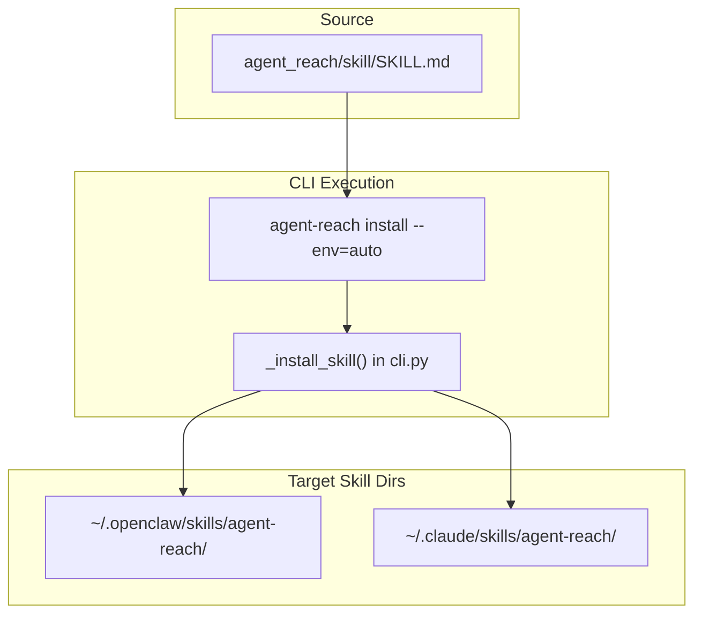
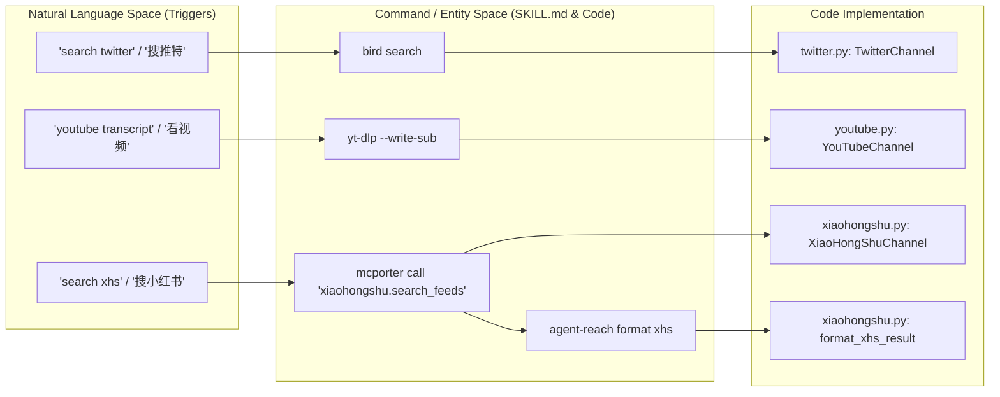
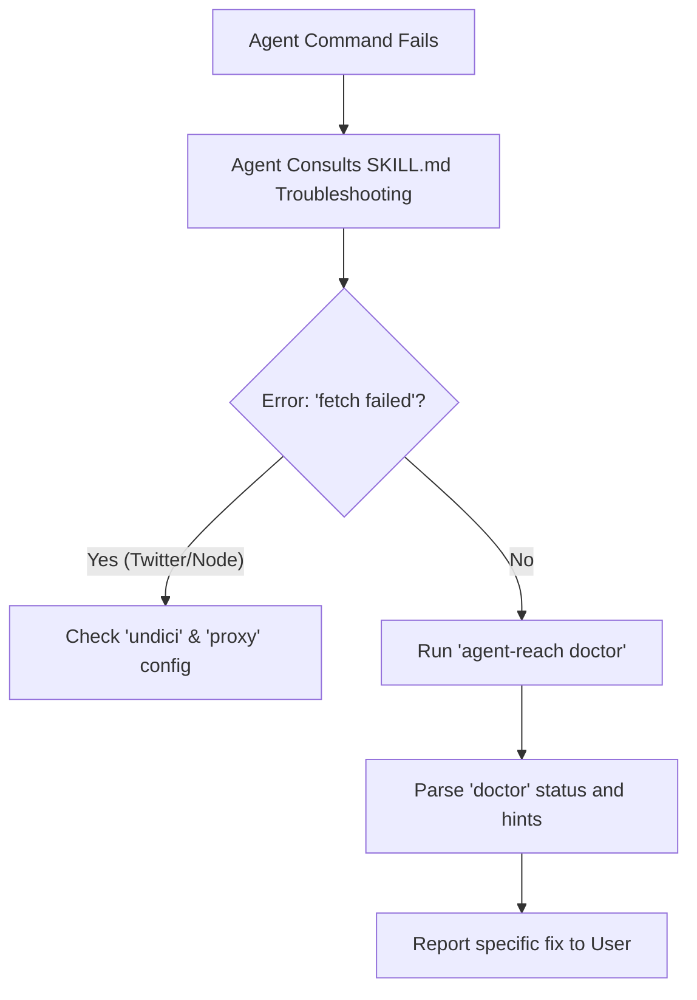

# AI 에이전트 통합

<details>
<summary>관련 소스 파일</summary>

이 위키 페이지를 생성할 때 컨텍스트로 사용된 파일은 다음과 같습니다:

- [agent_reach/channels/xiaohongshu.py](agent_reach/channels/xiaohongshu.py)
- [agent_reach/skill/SKILL.md](agent_reach/skill/SKILL.md)
- [tests/test_skill_command.py](tests/test_skill_command.py)
- [tests/test_xhs_format.py](tests/test_xhs_format.py)

</details>


이 페이지는 AI 에이전트(Claude Code, Cursor, OpenClaw, Windsurf 등)가 `SKILL.md` 스킬 등록 메커니즘을 통해 agent-reach 기능을 어떻게 발견하고 사용하는지 문서화합니다. 스킬 파일 구조, 에이전트 스킬 디렉터리에의 설치, 자연어 트리거 매핑, 기대되는 에이전트 상호작용 모델을 다룹니다.

---

## 개요

Agent Reach는 CLI 도구이지만, 주로 AI 에이전트가 구동하도록 의도되었습니다. 통합은 하나의 메커니즘을 통해 동작합니다. 바로 에이전트의 스킬 디렉터리에 설치되는 `SKILL.md`라는 파일입니다. 설치되면 에이전트는 이 파일을 읽어 agent-reach가 무엇을 할 수 있는지, 언제 호출해야 하는지, 그리고 어떻게 호출해야 하는지를 학습합니다.

### 에이전트 상호작용 흐름
```mermaid
sequenceDiagram
    participant "User" as User
    participant "AI Agent" as Agent
    participant "SKILL.md" as Skill Definition
    participant "agent-reach CLI" as CLI / Backends

    User->>Agent: "Search Twitter for opinions on this product"
    Agent->>Skill Definition: Consult registered skill metadata
    Skill Definition-->>Agent: Trigger matched; Use "bird search" or "agent-reach search-twitter"
    Agent->>CLI: bird search "product opinions" -n 10
    CLI-->>Agent: Structured JSON/Text results
    Agent-->>User: Summarized response with citations
```

출처: [agent_reach/skill/SKILL.md:1-18](), [agent_reach/skill/SKILL.md:43-50]()

---

## `SKILL.md` 파일

`SKILL.md`는 agent-reach 패키지와 스킬 프로토콜을 지원하는 모든 에이전트 사이의 계약입니다. 이 파일은 `agent_reach/skill/SKILL.md`에 있으며, 에이전트에게 제공되는 주된 지침 집합 역할을 합니다.

### Frontmatter: 등록 메타데이터
이 파일은 스킬의 정체성과 활성화 트리거를 정의하는 YAML frontmatter로 시작합니다.

[agent_reach/skill/SKILL.md:1-18]()

| 필드 | 목적 |
|---|---|
| `name` | 고유 식별자 (`agent-reach`) |
| `description` | 에이전트에게 이 스킬을 *언제* 사용해야 하는지 알려줌 (예: "17개 플랫폼 검색 및 읽기") |
| `triggers` | 스킬을 활성화하는 "搜推特", "search reddit", "播客", "web search" 같은 키워드 |
| `metadata` | 통합 전용 데이터 (예: `openclaw` 홈페이지) |

### 스킬 본문: 명령 참조
파일 본문에는 에이전트가 서로 다른 플랫폼에 대해 실행할 구체적인 셸 명령이 담겨 있습니다. 사람을 위한 CLI와 달리, 에이전트는 속도 때문에 하위 백엔드를 직접 호출하거나 MCP 기반 채널에 `mcporter`를 사용하는 쪽으로 종종 권장됩니다.

**에이전트를 위한 핵심 명령 예시:**
- **Web Search (Exa):** `mcporter call 'exa.web_search_exa(query: "query", numResults: 5)'` [agent_reach/skill/SKILL.md:36-41]()
- **Twitter (bird):** `bird search "query" -n 10` [agent_reach/skill/SKILL.md:43-50]()
- **XiaoHongShu (mcporter):** `mcporter call 'xiaohongshu.search_feeds(keyword: "query")' | agent-reach format xhs` [agent_reach/skill/SKILL.md:89-105]()
- **WeChat (Camoufox):** `cd ~/.agent-reach/tools/wechat-article-for-ai && python3 main.py "URL"` [agent_reach/skill/SKILL.md:133-138]()

출처: [agent_reach/skill/SKILL.md:20-138]()

---

## 스킬 설치

설치는 일반적인 에이전트 스킬 디렉터리를 감지하는 내부 CLI 헬퍼가 처리합니다.

### 구현: `_install_skill` 및 `_uninstall_skill`
`agent_reach/cli.py`의 `_install_skill()`과 `_uninstall_skill()` 함수는 에이전트 환경 내에서 `SKILL.md` 파일의 수명 주기를 관리합니다.

- **감지:** `~/.openclaw/skills/` 같은 디렉터리나 `OPENCLAW_HOME`으로 정의된 경로를 찾습니다. [tests/test_skill_command.py:15-29]()
- **작업:** `agent-reach` 하위 디렉터리를 만들고 `SKILL.md` 내용을 그 안에 복사합니다. [tests/test_skill_command.py:66-86]()

### 설치 로직 흐름


출처: [tests/test_skill_command.py:9-86]()

---

## 자연어에서 코드로의 매핑

이 섹션은 에이전트가 사용자의 자연어 요청과 `agent-reach`에 정의된 구체적인 코드 엔티티 또는 명령 사이의 간극을 어떻게 메우는지 보여줍니다.

### 의도 매핑 표

| 사용자 프롬프트(자연어) | 에이전트 동작(명령) | 내부 로직 / 백엔드 |
|---|---|---|
| "Read this link" | `agent-reach read <url>` | `AgentReach.read()` in `core.py` |
| "Search Twitter for AI news" | `bird search "AI news"` | `bird` CLI를 통한 `TwitterChannel` |
| "Find XHS notes about hiking" | `mcporter call 'xiaohongshu...'` | MCP를 통한 `XiaoHongShuChannel` |
| "Transcribe this podcast" | `transcribe.sh <url>` | `XiaoyuzhouChannel` (Groq Whisper) |
| "Search GitHub for python libs" | `gh search repos "python libs"` | `gh` CLI를 통한 `GitHubChannel` |

### 브리지: 자연어에서 코드 엔티티 공간으로


출처: [agent_reach/skill/SKILL.md:1-14](), [agent_reach/skill/SKILL.md:43-105](), [agent_reach/channels/xiaohongshu.py:11-30]()

---

## 에이전트 상호작용 모델

### 컨텍스트 윈도우를 위한 출력 형식
에이전트는 토큰 제한에 민감합니다. `agent-reach`는 API 응답이 에이전트에 도달하기 전에 중복 메타데이터를 제거하는 특정 포맷터를 제공합니다.

- **XiaoHongShu 포맷터:** `agent_reach/channels/xiaohongshu.py`의 `format_xhs_result` 함수는 MCP 서버의 대형 JSON 응답을 정리해 `title`, `desc`, `user`, `images`, 그리고 참여 지표만 남깁니다. [agent_reach/channels/xiaohongshu.py:11-101]()
- **스킬 내 사용법:** `SKILL.md`는 출력 파이프를 명시적으로 지시합니다. `mcporter call ... | agent-reach format xhs`. [agent_reach/skill/SKILL.md:100-105]()

### 진단 중심 구성
에이전트는 구성 로직을 하드코딩하지 않습니다. 대신 "Doctor-First" 모델을 따릅니다:
1. **트리거:** 사용자가 "Why isn't Twitter working?"라고 묻습니다.
2. **동작:** 에이전트가 `agent-reach doctor`를 실행합니다.
3. **분석:** 에이전트는 `doctor` 출력에 제공된 "Remedy" 텍스트를 읽습니다(예: "Need cookies").
4. **해결:** 에이전트는 Cookie-Editor 확장 프로그램을 사용하는 방법을 사용자에게 안내하거나, 데이터가 있으면 `agent-reach configure`를 실행합니다.

### 문제 해결 모델


출처: [agent_reach/skill/SKILL.md:24-28](), [agent_reach/skill/SKILL.md:100-105](), [agent_reach/channels/xiaohongshu.py:11-30](), [tests/test_xhs_format.py:58-83]()
