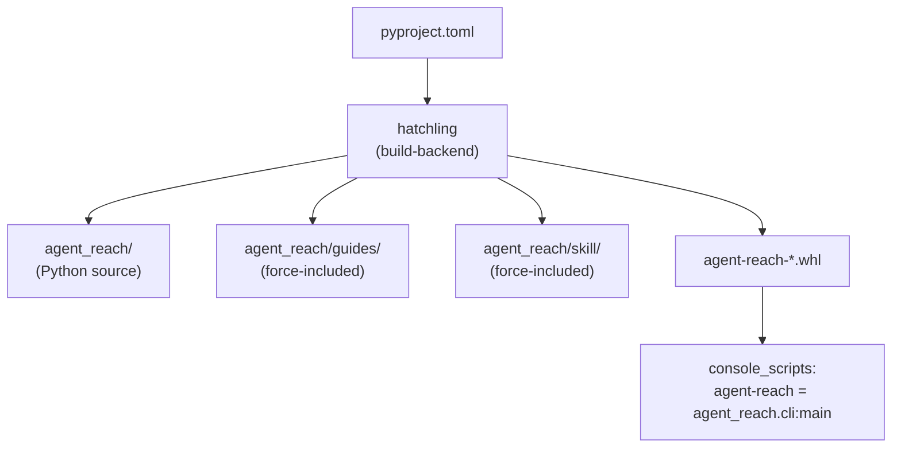
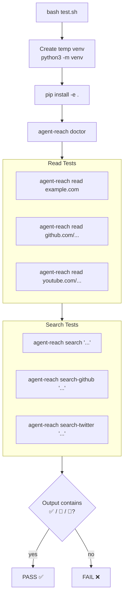
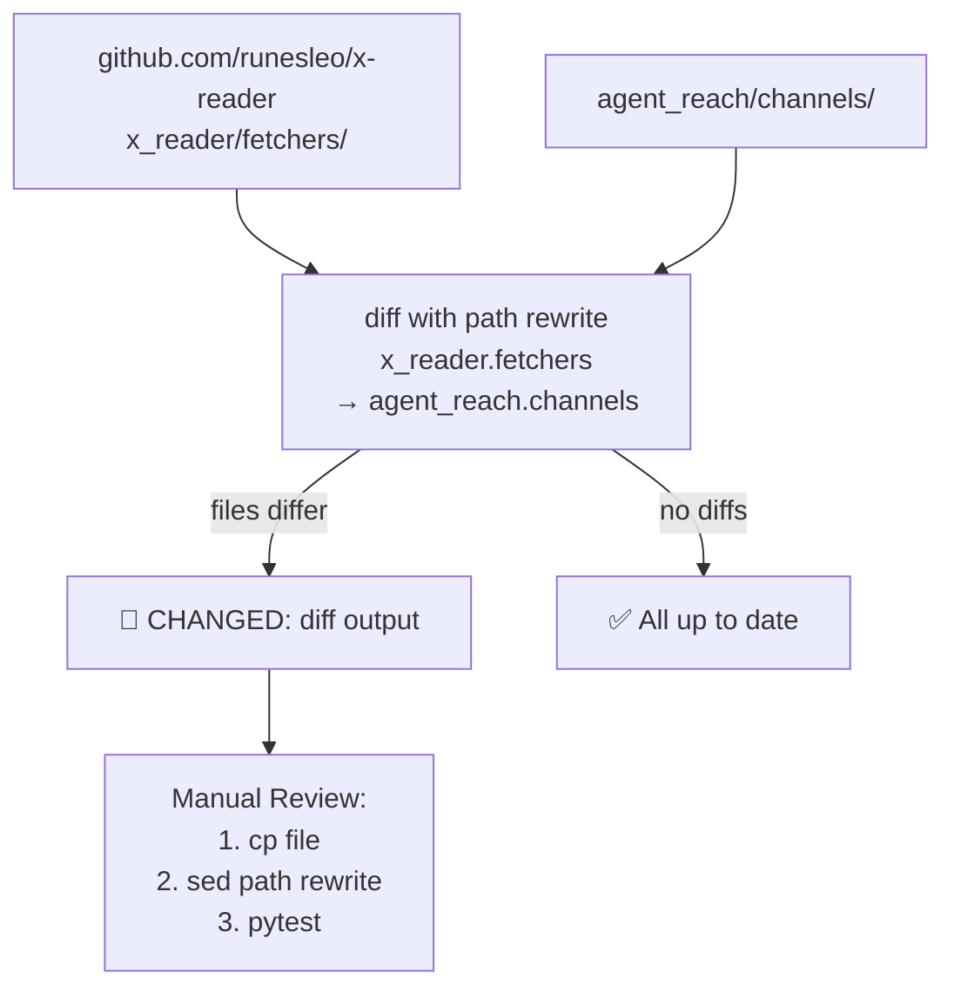

# 개발

관련 소스 파일

이 위키 페이지를 생성할 때 컨텍스트로 사용된 파일은 다음과 같습니다:

- [CLAUDE.md](CLAUDE.md)
- [CONTRIBUTING.md](CONTRIBUTING.md)
- [agent_reach/__init__.py](agent_reach/__init__.py)
- [docs/wechat-group-qr.jpg](docs/wechat-group-qr.jpg)
- [llms.txt](llms.txt)
- [pyproject.toml](pyproject.toml)
- [tests/test_cli.py](tests/test_cli.py)

이 페이지는 `agent-reach` 패키지가 어떻게 구조화되고, 빌드되며, 테스트되고, 상위 의존성과의 동기화 상태를 유지하는지에 대한 기여자 중심 개요입니다. 빌드 시스템 설정, 포함된 데이터 디렉터리, 테스트 스위트, 그리고 `CLAUDE.md`에 정의된 개발 규칙을 다룹니다.

최종 사용자 설치 단계는 Getting Started 페이지([Getting Started](#1.2))를 참조하세요. 자세한 의존성과 extras 문서는 [Package and Dependencies](#6.1)를 참조하세요. 테스트 스위트의 세부 사항은 [Testing](#6.2)를 참조하세요. 상위 저장소 동기화 세부 정보는 [Upstream Sync](#6.3)를 참조하세요.

---

## 저장소 레이아웃

저장소에는 기여자에게 관련된 다음 상위 수준 디렉터리와 파일이 포함되어 있습니다:

| 경로 | 용도 |
|---|---|
| `agent_reach/` | 주 Python 패키지 소스 [pyproject.toml:65]() |
| `agent_reach/channels/` | `BaseChannel`을 상속하는 모든 플랫폼 구현 [CLAUDE.md:21-22]() |
| `agent_reach/guides/` | wheel에 포함되는 번들 문서 [pyproject.toml:68]() |
| `agent_reach/skill/` | AI 에이전트 스킬 등록을 위해 번들되는 `SKILL.md` [pyproject.toml:69]() |
| `scripts/sync-upstream.sh` | 채널 파일을 상위 `runesleo/x-reader`와 비교하는 셸 스크립트 [CLAUDE.md:16-28]() |
| `test.sh` | 종단 간 통합 테스트 스크립트 [CLAUDE.md:12]() |
| `tests/` | Pytest 스위트(CLI, config, channels, doctor) [CLAUDE.md:26]() |
| `pyproject.toml` | 패키지 메타데이터, 의존성, 빌드 설정 [pyproject.toml:1-63]() |
| `CLAUDE.md` | 개발자 가이드: 명령, 구조, 규칙 [CLAUDE.md:1-45]() |

출처: [pyproject.toml:65-70](), [CLAUDE.md:16-28](), [CONTRIBUTING.md:52-59]()

---

## 패키지 빌드

**빌드 시스템 다이어그램 - `pyproject.toml`에서 wheel 내용까지**

출처: [pyproject.toml:53-63](), [pyproject.toml:67-70]()

빌드 백엔드는 `hatchling`입니다 [pyproject.toml:61-62](). `packages` 지시문은 핵심 `agent_reach` 디렉터리를 포함합니다 [pyproject.toml:65](). 세 개의 데이터 디렉터리인 `agent_reach/guides/`, `agent_reach/skill/`, `agent_reach/scripts/`는 `[tool.hatch.build.targets.wheel.force-include]` 테이블 [pyproject.toml:67-70]()을 통해 강제로 포함되어 설치된 wheel에 존재하도록 보장됩니다.

콘솔 스크립트 엔트리포인트는 `agent-reach` 명령을 `agent_reach.cli`의 `main` 함수에 매핑합니다 [pyproject.toml:52-53]().

### 런타임 의존성

| 의존성 | 최소 버전 | 역할 |
|---|---|---|
| `requests` | 2.28 | HTTP 요청 및 GitHub API 업데이트 [pyproject.toml:31]() |
| `feedparser` | 6.0 | RSS 채널 백엔드 [pyproject.toml:32]() |
| `python-dotenv` | 1.0 | 환경 변수 관리 [pyproject.toml:33]() |
| `loguru` | 0.7 | 패키지 전반의 구조화된 로깅 [pyproject.toml:34]() |
| `pyyaml` | 6.0 | `config.yaml` 파싱 및 저장 [pyproject.toml:35]() |
| `rich` | 13.0 | CLI 포매팅 및 "doctor" 보고서 [pyproject.toml:36]() |
| `yt-dlp` | 2024.0 | YouTube/Bilibili 전사 및 정보 추출 [pyproject.toml:37]() |

출처: [pyproject.toml:30-38]()

### 선택적 Extras

| Extra | 추가되는 패키지 | 활성화되는 기능 |
|---|---|---|
| `[browser]` | `playwright>=1.40` | WeChat/Camoufox용 헤드리스 브라우저 [pyproject.toml:41]() |
| `[cookies]` | `browser-cookie3>=0.19` | `agent-reach configure --from-browser` [pyproject.toml:42]() |
| `[all]` | `playwright`, `mcp[cli]`, `browser-cookie3` | MCP를 포함한 전체 기능 세트 [pyproject.toml:43]() |
| `[dev]` | `pytest`, `ruff`, `mypy` | 린팅, 타입 검사, 테스트 [pyproject.toml:44-50]() |

출처: [pyproject.toml:40-50]()

---

## 개발 규칙 (`CLAUDE.md`)

`CLAUDE.md` 파일은 일관성을 유지하기 위해 프로젝트의 주요 규칙과 관례를 정의합니다:

- **채널 계약**: 모든 플랫폼은 `can_handle(url)`, `read(url)`, `search(query)`, `check()`를 구현해야 합니다 [CLAUDE.md:32]().
- **글루 레이어 철학**: Agent Reach는 기존 도구를 라우팅하고 호출하는 "glue layer"이며, 내부를 다시 구현하지 않습니다 [CLAUDE.md:39]().
- **버전 동기화**: 버전 문자열은 `pyproject.toml`, `agent_reach/__init__.py`, `tests/test_cli.py`에서 정확히 일치해야 합니다 [CLAUDE.md:40]().
- **인증**: XHS와 Twitter의 경우 QR 스캔에서 멈추는 일을 피하기 위해 쿠키 기반 내보내기만 지원됩니다 [CLAUDE.md:43-44]().

출처: [CLAUDE.md:29-45](), [agent_reach/__init__.py:4]()

---

## 테스트

테스트 스위트는 자동화된 단위 테스트와 수동 통합 스크립트로 구성됩니다.

| 구성 요소 | 파일 | 유형 | 테스트 대상 |
|---|---|---|---|
| 통합 | `test.sh` | 셸 스크립트 | 전체 CLI 명령(install, doctor, read, search) [CLAUDE.md:12]() |
| CLI 로직 | `tests/test_cli.py` | Pytest | 인자 파싱, 버전 출력, 쿠키 파싱 [tests/test_cli.py:11-45]() |
| 업데이트 로직 | `tests/test_cli.py` | Pytest | GitHub API 재시도 로직 및 오류 분류 [tests/test_cli.py:46-127]() |
| 진단 | `tests/test_doctor.py` | Pytest | 상태 검사 로직 및 보고서 포맷팅 [CLAUDE.md:20]() |

### 통합 테스트 흐름

**`test.sh` 실행 흐름**

출처: [CLAUDE.md:8-15](), [tests/test_cli.py:26-32]()

전체 테스트 스위트와 개별 플랫폼 테스트 실행 방법은 [Testing](#6.2)를 참조하세요.

---

## 상위 저장소 동기화

`agent_reach/channels/`의 채널 구현은 `runesleo/x-reader` 저장소를 기준으로 추적됩니다. `scripts/sync-upstream.sh` 스크립트가 비교를 자동화합니다.

**상위 동기화 워크플로**

출처: [CLAUDE.md:21-22](), [CONTRIBUTING.md:52-59]()

경로 재작성 로직과 수동 병합 워크플로의 자세한 내용은 [Upstream Sync](#6.3)를 참조하세요.
