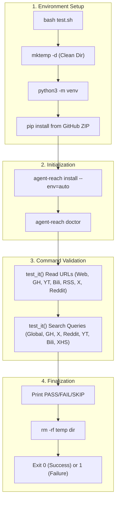
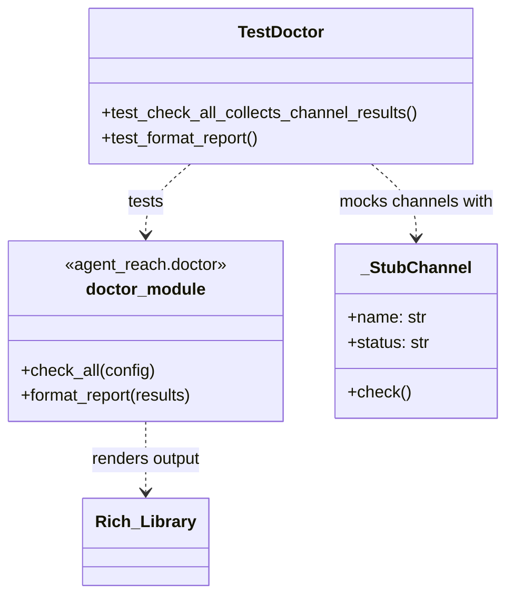

# 테스트

관련 소스 파일

이 위키 페이지를 생성할 때 컨텍스트로 사용된 파일은 다음과 같습니다:

- [.github/workflows/pytest.yml](.github/workflows/pytest.yml)
- [agent_reach/channels/xiaohongshu.py](agent_reach/channels/xiaohongshu.py)
- [constraints.txt](constraints.txt)
- [docs/dependency-locking.md](docs/dependency-locking.md)
- [test.sh](test.sh)
- [tests/test_core.py](tests/test_core.py)
- [tests/test_doctor.py](tests/test_doctor.py)
- [tests/test_skill_command.py](tests/test_skill_command.py)
- [tests/test_xhs_format.py](tests/test_xhs_format.py)
- [tests/test_xiaoyuzhou_install.py](tests/test_xiaoyuzhou_install.py)

이 페이지는 Agent Reach의 테스트 스위트를 문서화합니다. 여기에는 bash 기반 종단 간 통합 스크립트, 포괄적인 pytest 단위 테스트 집합, 그리고 특화된 포맷 검증기가 포함됩니다. 이 스위트는 CLI 명령, 채널 계약, 구성 처리 전반에서 기능적 정확성을 보장합니다.

---

## 테스트 구성 요소 개요

| 구성 요소 | 파일 | 유형 | 범위 |
|---|---|---|---|
| **통합** | `test.sh` | Bash E2E | 설치, `doctor`, `read`, `search` 명령 검증 |
| **Doctor Unit** | `tests/test_doctor.py` | pytest | `check_all()` 수집 및 `format_report()` Rich 출력 |
| **XHS Format** | `tests/test_xhs_format.py` | unittest | XiaoHongShu JSON 응답의 토큰 절감 로직 |
| **Skill CLI** | `tests/test_skill_command.py` | unittest | `SKILL.md` 설치 및 제거 로직 |
| **Core/CLI** | `tests/test_core.py`, `tests/test_cli.py` | pytest | `AgentReach` 클래스 초기화 및 CLI 인자 파싱 |
| **Contract** | `tests/test_channel_contracts.py` | pytest | 등록된 모든 채널의 인터페이스 준수 |

출처: [test.sh:1-93](), [tests/test_doctor.py:1-102](), [tests/test_xhs_format.py:1-133](), [tests/test_skill_command.py:1-90]()

---

## `test.sh` - 종단 간 통합 스크립트

`test.sh`는 깨끗한 환경에서 성공적인 콘텐츠 검색까지의 전체 사용자 여정을 검증하는 독립형 스크립트입니다.

**E2E 테스트 흐름 다이어그램:**

출처: [test.sh:13-93]()

### 검증 로직: `test_it()`
이 스크립트는 하드코딩된 모의 응답 없이 성공 여부를 판별하기 위해 휴리스틱 접근을 사용합니다 [test.sh:39-55]().

*   **PASS (✅):** 출력에 `📖`, `🔗`, 또는 URL 문자열 `http` 같은 성공 마커가 포함됩니다.
*   **SKIP (⏭️):** 출력에 `⚠️` 또는 `not installed`/`not configured` 같은 문구가 포함됩니다. 이를 통해 `bird`나 `mcporter`가 없는 부분적 환경에서도 CI가 실패하지 않도록 테스트를 실행할 수 있습니다 [test.sh:47-49]().
*   **FAIL (❌):** 그 외의 모든 출력 또는 0이 아닌 종료 코드 [test.sh:50-54]().

---

## 단위 테스트: `tests/test_doctor.py`

이 모듈은 진단 엔진을 검증합니다. `gh`나 `mcporter` 같은 실제 시스템 의존성 없이 다양한 채널 상태를 시뮬레이션하기 위해 `monkeypatch` 전략을 사용합니다.

**Doctor 로직 연관성:**

출처: [tests/test_doctor.py:10-38]()

### 주요 테스트 기능
*   **상태 수집:** `test_check_all_collects_channel_results`는 `doctor.check_all`이 모든 채널 레지스트리에서 `status`, `tier`, `backends`를 올바르게 집계하는지 검증합니다 [tests/test_doctor.py:29-64]().
*   **출력 포맷팅:** `test_format_report`는 최종 문자열에 "Agent Reach" 같은 필수 헤더가 포함되고 채널을 "Ready to use" (装好即用) 또는 "Needs config" (配置后可用) 섹션으로 올바르게 분류하는지 확인합니다 [tests/test_doctor.py:66-101](). 또한 어설션 전에 Rich 마크업 태그를 제거하기 위해 정규식을 사용합니다 [tests/test_doctor.py:94-95]().

---

## 특화된 테스트 모듈

### XiaoHongShu 포맷 검증
`tests/test_xhs_format.py`는 `agent_reach/channels/xiaohongshu.py`의 `format_xhs_result` 함수에 집중합니다.

*   **토큰 최적화:** `at_user_list`, `geo_info`, `audit_info` 같은 중복 메타데이터가 XHS API 응답에서 제거되어 LLM 컨텍스트 토큰을 절약하는지 보장합니다 [tests/test_xhs_format.py:73-82]().
*   **데이터 정규화:** 복잡한 `image_list` 구조에서 깨끗한 이미지 URL을 추출하고 작성자/댓글 딕셔너리를 평탄화하는지를 테스트합니다 [tests/test_xhs_format.py:58-71]().

### Skill 명령 검증
`tests/test_skill_command.py`는 AI 에이전트(Claude Code, OpenClaw)와의 통합을 테스트합니다.

*   **설치:** `test_install_skill_creates_skill_md`는 `_install_skill()`이 대상 디렉터리(`~/.openclaw/skills` 같은)를 올바르게 찾고 `SKILL.md` 파일을 쓰는지 검증합니다 [tests/test_skill_command.py:15-43]().
*   **제거:** `test_uninstall_skill_removes_dir`는 요청 시 `agent-reach` 스킬 디렉터리가 재귀적으로 삭제되는지 보장합니다 [tests/test_skill_command.py:44-64]().

### 의존성과 CI
프로젝트는 GitHub Actions(`.github/workflows/pytest.yml`)를 사용해 Python 3.10부터 3.13까지 테스트 스위트를 실행합니다 [github/workflows/pytest.yml:12-13](). 재현성을 보장하기 위해 테스트는 `constraints.txt`에 고정된 버전을 기준으로 실행됩니다 [constraints.txt:1-18]().

| 의존성 | 목적 | 파일 |
|---|---|---|
| `pytest` | 주 테스트 러너 | [constraints.txt:13]() |
| `ruff` | 린팅 및 포맷팅 검사 | [constraints.txt:14]() |
| `mypy` | 정적 타입 검증 | [constraints.txt:15]() |

출처: [docs/dependency-locking.md:1-31](), [.github/workflows/pytest.yml:1-31]()
