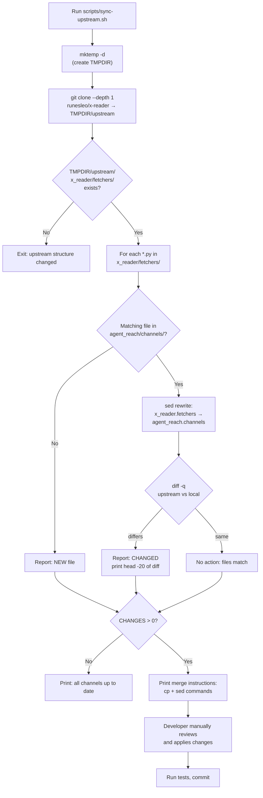
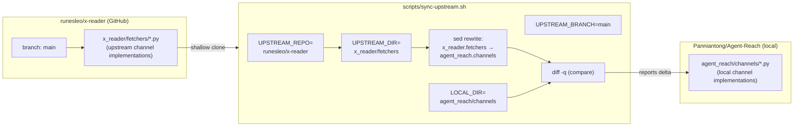

# 상위 저장소 동기화

<details>
<summary>관련 소스 파일</summary>

이 위키 페이지를 생성할 때 컨텍스트로 사용된 파일은 다음과 같습니다:

- [LICENSE](LICENSE)
- [scripts/sync-upstream.sh](scripts/sync-upstream.sh)

</details>


이 페이지는 상위 오픈소스 저장소에서 채널 구현 업데이트를 추적하고 병합하는 데 사용되는 `scripts/sync-upstream.sh` 스크립트를 문서화합니다. 이는 개발자/기여자 워크플로에 관한 내용입니다.

채널이 무엇이고 어떻게 구조화되는지에 대한 정보는 [Channel Architecture]()를 참조하세요. 전체 개발 환경에 대한 정보는 [Development]()를 참조하세요.

---

## 목적

Agent Reach의 채널 구현은 [`runesleo/x-reader`](https://github.com/runesleo/x-reader) 프로젝트에서 부분적으로 파생되었습니다. `scripts/sync-upstream.sh`의 스크립트는 어떤 채널 파일이 상위 저장소의 대응 파일과 달라졌는지 식별하는 반자동 방법을 제공하여, 개발자가 관련 개선 사항을 수동으로 검토하고 병합할 수 있게 합니다.

동기화는 의도적으로 **수동**입니다. 이 스크립트는 차이만 보고할 뿐 자동으로 적용하지 않습니다. 이를 통해 병합 과정에서 Agent Reach 고유의 수정 사항(임포트 경로, 추가된 구성 통합 등)이 보존됩니다.

---

## 저장소 매핑

핵심 관계는 두 개의 서로 다른 저장소에 있는 두 디렉터리 사이에 있습니다:

| 상위(`runesleo/x-reader`) | 로컬(`Panniantong/Agent-Reach`) |
|---|---|
| `x_reader/fetchers/` | `agent_reach/channels/` |
| 임포트 접두사: `x_reader.fetchers` | 임포트 접두사: `agent_reach.channels` |

추적되는 상위 브랜치는 `main`입니다.

출처: [scripts/sync-upstream.sh:12-16]()

---

## 스크립트 내부

**스크립트: `scripts/sync-upstream.sh`**

스크립트 워크플로는 네 단계로 구성됩니다:

1. **Clone** — 상위 저장소를 임시 디렉터리에 얕게 clone합니다 [scripts/sync-upstream.sh:25-27]()
2. **Validate** — 상위 저장소에서 `x_reader/fetchers/`가 여전히 존재하는지 확인합니다(상위 구조 변경에 대한 방어) [scripts/sync-upstream.sh:29-33]()
3. **Compare** — 상위 fetchers 디렉터리의 각 `.py` 파일에 대해, 비교하기 전에 임포트 경로를 정규화한 뒤 같은 이름의 로컬 채널 파일과 diff를 수행합니다 [scripts/sync-upstream.sh:40-58]()
4. **Report** — diff 요약을 출력하고 각 파일에 적용하는 데 필요한 정확한 `cp` + `sed` 명령을 내보냅니다 [scripts/sync-upstream.sh:60-72]()

**diff에서의 임포트 경로 정규화:**

파일을 비교할 때 스크립트는 `diff`에 넘기기 전에 `sed`를 사용해 상위 임포트 접두사를 즉석에서 다시 씁니다:

```bash
sed 's/x_reader\.fetchers/agent_reach.channels/g'
```

이는 임포트 경로만 다른 파일은 비교 결과에서 **변경 없음**으로 나타난다는 뜻입니다. 의미 있는 로직 차이만 노출됩니다.

출처: [scripts/sync-upstream.sh:51-53]()

---

## 워크플로 다이어그램

**상위 동기화 워크플로**



출처: [scripts/sync-upstream.sh:22-72]()

---

## 비교 로직 상세

스크립트의 비교 로직은 각 상위 파일을 다음과 같이 처리합니다:

**파일 분류**

| 조건 | 출력 라벨 | 의미 |
|---|---|---|
| 파일이 상위에는 있지만 `agent_reach/channels/`에는 없음 | `🆕 NEW` | 상위에 새 fetcher가 추가되었으므로 포팅을 고려해야 함 |
| 파일이 양쪽에 모두 있고, 내용이 다름(임포트 재작성 후) | `📝 CHANGED` | 검토할 가치가 있는 로직 변경이 상위에 있음 |
| 파일이 양쪽에 모두 있고, 내용이 같음(임포트 재작성 후) | *(무표시)* | 동기화 상태이며 조치 불필요 |

변경된 파일의 경우 스크립트는 통합 diff의 첫 20줄(`diff --color -u ... | head -20`)을 줄임표와 함께 출력하여, 터미널을 압도하지 않으면서도 빠르게 개요를 볼 수 있게 합니다.

출처: [scripts/sync-upstream.sh:40-58]()

---

## 수동 병합 지침

변경이 감지되면 스크립트는 특정 상위 파일을 적용하는 데 필요한 정확한 명령을 출력합니다:

```sh
cp $TMPDIR/upstream/x_reader/fetchers/FILENAME.py agent_reach/channels/FILENAME.py
sed -i 's/x_reader\.fetchers/agent_reach.channels/g' agent_reach/channels/FILENAME.py
```

적용 후:
1. diff를 수동으로 검토합니다. 상위 저장소에는 Agent Reach 고유의 구성 통합, 프록시 지원, 폴백 채널이 없을 수 있습니다.
2. 테스트 스위트를 실행합니다. 테스트 실행기는 [Testing]()을 참조하세요.
3. 업데이트된 채널 파일을 커밋합니다.

> **중요:** 상위 파일은 원시 `x_reader.fetchers` 임포트 경로를 사용합니다. 병합 명령의 `sed` 치환이 이 이름 변경을 처리합니다. 이 단계를 잊으면 임포트가 깨집니다.

출처: [scripts/sync-upstream.sh:63-72]()

---

## 구조 다이어그램: 코드 엔티티

**동기화 과정에 관여하는 엔티티**



출처: [scripts/sync-upstream.sh:12-16]()

---

## 환경 및 사전 요구 사항

스크립트의 요구 사항은 최소한입니다:

| 요구 사항 | 목적 |
|---|---|
| `bash` | 스크립트 인터프리터(`set -e` 사용) |
| `git` | 상위 저장소를 shallow clone |
| `diff` | 파일 내용 비교 |
| `sed` | 비교 전에 메모리상에서 임포트 경로 재작성 |
| 네트워크 접근 | clone 단계에서 GitHub에 도달 가능해야 함 |

임시 디렉터리는 `mktemp -d`로 생성되며 `trap "rm -rf $TMPDIR" EXIT`를 통해 종료 시 자동으로 제거되므로, 스크립트가 중단되더라도 별도의 정리 작업은 필요하지 않습니다.

출처: [scripts/sync-upstream.sh:10-23]()
