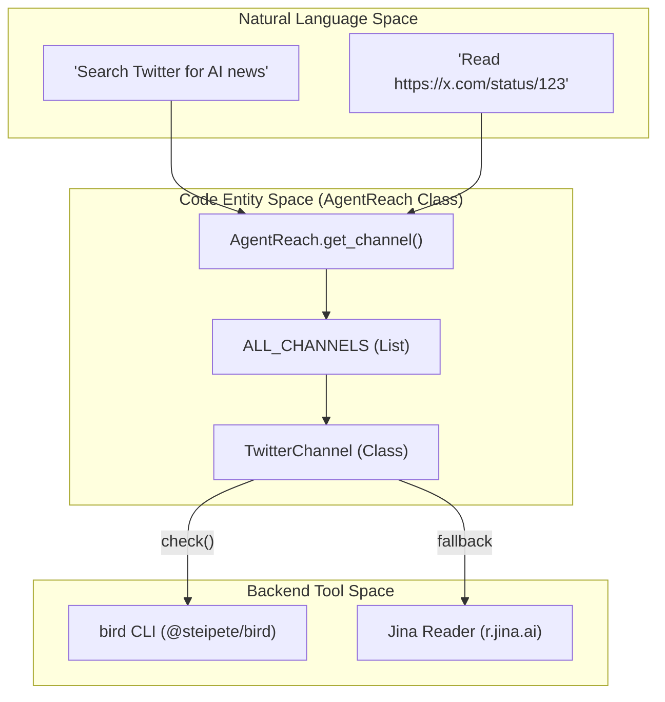
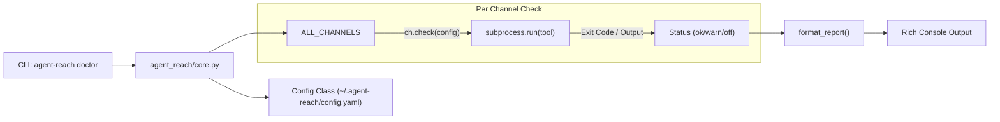

# 용어집

관련 소스 파일

이 위키 페이지를 생성할 때 컨텍스트로 사용된 파일은 다음과 같습니다:

- [README.md](README.md)
- [agent_reach/channels/__init__.py](agent_reach/channels/__init__.py)
- [agent_reach/channels/twitter.py](agent_reach/channels/twitter.py)
- [agent_reach/channels/v2ex.py](agent_reach/channels/v2ex.py)
- [agent_reach/channels/wechat.py](agent_reach/channels/wechat.py)
- [agent_reach/channels/weibo.py](agent_reach/channels/weibo.py)
- [agent_reach/channels/xiaoyuzhou.py](agent_reach/channels/xiaoyuzhou.py)
- [agent_reach/channels/xueqiu.py](agent_reach/channels/xueqiu.py)
- [agent_reach/scripts/transcribe_xiaoyuzhou.sh](agent_reach/scripts/transcribe_xiaoyuzhou.sh)
- [agent_reach/skill/SKILL.md](agent_reach/skill/SKILL.md)
- [tests/test_channel_contracts.py](tests/test_channel_contracts.py)
- [tests/test_channels.py](tests/test_channels.py)
- [tests/test_twitter_channel.py](tests/test_twitter_channel.py)

이 페이지는 Agent Reach 전반에서 사용되는 코드베이스 고유 용어, 전문 용어, 약어의 정의를 제공합니다. 온보딩 엔지니어가 내부 명명법과 시스템에 통합된 특정 도구를 이해할 수 있도록 돕는 기술 참고 자료 역할을 합니다.

## 핵심 개념

### Channel
**Channel**은 특정 인터넷 플랫폼(예: Twitter, GitHub, Reddit)과 상호작용하기 위한 표준화된 인터페이스를 제공하는 플러그형 어댑터입니다. 각 채널은 특정 URL을 처리할 수 있는지 감지하고, 자체 상태/의존성 상태를 검사하며, 콘텐츠 읽기 또는 검색 메서드를 제공합니다 [agent_reach/channels/base.py:1-50]().

### ALL_CHANNELS
지원되는 모든 플랫폼의 전역 레지스트리입니다. 시스템이 URL을 라우팅할 때 사용하는, 인스턴스화된 `Channel` 객체들의 순서 있는 목록입니다. 순서는 중요합니다. 시스템은 이 목록을 순회하면서 각 항목에 `can_handle(url)`을 호출하고, `True`를 처음 반환한 채널이 요청을 처리하도록 선택됩니다 [agent_reach/channels/__init__.py:29-46]().

### Tier (0/1/2)
채널은 구성 요구 사항에 따라 티어로 분류됩니다:
*   **Tier 0 (Zero Config):** API 키나 로그인 없이 바로 작동합니다(예: Web, V2EX, Xueqiu) [agent_reach/channels/xueqiu.py:55-55]().
*   **Tier 1 (Needs Key/Tool):** 무료 API 키나 특정 시스템 도구 설치가 필요합니다(예: `bird`를 통한 Twitter, `yt-dlp`를 통한 YouTube) [agent_reach/channels/twitter.py:13-13]().
*   **Tier 2 (Complex Setup):** 쿠키, 스텔스 브라우저, 로컬 Docker 컨테이너가 필요합니다(예: WeChat, Instagram) [agent_reach/channels/wechat.py:17-17]().

### can_handle & check()
*   **`can_handle(url)`**: 모든 채널이 구현하는 메서드로, 정규식 또는 도메인 파싱을 사용해 주어진 URL이 해당 플랫폼에 속하는지 판단합니다 [agent_reach/channels/twitter.py:15-18]().
*   **`check(config)`**: `agent-reach doctor`에서 사용하는 진단 메서드입니다. 필요한 백엔드(CLI 도구, 환경 변수, 쿠키)가 존재하고 동작하는지 검증합니다 [agent_reach/channels/twitter.py:20-50]().

### 시스템 엔티티 매핑

다음 다이어그램은 자연어 플랫폼 요청이 어떻게 특정 코드 엔티티와 백엔드 CLI 도구로 매핑되는지 보여줍니다.

**플랫폼 라우팅 및 백엔드 매핑**

출처: [agent_reach/channels/__init__.py:29-46](), [agent_reach/channels/twitter.py:9-50](), [README.md:155-187]()

---

## 기술 구성 요소 및 백엔드

### bird / birdx
Twitter 채널의 주요 백엔드로 사용되는 Node.js 기반 CLI 도구(`@steipete/bird`)입니다. 인증된 요청으로 트윗 읽기, 검색, 타임라인 보기 기능을 처리합니다 [agent_reach/channels/twitter.py:21-26]().

### mcporter
**Model Context Protocol (MCP) 브리지**입니다. Agent Reach가 `mcporter call` 인터페이스를 통해 Exa, XiaoHongShu, Weibo 같은 다양한 MCP 서버의 도구를 호출할 수 있게 해주는 CLI 도구입니다 [agent_reach/skill/SKILL.md:39-41]().

### MCP (Model Context Protocol)
AI 모델이 외부 데이터 소스와 도구에 연결할 수 있게 해주는 공개 표준입니다. Agent Reach는 각 플랫폼마다 맞춤형 스크래퍼를 따로 만들지 않고도 MCP 서버를 사용해 XiaoHongShu, Douyin, Weibo 같은 플랫폼에 접근합니다 [README.md:195-200]().

### SKILL.md
`agent_reach/skill/SKILL.md`에 위치한 특수한 Markdown 파일입니다. Claude Code나 Cursor 같은 AI 에이전트가 특정 사용자 요청에 대해 어떤 명령을 실행해야 하는지 이해할 수 있도록 구조화된 "사용 가이드"를 포함합니다 [agent_reach/skill/SKILL.md:1-25]().

### doctor
`agent-reach doctor` 진단 명령입니다. `ALL_CHANNELS`에 등록된 모든 채널을 순회하면서 `check()` 메서드를 실행해 시스템 상태를 보고합니다 [README.md:61-61](), [agent_reach/channels/__init__.py:49-60]().

### Jina Reader
모든 URL을 깨끗한 LLM 친화적 Markdown으로 변환하는 대체 웹 읽기 서비스(`https://r.jina.ai/`)입니다. `WebChannel`과 여러 Tier 1/2 채널의 fallback으로 사용됩니다 [README.md:192-192]().

### yt-dlp
YouTube 및 Bilibili의 비디오 메타데이터와 자막/전사를 추출하기 위해 `YouTubeChannel`과 `BilibiliChannel`이 사용하는 강력한 명령행 미디어 다운로더입니다 [agent_reach/skill/SKILL.md:52-66]().

### gh CLI
공식 GitHub Command Line Interface입니다. 저장소 보기, 이슈 추적, 코드 검색을 처리하는 `GitHubChannel`의 주요 백엔드입니다 [agent_reach/skill/SKILL.md:79-87]().

---

## 특수 용어

### xsec_token
XiaoHongShu(XHS) API에서 피드 세부 정보를 가져오는 데 필요한 필수 보안 토큰입니다. 일반적으로 브라우저 쿠키에서 추출하여 `mcporter` 호출에 전달합니다 [agent_reach/skill/SKILL.md:92-94]().

### Node (V2EX)
`V2EXChannel` 맥락에서 **Node**는 특정 하위 포럼 또는 카테고리(예: `python`, `tech`, `jobs`)를 의미합니다 [agent_reach/skill/SKILL.md:205-206]().

### Cookie Auth
사용자가 브라우저에서 쿠키를 내보내고(주로 **Cookie-Editor** 확장 프로그램을 통해) 이를 Agent Reach에 제공해 Twitter나 XHS 같은 플랫폼의 로그인 화면을 우회하는 인증 방식입니다 [README.md:88-91]().

### Visitor Passport / Passport
Weibo 채널에서 인증 없이 hot search와 공개 프로필에 접근할 수 있도록 자동 생성되는 "Visitor Cookie"를 의미합니다 [agent_reach/skill/SKILL.md:174-174]().

### Residential Proxy
서버 측 배포에 권장되는 구성입니다. Reddit과 Bilibili 같은 플랫폼은 종종 데이터센터 IP 대역을 차단하므로, 트래픽이 가정 네트워크에서 온 것처럼 보이도록 주거용 프록시를 사용합니다 [README.md:91-91]().

### Scaffolding
Agent Reach의 설계 철학입니다. 무거운 프레임워크가 아니라, 독립적인 상위 도구를 설정하고 구성하는 **scaffolding**으로 작동하며, AI 에이전트가 그 도구들을 직접 호출할 수 있게 합니다 [README.md:157-164]().

### Vibe-coded
프로젝트 개발에서 사용된 구어체 용어로, 시스템이 AI 에이전트가 도구와 "느끼는 방식"과 상호작용하는 방식에 최적화된 "zero-config" 및 "natural language first" 접근을 설명합니다.

---

## 내부 로직 흐름

다음 다이어그램은 `agent-reach doctor` 명령이 시스템 상태를 검증할 때의 데이터 흐름을 설명합니다.

**Doctor 진단 데이터 흐름**

출처: [agent_reach/channels/base.py:20-30](), [agent_reach/channels/twitter.py:20-50](), [agent_reach/channels/weibo.py:20-52]()

### 핵심 클래스
*   **AgentReach**: 요청의 수명 주기와 채널 선택을 관리하는 중앙 오케스트레이터입니다.
*   **Config**: `~/.agent-reach/config.yaml`의 읽기/쓰기, API 키 및 프록시 설정을 관리합니다 [agent_reach/channels/xiaoyuzhou.py:43-46]().

### 상위 통합 도구
*   **wechat-article-for-ai**: 스텔스 브라우저(**Camoufox**)를 사용해 WeChat 문서를 읽습니다 [agent_reach/channels/wechat.py:16-16]().
*   **douyin-mcp-server**: Douyin 비디오 정보를 파싱하는 MCP 서버입니다 [README.md:199-199]().
*   **mcp-server-weibo**: Weibo 트렌드와 댓글에 접근하는 MCP 서버입니다 [agent_reach/channels/weibo.py:12-12]().
*   **Groq Whisper**: `XiaoyuzhouChannel`이 Groq API를 사용해 팟캐스트 오디오를 텍스트로 전사하는 파이프라인입니다 [agent_reach/channels/xiaoyuzhou.py:2-13]().

출처: [README.md:155-200](), [agent_reach/channels/__init__.py:29-46](), [agent_reach/skill/SKILL.md:1-216](), [agent_reach/channels/twitter.py:1-50](), [agent_reach/channels/wechat.py:1-58](), [agent_reach/channels/xiaoyuzhou.py:1-55]()
