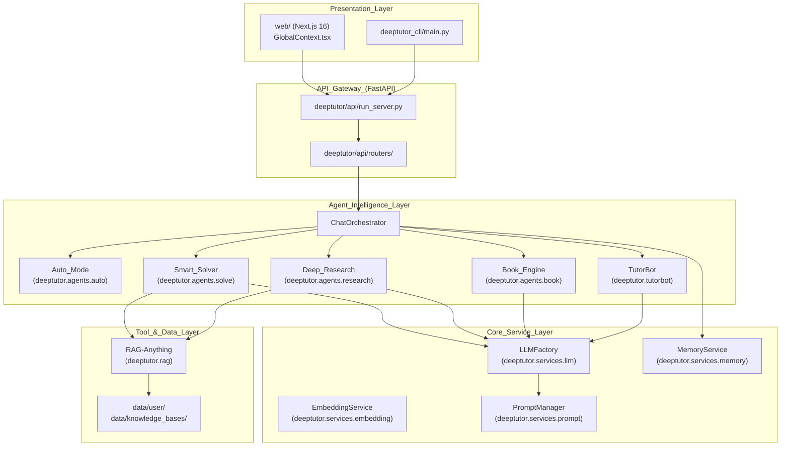
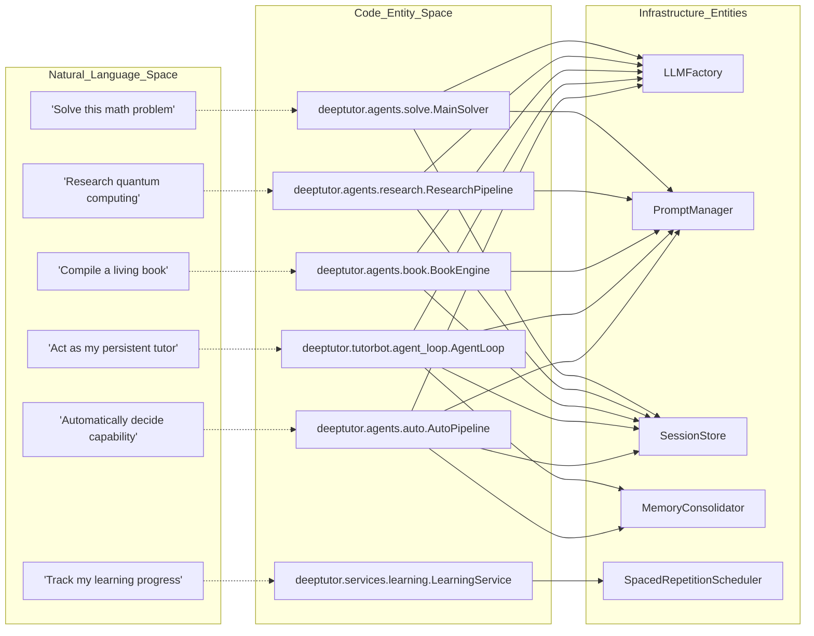
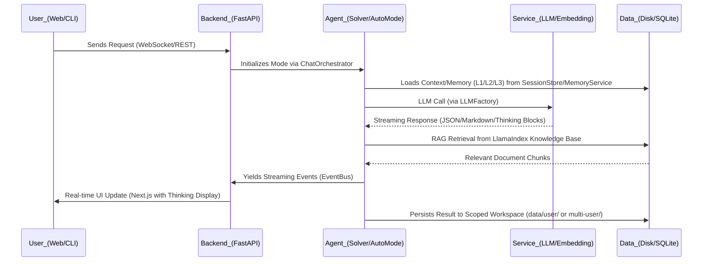

# 개요

관련 소스 파일

다음 파일들은 이 위키 페이지를 생성할 때 참고한 컨텍스트로 사용되었습니다:

- [.github/workflows/pypi-release.yml](.github/workflows/pypi-release.yml)
- [.gitignore](.gitignore)
- [README.md](README.md)
- [assets/README/README_AR.md](assets/README/README_AR.md)
- [assets/README/README_CN.md](assets/README/README_CN.md)
- [assets/README/README_ES.md](assets/README/README_ES.md)
- [assets/README/README_FR.md](assets/README/README_FR.md)
- [assets/README/README_HI.md](assets/README/README_HI.md)
- [assets/README/README_JA.md](assets/README/README_JA.md)
- [assets/README/README_PL.md](assets/README/README_PL.md)
- [assets/README/README_PT.md](assets/README/README_PT.md)
- [assets/README/README_RU.md](assets/README/README_RU.md)
- [assets/README/README_TH.md](assets/README/README_TH.md)
- [deeptutor/api/run_server.py](deeptutor/api/run_server.py)
- [deeptutor_cli/main.py](deeptutor_cli/main.py)
- [requirements.txt](requirements.txt)
- [requirements/dev.txt](requirements/dev.txt)
- [requirements/math-animator.txt](requirements/math-animator.txt)

## 목적과 범위

DeepTutor는 교육 자료를 상호작용적인 멀티모달 학습 여정으로 바꾸도록 설계된 **agent-native** AI 기반 개인화 학습 도우미입니다. 전통적인 챗봇과 달리 DeepTutor는 자율 에이전트 아키텍처를 사용해 심층 문제 해결, 다중 에이전트 조사, 대화형 책 생성, 지속형 튜터링 같은 전문화된 워크플로를 제공합니다. [README.md:5-19]()

이 시스템은 고수준 자연어 지시와 저수준 코드 실행, 도구 조작, 영속 메모리 시스템을 연결하는 모듈형 다층 아키텍처 위에 구축되어 있습니다. [README.md:107-108](), [README.md:117-121]()

---

## 고수준 아키텍처

DeepTutor는 사용자 표현 계층에서 시작해 영속 데이터 저장소까지 이어지는 다층 아키텍처를 구현합니다. 시스템의 핵심은 `ChatOrchestrator`로, 단일 대화 스레드 안에서 서로 다른 에이전트 모드(Solver, Researcher, Quiz, Book Engine 등) 사이의 전환을 관리합니다. [README.md:119-122]()

### 시스템 구성 요소 맵

다음 다이어그램은 논리적 시스템 구성 요소를 코드베이스의 구체적인 구현 경로에 대응시킵니다.

**Sources:** [README.md:47-50](), [README.md:107-114](), [README.md:119-122](), [README.md:126-128](), [deeptutor/api/run_server.py:1-10](), [deeptutor_cli/main.py:1-15]()

---

## 핵심 설계 원칙

### 1. Agent-Native 인터페이스
DeepTutor의 모든 기능은 웹 UI와 풍부한 CLI를 통해 접근할 수 있습니다. 이 시스템은 "Skills"를 일급 시민으로 취급하며, `SKILL.md` 파일을 제공하면 자율 에이전트가 시스템의 도구를 조작하고 작업 공간을 탐색할 수 있습니다. [README.md:127-128]()

### 2. 통합된 채팅 작업공간
DeepTutor는 서로 다른 모드 전반에 걸쳐 하나의 대화 스레드 컨텍스트를 유지합니다. 사용자는 "Chat"에서 대화를 시작한 뒤, 복잡한 수학 문제를 위해 "Deep Solve"로 전환하고, 개념을 시각화한 다음, "Deep Research"로 이동해 보고서를 생성할 수 있으며, 이 모든 과정에서 통합된 `Space` 컨텍스트를 통해 메시지 기록과 학습된 컨텍스트가 보존됩니다. [README.md:68](), [README.md:119-119]()

### 3. 3계층 메모리 워크벤치
이 시스템은 정교한 메모리 아키텍처를 구현합니다:
*   **L1 (Trace):** 즉시적인 상호작용 기록.
*   **L2 (Surface Summaries):** 기능별 요약.
*   **L3 (Cross-Surface Knowledge):** 전역 영속 학습자 프로필. [README.md:47-49](), [README.md:124-124]()

### 4. 숙달 경로 학습 엔진
DeepTutor에는 간격 반복과 정성적 게이트(예: Feynman 기법)를 사용해 진행 상황을 추적하는 특화된 학습 엔진이 포함되어 있습니다. 이 엔진은 최근성 가중 정확도를 바탕으로 숙달도를 계산하고, `SpacedRepetitionScheduler`를 통해 복습 작업을 관리합니다. [README.md:47-48]()

---

## 기술 구현: 코드에서 엔티티로의 매핑

다음 다이어그램은 **자연어 공간**(사용자 개념)과 **코드 엔티티 공간**(클래스/파일 이름)을 연결해 개발자가 저장소를 탐색하는 데 도움을 줍니다.

### 브리지: 에이전트 워크플로에서 코드 엔티티로

**Sources:** [README.md:47-50](), [README.md:107-114](), [README.md:119-122](), [README.md:126-128]()

---

## 주요 기능

| 기능 | 설명 |
| :--- | :--- |
| **Auto Mode** | 작업을 자동으로 하위 기능에 분배하는 3단계 에이전틱 기능 라우터(`ANALYZING`, `DELEGATING`, `SYNTHESIZING`). [README.md:47-51]() |
| **Smart Solver** | 정식 해법을 시도하기 전에 먼저 문제를 분석하고 조사하는 이중 루프 아키텍처. [README.md:119]() |
| **Deep Research** | Topic Planning, Web/Paper Gathering, Note-taking, 그리고 Markdown 보고서로의 Synthesis로 구성된 다중 에이전트 파이프라인. [README.md:119]() |
| **Book Engine** | 자료를 퀴즈, 플래시카드, 개념 그래프를 포함한 14가지 블록 유형의 대화형 페이지로 바꾸는 다중 에이전트 "living book" 컴파일러. [README.md:64](), [README.md:121]() |
| **TutorBot (Partners)** | 독립적인 작업공간, 메모리, 성격을 갖춘 지속형 자율 튜터로, 15개 이상의 메시징 채널(Telegram, Discord, Zulip)을 지원합니다. [README.md:51](), [README.md:126-128]() |
| **Mastery Path** | 하드 숙달 게이트, Feynman 기법 검증, 그리고 `/learning` 대시보드를 갖춘 안내형 학습 엔진. [README.md:47]() |
| **Vision Solver & Math Animator** | 기하/수학 문제의 비전 기반 분석과 Manim 기반 수학 애니메이션 생성. [README.md:47](), [README.md:82]() |
| **Visualization Agent** | 개념적 및 수학적 데이터를 렌더링하기 위한 Chart.js, Cytoscape, Mermaid를 사용하는 데이터 시각화 파이프라인. [README.md:60](), [README.md:74](), [README.md:78]() |
| **RAG System** | LlamaIndex 전용 리팩터링을 사용한 검색 증강 생성으로, Brave, Tavily, Serper 등 여러 검색 제공자를 지원합니다. [README.md:47-49](), [README.md:110]() |

**Sources:** [README.md:47-64](), [README.md:107-128]()

---

## 데이터 흐름과 영속성

모든 시스템 데이터는 기본적으로 로컬에 저장되어 프라이버시를 보장합니다. DeepTutor는 선택적인 **다중 사용자 모드**를 지원하며, `AUTH_ENABLED`와 `Grant` 시스템을 통해 격리된 사용자 작업공간, 관리 권한 부여, 인증 라우트를 제공합니다. [README.md:33](), [README.md:51](), [README.md:62](), [README.md:125]()

*   **지식 베이스**: 버전 관리되는 RAG 인덱스, 문서 추출물, 벡터 인덱스를 저장합니다. [README.md:49](), [README.md:74](), [README.md:123]()
*   **세션 관리**: 대화 턴, WebSocket 하트비트, 세션 스냅샷을 유지하는 영속 `SessionStore`(SQLite)를 통해 처리됩니다. [README.md:31](), [README.md:53](), [README.md:68]()
*   **메모리 워크벤치**: 시스템 전반에서 `MemoryService`를 통해 공유되는 영속 학습 진행도와 학습자 프로필을 위한 3계층 서브시스템(L1/L2/L3). [README.md:47-49](), [README.md:124]()

### 데이터 흐름 다이어그램

**Sources:** [README.md:31-53](), [README.md:107-114](), [README.md:119-128](), [deeptutor/api/run_server.py:1-20]()

---

## 다음 단계

시스템을 더 깊게 살펴보려면:
*   **설치**: 대화형 설정 안내는 [시작하기](2.-Getting-Started)를 참고하세요. [README.md:53]()
*   **설정**: 환경 변수와 LLM 설정은 [설정 가이드](2.2.-Configuration-Guide)를 참고하세요. [README.md:39]()
*   **배포**: 컨테이너 기반 설정은 [Docker 배포](2.1.-Docker-Deployment)를 참고하세요. [README.md:47]()
*   **CLI 참고**: 터미널로 에이전트, 세션, 지식 베이스를 관리하려면 [CLI 참고](9.-CLI-Reference)를 참고하세요. [README.md:127-128]()
