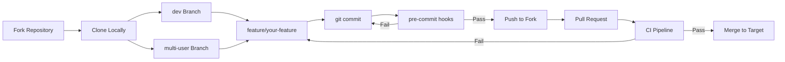
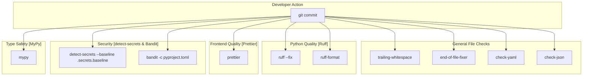
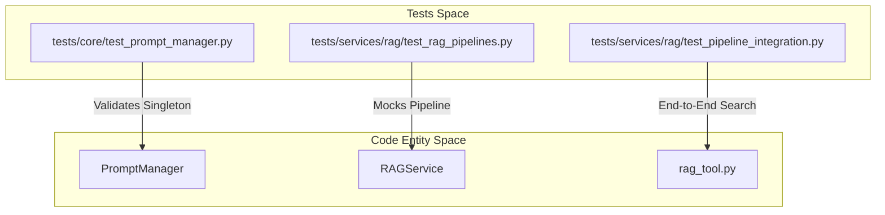

# 개발 가이드

관련 소스 파일

다음 파일들이 이 wiki 페이지를 생성할 때 맥락으로 사용되었습니다:

- [.gitattributes](.gitattributes)
- [.github/pull_request_template.md](.github/pull_request_template.md)
- [.pre-commit-config.yaml](.pre-commit-config.yaml)
- [.secrets.baseline](.secrets.baseline)
- [CONTRIBUTING.md](CONTRIBUTING.md)
- [Dockerfile](Dockerfile)
- [tests/core/__init__.py](tests/core/__init__.py)
- [tests/core/test_prompt_manager.py](tests/core/test_prompt_manager.py)
- [tests/services/rag/test_pipeline_integration.py](tests/services/rag/test_pipeline_integration.py)
- [tests/services/rag/test_rag_pipelines.py](tests/services/rag/test_rag_pipelines.py)
- [tests/services/rag/testfile.txt](tests/services/rag/testfile.txt)
- [web/app/(workspace)/page.tsx](web/app/(workspace)/page.tsx)

## 목적과 범위

이 문서는 DeepTutor 코드베이스에 기여하는 개발자를 위한 지침을 제공합니다. 개발 workflow, code quality 도구, 테스트 절차, CI/CD pipeline 설정을 다룹니다. 이는 상위 수준 개요이며, 자세한 지침은 하위 페이지인 [Contributing Guidelines](#10.1), [Code Quality Tools](#10.2), [Testing and CI/CD](#10.3)를 참조하세요.

---

## 개발 Workflow 개요

DeepTutor는 자동화된 품질 검사를 포함한 구조화된 개발 workflow를 강제합니다. 모든 기여는 `dev` 또는 `multi-user` branch를 대상으로 해야 합니다 [CONTRIBUTING.md:32-42](). 코드는 제출 전에 pre-commit 검증을 통과해야 합니다 [CONTRIBUTING.md:80-84]().

### Git Branch 전략

**Workflow: Development Branch Strategy**

| Target Branch | Purpose | PR Content |
|---------------|---------|------------|
| `dev` | 기본 개발 branch [CONTRIBUTING.md:59-60]() | 새 기능, 리팩터링, 일반 버그 수정 [CONTRIBUTING.md:46-51]() |
| `multi-user` | 실험적인 multi-tenant branch [CONTRIBUTING.md:39-39]() | session isolation, user management, permissions [CONTRIBUTING.md:53-58]() |

**Sources:** [CONTRIBUTING.md:32-61](), [.github/pull_request_template.md:1-40]()

---

## 코드 품질 도구

DeepTutor는 `.pre-commit-config.yaml`에 구성된 자동화 도구를 통해 코드 품질을 유지하기 위한 다층적 접근 방식을 사용합니다.

### Pre-commit Hook 아키텍처

다음 다이어그램은 상위 수준 품질 요구사항을 설정 파일에 정의된 구체적인 도구와 연결합니다.

**Workflow: Pre-commit Hook Execution Chain**

**Sources:** [.pre-commit-config.yaml:12-106](), [CONTRIBUTING.md:149-162]()

### Toolstack 요약

| Tool | Purpose | Configuration |
|------|---------|---------------|
| **Ruff** | Python linting 및 formatting [CONTRIBUTING.md:155-155]() | [.pre-commit-config.yaml:42-51]() |
| **Prettier** | Frontend(`web/`) 및 config formatting [CONTRIBUTING.md:156-156]() | [.pre-commit-config.yaml:55-61]() |
| **detect-secrets** | 하드코딩된 secret을 검사합니다 [CONTRIBUTING.md:157-157]() | [.pre-commit-config.yaml:66-73]() |
| **MyPy** | 정적 타입 검사 [CONTRIBUTING.md:160-160]() | [.pre-commit-config.yaml:97-106]() |
| **Bandit** | 보안 이슈 분석 [CONTRIBUTING.md:159-159]() | [.pre-commit-config.yaml:84-91]() |

구성 세부 사항과 `detect-secrets scan > .secrets.baseline`로 secrets baseline을 업데이트하는 방법은 [Code Quality Tools](#10.2)를 참조하세요 [CONTRIBUTING.md:134-134]().

---

## 테스트 인프라

DeepTutor는 core service, agent module, RAG pipeline을 포괄하는 테스트에 `pytest`를 사용합니다.

### 테스트 조직

테스트 suite는 시스템 아키텍처를 반영하도록 구성되어 있으며, 핵심 로직과 특화된 agent 동작이 독립적으로 검증되도록 합니다.

**매핑: Test Suite to Code Entity**

**Sources:** [tests/core/test_prompt_manager.py:8-30](), [tests/services/rag/test_rag_pipelines.py:9-12](), [tests/services/rag/test_pipeline_integration.py:202-207]()

### 테스트 실행

| Task | Command |
|------|---------|
| 일반 테스트 실행 | `pytest tests/` |
| RAG 통합 실행 | `python tests/services/rag/test_pipeline_integration.py --pipeline all` [tests/services/rag/test_pipeline_integration.py:13-14]() |
| Prompt Manager 테스트 | `pytest tests/core/test_prompt_manager.py` [tests/core/test_prompt_manager.py:1-189]() |

테스트 workflow와 coverage reporting에 대한 자세한 내용은 [Testing and CI/CD](#10.3)를 참조하세요.

---

## CI/CD Pipeline

DeepTutor는 cross-platform 호환성과 코드 무결성에 초점을 맞춰 GitHub Actions를 continuous integration에 사용합니다.

### CI 하이라이트
- **Docker Multi-Stage Builds**: production image는 `frontend-builder` stage [Dockerfile:23-23](), `python-base` stage [Dockerfile:63-63](), 최종 `production` stage [Dockerfile:103-103]()를 사용합니다.
- **Service Orchestration**: production 환경은 `supervisord`를 사용해 FastAPI backend(`start-backend.sh`)와 Next.js frontend(`start-frontend.sh`) 프로세스를 모두 관리합니다 [Dockerfile:187-208]().
- **Strict Linting**: 로컬 hook이 경고를 보여줄 수 있지만, CI는 엄격한 검사를 수행하고 실패한 PR을 거부합니다 [CONTRIBUTING.md:163-165]().
- **Security Baseline**: `.secrets.baseline`을 사용해 secret을 스캔하여 실수로 인한 credential 누출을 방지합니다 [.pre-commit-config.yaml:66-73]().
- **Cross-Platform Compatibility**: 중요한 빌드 파일과 스크립트는 `.gitattributes`를 통해 LF line ending을 사용하도록 강제됩니다 [.gitattributes:1-19]().

CI workflow의 전체 내역은 [Testing and CI/CD](#10.3)를 참조하세요.

**Sources:** [CONTRIBUTING.md:163-165](), [Dockerfile:1-208](), [.pre-commit-config.yaml:1-106](), [.gitattributes:1-19]()
