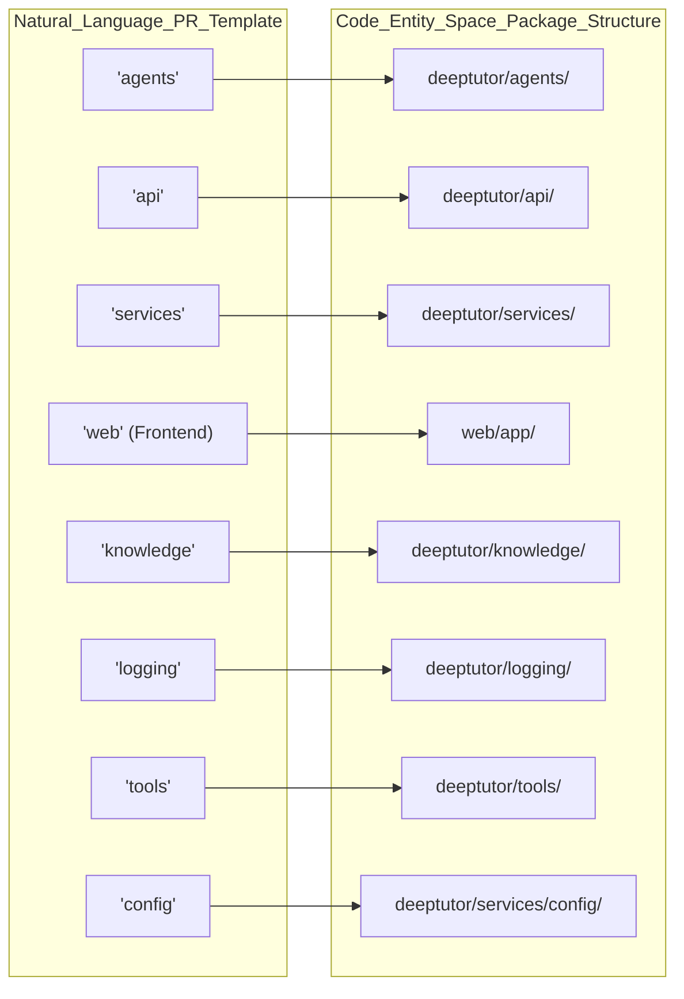
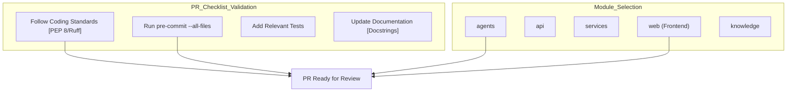

# 기여 가이드라인

<details>
<summary>관련 소스 파일</summary>

다음 파일들이 이 wiki 페이지를 생성할 때 맥락으로 사용되었습니다:

- [.gitattributes](.gitattributes)
- [.github/pull_request_template.md](.github/pull_request_template.md)
- [.secrets.baseline](.secrets.baseline)
- [CONTRIBUTING.md](CONTRIBUTING.md)
- [Dockerfile](Dockerfile)
- [web/app/(workspace)/page.tsx](web/app/(workspace)/page.tsx)

</details>


## 목적과 범위

이 문서는 DeepTutor 프로젝트의 기여 절차, git workflow, commit 규칙을 정의합니다. 모든 기여자가 견고한 지능형 학습 동반자를 유지하기 위해 따라야 하는 필수 branch 전략, pre-commit 요구사항, 커뮤니티 참여 채널을 설명합니다 [CONTRIBUTING.md:1-2]().

DeepTutor는 높은 수준의 코드 품질과 보안을 유지하기 위해 Ruff, Prettier, detect-secrets 등의 자동화 도구 모음을 사용합니다 [CONTRIBUTING.md:149-152](). 모든 기여는 코드베이스에 병합되기 전에 이러한 검사를 통과해야 합니다.

---

## Branch 전략

우리는 개발을 체계적으로 유지하기 위해 multi-branch 모델을 사용합니다 [CONTRIBUTING.md:32-34](). **`main`으로 직접 PR을 제출하지 마세요** [CONTRIBUTING.md:41-42]().

| Branch | Purpose | Stability |
|---|---|---|
| `dev` | 일반 개발(Default target) | 버그나 breaking change가 있을 수 있음 |
| `multi-user` | multi-user scenario 개발 | experimental, multi-tenant 기능 중심 |

새 기능, 리팩터링, API 변경, 일반 버그 수정은 **`dev`**를 대상으로 합니다 [CONTRIBUTING.md:46-51]().
session isolation, user management, 협업 workspace 기능은 **`multi-user`**를 대상으로 합니다 [CONTRIBUTING.md:53-58]().

### Git Workflow 다이어그램

```mermaid
graph TB
    ["Fork_Repository"] --> ["Clone_Fork_Locally"]
    ["Clone_Fork_Locally"] --> ["Checkout_dev_Branch"]
    ["Checkout_dev_Branch"] --> ["Pull_Latest_Changes"]
    ["Pull_Latest_Changes"] --> ["Create_Feature_Branch"]
    ["Create_Feature_Branch"] --> ["Make_Changes"]
    ["Make_Changes"] --> ["Run_Pre-commit_Checks"]
    ["Run_Pre-commit_Checks"] -->|Fails| ["Make_Changes"]
    ["Run_Pre-commit_Checks"] -->|Passes| ["Commit_Changes"]
    ["Commit_Changes"] --> ["Push_to_Fork"]
    ["Push_to_Fork"] --> ["Open_Pull_Request"]
    ["Open_Pull_Request"] --> ["CI_Pipeline_Runs"]
    ["CI_Pipeline_Runs"] -->|Fails| ["Make_Changes"]
    ["CI_Pipeline_Runs"] -->|Passes| ["Code_Review"]
    ["Code_Review"] -->|Changes_Requested| ["Make_Changes"]
    ["Code_Review"] -->|Approved| ["Merge_to_dev"]
```

**Workflow: Development Branch Strategy**

| Target Branch | Purpose | PR Content |
|---------------|---------|------------|
| `dev` | 기본 개발 branch [CONTRIBUTING.md:59-60]() | 새 기능, 리팩터링, 일반 버그 수정 [CONTRIBUTING.md:46-51]() |
| `multi-user` | 실험적인 multi-tenant branch [CONTRIBUTING.md:39-39]() | session isolation, user management, permissions [CONTRIBUTING.md:53-58]() |

**Sources**: [CONTRIBUTING.md:32-61](), [CONTRIBUTING.md:32-86](), [.github/pull_request_template.md:1-40]()

---

## 기여 절차

### 1단계: Fork 및 Clone

1. GitHub UI를 통해 저장소를 fork합니다.
2. fork를 로컬에 clone합니다: `git clone https://github.com/YOUR_USERNAME/DeepTutor.git`.

### 2단계: 개발 환경 설정

작업을 시작하기 전에 로컬 환경을 upstream 대상 branch와 동기화합니다 [CONTRIBUTING.md:67-71]().

```bash
# Sync with target branch
git checkout dev && git pull origin dev

# Create feature branch
git checkout -b feature/your-feature-name
```

### 3단계: Pre-commit Hook 설치

Pre-commit hook은 **필수**입니다. 이는 `.pre-commit-config.yaml`로 구성되며, 코드가 commit되기도 전에 품질 기준을 충족하도록 보장합니다 [CONTRIBUTING.md:114-128]().

```bash
# Create and activate virtual environment
python -m venv venv
source venv/bin/activate  # Windows: venv\Scripts\activate

# Install dependencies with development tools
pip install -e ".[all]"

# Install pre-commit tool and git hooks
pip install pre-commit
pre-commit install
```

**Sources**: [CONTRIBUTING.md:98-128]()

### 4단계: 변경 사항 작성 및 Commit

DeepTutor는 모든 Python function signature에 대한 **Type Hints**와 cross-platform 호환성을 위한 `pathlib.Path` 사용을 포함한 엄격한 코딩 표준을 강제합니다 [CONTRIBUTING.md:170-175, 215]().

```bash
# Stage changes
git add .

# Commit (hooks run automatically)
git commit -m "feat: add support for new embedding provider"

# If hooks fail, fix issues and retry.
# To run checks manually on all files:
pre-commit run --all-files
```

### 5단계: Push 및 Pull Request 생성

올바른 대상 branch(보통 `dev`)로 Pull Request를 제출합니다 [CONTRIBUTING.md:86](). 제공된 PR 템플릿을 사용하며, `agents`, `api`, `web` 같은 영향을 받는 module을 체크해야 합니다 [.github/pull_request_template.md:14-28]().

---

## Commit Message 규칙

DeepTutor는 깔끔한 history 유지를 위해 구조화된 commit 형식을 따릅니다 [CONTRIBUTING.md:184-190]().

### 형식
```
<type>: <short description>

[optional body]
```

### Commit Type
| Type | Description |
|---|---|
| `feat` | 새로운 기능(MINOR version bump) |
| `fix` | 버그 수정(PATCH version bump) |
| `docs` | 문서 전용 변경 |
| `style` | formatting, logic 변경 없음 |
| `refactor` | 코드 구조 변경, 새 기능이나 수정 없음 |
| `test` | 테스트 추가 또는 수정 |
| `chore` | 빌드 프로세스, tooling, dependency 업데이트 |

**Sources**: [CONTRIBUTING.md:192-201]()

---

## 코드 품질 및 보안 도구

높은 기준을 보장하기 위해 workflow에 다음 도구들이 통합되어 있습니다:

| Tool | Purpose | Source |
|---|---|---|
| **Ruff** | Python linting 및 formatting | [CONTRIBUTING.md:155]() |
| **Prettier** | Frontend 및 config file formatting | [CONTRIBUTING.md:156]() |
| **detect-secrets** | 하드코딩된 secret 검사 | [CONTRIBUTING.md:157]() |
| **pip-audit** | dependency 취약점 스캔 | [CONTRIBUTING.md:158]() |
| **Bandit** | 보안 이슈 분석 | [CONTRIBUTING.md:159]() |
| **MyPy** | 정적 타입 검사 | [CONTRIBUTING.md:160]() |
| **Interrogate** | docstring coverage 보고 | [CONTRIBUTING.md:161]() |

### Secret 관리
테스트의 mock API key처럼 false positive secret을 만나면 baseline 파일을 업데이트합니다 [CONTRIBUTING.md:129-135](). `.secrets.baseline` 파일은 `OpenAIDetector`나 `JwtTokenDetector` 같은 민감 정보 탐지용 다양한 plugin을 사용합니다 [.secrets.baseline:46-59]().

```bash
detect-secrets scan > .secrets.baseline
```

**Sources**: [CONTRIBUTING.md:129-135](), [.secrets.baseline:1-88]()

---

## 보안 모범 사례

기여자는 다음 보안 표준을 준수해야 합니다:

*   **File Uploads**: 일반 파일은 최대 100 MB, PDF는 최대 50 MB로 제한합니다. extension + MIME type + content sanitization의 다층 검증이 필요합니다 [CONTRIBUTING.md:208-210]().
*   **Pathing**: cross-platform 호환성과 path traversal 방지를 위해 `pathlib.Path`를 사용합니다 [CONTRIBUTING.md:211, 215]().
*   **Subprocesses**: command injection 방지를 위해 항상 `shell=False`를 사용합니다 [CONTRIBUTING.md:214]().
*   **Line Endings**: Docker container에서 CRLF 관련 문제를 방지하기 위해 `Dockerfile`, `.sh`, `.py` 같은 중요한 파일은 `.gitattributes`를 통해 LF(Unix) line ending을 강제합니다 [.gitattributes:3-18]().

**Sources**: [CONTRIBUTING.md:205-218](), [.gitattributes:1-19]()

---

## 커뮤니티 참여

토론과 지원을 위해 커뮤니티에 참여하세요:

*   **Discord**: [Join Community](https://discord.gg/eRsjPgMU4t) [CONTRIBUTING.md:6]()
*   **WeChat**: [Join Group (Issue #78)](https://github.com/HKUDS/DeepTutor/issues/78) [CONTRIBUTING.md:7]()
*   **Feishu**: [Join Group (See Communication.md)](./Communication.md) [CONTRIBUTING.md:8]()

---

## Pull Request 템플릿 구조

PR을 열 때는 템플릿 [.github/pull_request_template.md:30-36]()에 따라 다음 체크리스트가 완료되었는지 확인합니다.

### PR 체크리스트와 Module 매핑

이 다이어그램은 PR 템플릿의 자연어 카테고리를 코드베이스의 특정 디렉터리와 연결합니다.



### PR 수명 주기 흐름



**Sources**: [.github/pull_request_template.md:14-36](), [CONTRIBUTING.md:150-161]()
