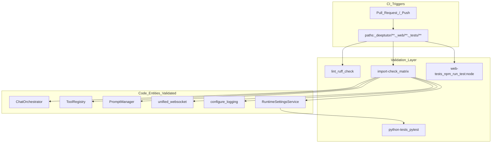
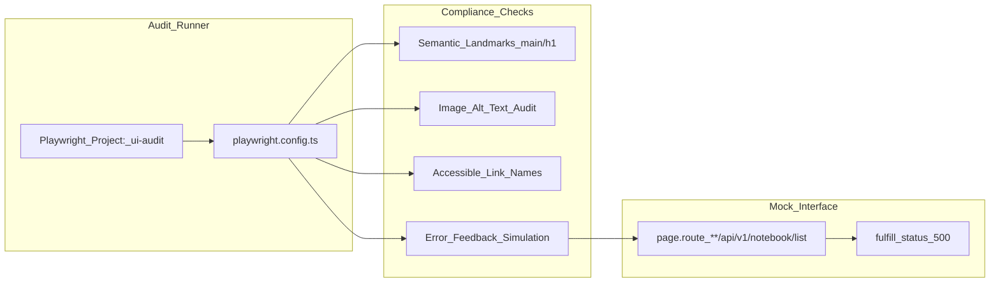

# 테스트 및 CI/CD

관련 소스 파일

다음 파일들이 이 wiki 페이지를 생성할 때 맥락으로 사용되었습니다:

- [.github/workflows/docker-release.yml](.github/workflows/docker-release.yml)
- [.github/workflows/tests.yml](.github/workflows/tests.yml)
- [web/eslint.config.mjs](web/eslint.config.mjs)
- [web/next-env.d.ts](web/next-env.d.ts)
- [web/next.config.js](web/next.config.js)
- [web/package-lock.json](web/package-lock.json)
- [web/package.json](web/package.json)
- [web/playwright.config.ts](web/playwright.config.ts)
- [web/tests/e2e/compliance-and-ux.audit.ts](web/tests/e2e/compliance-and-ux.audit.ts)
- [web/tsconfig.json](web/tsconfig.json)

## 목적과 범위

이 문서는 DeepTutor의 자동화된 테스트 인프라와 continuous integration(CI) pipeline을 설명합니다. 코드 품질을 강제하고, multi-Python-version matrix 전반에서 테스트 suite를 실행하며, 중요한 module import 검증을 수행하는 GitHub Actions workflow를 다룹니다. 이 시스템은 agent-native 아키텍처가 핵심 `deeptutor` package, `deeptutor_cli`, Next.js frontend 업데이트 전반에서 안정적으로 유지되도록 설계되었습니다.

---

## 테스트 인프라 개요

DeepTutor는 전체 스택을 검증하기 위해 Python과 Node.js 테스트 도구를 함께 사용합니다. Python 로직은 주로 **pytest**로 테스트되며, frontend는 UI 감사와 compliance 검사를 위해 **Playwright**를 사용합니다.

| Component | Tooling | Purpose |
|-----------|----------|---------|
| **Backend Unit/Integration** | `pytest` | 핵심 로직, agent module, learning service를 검증합니다 [[.github/workflows/tests.yml:178]](). |
| **Import Validation** | `python -c` | Python version 전반에서 순환 의존성 없이 중요한 module이 부팅되는지 확인합니다 [[.github/workflows/tests.yml:114-123]](). |
| **Linting & Formatting** | `ruff` | Python 코드 스타일과 정적 분석을 강제합니다 [[.github/workflows/tests.yml:50-54]](). |
| **Frontend Node Tests** | `npm run test:node` | frontend 로직과 utility function에 대한 단위 테스트 [[web/package.json:11]](). |
| **UI & Compliance Audit** | `playwright` | 접근성, semantic landmark, UX signal 검증 [[web/package.json:18]](), [[web/tests/e2e/compliance-and-ux.audit.ts:23-24]](). |
| **Internationalization** | `i18n-audit` | 번역 정합성을 보장하고 literal UI text를 탐지 [[web/package.json:14-17]](), [[web/eslint.config.mjs:12-14]](). |

**Sources:** [[.github/workflows/tests.yml:45-54]](), [web/package.json:11-20](), [[web/tests/e2e/compliance-and-ux.audit.ts:1-5]]()

## GitHub Actions Workflow

### Tests Workflow (`tests.yml`)

주요 테스트 workflow는 `deeptutor/`, `deeptutor_cli/`, `tests/`, `requirements/`, `web/`의 관련 파일이 수정될 때 `main`과 `dev` branch로의 push 및 pull request에서 트리거됩니다 [[.github/workflows/tests.yml:3-29]]().

#### Job: `lint`
Python 3.11을 사용해 전체 repository에 `ruff check`와 `ruff format --check`를 실행합니다 [[.github/workflows/tests.yml:32-54]]().

#### Job: `web-tests`
Node.js 22를 설정하고 frontend 전용 테스트를 실행합니다 [[.github/workflows/tests.yml:56-77]](). 여기에는 frontend 설정에 정의된 `test:node` script가 포함됩니다 [[web/package.json:11]]().

#### Job: `import-check`
Python 3.11, 3.12, 3.13(3.14는 experimental)의 matrix 전략을 사용합니다 [[.github/workflows/tests.yml:79-91]](). `requirements/server.txt`를 설치하고 핵심 클래스를 import하여 runtime environment가 유효한지 확인합니다 [[.github/workflows/tests.yml:110-123]]().

**Import Check Entities:**
- `ChatOrchestrator` (`deeptutor.runtime.orchestrator`) [[.github/workflows/tests.yml:117]]().
- `get_tool_registry` (`deeptutor.runtime.registry.tool_registry`) [[.github/workflows/tests.yml:118]]().
- `get_capability_registry` (`deeptutor.runtime.registry.capability_registry`) [[.github/workflows/tests.yml:119]]().
- `RuntimeSettingsService` (`deeptutor.services.config.runtime_settings`) [[.github/workflows/tests.yml:120]]().
- `unified_websocket` (`deeptutor.api.routers.unified_ws`) [[.github/workflows/tests.yml:121]]().
- `PromptManager` (`deeptutor.services.prompt.manager`) [[.github/workflows/tests.yml:122]]().
- `configure_logging` (`deeptutor.logging`) [[.github/workflows/tests.yml:123]]().

#### Job: `python-tests`
`import-check`에 의존합니다 [[.github/workflows/tests.yml:130]](). `data/user/settings/main.yaml`에 최소 runtime configuration을 생성하고 [[.github/workflows/tests.yml:165-173]](), `tests/` 디렉터리와 `deeptutor/learning/tests` 전반에 `pytest`를 실행합니다 [[.github/workflows/tests.yml:178]]().

**Sources:** [[.github/workflows/tests.yml:31-181]]()

---

## 프런트엔드 Compliance 및 UX 감사

DeepTutor는 자동화된 접근성 및 compliance 감사를 수행하기 위해 **Playwright**를 사용합니다. 이 테스트는 `web/tests/e2e/compliance-and-ux.audit.ts`에 있으며 semantic integrity에 초점을 맞춥니다 [[web/tests/e2e/compliance-and-ux.audit.ts:1-4]]().

### 주요 감사 지표
*   **Semantic Landmarks:** `<main>`과 `<h1>` 태그의 존재를 검증합니다 [[web/tests/e2e/compliance-and-ux.audit.ts:24-32]]().
*   **Accessibility:** 모든 `` 태그의 `alt` text와 `<a>` 링크의 접근 가능한 이름(aria-label/title)을 확인합니다 [[web/tests/e2e/compliance-and-ux.audit.ts:34-67]]().
*   **Responsive Design:** `viewport` meta tag의 존재를 검증합니다 [[web/tests/e2e/compliance-and-ux.audit.ts:69-73]]().
*   **Error Handling:** backend 실패(예: `/api/v1/notebook/list`의 500 상태)를 시뮬레이션하여 UI가 `[role="alert"]` 또는 empty state indicator를 통해 사용자 친화적 피드백을 표시하는지 확인합니다 [[web/tests/e2e/compliance-and-ux.audit.ts:77-99]]().

**Sources:** [[web/tests/e2e/compliance-and-ux.audit.ts:23-100]](), [[web/package.json:18-20]]()

---

## Docker Release Pipeline

`docker-release.yml` workflow는 GitHub Release가 게시될 때 production-ready image 생성을 자동화합니다 [[.github/workflows/docker-release.yml:1-15]]().

*   **Multi-Platform Support:** QEMU와 Buildx를 사용해 `linux/amd64`와 `linux/arm64`를 빌드합니다 [[.github/workflows/docker-release.yml:31-63]]().
*   **Layer Caching:** `type=gha`와 `mode=max`를 사용해 frontend builder와 Python base image 같은 비용이 큰 중간 layer를 캐시합니다 [[.github/workflows/docker-release.yml:69-70]]().
*   **Output Optimization:** Next.js build는 `output: "standalone"`을 사용해 필요한 `node_modules`만 포함시켜 image 크기를 최소화합니다 [[web/next.config.js:89]]().

**Sources:** [[.github/workflows/docker-release.yml:22-71]](), [[web/next.config.js:87-89]]()

---

## CI/CD Pipeline 흐름

다음 다이어그램은 자연어 요구사항을 CI lifecycle 동안 이를 처리하는 구체적인 코드 엔터티와 연결합니다.

Title: DeepTutor CI Pipeline and Entity Mapping

Title: Frontend Compliance Audit Logic

**Sources:** [[.github/workflows/tests.yml:1-185]](), [[web/playwright.config.ts:9-27]](), [[web/tests/e2e/compliance-and-ux.audit.ts:23-100]](), [[web/package.json:5-20]]()
