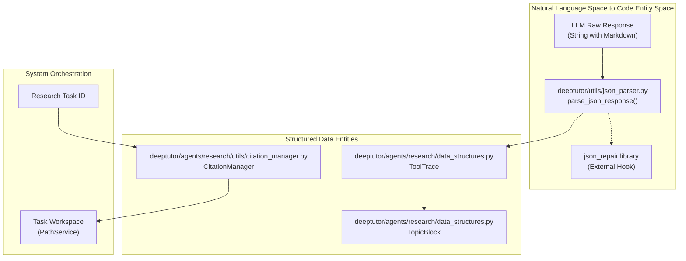
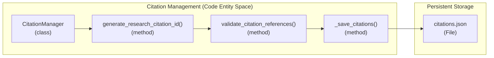

# 유틸리티와 헬퍼

관련 소스 파일

이 위키 페이지를 생성할 때 참고한 파일은 다음과 같습니다:

- [deeptutor/agents/research/data_structures.py](deeptutor/agents/research/data_structures.py)
- [deeptutor/agents/research/utils/citation_manager.py](deeptutor/agents/research/utils/citation_manager.py)
- [deeptutor/utils/json_parser.py](deeptutor/utils/json_parser.py)

## 목적과 범위

이 페이지는 DeepTutor 코드베이스 전반에서 사용되는 공통 유틸리티 함수와 헬퍼 모듈의 개요를 제공합니다. 이 유틸리티들은 LLM 출력에서의 견고한 JSON 파싱, 다양한 LLM 제공자를 위한 URL 정리, RAG 시스템을 위한 문서 검증/추출, 통합 로깅 인프라 같은 횡단 관심사를 처리합니다. 이러한 헬퍼는 원시 LLM 출력과 에이전트 오케스트레이션 계층이 필요로 하는 구조화된 데이터 사이의 간극을 메웁니다.

**상세 범위:**
- **[JSON 유틸리티](#11.1)**: LLM 출력에서의 견고한 JSON 추출 및 파싱 유틸리티.
- **[URL 정리 및 서버 감지](#11.2)**: URL 정리, 로컬 서버 감지, API 호환성 유틸리티.
- **[로깅 인프라](#11.3)**: 콘솔, 파일, WebSocket 핸들러를 갖춘 통합 로깅 시스템.

Sources: [deeptutor/utils/json_parser.py:1-10](), [deeptutor/agents/research/utils/citation_manager.py:1-5]()

---

## 유틸리티 모듈 아키텍처

**유틸리티 상호작용 흐름**

이 다이어그램은 유틸리티 모듈이 비구조화된 입력을 구조화된 데이터로 변환하는 방식을 보여줍니다. `parse_json_response` 함수 [deeptutor/utils/json_parser.py:34-38]()는 LLM 통신의 주요 관문 역할을 하며, JSON을 추출하고 수정하기 위해 3단계 전략을 구현합니다. Research 모듈에서는 `CitationManager` [deeptutor/agents/research/utils/citation_manager.py:18-19]()가 `CIT-X-XX` [deeptutor/agents/research/utils/citation_manager.py:84-84]() 및 `PLAN-XX` [deeptutor/agents/research/utils/citation_manager.py:58-58]() 같은 증거 ID의 수명을 관리합니다. 컨텍스트 초과를 방지하기 위해 `ToolTrace`는 JSON 유효성을 유지하면서 `DEFAULT_RAW_ANSWER_MAX_SIZE` 50KB [deeptutor/agents/research/data_structures.py:63-63]()를 준수하는 지능형 잘라내기 [deeptutor/agents/research/data_structures.py:95-105]()를 구현합니다.

Sources: [deeptutor/utils/json_parser.py:34-106](), [deeptutor/agents/research/utils/citation_manager.py:18-47](), [deeptutor/agents/research/data_structures.py:63-133]()

---

## JSON 처리 유틸리티

DeepTutor는 LLM 출력을 다루기 위해 특별히 설계된 견고한 JSON 추출 유틸리티를 제공합니다. LLM 출력은 종종 자연어 또는 Markdown 코드 블록 안에 JSON이 포함된 형태이기 때문입니다. 자세한 내용은 [JSON 유틸리티](#11.1)를 참고하세요.

### 핵심 함수
- `parse_json_response()`: 3단계 파싱 전략을 구현합니다. 정규식을 통한 Markdown 추출 [deeptutor/utils/json_parser.py:75-79](), 직접 파싱 [deeptutor/utils/json_parser.py:82-83](), 그리고 가능하다면 `json-repair`를 통한 자동 복구 [deeptutor/utils/json_parser.py:93-98]()가 그 순서입니다.
- `safe_json_loads()`: 실패 시 런타임 크래시를 방지하기 위해 대체 값(기본값은 `{}`)을 반환하는 `json.loads`의 간단한 래퍼입니다 [deeptutor/utils/json_parser.py:108-125]().
- `_truncate_raw_answer()`: `ToolTrace` 내부의 특수 메서드로, 잘못된 JSON을 잘라내기 전에 먼저 파싱을 시도하여 `answer`, `content`, `chunks` 같은 핵심 필드를 보존하면서 `[truncated]` 표시를 추가합니다 [deeptutor/agents/research/data_structures.py:110-121]().

### Research 데이터 통합
`ToolTrace` 클래스는 `parse_json_response`를 사용해 도구 출력을 지능적으로 잘라내면서도 유효한 JSON 구조를 유지합니다 [deeptutor/agents/research/data_structures.py:110-111](). 이를 통해 Research 에이전트의 추적 기록 [deeptutor/agents/research/data_structures.py:67-70]()이 보고에 사용되는 데이터 스키마를 깨뜨리지 않으면서도 컨텍스트 창 한도 내에 머물 수 있습니다.

Sources: [deeptutor/utils/json_parser.py:34-126](), [deeptutor/agents/research/data_structures.py:63-133]()

---

## URL 및 서버 유틸리티

이 시스템에는 로컬과 원격 LLM 제공자 간의 복잡성 및 API 엔드포인트 정리를 관리하는 헬퍼가 포함되어 있습니다. 자세한 내용은 [URL 정리 및 서버 감지](#11.2)를 참고하세요.

### URL 처리
유틸리티는 `base_url` 문자열이 특정 제공자에 맞게 올바르게 형식화되도록 보장하고, 시스템이 Docker와 같은 제한된 환경에서 실행 중인지 감지하여 로컬 네트워킹 주소를 조정합니다. 이는 `localhost`가 호스트가 아니라 컨테이너를 가리킬 수 있는 로컬 Ollama 또는 vLLM 인스턴스에 연결할 때 중요합니다.

---

## 로깅 및 추적 인프라

DeepTutor는 모든 모듈에 걸친 활동을 기록하는 통합 로깅 시스템을 유지합니다. 이는 복잡한 다중 에이전트 상호작용을 추적하는 데 중요합니다. 자세한 내용은 [로깅 인프라](#11.3)를 참고하세요.

### Research 추적과 인용
`CitationManager`는 Research 수명 주기 전반에 걸쳐 증거를 추적하는 구조화된 방법을 제공하며, 계획(`PLAN-XX`)과 Research(`CIT-X-XX`) 단계에 대한 고유 ID를 생성합니다 [deeptutor/agents/research/utils/citation_manager.py:50-84](). 또한 `PathService`가 제공하는 작업 공간 [deeptutor/agents/research/utils/citation_manager.py:31-31]() 안의 `citations.json` 파일 [deeptutor/agents/research/utils/citation_manager.py:35-35]()에 이를 저장합니다.

**인용 관리 흐름**

`CitationManager`는 에이전트가 생성한 인용이 유효하고 Research 캐시에 실제로 존재하도록 보장합니다 [deeptutor/agents/research/utils/citation_manager.py:175-189](). 이를 통해 시스템은 `ToolTrace` 객체 [deeptutor/agents/research/data_structures.py:67-81]()에 저장된 원시 도구 출력과 LLM이 생성한 보고서를 상호 참조할 수 있습니다. 이 매니저는 `asyncio.Lock` [deeptutor/agents/research/utils/citation_manager.py:46-46]()을 통해 병렬 Research 수행 중에도 스레드 안전성을 유지하며, 여러 하위 주제를 동시에 조사할 때 이는 필수적입니다.

Sources: [deeptutor/agents/research/utils/citation_manager.py:18-189](), [deeptutor/agents/research/data_structures.py:67-81](), [deeptutor/utils/json_parser.py:29-30]()
