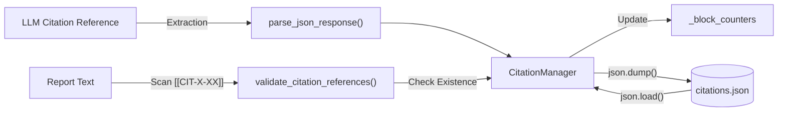

# JSON 유틸리티

<details>
<summary>관련 소스 파일</summary>

다음 파일들은 이 위키 페이지를 생성할 때 참고한 컨텍스트입니다:

- [deeptutor/agents/research/data_structures.py](deeptutor/agents/research/data_structures.py)
- [deeptutor/agents/research/utils/citation_manager.py](deeptutor/agents/research/utils/citation_manager.py)
- [deeptutor/utils/json_parser.py](deeptutor/utils/json_parser.py)

</details>


## 목적과 범위

JSON Utilities 모듈은 LLM 출력에 포함된 JSON 데이터를 다루기 위해 특별히 설계된 견고한 파싱 및 추출 함수를 제공합니다. 대규모 언어 모델은 종종 마크다운 코드 블록으로 감싸진 JSON 응답을 생성하거나, 설명 텍스트와 JSON을 섞어 내보내거나, 표준 JSON 구문을 위반하는 형식 오류를 포함합니다. 이 모듈은 다양한 텍스트 형식에서 JSON을 정제하고 파싱하는 다단계 추출 파이프라인을 구현하며, 잘못된 구조를 자동으로 복구하는 기능도 포함합니다.

이 페이지는 `deeptutor/utils/json_parser.py`의 유틸리티를 문서화합니다. 이 유틸리티는 시스템 동작의 기초가 되며, **Deep Research** 모듈의 citation 관리 [deeptutor/agents/research/utils/citation_manager.py:15-15](), 핵심 데이터 구조 축소 [deeptutor/agents/research/data_structures.py:16-16](), 일반적인 에이전트 응답 처리에 사용됩니다.

---

## 핵심 파싱 로직

시스템은 JSON 파싱에 계층적 전략을 사용하며, 주로 `parse_json_response`에 구현되어 있습니다. 이 함수는 "agent-safe"하도록 설계되었으며, LLM이 흔히 만드는 형식상의 특이점을 처리할 수 있어야 합니다.

### 3단계 파싱 전략

`parse_json_response` 함수 [deeptutor/utils/json_parser.py:34-105]()는 다음 실행 경로를 따릅니다:

1.  **Markdown 추출**: 문자열에 ` ``` `가 포함되어 있으면 정규식 `r"```(?:json)?\s*\n?(.*?)```"`을 사용해 첫 번째 코드 블록의 내용을 분리합니다 [deeptutor/utils/json_parser.py:75-80]().
2.  **직접 파싱**: 추출한 문자열(또는 원본 문자열)에 대해 표준 `json.loads()`를 시도합니다 [deeptutor/utils/json_parser.py:82-85]().
3.  **자동 복구**: 직접 파싱에 실패하면 `json-repair` 라이브러리(`repair_json` 훅 경유)를 사용해 trailing comma, 누락된 따옴표, 이스케이프되지 않은 문자 같은 흔한 문제를 수정합니다 [deeptutor/utils/json_parser.py:88-98]().

**출처:** [deeptutor/utils/json_parser.py:17-105]()

### 추출 흐름도

> **그림 1: 견고한 JSON 파싱 흐름**
> 이 다이어그램은 `parse_json_response` 내부의 로직을 보여주며, "Natural Language Space" (LLM 텍스트)에서 "Code Entity Space" (Python dict/list)로의 전환을 설명합니다.

```mermaid
flowchart TD
    Input["Input: Raw LLM String"]
    CheckEmpty{"Is Empty?"}
    Markdown{"Contains ```?"}
    ExtractMD["Extract via Regex<br/>'re.search(r\"```(?:json)?...\", response)'"]
    
    TryDirect["Strategy 1: json.loads()"]
    CheckDirect{"Success?"}
    
    TryRepair["Strategy 2: repair_json()"]
    CheckRepair{"Success?"}
    
    ReturnVal["Return: Parsed Object"]
    ReturnFallback["Return: Fallback (default {})"]

    Input --> CheckEmpty
    CheckEmpty -->|Yes| ReturnFallback
    CheckEmpty -->|No| Markdown
    
    Markdown -->|Yes| ExtractMD
    Markdown -->|No| TryDirect
    ExtractMD --> TryDirect
    
    TryDirect --> CheckDirect
    CheckDirect -->|Yes| ReturnVal
    CheckDirect -->|No| TryRepair
    
    TryRepair --> CheckRepair
    CheckRepair -->|Yes| ReturnVal
    CheckRepair -->|No| ReturnFallback
```

**출처:** [deeptutor/utils/json_parser.py:34-105]()

---

## 지능형 절단

연구 도구 추적 같은 대규모 데이터를 다룰 때, 시스템은 JSON 객체가 크기 제한을 넘지 않으면서도 유효하고 파싱 가능해야 합니다. `ToolTrace` 클래스 [deeptutor/agents/research/data_structures.py:67-81]()는 지능형 절단을 구현합니다.

### 절단 메커니즘

`_truncate_raw_answer` 메서드 [deeptutor/agents/research/data_structures.py:94-133]()는 대량의 도구 출력으로 인한 메모리 초과를 방지합니다(기본 제한: 50KB) [deeptutor/agents/research/data_structures.py:63-63]():

1.  **JSON 인식**: 먼저 `parse_json_response`를 사용해 문자열을 Python 객체로 파싱하려고 시도합니다 [deeptutor/agents/research/data_structures.py:110-110]().
2.  **필드별 가지치기**: `answer`, `content`, `text`, `chunks`, `documents` 같은 특정 필드를 대상으로 합니다. 이 필드들이 문자열이면 잘라내고 [deeptutor/agents/research/data_structures.py:115-116](), 리스트이면 앞의 3개 항목만 남깁니다 [deeptutor/agents/research/data_structures.py:118-120]().
3.  **구조 보존**: Python 객체를 가지친 뒤 다시 JSON으로 직렬화하려고 시도합니다 [deeptutor/agents/research/data_structures.py:123-125]().
4.  **폴백**: JSON 파싱에 실패하거나 객체가 여전히 너무 크면, 원래 크기를 포함한 설명 마커와 함께 강제 문자열 절단을 수행합니다 [deeptutor/agents/research/data_structures.py:130-133]().

**출처:** [deeptutor/agents/research/data_structures.py:63-133](), [deeptutor/agents/research/data_structures.py:170-185]()

---

## 연구 컨텍스트에서의 데이터 흐름

JSON 유틸리티는 `CitationManager`가 연구 진행 상황을 저장하고 생성된 텍스트 안의 citation 참조를 검증할 때 매우 중요합니다.

> **그림 2: Citation 관리 데이터 흐름**
> "Code Entity Space" (Citation 객체)와 "Storage Space" (JSON 파일)를 연결합니다.



**출처:** [deeptutor/agents/research/utils/citation_manager.py:113-171](), [deeptutor/agents/research/utils/citation_manager.py:15-15](), [deeptutor/agents/research/utils/citation_manager.py:175-200]()

---

## 유틸리티 함수 요약

| 함수 | 위치 | 목적 |
| :--- | :--- | :--- |
| `parse_json_response` | `deeptutor/utils/json_parser.py` | LLM JSON 추출의 주요 진입점이며 복구 로직을 포함합니다 [deeptutor/utils/json_parser.py:34](). |
| `safe_json_loads` | `deeptutor/utils/json_parser.py` | 오류 발생 시 폴백을 반환하는 `json.loads`의 간단한 래퍼입니다 [deeptutor/utils/json_parser.py:108](). |
| `_truncate_raw_answer` | `deeptutor/agents/research/data_structures.py` | 유효성을 유지하면서 JSON 구조를 잘라냅니다 [deeptutor/agents/research/data_structures.py:94](). |

### 오류 처리와 폴백

이 유틸리티는 복원력을 염두에 두고 설계되었습니다:
*   `parse_json_response`는 모든 파싱 및 복구 전략이 실패하면 기본적으로 빈 딕셔너리 `{}`를 반환합니다 [deeptutor/utils/json_parser.py:65-66]().
*   `safe_json_loads`는 사용자 지정 폴백을 허용하고, `JSONDecodeError`가 발생하면 경고를 기록합니다 [deeptutor/utils/json_parser.py:123-126]().
*   `repair_json` 훅은 동적으로 로드되므로, `json-repair` 라이브러리가 없어도 시스템이 계속 동작합니다 [deeptutor/utils/json_parser.py:19-27]().

**출처:** [deeptutor/utils/json_parser.py:19-126](), [deeptutor/agents/research/data_structures.py:110-133]()
