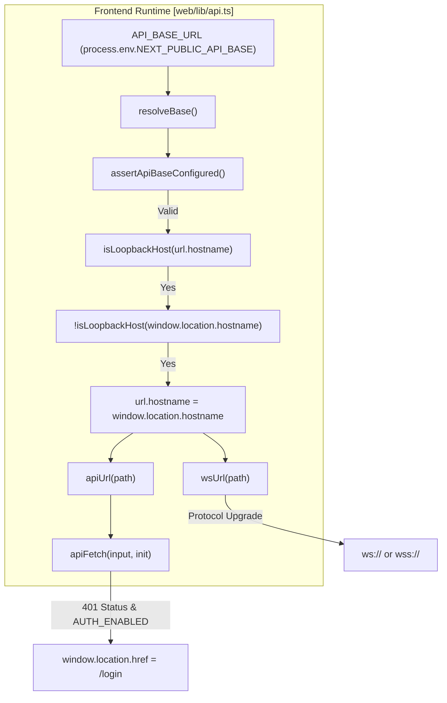
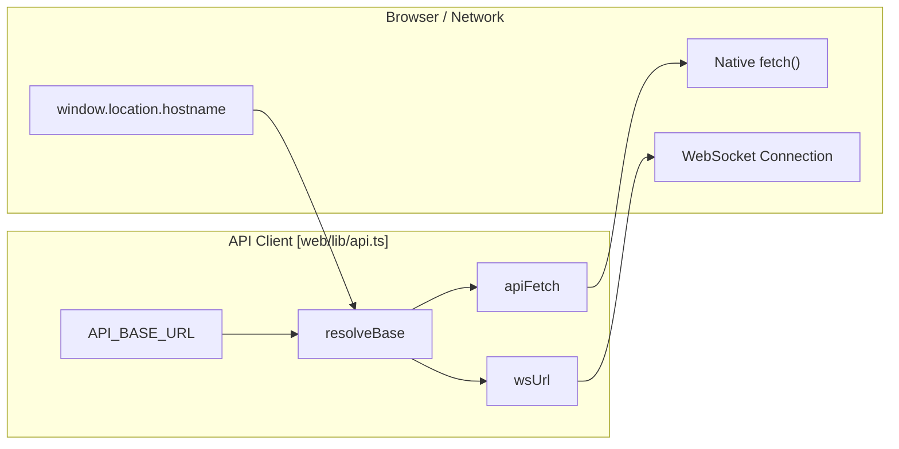

# URL 정리 및 서버 감지

관련 소스 파일

이 위키 페이지를 생성할 때 컨텍스트로 사용된 파일은 다음과 같습니다:

- [tests/api/test_unified_ws_turn_runtime.py](tests/api/test_unified_ws_turn_runtime.py)
- [tests/services/memory/test_meta_settings.py](tests/services/memory/test_meta_settings.py)
- [tests/services/session/test_regenerate.py](tests/services/session/test_regenerate.py)
- [tests/services/session/test_turn_runtime_subscribe.py](tests/services/session/test_turn_runtime_subscribe.py)
- [tests/services/test_path_service.py](tests/services/test_path_service.py)
- [web/lib/api.ts](web/lib/api.ts)
- [web/proxy.ts](web/proxy.ts)
- [web/tests/api-resolve-base.test.ts](web/tests/api-resolve-base.test.ts)

## 목적과 범위

이 문서는 DeepTutor가 다양한 LLM 제공자, 검색 엔진, 프런트엔드 서비스와 안정적으로 통신할 수 있도록 해주는 URL 정리, 로컬 서버 감지, API 엔드포인트 정규화 유틸리티를 설명합니다. 이러한 유틸리티는 교차 기기 LAN 접근을 돕기 위한 로컬 루프백 주소의 자동 감지, 보안 WebSocket 프로토콜 강제 적용, 그리고 인증된 fetch 요청 관리를 처리합니다. 이를 통해 시스템이 로컬 개발 환경, Docker 컨테이너, 또는 프로덕션 리버스 프록시에서 실행되더라도 네트워크 요청이 의도한 대상에 도달하도록 보장합니다.

**Sources:** [web/lib/api.ts:1-21]()

---

## 런타임 API Base 해석

DeepTutor는 LAN 환경에서의 "Localhost Problem"을 해결하기 위해 API base URL에 대해 동적 해석 전략을 사용합니다.

### 루프백 호스트 감지 및 교체
프런트엔드가 빌드될 때 `NEXT_PUBLIC_API_BASE`는 일반적으로 `http://localhost:<port>`로 설정됩니다. 사용자가 네트워크의 다른 기기에서 프런트엔드에 접근하면, "localhost"는 서버가 아니라 *사용자 자신의* 기기를 가리키게 되어 잘못된 대상이 됩니다.

`web/lib/api.ts`의 `resolveBase` 함수는 설정된 API 호스트가 루프백 주소(`127.0.0.1`, `localhost`, `0.0.0.0`, `::1`, `[::1]`)인지, 그리고 브라우저의 현재 `window.location.hostname`이 원격 주소인지 확인해 이를 감지합니다. 감지되면 호스트명을 자동으로 교체하여 프런트엔드가 백엔드에 도달할 수 있도록 합니다.

**Sources:** [web/lib/api.ts:46-52](), [web/lib/api.ts:73-90]()

### 플레이스홀더 감지
이 시스템은 Docker 빌드 중에 특정 토큰 `NEXT_PUBLIC_API_BASE_PLACEHOLDER`를 사용합니다 [web/lib/api.ts:10-10](). `isApiBasePlaceholder` 함수는 시작 시 이 토큰이 런처에 의해 성공적으로 치환되었는지 식별합니다 [web/lib/api.ts:19-21](). 치환에 실패하면 `assertApiBaseConfigured` 함수가 콘솔 오류를 발생시키고 예외를 던져서 조용한 실패를 막습니다 [web/lib/api.ts:23-41]().

**Sources:** [web/lib/api.ts:10-21](), [web/lib/api.ts:23-41]()

### URL 구성 유틸리티
이 시스템은 REST와 WebSocket용 전체 URL을 구성하는 헬퍼를 제공하며, 일관된 경로 결합과 프로토콜 선택을 보장합니다.

| Function | File | Purpose |
| :--- | :--- | :--- |
| `resolveBase` | `web/lib/api.ts` | 실제 API 루트를 해석하며, 루프백 호스트 교체를 처리합니다. |
| `apiUrl` | `web/lib/api.ts` | 해석된 base에 경로를 추가하고, 이중 슬래시를 방지합니다. |
| `wsUrl` | `web/lib/api.ts` | `http(s)`를 `ws(s)`로 변환하고 WebSocket 경로를 추가합니다. |
| `apiFetch` | `web/lib/api.ts` | `401` 리다이렉트를 `/login`으로 처리하는 인증된 fetch 래퍼입니다. |

**Sources:** [web/lib/api.ts:73-95](), [web/lib/api.ts:102-111](), [web/lib/api.ts:118-132]()

**네트워크 해석 데이터 흐름**

**Sources:** [web/lib/api.ts:17-21](), [web/lib/api.ts:23-41](), [web/lib/api.ts:46-52](), [web/lib/api.ts:73-95](), [web/lib/api.ts:102-111](), [web/lib/api.ts:118-132](), [web/lib/api.ts:140-153]()

---

## 인증 및 보안 유틸리티

이 시스템에는 WebSocket 보안 강화와 인증된 요청을 위한 세션 관리를 처리하는 유틸리티가 포함되어 있습니다.

### WebSocket 프로토콜 강제 적용
`wsUrl` 함수는 `http:`를 `ws:`로, `https:`를 `wss:`로 명시적으로 바꿔 보안을 강화합니다 [web/lib/api.ts:121-123](). 이를 통해 API가 TLS로 제공되는 운영 환경에서도 WebSocket 연결이 암호화를 사용하도록 보장합니다.

**Sources:** [web/lib/api.ts:118-124]()

### 인증된 Fetch 래퍼
`apiFetch` 유틸리티는 표준 `fetch` API의 프록시 역할을 합니다. `credentials: "include"`를 설정해 세션 지속성을 강제하고, 인증 실패에 대한 전역 핸들러를 제공합니다 [web/lib/api.ts:140-144](). 백엔드가 `401 Unauthorized` 상태를 반환하고 `NEXT_PUBLIC_AUTH_ENABLED`가 true이면, 이 유틸리티는 현재 경로를 `encodeURIComponent`를 통해 리다이렉트 파라미터로 보존하면서 사용자를 로그인 페이지로 자동 이동시킵니다 [web/lib/api.ts:146-150]().

**Sources:** [web/lib/api.ts:134-153]()

### 경로 보안 및 정리
백엔드에서는 `PathService`가 요청된 파일 경로가 허용된 공개 artifact 디렉터리 내부에 있도록 보장하는 유틸리티를 제공합니다. `is_public_output_path` 메서드는 plot, animation, 생성된 보고서(PDF, PNG, MP4 등)의 경로가 `settings/`나 소스 코드 폴더 같은 민감한 디렉터리 밖으로 벗어나지 않는지 검증합니다 [tests/services/test_path_service.py:8-120]().

**Sources:** [tests/services/test_path_service.py:8-120]()

**엔티티 매핑: Web API 유틸리티**

**Sources:** [web/lib/api.ts:17-21](), [web/lib/api.ts:73-95](), [web/lib/api.ts:118-132](), [web/lib/api.ts:140-153]()

---

## 세션 및 턴 유틸리티

백엔드 `TurnRuntimeManager`는 `_regenerate` 같은 내부 플래그 추출을 포함하여 턴 요청의 정리를 처리합니다.

### 재생성 플래그 추출
사용자가 응답 재생성을 요청하면, 백엔드는 `_extract_regenerate_flag`를 사용해 구성 페이로드에서 의도를 식별합니다. 이 함수는 config 딕셔너리에서 플래그를 안전하게 꺼내며, "true", "1" 같은 참 문자열 값을 불리언으로 변환합니다 [tests/services/session/test_regenerate.py:42-62]().

**Sources:** [tests/services/session/test_regenerate.py:42-62]()

### 오래된 턴 감지
`TurnRuntimeManager`는 데이터베이스에서는 "running"으로 표시되지만 실제 in-process 실행이 없는 "orphan" 턴을 감지하고 정리합니다. 이는 보통 서버 재시작 후에 발생합니다. 구독하거나 새 턴을 시작하는 동안 시스템은 이러한 오래된 턴을 식별해 UI를 막지 않도록 "failed"로 표시합니다 [tests/services/session/test_turn_runtime_subscribe.py:49-104]().

**Sources:** [tests/services/session/test_turn_runtime_subscribe.py:49-104]()
