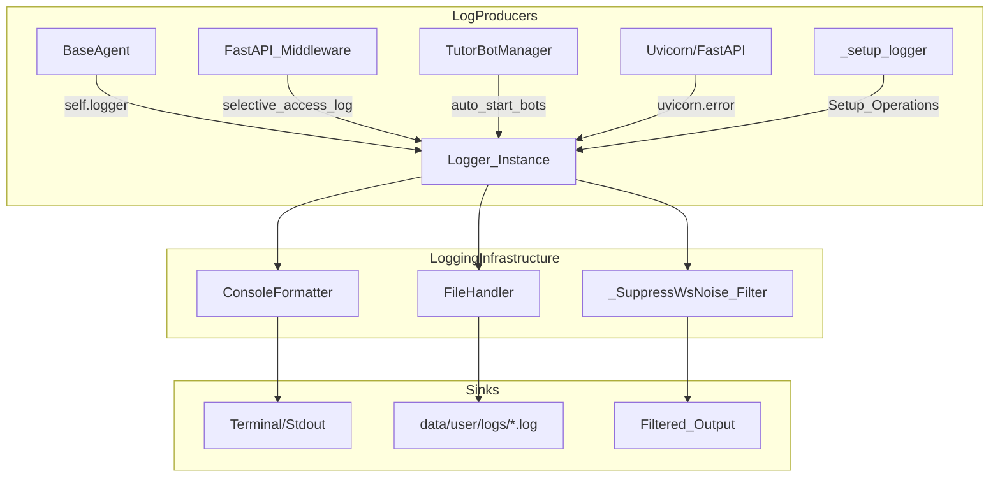
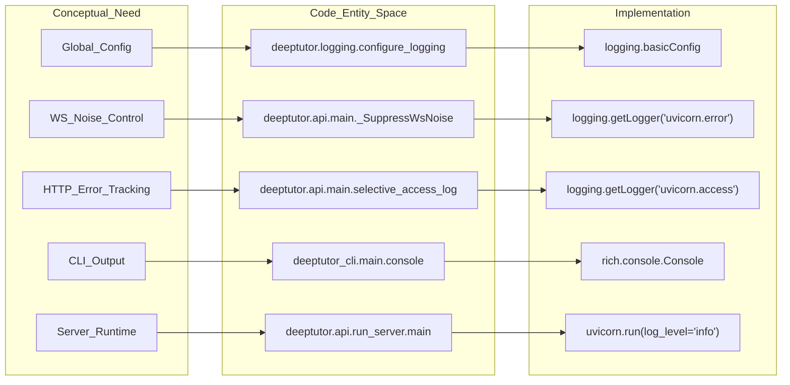

# 로깅 인프라

관련 소스 파일

이 위키 페이지를 생성할 때 컨텍스트로 사용된 파일은 다음과 같습니다:

- [.github/workflows/pypi-release.yml](.github/workflows/pypi-release.yml)
- [.gitignore](.gitignore)
- [deeptutor/api/run_server.py](deeptutor/api/run_server.py)
- [deeptutor_cli/main.py](deeptutor_cli/main.py)
- [requirements.txt](requirements.txt)
- [requirements/dev.txt](requirements/dev.txt)
- [requirements/math-animator.txt](requirements/math-animator.txt)

DeepTutor 로깅 인프라는 에이전트 네이티브 아키텍처의 복잡한 요구 사항을 지원하도록 설계된 통합형, 스레드 안전, 다중 채널 로깅 시스템을 제공합니다. 이 시스템은 콘솔을 통한 실시간 디버깅, 감사 추적을 위한 영구 저장, 그리고 CLI 및 Server 환경 전반의 고변동성 비동기 작업을 위한 특수 필터링을 지원합니다.

## 아키텍처 개요

로깅 시스템은 표준 Python `logging` 라이브러리를 기반으로 하며, 사용자 정의 포맷터와 필터로 강화되어 있습니다. 이를 통해 하위 수준의 LLM 서비스부터 상위 수준의 에이전트 오케스트레이터에 이르기까지 모든 모듈이 구조화되고 일관된 로그를 출력합니다. 시스템은 `configure_logging()` [deeptutor_cli/main.py:27-27](), [deeptutor/api/run_server.py:41-41]())를 통해 프로세스 수명 주기 초기에 초기화됩니다.

### 로그 흐름 다이어그램
이 다이어그램은 다양한 시스템 구성 요소가 생성한 로그 레코드가 처리되어 서로 다른 싱크로 라우팅되는 방식을 보여주며, WebSocket 노이즈에 대한 특수 처리도 포함합니다.

**로그 레코드 라우팅 및 처리**

Sources: [deeptutor/api/run_server.py:41-41](), [deeptutor_cli/main.py:27-27](), [deeptutor/api/main.py:30-40](), [deeptutor/api/main.py:176-188]()

## 핵심 구성 요소

### 로깅 구성
시스템은 `configure_logging()`를 통해 초기화됩니다. CLI에서는 `RunMode`를 설정한 직후에 이 작업이 이루어집니다 [deeptutor_cli/main.py:26-27](). 서버에서는 `uvicorn` 실행기가 시작되기 전에 `main()` 시작 루틴 안에서 호출됩니다 [deeptutor/api/run_server.py:40-42]().

### 로그 필터링 및 노이즈 감소
고동시성 작업 동안 깨끗한 로그 스트림을 유지하기 위해 시스템은 사용자 정의 필터를 구현합니다:

*   **WebSocket 억제**: `_SuppressWsNoise` 필터는 `logging.Filter`를 상속하여 WebSocket 연결 변동("connection open" 및 "connection closed")과 관련된 반복적인 Uvicorn 로그를 묵음 처리합니다 [deeptutor/api/main.py:30-37](). 이 필터는 `uvicorn.error` 로거에만 적용됩니다 [deeptutor/api/main.py:40-40]().
*   **선택적 Access 로깅**: 표준 Uvicorn access log로 모든 요청을 기록하는 대신(서버 실행기에서는 일반적으로 `access_log=False` [deeptutor/api/run_server.py:68-68]()로 비활성화됨), `selective_access_log` 미들웨어는 200이 아닌 HTTP 응답만 캡처합니다. 이렇게 하면 일반적인 상태 확인으로 로그가 넘쳐나는 것을 막으면서도 오류는 기록되도록 보장합니다 [deeptutor/api/main.py:176-188]().

### 구조화된 Access 로그
200이 아닌 요청을 기록할 때 시스템은 `uvicorn`의 `AccessFormatter`와 호환되도록 레코드를 명시적으로 포맷하며, Client Host, Method, Path, HTTP Version, Status Code를 포함하는 5개 요소 튜플을 제공합니다 [deeptutor/api/main.py:180-187]().

## 코드 엔티티 매핑

다음 다이어그램은 개념적인 로깅 요구 사항과 구현에 사용되는 구체적인 코드 엔티티 및 데이터 구조를 연결합니다.

**자연어에서 코드 엔티티 공간으로**

Sources: [deeptutor/api/run_server.py:41-69](), [deeptutor_cli/main.py:9-27](), [deeptutor/api/main.py:30-40](), [deeptutor_cli/common.py:14-14]()

## 시스템 모듈과의 통합

### CLI 및 콘솔 출력
CLI는 형식화된 출력을 위해 전용 `rich` 콘솔 인스턴스를 사용합니다 [deeptutor_cli/common.py:14-14](). 내부 로직은 표준 Python logging을 사용하지만, CLI 진입점은 API 서버 의존성이 누락된 경우와 같은 사용자 대상 오류에 대해 `console.print`를 사용합니다 [deeptutor_cli/main.py:148-151]().

### 서버 수명 주기 및 Uvicorn
서버 시작 스크립트 `deeptutor/api/run_server.py`는 `uvicorn`이 특정 로그 레벨을 사용하도록 구성하고, 불필요한 재시작 루프를 방지하기 위해 고변동성 데이터 디렉터리를 자동 재로드 감시 대상에서 제외합니다 [deeptutor/api/run_server.py:46-69](). 또한 컨테이너 환경에서 로그가 보이도록 무버퍼링 출력을 강제합니다 [deeptutor/api/run_server.py:23-27]().

### 애플리케이션 수명 주기
메인 API 진입점의 `lifespan` 컨텍스트 매니저는 LLM 클라이언트 초기화와 EventBus 활성화를 포함한 중요한 시작 및 종료 시점을 기록합니다 [deeptutor/api/main.py:91-160]().

### RAG 및 지식 베이스 로깅
`RAGService`는 특수한 `_capture_raw_logs` 컨텍스트 매니저를 사용합니다. 이를 통해 서비스는 지식 베이스 검색 중 생성된 내부 로그를 캡처하고 `event_sink`를 통해 `raw_log` 이벤트로 내보낼 수 있습니다 [deeptutor/services/rag/service.py:138-160](). 이는 표준 Python logging과 프런트엔드가 사용하는 실시간 이벤트 스트리밍 프로토콜 사이의 간극을 메웁니다.

### LLM 유틸리티
시스템은 후속 로거 또는 UI 구성 요소가 처리하기 전에 모델 출력에서 `<think>` 블록을 제거하는 `clean_thinking_tags`를 제공합니다. 이를 통해 내부 모델 "scratchpad"가 구조화된 로그를 어지럽히지 않도록 보장합니다 [deeptutor/services/llm/utils.py:142-164]().

Sources: [deeptutor/api/run_server.py:23-69](), [deeptutor_cli/main.py:148-151](), [deeptutor/api/main.py:91-160](), [deeptutor/services/rag/service.py:138-160](), [deeptutor/services/llm/utils.py:142-164]()
