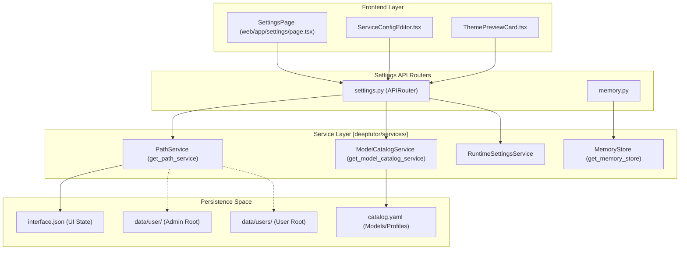
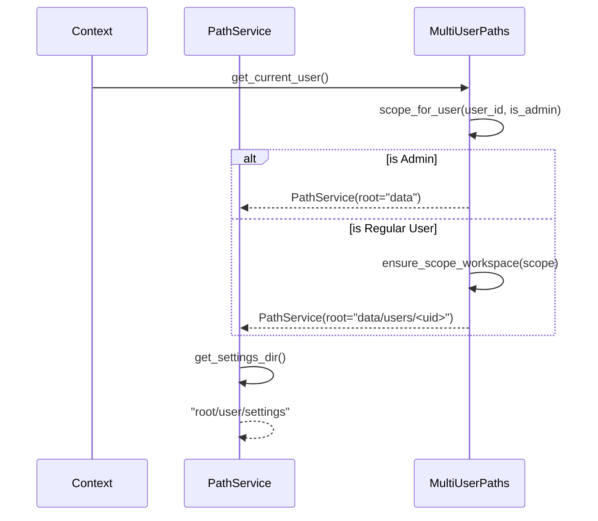

# Settings API

관련 소스 파일

이 위키 페이지를 생성할 때 컨텍스트로 사용된 파일은 다음과 같습니다:

- [deeptutor/api/routers/memory.py](deeptutor/api/routers/memory.py)
- [deeptutor/api/routers/settings.py](deeptutor/api/routers/settings.py)
- [deeptutor/multi_user/context.py](deeptutor/multi_user/context.py)
- [deeptutor/multi_user/paths.py](deeptutor/multi_user/paths.py)
- [deeptutor/services/path_service.py](deeptutor/services/path_service.py)
- [tests/api/test_settings_router.py](tests/api/test_settings_router.py)
- [web/components/settings/ServiceConfigEditor.tsx](web/components/settings/ServiceConfigEditor.tsx)
- [web/components/settings/ThemePreviewCard.tsx](web/components/settings/ThemePreviewCard.tsx)

Settings API는 UI 기본 설정, 모델 카탈로그, 다중 사용자 접근 제어, capability 튜너블, 진단 테스트를 포함한 DeepTutor의 런타임 구성을 관리하는 REST 엔드포인트를 제공합니다. 사용자가 LLM 제공자, 임베딩 모델, 에이전트 동작을 설정하는 मुख्य 인터페이스 역할을 합니다.

---

## 개요 및 범위

Settings API는 주로 `deeptutor/api/routers/settings.py`에 구현되어 있습니다 [[deeptutor/api/routers/settings.py:1-6]](). 이 API는 다음과 같은 여러 개의 구분된 구성 계층을 관리합니다:

1.  **UI 기본 설정**: 사용자의 설정 디렉터리 안 `interface.json`에 저장되는 `theme`, `language`, `sidebar_nav_order` 같은 클라이언트 측 설정 [[deeptutor/api/routers/settings.py:42-44]](), [[deeptutor/api/routers/settings.py:57-68]]().
2.  **모델 카탈로그**: `get_model_catalog_service()`를 통해 접근하는 LLM, Embedding, Search 프로필의 구조화된 관리 시스템 [[deeptutor/api/routers/settings.py:26-26]]().
3.  **도구 관리**: `USER_TOGGLEABLE_TOOL_NAMES`를 기반으로, 설정 인터페이스에서 사용자가 켜거나 끌 수 있는 채팅 도구 [[deeptutor/api/routers/settings.py:35-35]](), [[deeptutor/api/routers/settings.py:199-212]]().
4.  **네트워크 및 환경**: `NetworkSettingsUpdate`를 통한 백엔드/프런트엔드 포트, CORS origin, 공개 API base 구성 [[deeptutor/api/routers/settings.py:113-118]]().
5.  **다중 사용자 접근**: `allowed_llm_options`를 통해 사용자에게 권한이 부여된 모델 옵션을 제공하기 위한 컨텍스트 시스템 통합 [[deeptutor/api/routers/settings.py:22-23]]().

**Sources**: [[deeptutor/api/routers/settings.py:1-37]](), [[deeptutor/api/routers/settings.py:113-118]]()

---

## Settings API 아키텍처

Settings API는 저장 위치를 해석하기 위해 `PathService`와, 제공자 구성을 관리하기 위해 `ModelCatalogService`와 통합됩니다.

### 구성 흐름과 코드 엔티티

**Sources**: [[deeptutor/api/routers/settings.py:37-50]](), [[deeptutor/api/routers/memory.py:84-86]](), [[deeptutor/multi_user/paths.py:1-10]](), [[web/components/settings/ServiceConfigEditor.tsx:45-69]]()

---

## UI 및 도구 관리

### UI 설정
UI 설정은 시각적 표현을 제어하며 사용자의 작업 공간에 지속 저장됩니다.
- **Models**: `UISettings`는 `theme`(light, dark, glass, snow)과 `language`(zh, en)를 처리합니다 [[deeptutor/api/routers/settings.py:76-81]]().
- **기본 사이드바**: `/history`, `/knowledge`, `/research` 같은 경로를 포함하는 `DEFAULT_SIDEBAR_NAV_ORDER`로 정의됩니다 [[deeptutor/api/routers/settings.py:52-55]]().
- **지속성**: 설정은 `get_path_service().get_settings_file("interface")`가 제공하는 파일 경로로 `save_ui_settings()`를 통해 저장됩니다 [[deeptutor/api/routers/settings.py:42-44]](), [[deeptutor/api/routers/settings.py:215-225]]().

### 도구 스위치보드
DeepTutor는 켜고 끌 수 있는 도구 시스템을 제공합니다. 
- **토글 가능한 도구**: `USER_TOGGLEABLE_TOOL_NAMES`에 정의됩니다 [[deeptutor/api/routers/settings.py:35-35]]().
- **정제**: `_sanitize_enabled_tools`는 폐기되었거나 잘못된 도구 이름이 남지 않도록 하고, 중복을 필터링합니다 [[deeptutor/api/routers/settings.py:186-196]]().
- **조회**: `get_enabled_optional_tools()`는 저장된 토글과 관리자 승인 화이트리스트의 교집합을 source of truth로 사용합니다 [[deeptutor/api/routers/settings.py:199-212]]().

**Sources**: [[deeptutor/api/routers/settings.py:52-81]](), [[deeptutor/api/routers/settings.py:186-212]]()

---

## 장기 기억(Memory v3) API

`deeptutor/api/routers/memory.py`에서 관리되는 이 API는 3계층 메모리 서브시스템을 위한 작업 공간을 제공합니다.

- **개요**: `GET /overview`는 모든 메모리 문서(L2 및 L3)의 상태를 반환하고 사용 가능한 v1 마이그레이션 백업을 나열합니다 [[deeptutor/api/routers/memory.py:84-92]]().
- **문서 접근**: `/doc/{layer}/{key}`에 대한 `GET` 및 `PUT` 엔드포인트는 메모리 마크다운 파일을 읽고 수동으로 편집할 수 있게 합니다 [[deeptutor/api/routers/memory.py:140-156]]().
- **엔트리 해석**: `GET /resolve_entry/{entry_id}`는 특정 entry ID의 소유자를 찾기 위해 L2 문서들(예: `chat`, `solve`)을 스캔합니다(L3 각주 탐색용 등) [[deeptutor/api/routers/memory.py:95-121]]().
- **수명 주기**: `POST /doc/{layer}/{key}/reset`는 새로 재-ingestion을 강제하기 위해 문서와 메타데이터 사이드카(예: `seen_entity_refs`)를 지웁니다 [[deeptutor/api/routers/memory.py:169-180]]().

**Sources**: [[deeptutor/api/routers/memory.py:1-28]](), [[deeptutor/api/routers/memory.py:84-121]](), [[deeptutor/api/routers/memory.py:169-180]]()

---

## 모델 카탈로그 및 런타임 통합

Model Catalog는 관리자가 여러 제공자 프로필(예: OpenAI, Ollama, Anthropic)을 정의할 수 있게 합니다.

### 카탈로그 무효화
카탈로그가 업데이트되거나 적용되면, 시스템은 런타임 클라이언트가 변경 사항을 반영하도록 강제해야 합니다. `_invalidate_runtime_caches()`는 프로세스 전역 싱글톤을 초기화합니다 [[deeptutor/api/routers/settings.py:150-164]]():
1. `clear_llm_config_cache()`: 캐시된 제공자 구성을 지웁니다 [[deeptutor/api/routers/settings.py:162]]().
2. `reset_llm_client()`: 전역 LLM 클라이언트를 다시 인스턴스화합니다 [[deeptutor/api/routers/settings.py:163]]().
3. `reset_embedding_client()`: 전역 embedding 클라이언트를 다시 인스턴스화합니다 [[deeptutor/api/routers/settings.py:164]]().

### 네트워크 설정 정규화
`update_network_settings`를 통해 네트워크 설정을 업데이트할 때, CORS origin은 `normalize_origins`를 사용해 정규화됩니다 [[deeptutor/api/routers/settings.py:29]](). 이 과정은 여러 형식(세미콜론 또는 쉼표 구분)을 처리하고, origin만 남기기 위해 path를 제거합니다 [[tests/api/test_settings_router.py:182-199]]().

**Sources**: [[deeptutor/api/routers/settings.py:150-164]](), [[tests/api/test_settings_router.py:182-199]]()

---

## 다중 사용자 컨텍스트 및 경로 해석

DeepTutor는 관리자 데이터와 사용자별 데이터를 분리하기 위해 범위가 지정된 path 시스템을 사용합니다.

### 작업 공간 해석 로직

**Sources**: [[deeptutor/multi_user/paths.py:85-102]](), [[deeptutor/multi_user/paths.py:139-151]](), [[deeptutor/services/path_service.py:80-85]](), [[deeptutor/services/path_service.py:175-176]]()

### 저장 레이아웃
`PathService`는 `CurrentUser` 컨텍스트를 기준으로 저장 위치를 결정합니다:
- **관리자 작업 공간**: `data/` [[deeptutor/multi_user/paths.py:33]]().
- **다중 사용자 작업 공간**: `data/users/<uid>` [[deeptutor/multi_user/paths.py:7]](), [[deeptutor/multi_user/paths.py:102]]().
- **시스템 데이터**: 인증, grant, 감사 로그를 위한 `data/system` [[deeptutor/multi_user/paths.py:9-10]](), [[deeptutor/multi_user/paths.py:35]]().

### 접근 제어
- **사용자 컨텍스트**: `get_current_user()`는 context variable에서 활성 사용자를 반환하거나 `local_admin_user()`를 기본값으로 사용합니다 [[deeptutor/multi_user/context.py:22-23]]().
- **마스킹**: 표준 사용자가 설정을 가져올 때, MinerU용 API token 같은 민감 필드는 유출을 막기 위해 `None` 또는 빈 값으로 마스킹됩니다 [[deeptutor/api/routers/settings.py:120-130]](), [[tests/api/test_settings_router.py:202-210]]().

**Sources**: [[deeptutor/multi_user/paths.py:32-36]](), [[deeptutor/multi_user/context.py:22-23]](), [[deeptutor/api/routers/settings.py:120-130]]()
