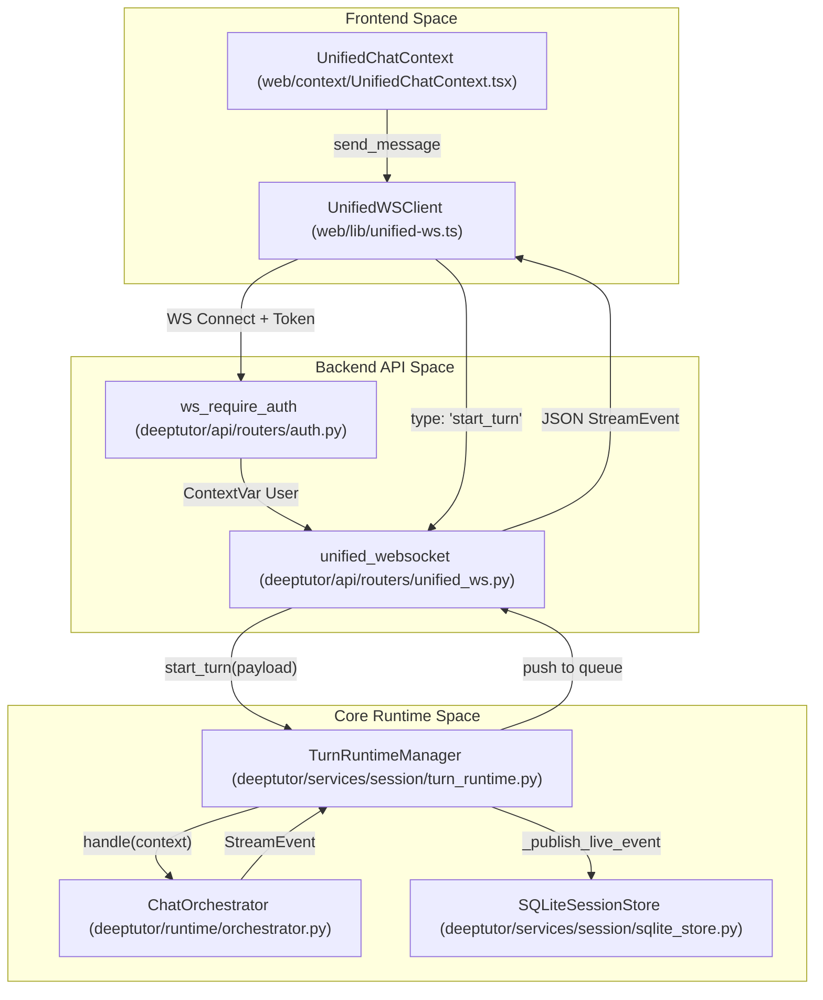
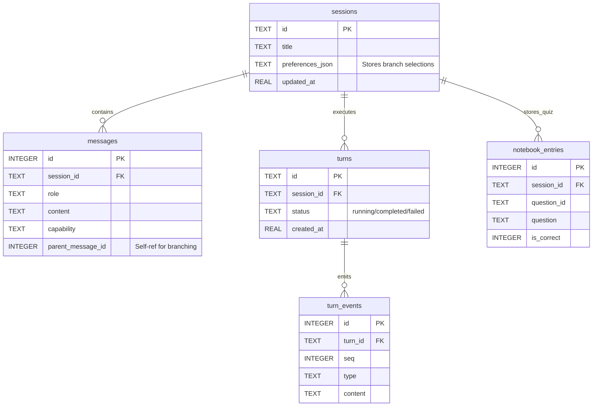

# 통합 WebSocket 및 세션 API

관련 소스 파일

이 위키 페이지를 생성할 때 컨텍스트로 사용된 파일은 다음과 같습니다:

- [deeptutor/api/routers/sessions.py](deeptutor/api/routers/sessions.py)
- [deeptutor/api/routers/unified_ws.py](deeptutor/api/routers/unified_ws.py)
- [deeptutor/core/stream.py](deeptutor/core/stream.py)
- [deeptutor/learning/storage.py](deeptutor/learning/storage.py)
- [deeptutor/services/session/pocketbase_store.py](deeptutor/services/session/pocketbase_store.py)
- [deeptutor/services/session/sqlite_store.py](deeptutor/services/session/sqlite_store.py)
- [deeptutor/services/session/turn_runtime.py](deeptutor/services/session/turn_runtime.py)
- [deeptutor/services/storage/attachment_store.py](deeptutor/services/storage/attachment_store.py)
- [tests/api/test_unified_ws_turn_runtime.py](tests/api/test_unified_ws_turn_runtime.py)
- [tests/services/memory/test_meta_settings.py](tests/services/memory/test_meta_settings.py)
- [tests/services/session/test_regenerate.py](tests/services/session/test_regenerate.py)
- [tests/services/session/test_sqlite_store.py](tests/services/session/test_sqlite_store.py)
- [tests/services/session/test_turn_runtime_subscribe.py](tests/services/session/test_turn_runtime_subscribe.py)
- [tests/services/test_path_service.py](tests/services/test_path_service.py)
- [web/app/(workspace)/chat/[[...sessionId]]/page.tsx](web/app/(workspace)/chat/[[...sessionId]]/page.tsx)
- [web/components/chat/home/ChatMessages.tsx](web/components/chat/home/ChatMessages.tsx)
- [web/context/UnifiedChatContext.tsx](web/context/UnifiedChatContext.tsx)
- [web/lib/api.ts](web/lib/api.ts)
- [web/tests/api-resolve-base.test.ts](web/tests/api-resolve-base.test.ts)

API 계층은 실시간 에이전트 상호작용과 영속적인 세션 관리를 위한 통합 통신 인터페이스를 제공합니다. 이 계층은 스트리밍 이벤트를 위한 단일 WebSocket 엔드포인트와 대화 기록 및 Question Notebook 관리를 위한 일련의 RESTful 라우트로 구성됩니다.

## 통합 WebSocket 프로토콜

DeepTutor는 모든 agentic 상호작용을 처리하기 위해 `/api/v1/ws`의 단일 WebSocket 엔드포인트를 사용합니다 [deeptutor/api/routers/unified_ws.py:44-45](). 이 엔드포인트는 새 턴 시작, 기존 턴 구독, 중단된 스트림 재개, 이전 응답 재생성을 지원합니다.

### 클라이언트-서버 메시지
이 프로토콜은 프런트엔드가 에이전트 수명 주기를 제어하기 위해 보내는 여러 메시지 유형을 정의합니다:

| Message Type | Purpose | Key Fields |
|:---|:---|:---|
| `message` / `start_turn` | 새로운 에이전트 상호작용을 시작합니다. | `content`, `capability`, `session_id`, `attachments`, `tools` |
| `subscribe_turn` | 이미 실행 중인 백그라운드 작업을 수신합니다. | `turn_id`, `after_seq` |
| `subscribe_session` | 세션의 활성 턴에 대한 이벤트를 스트리밍합니다. | `session_id`, `after_seq` |
| `resume_from` | 네트워크 끊김 후 턴에 다시 연결합니다. | `turn_id`, `seq` |
| `unsubscribe` | 이전에 생성한 구독을 중지합니다. | `turn_id`, `session_id` |
| `cancel_turn` | 백엔드에 특정 작업을 중단하라고 신호를 보냅니다. | `turn_id` |
| `regenerate` | 세션에서 마지막 사용자 메시지를 다시 실행합니다. | `session_id`, `overrides` |
| `check_active_turn` | 세션에 살아 있는 실행 턴이 있는지 확인합니다. | `session_id` |
| `user_input` | 대기 중인 `ask_user` 일시 정지에 대한 응답을 전달합니다. | `content`, `turn_id` |

Sources: [deeptutor/api/routers/unified_ws.py:7-29](), [deeptutor/api/routers/unified_ws.py:113-200]()

### 서버-클라이언트 이벤트
백엔드는 `StreamEvent` 객체를 스트리밍합니다. 모든 이벤트에는 순서 있는 전달과 재개 지원을 보장하기 위한 `seq`(시퀀스 번호)가 포함됩니다 [deeptutor/core/stream.py:58]().

*   **`stage_start` / `stage_end`**: 에이전트 단계 간 전환을 표시합니다(예: Thinking → Acting).
*   **`thinking`**: LLM의 실시간 추론 토큰 또는 상태입니다.
*   **`tool_call` / `tool_result`**: 외부 도구 실행의 세부 정보입니다.
*   **`content`**: 응답 조각(텍스트/마크다운)입니다.
*   **`result`**: 턴의 최종 구조화된 페이로드입니다.
*   **`error`**: 턴이 실패했을 때의 예외 세부 정보입니다.
*   **`wait_for_input`**: 에이전트가 사용자 피드백을 기다리며 일시 정지했음을 나타냅니다.

Sources: [deeptutor/core/stream.py:17-35](), [deeptutor/api/routers/unified_ws.py:65-67]()

## 세션 및 턴 관리

백엔드는 HTTP/WebSocket 요청 수명 주기와 실제 에이전트 실행을 분리하기 위해 `TurnRuntimeManager`를 활용합니다.

### 턴 실행 흐름
턴이 시작되면 시스템은 `TurnRuntimeManager.start_turn()`을 통해 로직을 시작합니다 [deeptutor/api/routers/unified_ws.py:118](). 그런 다음 오케스트레이터가 특정 에이전트 파이프라인을 트리거합니다.

**에이전트 이벤트 흐름 다이어그램**

Sources: [deeptutor/api/routers/unified_ws.py:113-134](), [deeptutor/services/session/turn_runtime.py:167-182](), [web/context/UnifiedChatContext.tsx:21-28](), [tests/api/test_unified_ws_turn_runtime.py:167-182]()

### 재생성 및 브랜칭
이 시스템은 "Edit-branching"을 지원합니다. 여기서 새 사용자 메시지가 세션 끝에 추가되는 대신, 부모 메시지 아래의 형제 메시지로 삽입될 수 있습니다 [web/context/UnifiedChatContext.tsx:77-81]().
*   **`regenerate`**: 세션의 마지막 사용자 메시지를 다시 실행하며, trailing assistant 메시지가 있으면 그것을 대체합니다 [deeptutor/api/routers/unified_ws.py:17-23]().
*   **브랜치 선택**: 사용자는 서로 다른 응답 브랜치(형제)를 선택할 수 있으며, 이는 세션 기본 설정에 저장됩니다 [deeptutor/api/routers/sessions.py:25-32](), [deeptutor/api/routers/sessions.py:166-177]().

Sources: [web/context/UnifiedChatContext.tsx:77-81](), [deeptutor/api/routers/sessions.py:166-177](), [deeptutor/api/routers/unified_ws.py:17-23]()

## 세션 지속성 API

`deeptutor/api/routers/sessions.py`에 위치한 REST API는 대화 기록에 대한 CRUD 작업을 제공하며, `SQLiteSessionStore` 또는 `PocketBaseSessionStore`를 기반으로 합니다.

### 주요 작업

| Operation | Implementation | Description |
|:---|:---|:---|
| List Sessions | `list_sessions` | 페이지네이션과 함께 최근 세션을 반환합니다 [deeptutor/api/routers/sessions.py:80-87](). |
| Get Session | `get_session` | 세션과 그 전체 메시지 기록을 반환합니다 [deeptutor/api/routers/sessions.py:133-140](). |
| Rename | `rename_session` | DB에서 세션 제목을 업데이트합니다 [deeptutor/api/routers/sessions.py:143-150](). |
| Delete | `delete_session` | 세션과 연관된 모든 첨부 파일을 제거합니다 [deeptutor/api/routers/sessions.py:153-163](). |
| Branch Selection | `update_branch_selection` | 세션의 활성 브랜치 경로를 업데이트합니다 [deeptutor/api/routers/sessions.py:166-177](). |

Sources: [deeptutor/api/routers/sessions.py:80-177](), [deeptutor/services/session/sqlite_store.py:77-86]()

### 데이터 스키마(SQLite)
`SQLiteSessionStore`는 `_initialize()`에서 초기화되는 여러 연결된 테이블을 사용해 지속성 계층을 관리합니다 [deeptutor/services/session/sqlite_store.py:100-186]().

**데이터베이스 엔티티 관계 다이어그램**

Sources: [deeptutor/services/session/sqlite_store.py:100-186]()

## 다중 사용자 경로 격리
API는 `PathService`를 통해 `CurrentUser` 컨텍스트를 기반으로 저장 경로를 동적으로 해석하여 다중 사용자 격리를 지원합니다.
*   **Path Service**: `chat_history.db`, `logs`, `workspace`의 경로를 해석합니다 [deeptutor/services/path_service.py:113-121]().
*   **Workspace 라우팅**: 각 사용자에게는 자신만의 데이터베이스와 설정을 담은 전용 디렉터리가 있습니다 [deeptutor/services/path_service.py:85]().
*   **Auth 가드**: `ws_require_auth`는 WebSocket 연결을 업그레이드하기 전에 유효한 사용자와 연결되어 있는지 확인합니다 [deeptutor/api/routers/unified_ws.py:49-51]().

Sources: [deeptutor/services/path_service.py:85-121](), [deeptutor/api/routers/unified_ws.py:46-51]()

## Question Notebook 및 학습 저장소

API에는 구조화된 교육 데이터를 지속 저장하는 **Question Notebook**과 **Learning Progress**를 위한 특화 로직이 포함되어 있습니다.
*   **퀴즈 결과 기록**: `/quiz-results` 엔드포인트는 `QuizResultItem` 목록을 받아 사용자 메시지와 구조화된 notebook entry 둘 다로 저장합니다 [deeptutor/api/routers/sessions.py:195-217]().
*   **Learning Store**: `LearningStore`는 `LearningProgress` 모델을 위한 원자적 파일 기반 지속성을 제공하며, 모듈 수준 lock을 통해 CAS(Compare-and-Swap) 의미를 보장합니다 [deeptutor/learning/storage.py:12-44]().
*   **Notebook Upsert**: 장기 추적을 위해 퀴즈 결과를 `notebook_entries` 테이블에 삽입합니다 [deeptutor/services/session/sqlite_store.py:175-186]().

Sources: [deeptutor/api/routers/sessions.py:195-217](), [deeptutor/learning/storage.py:12-51](), [deeptutor/services/session/sqlite_store.py:175-186]()

## 첨부 파일 관리

`AttachmentStore`는 채팅 세션 중 업로드되거나 도구에 의해 생성된 바이너리 파일의 지속 저장을 처리합니다.

| Component | Role |
|:---|:---|
| `AttachmentStore` | `put` 및 `delete` 작업을 정의하는 프로토콜입니다 [deeptutor/services/storage/attachment_store.py:64-70](). |
| `LocalDiskAttachmentStore` | 파일을 사용자 작업 공간에 저장하는 구현체입니다 [deeptutor/services/storage/attachment_store.py:103-109](). |
| `_artifact_attachments` | 도구가 생성한 파일(예: 코드 실행 결과)을 추출해 메시지 첨부 파일로 변환합니다 [deeptutor/services/session/turn_runtime.py:61-102](). |
| Attachment Cleanup | 세션이나 메시지가 제거될 때 연관 파일을 삭제합니다 [deeptutor/api/routers/sessions.py:160-162](), [deeptutor/api/routers/sessions.py:190-194](). |

Sources: [deeptutor/services/storage/attachment_store.py:64-109](), [deeptutor/api/routers/sessions.py:160-194](), [deeptutor/services/session/turn_runtime.py:61-102]()
