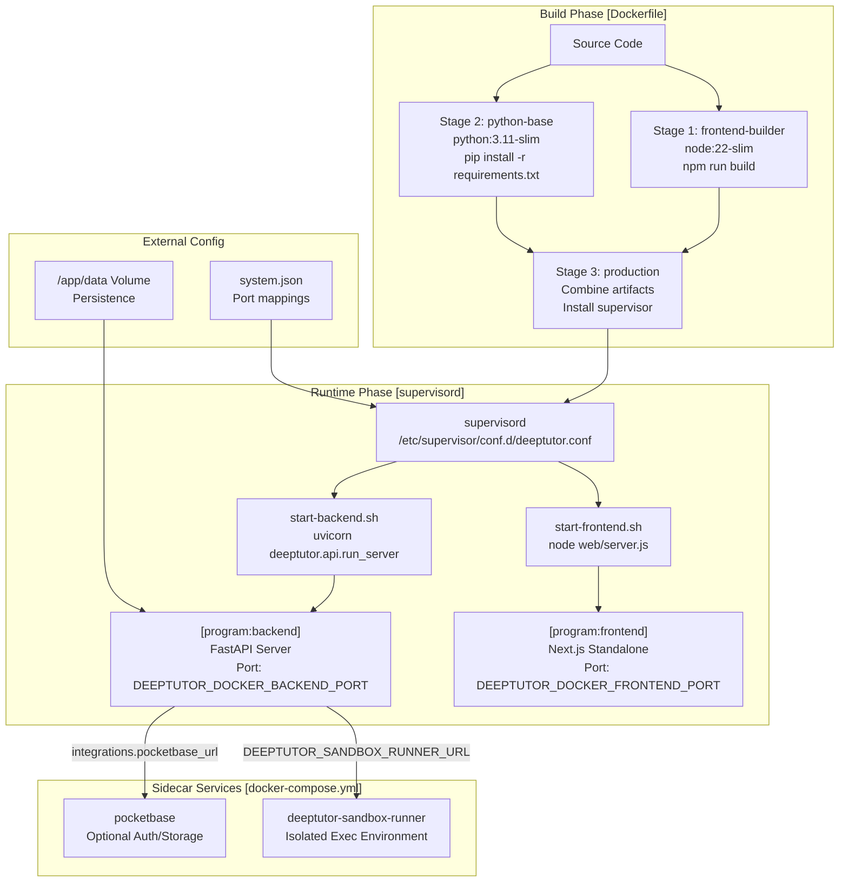
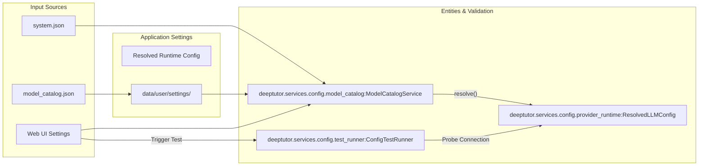

# 배포 및 운영

관련 소스 파일

이 위키 페이지를 생성할 때 컨텍스트로 사용된 파일은 다음과 같습니다:

- [.dockerignore](.dockerignore)
- [README.md](README.md)
- [assets/README/README_AR.md](assets/README/README_AR.md)
- [assets/README/README_CN.md](assets/README/README_CN.md)
- [assets/README/README_ES.md](assets/README/README_ES.md)
- [assets/README/README_FR.md](assets/README/README_FR.md)
- [assets/README/README_HI.md](assets/README/README_HI.md)
- [assets/README/README_JA.md](assets/README/README_JA.md)
- [assets/README/README_PL.md](assets/README/README_PL.md)
- [assets/README/README_PT.md](assets/README/README_PT.md)
- [assets/README/README_RU.md](assets/README/README_RU.md)
- [assets/README/README_TH.md](assets/README/README_TH.md)
- [deeptutor/agents/notebook/summarize_agent.py](deeptutor/agents/notebook/summarize_agent.py)
- [deeptutor/services/config/test_runner.py](deeptutor/services/config/test_runner.py)
- [docker-compose.dev.yml](docker-compose.dev.yml)
- [docker-compose.ghcr.yml](docker-compose.ghcr.yml)
- [docker-compose.yml](docker-compose.yml)
- [tests/agents/notebook/__init__.py](tests/agents/notebook/__init__.py)
- [tests/api/test_main_notebook_router.py](tests/api/test_main_notebook_router.py)
- [tests/services/config/test_llm_probe_config.py](tests/services/config/test_llm_probe_config.py)
- [tests/services/llm/test_factory_provider_exec.py](tests/services/llm/test_factory_provider_exec.py)

이 문서는 다양한 환경에서 DeepTutor를 실행하기 위한 프로덕션 배포 전략과 운영상의 고려 사항을 제공합니다. 배포 방법, 런타임 구성, 서비스 관리, 운영 모범 사례를 다룹니다.

**범위**: 이 페이지는 배포 아키텍처와 운영 워크플로에 초점을 맞춥니다. 상세한 구성 참조는 다음을 보세요:
- **환경 변수 참조**: 모든 환경 변수와 그 목적에 대한 완전한 참조입니다. 자세한 내용은 [Environment Variables Reference](#13.1)를 참고하세요.
- **다중 사용자 모드 및 관리**: `AUTH_ENABLED`, 사용자 역할, 작업 공간 격화를 활성화하는 방법을 안내합니다. 자세한 내용은 [Multi-User Mode and Administration](#13.2)를 참고하세요.
- **데이터 지속성 및 백업**: 데이터 디렉터리 구조와 백업 전략을 이해합니다. 자세한 내용은 [Data Persistence and Backups](#13.3)를 참고하세요.

---

## 배포 아키텍처 개요

DeepTutor는 두 가지 주요 배포 방식을 지원합니다: 컨테이너화된 Docker 배포(권장)와 개발 환경을 위한 수동 설치입니다. 시스템은 Docker용 다단계 빌드 프로세스와 컨테이너 내부 프로세스 관리를 위한 `supervisord`를 사용합니다. 

프로덕션 아키텍처의 핵심 구성 요소는 **Sandbox Runner**로, 신뢰할 수 없는 셸 명령을 격리된 환경에서 실행하여 메인 애플리케이션을 보호하는 sidecar 서비스입니다 [docker-compose.yml:94-103]().

### 시스템 배포 흐름
다음 다이어그램은 상위 수준의 배포 단계와 코드베이스에 정의된 구체적인 스크립트 및 구성을 연결합니다.

**Sources**: [Dockerfile:1-210](), [docker-compose.yml:21-154]()

---

## Docker 배포 프로세스

### 다단계 빌드 전략
Docker 빌드는 이미지 크기를 최소화하고 빌드 시점 의존성과 런타임 의존성을 분리하기 위해 다단계 프로세스를 사용합니다. 

| Stage | Base Image | Purpose | Key Operations |
|-------|-----------|---------|----------------|
| `frontend-builder` | `node:22-slim` | Next.js 앱 빌드 | standalone output으로 `npm run build` 실행 [Dockerfile:50]() |
| `python-base` | `python:3.11-slim` | Python 의존성 설치 | Rust toolchain과 `requirements.txt` 설치 [Dockerfile:89-98]() |
| `production` | `python:3.11-slim` | 최종 런타임 이미지 | artifact 복사 및 `supervisord` 설정 [Dockerfile:175-208]() |

### Sandbox 격리
프로덕션 보안을 위해 `sandbox-runner` 서비스는 별도 컨테이너로 배포됩니다. 이 서비스는 메인 앱과 `/app/data/user/workspace` 및 `/app/data/users` 볼륨만 공유하며, `data/system`의 시스템 비밀 정보와 구성은 신뢰할 수 없는 코드가 절대 접근할 수 없도록 보장합니다 [docker-compose.yml:111-123](). 또한 `no-new-privileges:true`와 읽기 전용 루트 파일시스템으로 강화됩니다 [docker-compose.yml:128-136]().

### 런타임 환경 주입
DeepTutor는 이미지를 다시 빌드하지 않고도 `NEXT_PUBLIC_*` 변수들을 런타임에 설정할 수 있도록 플레이스홀더 치환 전략을 사용합니다. 

**로컬 LLM 통합**: Docker에서 실행하면서 LLM 제공자(예: LM Studio, Ollama, vLLM)가 호스트에서 동작하는 경우, 사용자는 제공자 `base_url` 필드에 `localhost` 대신 `host.docker.internal`을 사용해야 합니다 [docker-compose.yml:16-17]().

**Sources**: [Dockerfile:23-51](), [Dockerfile:103-208](), [docker-compose.yml:1-154]()

---

## 프로세스 관리

DeepTutor는 단일 컨테이너 안에서 FastAPI 백엔드와 Next.js 프런트엔드의 수명 주기를 관리하기 위해 `supervisord`를 사용합니다.

### Supervisord 구성
`/etc/supervisor/conf.d/deeptutor.conf`의 구성은 두 서비스가 시작되고 모니터링되도록 보장합니다 [Dockerfile:179-208]().

- **Backend**: `start-backend.sh`를 통해 관리되며, `PYTHONPATH` 같은 적절한 환경 변수를 사용해 FastAPI 애플리케이션을 시작합니다 [Dockerfile:186-195]().
- **Frontend**: `start-frontend.sh`를 통해 관리되며, 환경 변수 주입을 처리하고 standalone Next.js 서버를 시작합니다 [Dockerfile:197-208]().

**Sources**: [Dockerfile:179-208]()

---

## 런타임 구성 및 테스트

구성은 시스템 설정과 `model_catalog.json`에서 애플리케이션의 내부 서비스로 흐릅니다. `ConfigTestRunner`는 UI를 통해 이러한 설정을 실시간으로 검증할 수 있게 합니다.

### 구성 흐름

### 구성 프로브
`ConfigTestRunner`는 LLM, Embedding, Search 서비스에 대한 진단 테스트를 실행합니다 [deeptutor/services/config/test_runner.py:68-88](). Embedding 서비스의 경우, 실행기는 성공적인 테스트 연결이 확인되면 벡터 차원을 자동으로 감지해 카탈로그에 저장합니다 [deeptutor/services/config/test_runner.py:132-153]().

**Sources**: [deeptutor/services/config/provider_runtime.py:1-331](), [deeptutor/services/config/test_runner.py:68-202]()

---

## 운영상 고려 사항

### 데이터 지속성
DeepTutor는 `/app/data` 볼륨 아래의 여러 하위 디렉터리가 지속 저장되도록 요구합니다 [docker-compose.yml:58-66]().

- `data/user/settings`: 전역 시스템 구성과 `model_catalog.json`.
- `data/users`: 다중 사용자 모드를 위한 사용자별 격리 작업 공간.
- `data/partners`: TutorBot(Partners) 채널의 구성 및 상태.
- `data/system`: 인증 상태, grant, 감사 로그.
- `data/knowledge_bases`: RAG 벡터 인덱스.
- `data/memory`: 세션 및 메모리 저장용 SQLite 데이터베이스.

### 보안 및 유지보수
- **비밀 정보**: `detect-secrets`를 사용해 secret scanning을 수행합니다 [CONTRIBUTING.md:129-137]().
- **다중 사용자 격리**: `AUTH_ENABLED`가 설정되면, 시스템은 사용자별 자원 격리와 범위 지정된 런타임 접근을 강제합니다 [README.md:68-69]().
- **줄 끝**: Linux/Docker 환경에서의 실행 문제를 방지하기 위해 중요한 스크립트는 `.gitattributes`를 통해 LF 줄 끝을 사용하도록 강제됩니다 [.gitattributes:1-19]().

**Sources**: [Dockerfile:159-173](), [docker-compose.yml:58-66](), [CONTRIBUTING.md:129-215](), [.gitattributes:1-19](), [README.md:68-69]()
