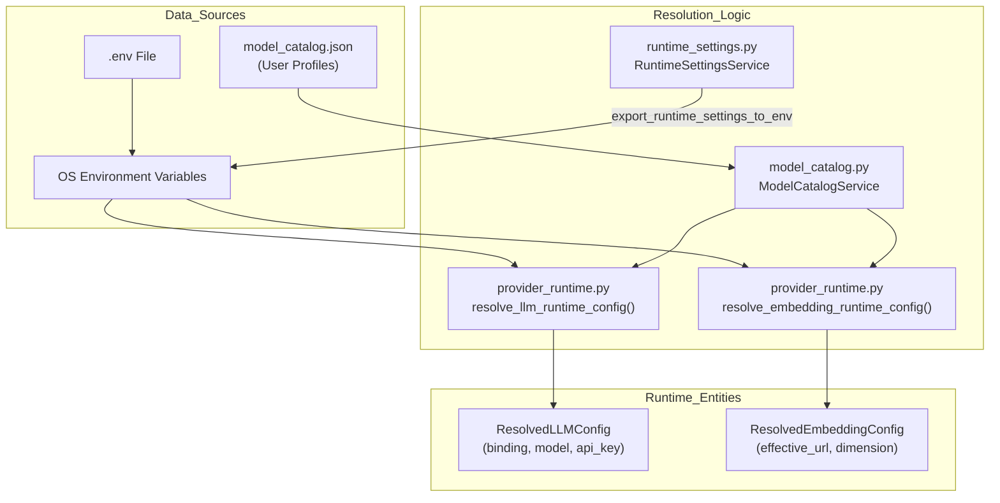
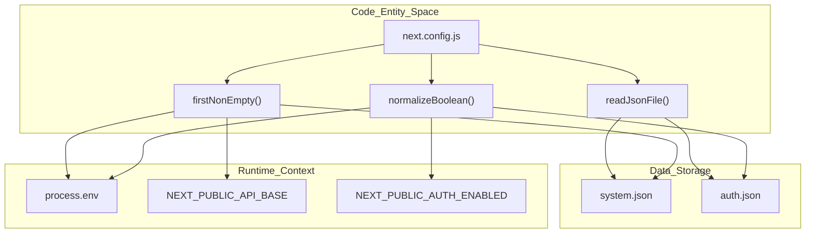

# 환경 변수 참조

관련 소스 파일

이 위키 페이지를 생성할 때 컨텍스트로 사용된 파일은 다음과 같습니다:

- [.github/workflows/docker-release.yml](.github/workflows/docker-release.yml)
- [README.md](README.md)
- [assets/README/README_AR.md](assets/README/README_AR.md)
- [assets/README/README_CN.md](assets/README/README_CN.md)
- [assets/README/README_ES.md](assets/README/README_ES.md)
- [assets/README/README_FR.md](assets/README/README_FR.md)
- [assets/README/README_HI.md](assets/README/README_HI.md)
- [assets/README/README_JA.md](assets/README/README_JA.md)
- [assets/README/README_PL.md](assets/README/README_PL.md)
- [assets/README/README_PT.md](assets/README/README_PT.md)
- [assets/README/README_RU.md](assets/README/README_RU.md)
- [assets/README/README_TH.md](assets/README/README_TH.md)
- [web/eslint.config.mjs](web/eslint.config.mjs)
- [web/next-env.d.ts](web/next-env.d.ts)
- [web/next.config.js](web/next.config.js)
- [web/package-lock.json](web/package-lock.json)
- [web/package.json](web/package.json)

이 문서는 DeepTutor에서 사용되는 모든 환경 변수에 대한 완전한 참조를 제공합니다. 환경 변수는 배포 구성, API 자격 증명, 서비스 엔드포인트, 런타임 동작을 제어합니다. 이들은 시작 시 `.env` 파일에서 로드되며, Settings API를 통해 런타임 중에도 수정할 수 있습니다.

DeepTutor는 다층 구성 시스템을 사용합니다. 환경 변수는 인프라(포트, API 키, 호스트)를 정의하고, YAML 파일과 모델 카탈로그는 에이전트 동작과 애플리케이션 로직을 정의합니다.

## 환경 변수 시스템 아키텍처

DeepTutor는 환경 변수와 정적 구성 파일을 결합하는 통합 구성 로딩 메커니즘을 사용합니다. 구성 시스템은 경로를 해석하고 런타임 구성을 애플리케이션 상태에 주입합니다. 시스템은 `ModelCatalogService`를 사용해 활성 프로필을 관리하며, 카탈로그 항목이 없을 경우 환경 변수로 폴백합니다 [deeptutor/services/config/provider_runtime.py:28-29]().

### 구성 로딩 및 해석 흐름

해석 로직은 `provider_runtime.py`에 캡슐화되어 있으며, 특히 `resolve_llm_runtime_config`와 `resolve_embedding_runtime_config` 같은 함수로 구현됩니다. 이 함수들은 원시 환경 문자열이나 카탈로그 항목을 구조화된 `ResolvedLLMConfig` 또는 `ResolvedEmbeddingConfig` 객체로 변환합니다 [deeptutor/services/config/provider_runtime.py:198-232](). `RuntimeSettingsService`도 모듈 간 일관성을 보장하기 위해 런타임 설정을 환경 변수로 내보냅니다 [deeptutor/services/config/runtime_settings.py:69-69]().

Title: Configuration Data Flow and Resolution

**Sources:** [deeptutor/services/config/provider_runtime.py:198-232](), [deeptutor/services/config/runtime_settings.py:22-30](), [deeptutor/services/config/runtime_settings.py:69-69]()

### 프런트엔드 구성 및 플레이스홀더 주입

Next.js 프런트엔드는 브라우저에 구성을 정규화하고 노출하기 위해 `next.config.js` 파일을 사용합니다. 배포 오버라이드로 환경 변수를 허용하면서, `data/user/settings/system.json`과 `data/user/settings/auth.json`을 주요 source of truth로 읽습니다 [web/next.config.js:41-42](). Docker 빌드 중에는 런타임 치환을 허용하기 위해 `__NEXT_PUBLIC_AUTH_ENABLED_PLACEHOLDER__` 같은 플레이스홀더가 사용됩니다 [web/next.config.js:24-26]().

Title: Frontend Configuration Resolution Space

**Sources:** [web/next.config.js:6-61](), [web/next.config.js:78-85]()

## 환경 변수 전체 참조

### 서버 및 네트워크 구성

이 변수들은 서버 환경과 실행 동작을 제어합니다. `next.config.js` 스크립트는 백엔드 포트와 API base를 결정하는 로직을 처리합니다 [web/next.config.js:35-49]().

| Variable | Required | Default | Description |
|----------|----------|---------|-------------|
| `BACKEND_PORT` | No | `8001` | FastAPI 백엔드가 사용하는 포트 [web/next.config.js:38-39](). |
| `NEXT_PUBLIC_API_BASE` | Yes (Web) | `http://localhost:8001` | 프런트엔드 통신을 위한 외부 API base URL [web/next.config.js:43-49](). |
| `NEXT_PUBLIC_AUTH_ENABLED` | No (Web) | `false` | 인증 로직을 활성화/비활성화합니다 [web/next.config.js:51-58](). |
| `NODE_ENV` | No | `production` | 프로덕션 이미지에서 `production`으로 설정됩니다 [Dockerfile:113](). |
| `PYTHONDONTWRITEBYTECODE` | No | `1` | Python이 .pyc 파일을 쓰지 않도록 합니다 [Dockerfile:110](). |
| `PYTHONUNBUFFERED` | No | `1` | Python 출력이 즉시 터미널로 전송되도록 보장합니다 [Dockerfile:111](). |
| `DEEPTUTOR_IGNORE_PROCESS_ENV_OVERRIDES` | No | `1` | 로컬 env 파일이 컨테이너 env를 덮어쓰지 못하게 합니다 [Dockerfile:114](). |

**Sources:** [web/next.config.js:32-61](), [Dockerfile:110-115]()

### LLM 및 Embedding 구성

DeepTutor는 `openai`, `anthropic`, `gemini`, `ollama`, `vllm`을 포함한 다양한 제공자를 지원합니다. Embedding 구성에는 완전한 자격의 endpoint URL이 필요합니다 [deeptutor/services/config/provider_runtime.py:50-53]().

| Variable | Protocol Bindings | Description |
|----------|-------------------|-------------|
| `LLM_BINDING` | `openai`, `anthropic`, `gemini`, `ollama`, `vllm` | 주요 LLM을 위한 프로토콜 바인딩 [deeptutor/services/config/provider_runtime.py:43-44](). |
| `EMBEDDING_BINDING` | `openai`, `ollama`, `cohere`, `jina` | 벡터 생성을 위한 프로토콜 바인딩 [deeptutor/services/config/provider_runtime.py:47-48](). |
| `EMBEDDING_HOST` | - | **FULL** endpoint URL(예: `https://api.openai.com/v1/embeddings`) [deeptutor/services/config/provider_runtime.py:51-53](). |

**Sources:** [deeptutor/services/config/provider_runtime.py:43-62]()

### 검색 서비스 제공자

Deep Research 및 RAG 모듈을 위한 외부 검색 제공자를 구성합니다.

| Variable | Supported Values |
|----------|------------------|
| `SEARCH_PROVIDER` | `brave`, `tavily`, `jina`, `searxng`, `duckduckgo`, `perplexity`, `serper` [deeptutor/services/config/provider_runtime.py:31-38](). |

**Sources:** [deeptutor/services/config/provider_runtime.py:30-40]()

### 보안 및 유지보수

| Variable | Description |
|----------|-------------|
| `DISABLE_SSL_VERIFY` | SDK 제공자에 대한 SSL 검증을 비활성화합니다. 로컬 프록시에 유용합니다 [README.md:64](). |
| `AUTH_ENABLED` | 다중 사용자 모드와 작업 공간 격화를 활성화하는 플래그입니다 [README.md:68](). |

**Sources:** [README.md:64-68]()
