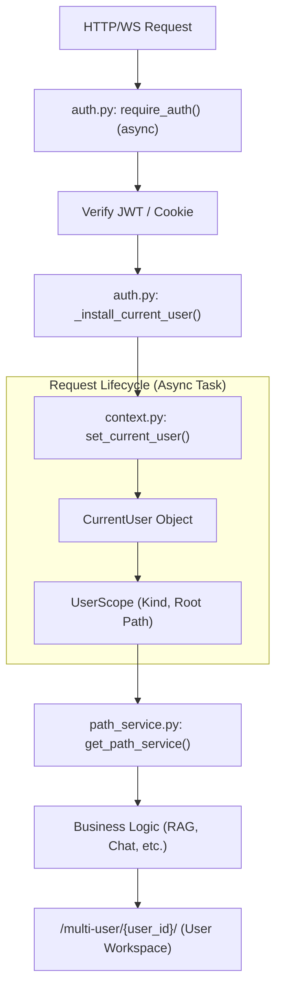
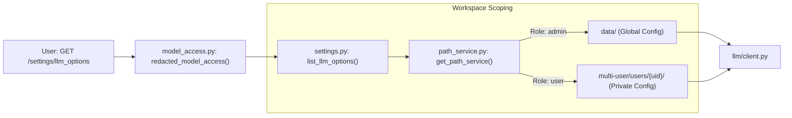

# 다중 사용자 모드 및 관리

관련 소스 파일

이 위키 페이지를 생성할 때 컨텍스트로 사용된 파일은 다음과 같습니다:

- [deeptutor/api/main.py](deeptutor/api/main.py)
- [deeptutor/api/routers/auth.py](deeptutor/api/routers/auth.py)
- [deeptutor/multi_user/router.py](deeptutor/multi_user/router.py)
- [tests/api/test_auth_contextvar.py](tests/api/test_auth_contextvar.py)
- [tests/api/test_selective_access_log.py](tests/api/test_selective_access_log.py)
- [web/components/SessionList.tsx](web/components/SessionList.tsx)
- [web/components/sidebar/UtilitySidebar.tsx](web/components/sidebar/UtilitySidebar.tsx)
- [web/components/sidebar/WorkspaceSidebar.tsx](web/components/sidebar/WorkspaceSidebar.tsx)
- [web/lib/admin-api.ts](web/lib/admin-api.ts)
- [web/lib/auth.ts](web/lib/auth.ts)
- [web/lib/session-api.ts](web/lib/session-api.ts)

DeepTutor에는 관리자가 자원(LLM, Knowledge Base, Skill)을 관리하고 이를 개별 사용자에게 할당하는 공유 배포용의 선택적이지만 강력한 다중 사용자 계층이 포함되어 있습니다. 이 시스템은 엄격한 작업 공간 격리, 자원 거버넌스, 감사 가능성을 보장합니다.

## 개요 및 활성화

다중 사용자 모드는 `AUTH_ENABLED` 플래그로 토글됩니다 [deeptutor/services/auth.py:30-30](). 활성화되면 시스템은 단일 사용자 로컬 도구에서 역할 기반 접근 제어(RBAC)를 갖춘 멀티테넌트 플랫폼으로 전환됩니다. 프런트엔드는 `NEXT_PUBLIC_AUTH_ENABLED`를 통해 이 상태를 감지합니다 [web/lib/auth.ts:3-3]().

### 주요 구성 요소
*   **신원 저장소**: 내장 SQLite/JSON 인증 또는 PocketBase 같은 외부 제공자를 지원합니다 [deeptutor/api/routers/auth.py:29-44]().
*   **Grant 시스템**: 관리 자원(모델, KB, Skill)을 특정 사용자에게 매핑하는 세분화된 권한 엔진입니다 [deeptutor/multi_user/router.py:118-143]().
*   **작업 공간 격리**: `PathService`가 관리하는 사용자별 디렉터리 구조입니다 [deeptutor/services/path_service.py:16-16]().
*   **컨텍스트 전파**: `CurrentUser`와 `UserScope` 객체는 `ContextVar`를 통해 요청 파이프라인에 주입됩니다 [deeptutor/multi_user/context.py:27-46]().

### 요청 파이프라인 및 컨텍스트 흐름

다음 다이어그램은 요청이 어떻게 인증되고, 사용자 컨텍스트가 어떻게 전파되어 데이터 격리를 보장하는지 보여줍니다.

**사용자 컨텍스트 및 요청 파이프라인**

Sources: [deeptutor/api/routers/auth.py:183-205](), [deeptutor/multi_user/context.py:27-46](), [deeptutor/services/path_service.py:34-34](), [deeptutor/multi_user/paths.py:35-40]()

---

## 신원 및 역할

DeepTutor는 두 가지 주요 역할을 정의합니다: `admin`과 `user` [deeptutor/api/routers/auth.py:104-105]().

1.  **Admin**: 전역 `data/` 디렉터리("Admin Workspace")에 대한 전체 접근 권한을 가집니다 [deeptutor/multi_user/paths.py:15-15](). 관리자는 사용자를 관리하고, 감사 로그를 확인하며, 전역 모델 카탈로그를 구성합니다 [deeptutor/multi_user/router.py:36-62]().
2.  **User**: `multi-user/users/{user_id}/` 아래의 개인 작업 공간으로 제한됩니다 [deeptutor/multi_user/paths.py:38-38](). 관리자가 명시적으로 부여한 LLM, KB, Skill만 사용할 수 있습니다.

### 사용자 등록 및 첫 실행
이 시스템은 "자동 첫 관리자" 로직을 구현합니다. 등록하는 첫 번째 사용자는 `is_first_user()`를 통해 잠재적 관리자로 식별됩니다 [deeptutor/api/routers/auth.py:40-40](). 등록에는 유효한 사용자 이름(이메일 또는 일반 문자열)과 최소 8자 비밀번호가 필요합니다 [deeptutor/api/routers/auth.py:72-93]().

---

## Grant 시스템

Grant 시스템은 관리자가 기본 자격 증명을 노출하지 않고도 관리자 작업 공간의 자원을 일반 사용자에게 "대여"할 수 있게 합니다.

### 자원 유형
관리자는 `/users/{user_id}/grants` 엔드포인트를 통해 다음 자원을 사용자에게 할당할 수 있습니다 [deeptutor/multi_user/router.py:118-143]():

| Resource | Logic Implementation | Description |
| :--- | :--- | :--- |
| **Models** | `_admin_catalog_summary` | 관리자의 전역 카탈로그에 있는 LLM 프로필입니다 [deeptutor/multi_user/router.py:36-62](). |
| **Knowledge Bases** | `_admin_kb_summary` | 관리자 작업 공간에 호스팅된 특정 KB입니다 [deeptutor/multi_user/router.py:65-74](). |
| **Skills** | `_admin_skill_summary` | Skill Hub에서 설치된 도구와 스킬입니다 [deeptutor/multi_user/router.py:77-80](). |
| **Tools** | `build_tool_options` | 시스템 도구와 MCP 파트너에 대한 접근입니다 [deeptutor/multi_user/router.py:102-109](). |

### 마스킹 및 보안
Grant 시스템은 비관리자 사용자가 높은 수준의 식별자만 다루도록 보장합니다. `save_grant` 함수는 이 권한을 시스템 메타데이터 저장소에 지속 저장하며 [deeptutor/multi_user/grants.py:17-17](), 비즈니스 로직은 `get_path_service()`를 사용해 런타임에 올바른 범위의 자원을 해석합니다 [deeptutor/services/path_service.py:34-34]().

**자원 해석 로직**

Sources: [deeptutor/multi_user/router.py:96-109](), [deeptutor/services/path_service.py:34-34](), [deeptutor/multi_user/paths.py:35-40](), [deeptutor/multi_user/context.py:27-46]()

---

## 작업 공간 격리

각 사용자는 데이터 유출을 방지하기 위해 고유한 디렉터리 구조가 할당됩니다.

### 디렉터리 레이아웃
`PathService` [deeptutor/services/path_service.py:16-16]()는 현재 `ContextVar`의 `UserScope`를 기준으로 경로를 해석합니다.

*   **Admin Root**: `data/` [deeptutor/multi_user/paths.py:15-15]()
*   **User Root**: `multi-user/users/{user_id}/` [deeptutor/multi_user/paths.py:38-38]()
    *   `sessions/`: 사용자별 채팅 기록.
    *   `knowledge_bases/`: 사용자별 RAG 데이터베이스 [deeptutor/multi_user/paths.py:44-44]().
    *   `memory/`: 사용자별 memory v3 문서 [deeptutor/multi_user/paths.py:45-45]().
*   **System Root**: `multi-user/_system/`(인증, grant, 감사 로그 저장) [deeptutor/multi_user/paths.py:17-18]().

### 컨텍스트 전파 수정(#481)
관리자 작업 공간으로 조용히 라우팅되는 문제를 방지하기 위해 `require_auth`와 `require_admin`은 `async def`로 구현됩니다 [deeptutor/api/routers/auth.py:183-183](). 이렇게 하면 `ContextVar.set()` 호출이 엔드포인트와 동일한 asyncio task 안에서 일어나므로, threadpool 복사본에서 컨텍스트가 사라지는 문제를 막을 수 있습니다 [tests/api/test_auth_contextvar.py:1-19]().

---

## 관리 및 감사

관리자 인터페이스(`/admin/users`)는 플랫폼을 관리하고 활동을 모니터링하기 위한 도구를 제공합니다.

### 사용자 관리
관리자는 `admin-api.ts` 모듈을 통해 다음 작업을 수행할 수 있습니다:
*   **사용자 목록 조회**: 등록된 모든 사용자를 가져옵니다 [web/lib/admin-api.ts:11-15]().
*   **사용자 생성/삭제**: 사용자 수명 주기를 관리합니다 [web/lib/admin-api.ts:17-28](), [web/lib/admin-api.ts:55-76]().
*   **역할 전환**: 사용자 권한을 `admin`과 `user` 사이에서 업데이트합니다 [web/lib/admin-api.ts:30-46]().

### 감사 로깅
grant 업데이트나 hub에서 skill 설치 같은 중요한 관리 작업은 `log_admin_action`을 통해 기록됩니다 [deeptutor/multi_user/audit.py:16-16](). 이 로그에는 `target_user_id`와 변경 사항의 요약(예: `model_count`, `skill_count`)이 포함됩니다 [deeptutor/multi_user/router.py:129-142]().

### Skill 관리
관리자는 `/admin/skills/install` 엔드포인트를 사용해 전역적으로 skill을 설치할 수 있습니다 [deeptutor/multi_user/router.py:146-150](). 이러한 skill은 관리자 작업 공간에 배치되며, Grant 시스템을 통해 명시적으로 할당되기 전까지는 일반 사용자에게 보이지 않습니다 [deeptutor/multi_user/router.py:151-158]().

Sources: [web/lib/admin-api.ts:3-76](), [deeptutor/multi_user/router.py:1-200](), [deeptutor/api/routers/auth.py:183-205](), [deeptutor/multi_user/paths.py:15-45](), [deeptutor/multi_user/audit.py:16-16]()
