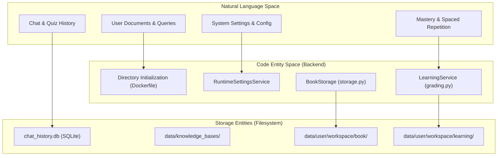
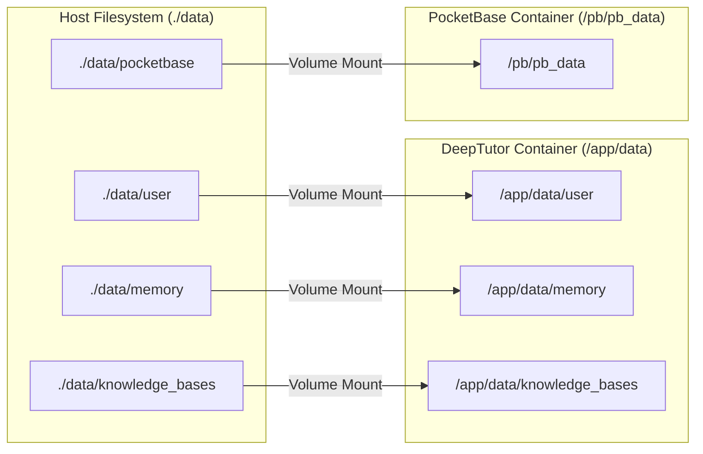

# 데이터 지속성 및 백업

<details>
<summary>관련 소스 파일</summary>

이 위키 페이지를 생성할 때 컨텍스트로 사용된 파일은 다음과 같습니다:

- [README.md](README.md)
- [assets/README/README_AR.md](assets/README/README_AR.md)
- [assets/README/README_CN.md](assets/README/README_CN.md)
- [assets/README/README_ES.md](assets/README/README_ES.md)
- [assets/README/README_FR.md](assets/README/README_FR.md)
- [assets/README/README_HI.md](assets/README/README_HI.md)
- [assets/README/README_JA.md](assets/README/README_JA.md)
- [assets/README/README_PL.md](assets/README/README_PL.md)
- [assets/README/README_PT.md](assets/README/README_PT.md)
- [assets/README/README_RU.md](assets/README/README_RU.md)
- [assets/README/README_TH.md](assets/README/README_TH.md)
- [deeptutor/book/storage.py](deeptutor/book/storage.py)
- [deeptutor/learning/grading.py](deeptutor/learning/grading.py)
- [deeptutor/learning/tests/test_grading.py](deeptutor/learning/tests/test_grading.py)

</details>


이 페이지는 DeepTutor의 데이터 지속성 아키텍처, 디렉터리 구조, 백업 전략을 설명합니다. 무엇이 어디에 저장되는지, 그리고 중앙화된 파일 기반 접근 방식을 사용해 재시작 간 상태를 어떻게 관리하는지를 다룹니다.

DeepTutor는 컨테이너화와 쉬운 마이그레이션을 위해 설계된 파일 기반 지속성 모델을 사용합니다. 모든 시스템 상태, 사용자 활동, 지식 베이스는 중앙화된 `data/` 디렉터리 또는 `multi-user/` 작업 공간 안에 저장됩니다.

## 데이터 지속성 아키텍처

DeepTutor는 **파일 기반 지속성 모델**을 따르며, 모든 사용자 데이터, 지식 베이스, 시스템 상태를 디스크의 파일로 저장합니다. 이 설계는 단순한 백업 전략, 쉬운 데이터 마이그레이션, 다양한 환경에서의 배포 유연성을 가능하게 합니다.

### 핵심 지속성 원칙

| Principle | Implementation |
|-----------|----------------|
| **단일 데이터 루트** | 모든 지속 데이터는 프로젝트 상대 경로인 `data/` 디렉터리 아래에 있습니다. |
| **관계적 무결성** | 채팅 기록, 턴, 메시지는 SQLite 데이터베이스(`chat_history.db`)로 관리됩니다. |
| **사용자 격리** | 다중 사용자 모드에서는 데이터가 `multi-user/<user_id>/` 디렉터리로 범위 지정됩니다 [README.md:51-51](). |
| **무상태 애플리케이션** | 모든 상태는 디스크에 지속되며, 데이터 볼륨을 마운트하면 이미지에서 애플리케이션을 다시 생성할 수 있습니다 [docker-compose.yml:58-63](). |
| **사전 초기화된 구조** | 프로덕션 Docker 이미지는 볼륨 마운트가 올바른 권한을 갖도록 필요한 디렉터리 트리를 미리 생성합니다 [Dockerfile:158-173](). |

**자연어에서 코드 엔티티로: 데이터 지속성 흐름**



Sources: [Dockerfile:158-173](), [docker-compose.yml:58-63](), [deeptutor/learning/grading.py:1-3](), [deeptutor/book/storage.py:1-10]()

## 디렉터리 구조 참조

### 루트 데이터 디렉터리

지속성 계층은 `data/` 볼륨 내부의 주요 최상위 디렉터리로 구성됩니다. Docker 이미지는 애플리케이션 시작 전에 이 경로들이 존재하도록 보장합니다 [Dockerfile:158-173]().

```
data/
├── knowledge_bases/          # RAG indices and source documents [Dockerfile:173-173]
├── memory/                   # Persistent memory files (L1/L2/L3) [README.md:60-60]
└── user/                     # User-specific data [Dockerfile:160-160]
    ├── logs/                 # System and performance logs [Dockerfile:172-172]
    ├── settings/             # UI and Provider configurations [Dockerfile:160-160]
    └── workspace/            # Feature-specific artifacts
        ├── memory/           # Workspace-specific memory traces [Dockerfile:162-162]
        ├── notebook/         # Quiz records and learner profiles [Dockerfile:163-163]
        ├── learning/         # Mastery path and spaced repetition data
        └── chat/             # Agent-specific outputs
            ├── chat/         # Standard chat history [Dockerfile:166-166]
            ├── deep_solve/   # Smart Solver outputs [Dockerfile:167-167]
            ├── deep_research/# Research reports [Dockerfile:169-169]
            ├── math_animator/# Manim videos [Dockerfile:170-170]
```

### 특화 기능 저장소

DeepTutor는 교차 오염을 방지하고 모듈식 백업을 쉽게 하기 위해 기능별로 데이터를 분리합니다.

| Directory | Feature Mapping | Implementation Detail |
|:---|:---|:---|
| `workspace/learning/` | Mastery Path Engine | 채점된 기록과 오류 분류를 저장합니다 [deeptutor/learning/grading.py:52-61](). |
| `workspace/book/` | Living Book Engine | 책 페이지 지속성과 재빌드 흐름을 관리합니다 [README.md:76-76](). |
| `workspace/chat/deep_solve` | Smart Solver | 이중 루프 문제 해결 출력 [README.md:60-60](). |
| `workspace/chat/deep_research` | Deep Research | 다중 에이전트 연구 보고서와 노트 [README.md:60-60](). |

Sources: [Dockerfile:158-173](), [deeptutor/learning/grading.py:1-64](), [README.md:47-76]()

## 지속성 구현

### 학습 및 숙련도 지속성
`LearningService`는 학생 진도를 지속 저장하기 위해 결정적 채점과 오류 분류를 사용합니다.
- **채점 로직**: 답변은 유형(`choice`, `short`, `open`)에 따라 문자열 정규화 또는 `SequenceMatcher`를 사용해 채점됩니다 [deeptutor/learning/grading.py:13-49]().
- **오류 분류**: 오답은 숙련도 경로에 반영되도록 `METACOGNITIVE`(공백) 또는 `APPLICATION_ERROR`로 분류됩니다 [deeptutor/learning/grading.py:52-61]().

### Docker 볼륨 매핑
컨테이너화된 배포에서는 호스트-컨테이너 볼륨 마운트를 통해 지속성을 구현합니다. `docker-compose.yml` 파일은 로컬 호스트 디렉터리를 컨테이너의 사전 생성된 경로에 매핑합니다 [docker-compose.yml:58-63]().

**자연어에서 코드 엔티티로: Docker 지속성 매핑**



Sources: [docker-compose.yml:33-34](), [docker-compose.yml:58-63](), [docker-compose.dev.yml:37-40]()

## 백업 및 마이그레이션 전략

### 백업 체크리스트
일관된 백업을 보장하려면 `data/` 디렉터리에서 다음 구성 요소를 아카이브해야 합니다:
1. **관계형 데이터**: `user/chat_history.db`(SQLite) 또는 외부 인증이 활성화된 경우 `data/pocketbase` 디렉터리 [docker-compose.yml:33-34]().
2. **구성**: 공급자 프로필과 에이전트 구성을 포함하는 `user/settings/` 디렉터리.
3. **지식 베이스**: 벡터 인덱스와 RAG 소스 파일이 들어 있는 `knowledge_bases/` 디렉터리 [README.md:78-78]().
4. **메모리**: 3계층 메모리 추적(L1/L2/L3)을 포함하는 `memory/` 디렉터리 [README.md:60-60]().
5. **학습 진행 상황**: 숙련도 게이트와 반복 일정을 포함하는 `user/workspace/learning/`.

### 보안 및 비밀 정보
DeepTutor는 민감한 정보가 커밋되는 것을 막기 위해 secrets baseline을 사용합니다. 구성을 백업할 때는 JSON/YAML 구성이나 `.env` 파일에 저장된 API 키를 안전하게 처리해야 합니다 [.secrets.baseline:1-124]().

### 제외 항목
이 시스템은 애플리케이션 코드와 정적 자산을 사용자 데이터와 분리하도록 설계되었습니다. 개발 모드에서는 소스 코드를 읽기 전용으로 마운트하고, 데이터 디렉터리는 쓰기 가능 상태로 유지합니다 [docker-compose.dev.yml:21-41]().

Sources: [docker-compose.yml:33-34](), [docker-compose.dev.yml:21-41](), [.secrets.baseline:1-124](), [Dockerfile:158-173](), [README.md:60-78]()
