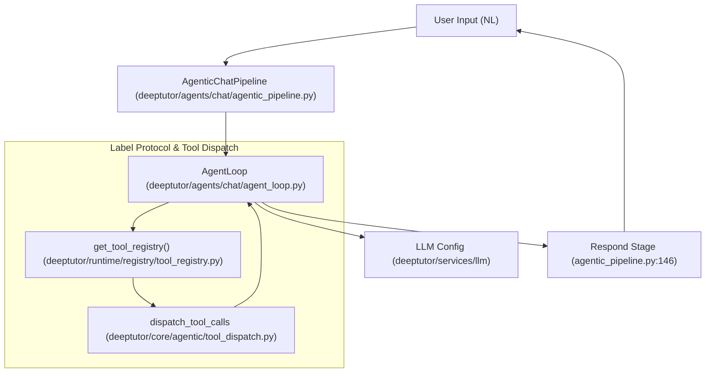
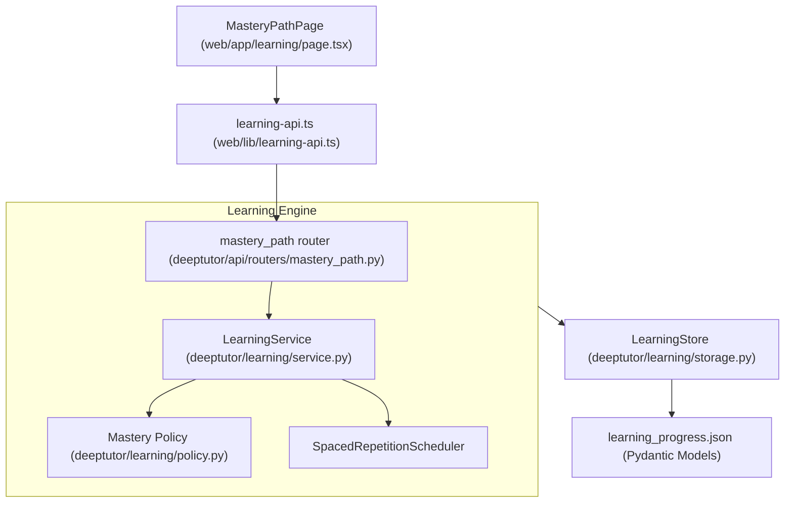

# 용어집

관련 소스 파일

이 위키 페이지를 생성할 때 컨텍스트로 사용된 파일은 다음과 같습니다:

- [README.md](README.md)
- [assets/README/README_AR.md](assets/README/README_AR.md)
- [assets/README/README_CN.md](assets/README/README_CN.md)
- [assets/README/README_ES.md](assets/README/README_ES.md)
- [assets/README/README_FR.md](assets/README/README_FR.md)
- [assets/README/README_HI.md](assets/README/README_HI.md)
- [assets/README/README_JA.md](assets/README/README_JA.md)
- [assets/README/README_PL.md](assets/README/README_PL.md)
- [assets/README/README_PT.md](assets/README/README_PT.md)
- [assets/README/README_RU.md](assets/README/README_RU.md)
- [assets/README/README_TH.md](assets/README/README_TH.md)
- [deeptutor/agents/chat/agentic_pipeline.py](deeptutor/agents/chat/agentic_pipeline.py)
- [deeptutor/learning/models.py](deeptutor/learning/models.py)
- [deeptutor/learning/tests/test_api_endpoints.py](deeptutor/learning/tests/test_api_endpoints.py)
- [deeptutor/learning/tests/test_guided_mastery_updates.py](deeptutor/learning/tests/test_guided_mastery_updates.py)
- [deeptutor/learning/tests/test_models.py](deeptutor/learning/tests/test_models.py)
- [deeptutor/learning/tests/test_scheduler.py](deeptutor/learning/tests/test_scheduler.py)
- [deeptutor/learning/tests/test_storage.py](deeptutor/learning/tests/test_storage.py)
- [deeptutor/tools/mastery_tool.py](deeptutor/tools/mastery_tool.py)
- [site/src/content/docs/docs/cli/agent-handoff.md](site/src/content/docs/docs/cli/agent-handoff.md)
- [site/src/content/docs/docs/cli/commands.md](site/src/content/docs/docs/cli/commands.md)
- [site/src/content/docs/zh-cn/docs/cli/agent-handoff.md](site/src/content/docs/zh-cn/docs/cli/agent-handoff.md)
- [site/src/content/docs/zh-cn/docs/cli/commands.md](site/src/content/docs/zh-cn/docs/cli/commands.md)
- [web/app/(workspace)/learning/page.tsx](web/app/(workspace)/learning/page.tsx)
- [web/app/globals.css](web/app/globals.css)
- [web/components/sidebar/SidebarShell.tsx](web/components/sidebar/SidebarShell.tsx)
- [web/components/ui/Tooltip.tsx](web/components/ui/Tooltip.tsx)
- [web/lib/learning-api.ts](web/lib/learning-api.ts)
- [web/locales/en/app.json](web/locales/en/app.json)
- [web/locales/zh/app.json](web/locales/zh/app.json)

이 용어집은 DeepTutor 코드베이스에서 사용되는 기술 용어, 아키텍처 패턴, 내부 전문 용어를 정의합니다. 에이전트 네이티브 설계, 3계층 메모리 서브시스템, 다양한 지능형 모듈을 탐색하는 데 도움을 주도록 구성되었습니다.

## 핵심 개념

### Agent-Native
모든 시스템 기능이 UI를 통해 인간에게도, 구조화된 인터페이스를 통해 AI 에이전트에게도 동등하게 접근 가능하도록 구축되는 설계 철학입니다 [README.md:5-6](). DeepTutor에서는 이것이 `SKILL.md` 형식과 `ClawHub` 레지스트리로 구현되어, 에이전트가 시스템 도구를 자율적으로 사용할 수 있게 합니다 [README.md:49-50]().

### TutorBot (Partners)
자율적이고 영속적인 AI 튜터 인스턴스입니다. 상태 없는 챗봇과 달리 TutorBot은 자신만의 작업 공간, 지속 메모리, 특정 스킬 집합을 가집니다 [README.md:51-52](). 이는 `TutorBotManager` 수명 주기에 의해 구동되며 Telegram, Discord, Slack, Zulip 같은 15개 이상의 메시징 채널을 지원합니다 [README.md:51-52]().

### Auto Mode
복잡한 사용자 요청을 원자적인 도구 호출로 분해해 처리하는 3단계 agentic capability router입니다. `ANALYZING` -> `DELEGATING` -> `SYNTHESIZING` 수명 주기를 따릅니다 [README.md:60-61](). 구현은 `AutoPipeline`을 중심으로 이루어집니다.

### Memory v2 (Three-Layer Memory)
v1.4.0에서 도입된 정교한 메모리 서브시스템입니다 [README.md:60-61]().
*   **L1 (Trace):** 단기 런타임 상호작용 로그.
*   **L2 (Surface Summaries):** 표면별(예: 특정 채팅 또는 책 페이지) 요약.
*   **L3 (Knowledge):** 표면 간 통합된 학습자 프로필과 영속 엔티티.
`MemoryConsolidator`가 관리합니다 [README.md:60-61]().

### Living Book (Book Engine)
다중 에이전트 파이프라인이 생성하는 구조화된 대화형 교육 콘텐츠 형식입니다 [README.md:76-77](). 14가지 블록 유형(예: `quiz`, `concept_graph`, `flash_cards`, `animation`)을 지원하고 페이지별 채팅 지속성을 처리합니다 [README.md:76-77]().

### Mastery Path
hard gate와 spaced repetition을 갖춘 mastery 기반 학습 엔진입니다 [README.md:47-48](). `LearningProgress`를 `DIAGNOSTIC`, `EXPLAIN`, `FEYNMAN_CHECK` 같은 단계로 추적합니다 [deeptutor/learning/models.py:61-72]().

Sources: [README.md:5-77](), [deeptutor/learning/models.py:61-72]().

---

## 아키텍처 구성 요소

### ChatOrchestrator
스트리밍 이벤트 버스, 도구 레지스트리, 에이전트 capability를 연결하는 중앙 런타임 엔진입니다. `RunMode`를 관리하고 동일 capability 쿼터와 재시도 예산이 준수되도록 보장합니다 [README.md:60-61]().

### AgenticChatPipeline
탐색 루프 에이전트를 위한 채팅 capability 조립기입니다. 탐색(도구 사용)에서 최종 응답 생성으로의 전환을 조율합니다 [deeptutor/agents/chat/agentic_pipeline.py:145-146]().

### Tool Registry & Capability Registry
시스템의 "플러그인" 아키텍처입니다. 도구는 `get_tool_registry` 헬퍼가 관리하며 [deeptutor/agents/chat/agentic_pipeline.py:158-158](), Smart Solver나 Deep Research 같은 상위 수준 모듈은 `agentic_pipeline`을 통해 조율됩니다.

### Label Protocol
에이전트 루프와 LLM 사이의 통신 계약입니다. 파이프라인의 다음 단계를 결정하기 위해 `TOOL` 호출이나 `FINISH` 신호 같은 특정 마커를 사용합니다 [deeptutor/agents/chat/agentic_pipeline.py:18-26]().

Sources: [README.md:60-61](), [deeptutor/agents/chat/agentic_pipeline.py:145-158]().

---

## 기술 용어 및 전문 용어

| Term | Definition | Code Pointer |
| :--- | :--- | :--- |
| **Thinking Block** | DeepSeek-R1 같은 추론 가능한 모델의 내부 추론 과정을 보여주는 UI 컴포넌트입니다. | [README.md:70-71]() |
| **Feynman Check** | 튜터가 학습자의 개념 설명을 평가하는 질적 게이트입니다. | [deeptutor/learning/models.py:68-68]() |
| **Consolidator Pipeline** | Memory 계층 간 데이터를 이동시키는 프로세스입니다(Update/Audit/Dedup/Merge 모드). | [README.md:60-61]() |
| **Vision Solver** | 기하학적 분석과 도형 재구성을 위해 GeoGebra를 사용하는 capability입니다. | [web/locales/en/app.json:76-80]() |
| **Grant System** | 다중 사용자 모드에서 특정 모델, KB, Skill을 사용자에게 할당하는 관리 계층입니다. | [README.md:68-69]() |
| **Turn Runtime** | 개별 사용자-에이전트 상호작용 사이클을 관리하는 재시작 안전 런타임입니다. | [README.md:60-61]() |
| **SpacedRepetitionScheduler** | `INTERVAL_SEQUENCES`를 기반으로 다음 복습 시간을 계산하는 엔진입니다. | [deeptutor/learning/models.py:144-152]() |
| **DeferredToolLoader** | 런타임 컨텍스트나 외부 초기화가 필요한 도구를 불러오는 유틸리티입니다. | [deeptutor/agents/chat/agentic_pipeline.py:38-40]() |

Sources: [README.md:60-71](), [deeptutor/learning/models.py:68-152](), [web/locales/en/app.json:76-80](), [deeptutor/agents/chat/agentic_pipeline.py:38-40]().

---

## 데이터 흐름 다이어그램

### 에이전틱 루프 수명 주기
이 다이어그램은 자연어 상호작용이 `AgenticChatPipeline` 및 `LLM` 제공자 로직과 어떻게 연결되는지를 보여줍니다.

"Natural Language Space to Code Entity Space: Agentic Loop"

**Sources:** [deeptutor/agents/chat/agentic_pipeline.py:145-188](), [deeptutor/core/agentic/tool_dispatch.py:27-27]().

### Mastery Path 학습 엔진
이 다이어그램은 프런트엔드 `MasteryPathPage`에서 백엔드 `LearningService`와 저장소로 이어지는 흐름을 보여줍니다.

"Natural Language Space to Code Entity Space: Mastery Path"

**Sources:** [web/app/learning/page.tsx:37-45](), [web/lib/learning-api.ts:1-111](), [deeptutor/learning/models.py:185-214]().

---

## CLI 명령 용어집

`deeptutor` CLI는 agent-native 작업을 위한 주요 진입점입니다.

*   `deeptutor run`: 특정 capability 또는 에이전트 파이프라인을 실행합니다 [README.md:66-67]().
*   `deeptutor chat`: 터미널 기반 튜터링을 위한 REPL을 시작합니다 [README.md:66-67]().
*   `deeptutor serve`: FastAPI 백엔드 서버를 시작합니다 [README.md:66-67]().
*   `deeptutor start`: 전체 스택을 실행하기 위한 편의 명령입니다 [README.md:66-67]().
*   `deeptutor kb`: knowledge base를 관리합니다(create, add, search, set-default) [README.md:72-73]().
*   `deeptutor memory`: L1/L2/L3 memory 작업 공간에 접근합니다 [README.md:62-63]().
*   `deeptutor skill`: ClawHub에서 커뮤니티 skill을 설치합니다 [README.md:49-50]().

Sources: [README.md:49-73]().
