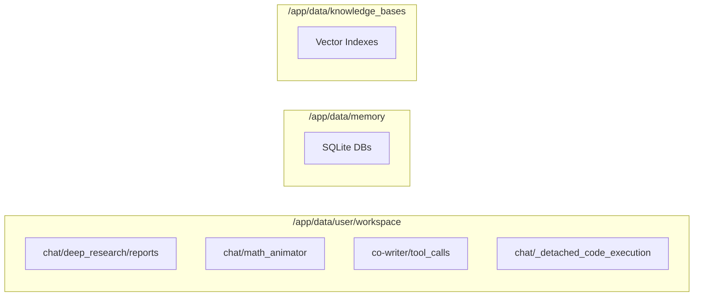

# Docker 배포

<details>
<summary>관련 소스 파일</summary>

다음 파일들은 이 위키 페이지를 생성할 때 참고한 컨텍스트로 사용되었습니다:

- [.dockerignore](.dockerignore)
- [.gitattributes](.gitattributes)
- [.github/pull_request_template.md](.github/pull_request_template.md)
- [.secrets.baseline](.secrets.baseline)
- [CONTRIBUTING.md](CONTRIBUTING.md)
- [Dockerfile](Dockerfile)
- [deeptutor/agents/notebook/summarize_agent.py](deeptutor/agents/notebook/summarize_agent.py)
- [deeptutor/services/config/test_runner.py](deeptutor/services/config/test_runner.py)
- [docker-compose.dev.yml](docker-compose.dev.yml)
- [docker-compose.ghcr.yml](docker-compose.ghcr.yml)
- [docker-compose.yml](docker-compose.yml)
- [tests/agents/notebook/__init__.py](tests/agents/notebook/__init__.py)
- [tests/api/test_main_notebook_router.py](tests/api/test_main_notebook_router.py)
- [tests/services/config/test_llm_probe_config.py](tests/services/config/test_llm_probe_config.py)
- [tests/services/llm/test_factory_provider_exec.py](tests/services/llm/test_factory_provider_exec.py)
- [web/app/(workspace)/page.tsx](web/app/(workspace)/page.tsx)

</details>


## 목적과 범위

이 문서는 DeepTutor의 Docker 기반 배포 아키텍처에 대한 기술 개요를 제공합니다. 여기에는 `Dockerfile`에 정의된 멀티스테이지 빌드 과정, `supervisord`가 관리하는 프로세스 오케스트레이션, 그리고 서로 다른 네트워크 환경에서 Next.js 프론트엔드가 FastAPI 백엔드와 통신할 수 있게 해주는 런타임 환경 변수 주입 메커니즘이 포함됩니다.

---

## Docker 아키텍처 개요

DeepTutor는 이미지 크기와 빌드 성능을 최적화하기 위해 멀티스테이지 Docker 빌드를 사용합니다. 이 아키텍처는 무거운 프론트엔드 컴파일과 Python 의존성 해결을 서로 다른 단계로 분리하며, 최종적으로 두 서비스를 동시에 실행하는 통합된 프로덕션 이미지를 생성합니다.

### 시스템 구성 요소 연관

다음 다이어그램은 고수준 배포 단계와 그것이 관리하는 구체적인 코드 엔티티 및 스크립트를 연결합니다.

```mermaid
graph TB
    subgraph "Build Phase (Dockerfile)"
        ["frontend-builder"] -- "Compiles Static Assets" --> FB["web/.next/standalone"]
        ["python-base"] -- "Installs PyPI & System Deps" --> PB["site-packages"]
        ["production"] -- "Final Image" --> PI["/app"]
    end

    subgraph "Runtime Process Space"
        ["supervisord"] -- "manages" --> B["program:backend"]
        ["supervisord"] -- "manages" --> F["program:frontend"]
        
        B -- "executes" --> S1["/app/start-backend.sh"]
        F -- "executes" --> S2["/app/start-frontend.sh"]
        
        S1 -- "runs" --> P1["deeptutor.api.run_server"]
        S2 -- "runs" --> P2["node web/server.js"]
    end

    subgraph "Configuration Entities"
        [docker-compose.yml] -- "injects" --> E[".env"]
        E -- "defines" --> V1["NEXT_PUBLIC_API_BASE_EXTERNAL"]
        E -- "defines" --> V2["BACKEND_PORT"]
    end
```

**Sources:** [Dockerfile:1-173](), [docker-compose.yml:21-78](), [Dockerfile:186-208]()

---

## 멀티스테이지 빌드 과정

### 1. 프론트엔드 빌더 (`frontend-builder`)
이 단계는 `--platform=$BUILDPLATFORM`을 사용해 빌드 플랫폼에 네이티브하게 고정되며, 대상 아키텍처와 무관하게 정적 자산을 고성능으로 컴파일하도록 보장합니다 [Dockerfile:23]().

*   **구현**: 표준 `npm ci` 다음에 `npm run build`를 수행합니다 [Dockerfile:31-50]().
*   **Next.js Standalone**: 빌드는 `standalone` 출력 모드를 사용합니다. 이는 최소한의 `server.js`와 일부 `node_modules`만 생성하여 프로덕션 이미지 크기를 크게 줄입니다 [Dockerfile:48-50]().
*   **플레이스홀더 주입**: 런타임 API URL 구성을 가능하게 하기 위해, 빌드 중 `.env.local` 파일에 `__NEXT_PUBLIC_API_BASE_PLACEHOLDER__`와 `__NEXT_PUBLIC_AUTH_ENABLED_PLACEHOLDER__` 같은 고유 문자열을 주입합니다 [Dockerfile:43-46]().

### 2. Python 기본 이미지 (`python-base`)
이 단계는 백엔드 환경을 준비합니다.
*   **시스템 의존성**: `OpenCV`에 필요한 `libgl1`과 `libglib2.0-0`을 설치합니다(`mineru` 문서 처리 도구에서 사용) [Dockerfile:77-88]().
*   **Rust 툴체인**: `rustup`을 통해 Rust 컴파일러를 설치합니다 [Dockerfile:89](). 이는 특정 아키텍처에서 사전 빌드된 wheel이 없을 때 `tiktoken` 같은 Python 패키지를 소스에서 빌드하는 데 엄격히 필요합니다 [Dockerfile:76-77]().

### 3. 프로덕션 이미지 (`production`)
최종 단계는 깨끗한 `python:3.11-slim` 이미지로, 다음 항목을 가져옵니다:
*   **Node.js 런타임**: 바이너리 호환성을 보장하기 위해 플랫폼과 일치하는 `node-runtime` 단계에서 복사합니다 [Dockerfile:141-145]().
*   **프론트엔드 산출물**: 빌더에서 `.next/standalone` 디렉터리, `.next/static`, `public` 폴더만 복사합니다 [Dockerfile:154-156]().
*   **애플리케이션 소스**: `deeptutor` 코어 패키지, `deeptutor_cli`, 그리고 필요한 `scripts`를 복사합니다 [Dockerfile:159-161]().

**Sources:** [Dockerfile:17-165]()

---

## supervisord를 이용한 프로세스 오케스트레이션

DeepTutor는 컨테이너 내부의 두 주요 서비스 수명을 관리하기 위해 `supervisord`를 사용합니다. 이를 통해 백엔드 또는 프론트엔드가 중단되더라도 자동으로 재시작됩니다.

### 구성 세부 사항
구성은 `Dockerfile` 내부에서 `/etc/supervisor/conf.d/deeptutor.conf`로 동적으로 생성됩니다 [Dockerfile:185-187]().

| 프로그램 | 명령 | 로그 |
| :--- | :--- | :--- |
| `backend` | `/bin/bash /app/start-backend.sh` | Docker 로그 캡처를 통해 stdout/stderr로 전달됨 [Dockerfile:194-196]() |
| `frontend` | `/bin/bash /app/start-frontend.sh` | Docker 로그 캡처를 통해 stdout/stderr로 전달됨 [Dockerfile:198-200]() |

**Sources:** [Dockerfile:185-208]()

---

## 런타임 환경 변수 주입

Next.js는 `NEXT_PUBLIC_`로 시작하는 환경 변수를 빌드 시점에 인라인 처리하므로, DeepTutor는 이미지 재빌드 없이 런타임에 이를 변경할 수 있도록 엔트리포인트 스크립트에서 `sed` 기반 치환 전략을 사용합니다.

### 동적 URL 및 인증 해석
`start-frontend.sh` 스크립트(`Dockerfile`의 heredoc에 정의됨)는 Node 서버를 시작하기 전에 다음 로직을 수행합니다:
1.  **API URL**: 우선순위 `NEXT_PUBLIC_API_BASE_EXTERNAL` > `NEXT_PUBLIC_API_BASE` > 기본값 `http://localhost:8001`을 사용해 API URL을 결정합니다 [Dockerfile:221-236]().
2.  **인증 상태**: 환경 변수 또는 `auth.json`에서 `NEXT_PUBLIC_AUTH_ENABLED` 상태를 해석합니다 [Dockerfile:238-245]().
3.  **Sed 치환**: 컴파일된 JS 청크 내부의 플레이스홀더를 찾아 해석된 값으로 교체하기 위해 `sed`를 사용합니다 [Dockerfile:252-258]().

이 메커니즘은 **원격 서버 배포**에서 중요합니다. 이 경우 프론트엔드(사용자의 브라우저에서 실행됨)는 API 및 WebSocket 요청을 보내기 위해 서버의 공인 IP를 알아야 합니다 [docker-compose.ghcr.yml:23-37]().

**Sources:** [Dockerfile:211-260](), [docker-compose.ghcr.yml:23-37]()

---

## 데이터 흐름과 영속성

Docker 구성은 사용자 데이터, 지식 베이스, 메모리가 컨테이너 재시작 사이에서도 유지되도록 중요한 볼륨 마운트를 정의합니다.

### 볼륨 매핑

| 호스트 경로 | 컨테이너 경로 | 설명 |
| :--- | :--- | :--- |
| `./data` | `/app/data` | 모든 영속 상태를 포함하는 루트 데이터 디렉터리 [docker-compose.yml:66]() |
| `./data/user` | `/app/data/user` | `settings`, `logs`, `workspace` 파일을 포함 [docker-compose.ghcr.yml:51]() |
| `./data/memory` | `/app/data/memory` | 세션 및 학습자 메모리를 위한 SQLite 데이터베이스 [docker-compose.ghcr.yml:52]() |
| `./data/knowledge_bases` | `/app/data/knowledge_bases` | RAG 벡터 저장소와 처리된 문서 [docker-compose.ghcr.yml:53]() |

### 디렉터리 초기화
`Dockerfile`은 다양한 에이전트 출력과 도구별 저장소를 처리하기 위해 작업공간 내부에 깊은 디렉터리 구조를 미리 생성합니다. 여기에는 `deep_research/reports`, `math_animator`, `co-writer/tool_calls`가 포함됩니다 [Dockerfile:167-181]().



**Sources:** [Dockerfile:167-181](), [docker-compose.yml:58-66]()

---

## 배포 모드

DeepTutor는 세 가지 주요 Docker 배포 패턴을 지원합니다:

1.  **프로덕션(표준)**: `docker-compose.yml`을 사용해 이미지를 로컬에서 빌드하고, `pocketbase`와 `sandbox-runner` 사이드카를 포함한 최적화된 프로덕션 스택을 실행합니다 [docker-compose.yml:21-104]().
2.  **사전 빌드(GHCR)**: `docker-compose.ghcr.yml`을 사용해 공식 이미지를 `ghcr.io/hkuds/deeptutor`에서 가져오며, 로컬 빌드 도구가 필요하지 않습니다 [docker-compose.ghcr.yml:40-42]().
3.  **개발**: `docker-compose.dev.yml`을 오버라이드로 사용해 로컬 소스 코드(예: `deeptutor/`, `web/app/`)를 컨테이너에 마운트하고, 핫 리로딩을 활성화합니다 [docker-compose.dev.yml:12-35]().

### 로컬 LLM 통합
LLM 서버(예: Ollama, LM Studio)가 호스트 머신에서 실행되는 경우, 컨테이너가 호스트 네트워크에 도달할 수 있도록 제공자 `base_url`은 `localhost` 대신 `host.docker.internal`로 설정해야 합니다 [docker-compose.yml:16-18]().

**Sources:** [docker-compose.yml:1-104](), [docker-compose.ghcr.yml:1-68](), [docker-compose.dev.yml:1-52]()
