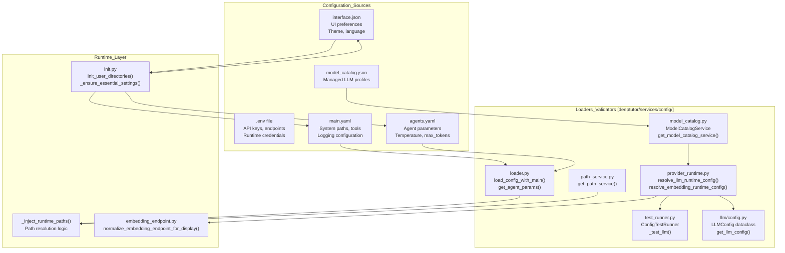
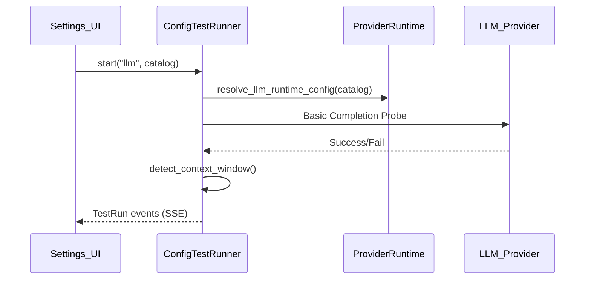

# 설정 가이드

관련 소스 파일

다음 파일들은 이 위키 페이지를 생성할 때 참고한 컨텍스트로 사용되었습니다:

- [README.md](README.md)
- [assets/README/README_AR.md](assets/README/README_AR.md)
- [assets/README/README_CN.md](assets/README/README_CN.md)
- [assets/README/README_ES.md](assets/README/README_ES.md)
- [assets/README/README_FR.md](assets/README/README_FR.md)
- [assets/README/README_HI.md](assets/README/README_HI.md)
- [assets/README/README_JA.md](assets/README/README_JA.md)
- [assets/README/README_PL.md](assets/README/README_PL.md)
- [assets/README/README_PT.md](assets/README/README_PT.md)
- [assets/README/README_RU.md](assets/README/README_RU.md)
- [assets/README/README_TH.md](assets/README/README_TH.md)
- [deeptutor/services/config/embedding_endpoint.py](deeptutor/services/config/embedding_endpoint.py)
- [deeptutor/services/config/launch_settings.py](deeptutor/services/config/launch_settings.py)
- [deeptutor/services/llm/config.py](deeptutor/services/llm/config.py)
- [scripts/start_tour.py](scripts/start_tour.py)
- [tests/scripts/test_start_tour.py](tests/scripts/test_start_tour.py)
- [tests/services/config/test_provider_runtime.py](tests/services/config/test_provider_runtime.py)
- [web/components/chat/home/ModelSelector.tsx](web/components/chat/home/ModelSelector.tsx)
- [web/tests/skill-slug.test.ts](web/tests/skill-slug.test.ts)

이 문서는 DeepTutor 구성에 대한 종합 가이드를 제공합니다. 여기에는 환경 변수, YAML 구성 파일, LLM 제공자 설정, 런타임 구성 관리가 포함됩니다. 배포별 구성 세부 사항은 [Docker Deployment](2.1)를 참고하세요.

---

## 구성 아키텍처 개요

DeepTutor는 환경 변수, YAML 파일, JSON 설정을 결합한 다층 구성 시스템을 사용합니다. 이 시스템은 분산된 에이전트 아키텍처 전반에서 일관성을 보장하기 위해 경로 해석과 에이전트 하이퍼파라미터를 중앙에서 관리합니다.

### 코드 엔티티 구성 맵

다음 다이어그램은 고수준 구성 개념을 이를 구현하는 코드베이스의 구체적인 클래스와 함수에 매핑합니다.

**구성 우선순위 순서**(높음에서 낮음):
1.  **컨텍스트 범위 구성**: 현재 async 컨텍스트에 대해 `set_scoped_llm_config`로 명시적으로 설정한 LLM 설정 [deeptutor/services/llm/config.py:136-138]().
2.  **모델 카탈로그**: 관리되는 LLM 프로필과 활성 모델. 사용자가 UI를 통해 설정을 사용자화하면 카탈로그가 단일 기준점이 됩니다 [deeptutor/services/config/test_runner.py:85-88]().
3.  **YAML 구성**: `main.yaml`과 `agents.yaml` [deeptutor/services/setup/init.py:161-166]().
4.  **기본값**: `init.py`에 하드코딩되어 첫 실행 시 JSON 및 YAML 파일을 초기화하는 데 사용됩니다 [deeptutor/services/setup/init.py:18-92]().

**Sources:** [deeptutor/services/llm/config.py:136-138](), [deeptutor/services/config/test_runner.py:85-88](), [deeptutor/services/setup/init.py:18-92](), [deeptutor/services/setup/init.py:161-166]()

---

## 환경 변수와 시작 설정

YAML과 JSON 파일이 에이전트 동작을 처리하는 동안, 환경 변수와 `LaunchSettings` 클래스는 서버 수준의 네트워킹과 인증을 관리합니다.

### 파일 위치와 로딩

수동 구성 설정의 기본 진입점은 `scripts/start_tour.py` 스크립트입니다. 이 스크립트는 대화형 안내를 제공하고 `run_init`에 위임해 `data/user/settings` 아래에 설정을 생성합니다 [scripts/start_tour.py:2-10](), [scripts/start_tour.py:43-47](). 포트와 같은 시작 설정은 `launch_settings.py`에서 관리됩니다 [deeptutor/services/config/launch_settings.py:9-10]().

DeepTutor는 런타임 구성을 읽고 모듈 임포트 시점에 `OPENAI_API_KEY`와 `OPENAI_BASE_URL`을 설정함으로써 OpenAI 호환 SDK를 위한 초기 환경 설정도 수행합니다 [deeptutor/services/llm/config.py:75-92]().

**Sources:** [scripts/start_tour.py:2-10](), [scripts/start_tour.py:43-47](), [deeptutor/services/config/launch_settings.py:9-10](), [deeptutor/services/llm/config.py:75-92]()

### 서버 및 네트워킹 구성

| 변수 / 설정 | 설명 | 기본값 |
| :--- | :--- | :--- |
| `backend_port` | `load_launch_settings`를 통해 해석되는 FastAPI 서버 포트 [deeptutor/services/setup/init.py:209-220]() | `8001` |
| `NEXT_PUBLIC_API_BASE` | Next.js 클라이언트용 직접 백엔드 URL [web/tests/api-resolve-base.test.ts:6]() | `http://localhost:8001/api` |
| `AUTH_ENABLED` | 인증 및 다중 사용자 모드 활성화 [deeptutor/services/config/runtime_settings.py:27]() | `false` |
| `DISABLE_SSL_VERIFY` | SDK 제공자에 대한 SSL 검증 비활성화 [README.md:64]() | `false` |

**Sources:** [deeptutor/services/setup/init.py:209-220](), [web/tests/api-resolve-base.test.ts:4-6](), [deeptutor/services/config/runtime_settings.py:27](), [README.md:64]()

### LLM 및 Embedding 구성

DeepTutor는 제공자에 대해 정규화된 런타임 해석을 사용합니다. LLM 및 Embedding 설정은 `provider_runtime.py`를 통해 처리되며 `LLMConfig` dataclass에 캡슐화됩니다 [deeptutor/services/llm/config.py:95-114]().

**LLM 구성 (`get_llm_config`를 통해 해석):**

| 필드 | 설명 | 요구 사항 |
| :--- | :--- | :--- |
| `model` | 특정 모델 식별자(예: gpt-4o) | 필수 [deeptutor/services/llm/config.py:165-168]() |
| `api_key` | 제공자용 인증 토큰 | 필수 |
| `base_url` | API 엔드포인트 URL | 선택 사항 [deeptutor/services/llm/config.py:101]() |
| `binding` | 사용할 SDK/어댑터(openai, anthropic 등) | 기본값: "openai" [deeptutor/services/llm/config.py:103]() |
| `reasoning_effort` | thinking 모델의 노력 수준 | 선택 사항 [deeptutor/services/llm/config.py:108]() |

**Embedding 구성 (`resolve_embedding_runtime_config`를 통해 해석):**

| 변수 | 설명 | 요구 사항 |
| :--- | :--- | :--- |
| `binding` | 제공자 유형(openai, cohere, jina 등) [deeptutor/services/config/test_runner.py:110]() | 제공자 레지스트리와 일치하는 정식 이름 |
| `base_url` | **전체 엔드포인트 URL** | 어댑터는 URL을 그대로 사용하며, 정규화가 올바른 경로를 보장합니다 [deeptutor/services/config/embedding_endpoint.py:67-93]() |
| `dimension` | 벡터 차원 | 연결 테스트 중 프로브가 감지한 차원으로 덮어쓰기 [deeptutor/services/config/test_runner.py:132-153]() |

**Sources:** [deeptutor/services/llm/config.py:95-114](), [deeptutor/services/llm/config.py:165-168](), [deeptutor/services/config/test_runner.py:110](), [deeptutor/services/config/embedding_endpoint.py:67-93](), [deeptutor/services/config/test_runner.py:132-153]()

---

## YAML 구성

YAML 파일은 시스템 동작을 위한 구조화된 설정을 제공합니다. 이들은 `loader.py` 모듈이 관리하고 `init.py`가 초기화합니다.

### 경로 해석과 주입
필수 사용자 디렉터리는 필요 시 초기화되며, 필수 설정 파일은 시작 시 생성됩니다 [deeptutor/services/setup/init.py:109-150]().

| 경로 키 | 해석된 디렉터리 | 사용처 |
| :--- | :--- | :--- |
| `user_data_dir` | `data/user/` | 사용자 루트 디렉터리 [deeptutor/services/setup/init.py:120]() |
| `workspace` | `data/user/workspace/` | 에이전트 작업 공간 [deeptutor/services/setup/init.py:127]() |
| `notebook` | `data/user/workspace/notebook/` | 저장된 노트와 기록 [deeptutor/services/setup/init.py:128]() |
| `research` | `data/user/workspace/chat/deep_research/` | 리서치 에이전트 산출물 [deeptutor/services/setup/init.py:136]() |

**Sources:** [deeptutor/services/setup/init.py:109-150](), [deeptutor/services/setup/init.py:120-136]()

### 에이전트 하이퍼파라미터 (agents.yaml)
`agents.yaml` 파일에는 다양한 에이전트 기능에 대한 하이퍼파라미터가 포함되어 있습니다 [deeptutor/services/setup/init.py:70-93]().

*   **기능**: `solve`(temp: 0.3), `research`(temp: 0.5), `question`(temp: 0.7), `chat`(temp: 0.2)에 대한 기본 설정 [deeptutor/services/setup/init.py:72-78]().
*   **토큰 제한**: 채팅의 `responding`(8000)과 `answer_now`(8000) 같은 단계별 제한 [deeptutor/services/setup/init.py:79-80]().
*   **진단**: 연결 테스트 중 사용되는 `llm_probe`의 설정(기본 max_tokens: 4096) [tests/services/config/test_llm_probe_config.py:32-41]().

**Sources:** [deeptutor/services/setup/init.py:70-93](), [tests/services/config/test_llm_probe_config.py:32-41]()

---

## LLM 제공자 검증 및 테스트

DeepTutor는 프로덕션에서 사용되기 전에 LLM 및 Embedding 구성을 검증하기 위한 `ConfigTestRunner`를 제공합니다.

*   **연결 프로브**: 시스템은 API 키와 엔드포인트를 검증하기 위해 기본 completion을 수행합니다 [deeptutor/services/config/test_runner.py:200-205]().
*   **차원 감지**: Embedding 제공자의 경우 테스트 러너가 실제 출력 차원을 프로브하고 `_persist_embedding_dimension`을 통해 이를 `model_catalog.json`에 다시 저장합니다 [deeptutor/services/config/test_runner.py:132-153]().
*   **엔드포인트 정규화**: `embedding_endpoint.py` 유틸리티는 사용자가 제공한 URL이 어댑터가 요구하는 전체 경로로 수정되도록 보장합니다(예: OpenAI 호환 제공자의 경우 `/v1/embeddings` 추가) [deeptutor/services/config/embedding_endpoint.py:67-93]().

**Sources:** [deeptutor/services/config/test_runner.py:132-153](), [deeptutor/services/config/test_runner.py:200-205](), [deeptutor/services/config/embedding_endpoint.py:67-93]()

---

## 설정 마법사와 CLI 구성

DeepTutor는 초기 구성을 단순화하기 위해 대화형 설정 마법사(`deeptutor init`)와 설정 투어 스크립트(`scripts/start_tour.py`)를 포함합니다.

*   **초기화**: `scripts/start_tour.py`는 의존성을 설치하지 않고 `data/user/settings` 아래의 설정을 생성하거나 갱신합니다 [scripts/start_tour.py:25-39]().
*   **마법사 도우미**: `init_wizard.py`는 라이브 API 탐색이 실패할 때를 대비한 폴백 모델 목록을 포함하여, 주요 LLM 및 embedding 제공자의 선별 목록을 제공합니다 [deeptutor_cli/init_wizard.py:33-107]().
*   **검색 제공자**: Brave, Tavily, Jina, Serper 등 여러 검색 엔진을 지원하며, API 키에 대한 환경 변수 자동 감지를 제공합니다 [deeptutor_cli/init_wizard.py:129-185]().

**Sources:** [scripts/start_tour.py:25-39](), [deeptutor_cli/init_wizard.py:33-107](), [deeptutor_cli/init_wizard.py:129-185]()
