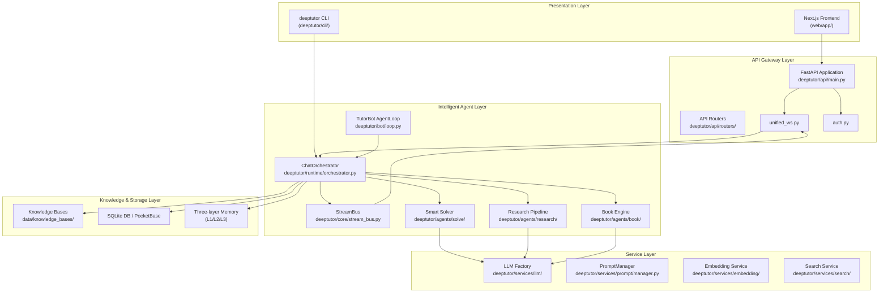
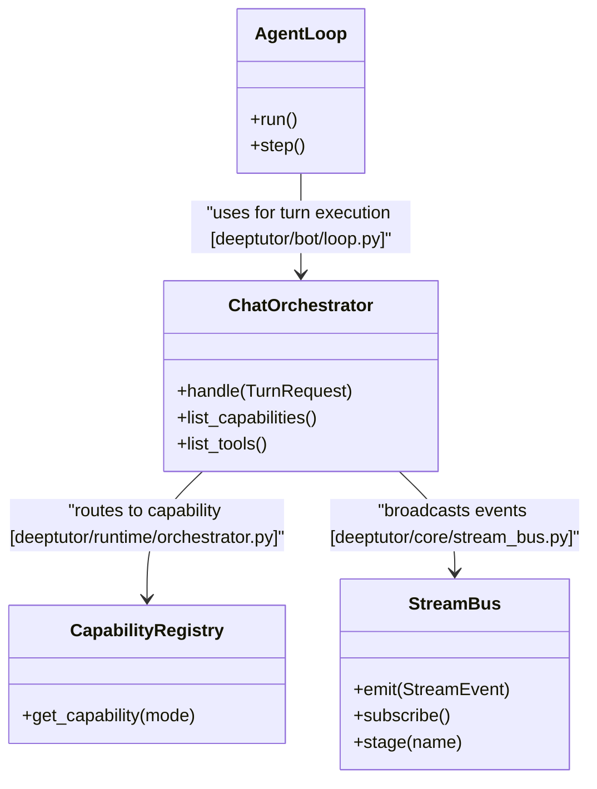
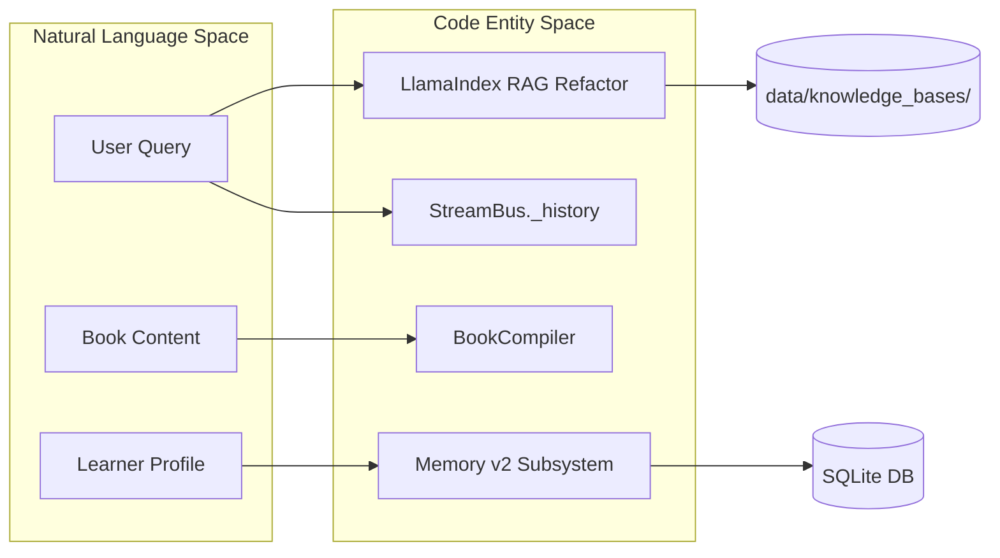

# 시스템 아키텍처

관련 소스 파일

다음 파일들은 이 위키 페이지를 생성할 때 참고한 컨텍스트로 사용되었습니다:

- [README.md](README.md)
- [assets/README/README_AR.md](assets/README/README_AR.md)
- [assets/README/README_CN.md](assets/README/README_CN.md)
- [assets/README/README_ES.md](assets/README/README_ES.md)
- [assets/README/README_FR.md](assets/README/README_FR.md)
- [assets/README/README_HI.md](assets/README/README_HI.md)
- [assets/README/README_JA.md](assets/README/README_JA.md)
- [assets/README/README_PL.md](assets/README/README_PL.md)
- [assets/README/README_PT.md](assets/README/README_PT.md)
- [assets/README/README_RU.md](assets/README/README_RU.md)
- [assets/README/README_TH.md](assets/README/README_TH.md)
- [deeptutor/core/stream_bus.py](deeptutor/core/stream_bus.py)
- [deeptutor/runtime/orchestrator.py](deeptutor/runtime/orchestrator.py)
- [tests/runtime/test_orchestrator.py](tests/runtime/test_orchestrator.py)

**목적**: 이 문서는 DeepTutor의 전체 아키텍처를 설명하며, 네 개의 주요 계층이 어떻게 상호작용하여 AI 기반 학습 도우미를 제공하는지 다룹니다. 여기에는 고수준 구조, 통신 패턴, 배포 모델이 포함됩니다. 특정 구성 요소에 대한 자세한 정보는 [Frontend Architecture](#3.1), [Data Flow and Storage](#3.3), [Runtime and Orchestration](#3.4)를 참고하세요.

---

## 아키텍처 개요

DeepTutor는 프레젠테이션, 오케스트레이션, 인텔리전스, 영속성 사이의 책임을 분리하는 **4계층 아키텍처**를 구현합니다. 이 시스템은 웹 기반 및 CLI 상호작용을 모두 지원하며, 스트리밍 이벤트 버스로 구동되는 실시간 양방향 통신을 제공합니다 [deeptutor/core/stream_bus.py:1-18]().

### 계층 다이어그램: 전체 시스템 구조

**Sources**: [README.md:119-126](), [deeptutor/core/stream_bus.py:31-39](), [deeptutor/runtime/orchestrator.py:1-20]()

---

## 프레젠테이션 계층

프레젠테이션 계층은 풍부한 웹 인터페이스와 agent-native CLI라는 두 가지 주요 상호작용 모드를 제공합니다.

### 웹 프론트엔드: Next.js 애플리케이션

웹 프론트엔드는 Next.js 16을 사용한 현대적인 React 기반 UI를 구현합니다 [README.md:28](). 이 프론트엔드는 구성 관리를 위해서는 REST를, 에이전트 응답 스트리밍을 위해서는 WebSocket을 통해 백엔드와 통신합니다.

**주요 특징**:
- **통합 채팅 작업공간**: 같은 컨텍스트를 공유하는 여러 모드(Chat, Deep Solve, Quiz, Research, Animator, Visualize) [README.md:119-124]().
- **AI Co-Writer**: 다중 문서 협업을 위한 대화형 Markdown 작업공간 [README.md:120-120]().
- **WebSocket 프로토콜**: 실시간 스트리밍, 하트비트, 자동 재연결 지원 [README.md:90-90]().

자세한 내용은 [Frontend Architecture](#3.1)를 참고하세요.

### Agent-Native CLI

CLI는 모든 시스템 기능, 지식 베이스, TutorBot에 직접 접근할 수 있는 인터페이스를 제공합니다 [README.md:126-126](). 이를 통해 사용자는 세션을 관리하고 터미널에서 직접 에이전트 턴을 실행할 수 있습니다.

**Sources**: [README.md:126-126](), [README.md:37-37]()

---

## API 게이트웨이 계층

API 게이트웨이는 FastAPI로 구동되며, 프론트엔드와 에이전트 런타임 사이의 다리 역할을 합니다.

### 통신 패턴

DeepTutor는 하이브리드 통신 전략을 사용합니다:
- **REST API**: 설정 관리, 사용자 인증, 지식 베이스 구성 같은 동기 작업을 처리합니다.
- **통합 WebSocket**: 오케스트레이터와 클라이언트 사이의 실시간 이벤트 버스를 조정하며, `StreamBus`를 통해 스트리밍 reasoning thinking-block을 지원합니다 [deeptutor/core/stream_bus.py:40-47]().

자세한 내용은 [API Layer](#12)를 참고하세요.

---

## 지능형 에이전트 및 오케스트레이션 계층

이 계층에는 문제 해결, 조사, 자율 튜터링을 위한 핵심 로직이 포함됩니다.

### 자연어에서 코드 엔티티로의 매핑

다음 다이어그램은 고수준 시스템 개념을 이를 구현하는 구체적인 클래스와 파일에 매핑합니다.

**핵심 구성 요소**:
- **ChatOrchestrator**: 컨텍스트를 올바른 기능으로 라우팅하는 중앙 런타임 [deeptutor/runtime/orchestrator.py:1-20]().
- **StreamBus**: `CONTENT`, `THINKING`, `TOOL_CALL` 같은 `StreamEvent` 타입을 처리하는 단일 채팅 턴용 팬아웃 비동기 이벤트 버스 [deeptutor/core/stream_bus.py:31-37](), [deeptutor/core/stream_bus.py:157-164]().
- **TutorBot Agent Loop**: Telegram, Discord, Zulip 같은 메시징 플랫폼에 통합할 수 있는 지속형 자율 AI 튜터 [README.md:51-51]().

자세한 내용은 [Runtime and Orchestration](#3.4)를 참고하세요.

---

## 데이터 흐름 및 저장 계층

DeepTutor는 사용자 지식과 에이전트 메모리 모두의 영속성을 강조합니다.

### 영속성 구조

| 데이터 유형 | 코드 엔티티 / 경로 | 저장 메커니즘 |
|-----------|-------------------|-------------------|
| **Knowledge Bases** | `data/knowledge_bases/` | 버전 관리된 인덱스와 재인덱싱 워크플로를 갖춘 벡터 DB [README.md:78-78]() |
| **Settings** | `agents.yaml` | LLM 진단 프로브에 사용되는 YAML 구성 [README.md:88-88]() |
| **Sessions** | `SQLite` | 채팅 기록과 세션 스냅샷을 위한 영속 저장소 [README.md:72-72]() |
| **Memory** | `MemoryConsolidator` | 3계층 서브시스템(L1 trace/L2 summaries/L3 cross-surface knowledge) [README.md:51-53]() |

### 데이터 상호작용 다이어그램

자세한 내용은 [Data Flow and Storage](#3.3)를 참고하세요.

---

## 배포 및 운영

DeepTutor는 유연성을 고려해 설계되었으며, Docker, 로컬 Python 환경, 다양한 LLM 제공자를 지원합니다.

**주요 운영 기능**:
- **다중 사용자 모드**: 격리된 사용자 작업공간, 관리자 권한 부여, 범위가 지정된 런타임 접근을 제공하는 선택적 배포 [README.md:62-62]().
- **다중 제공자 LLM Factory**: OpenAI, Anthropic, Gemini, NVIDIA NIM, 그리고 LM Studio와 llama.cpp 같은 로컬 제공자를 지원합니다 [README.md:72-72]().
- **이벤트 버스 오케스트레이션**: `StreamBus`는 여러 소비자(CLI 렌더러, WebSocket 푸셔)가 같은 에이전트 턴 이벤트를 동시에 구독할 수 있게 합니다 [deeptutor/core/stream_bus.py:5-6]().

**Sources**: [README.md:62-62](), [README.md:72-72](), [deeptutor/core/stream_bus.py:5-18](), [deeptutor/runtime/orchestrator.py:1-20]()
