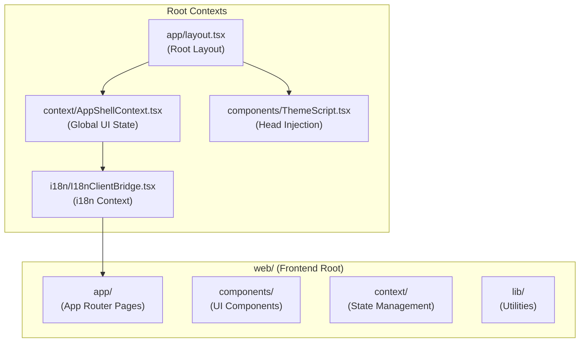
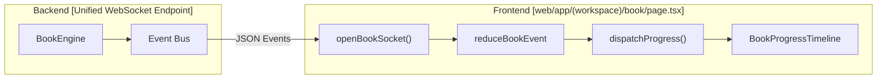

# 프론트엔드 아키텍처

관련 소스 파일

다음 파일들은 이 위키 페이지를 생성할 때 참고한 컨텍스트로 사용되었습니다:

- [.github/workflows/docker-release.yml](.github/workflows/docker-release.yml)
- [assets/roster/forkers.svg](assets/roster/forkers.svg)
- [assets/roster/stargazers.svg](assets/roster/stargazers.svg)
- [web/app/(workspace)/book/page.tsx](web/app/(workspace)/book/page.tsx)
- [web/app/(workspace)/co-writer/page.tsx](web/app/(workspace)/co-writer/page.tsx)
- [web/app/layout.tsx](web/app/layout.tsx)
- [web/components/ThemeScript.tsx](web/components/ThemeScript.tsx)
- [web/context/AppShellContext.tsx](web/context/AppShellContext.tsx)
- [web/context/app-shell-storage.ts](web/context/app-shell-storage.ts)
- [web/eslint.config.mjs](web/eslint.config.mjs)
- [web/lib/debounce.ts](web/lib/debounce.ts)
- [web/lib/theme-utils.ts](web/lib/theme-utils.ts)
- [web/lib/theme.ts](web/lib/theme.ts)
- [web/next-env.d.ts](web/next-env.d.ts)
- [web/next.config.js](web/next.config.js)
- [web/package-lock.json](web/package-lock.json)
- [web/package.json](web/package.json)

## 목적과 범위

이 문서는 DeepTutor의 웹 프론트엔드 아키텍처를 설명합니다. 이 프론트엔드는 모든 지능형 에이전트 모듈을 위한 사용자 인터페이스를 제공하는 Next.js 애플리케이션입니다. 프론트엔드는 AI 작업을 위한 실시간 스트리밍 기능, React Context를 통한 통합 상태 관리, 포괄적인 국제화 시스템을 갖춘 현대적인 단일 페이지 애플리케이션으로 구현되어 있습니다.

프론트엔드는 "agent-native" 인터페이스로 설계되었으며, 심층 조사, 다단계 문제 해결, 대화형 책 생성처럼 오래 걸리는 비동기 작업에 최적화되어 있습니다.

---

## 기술 스택

프론트엔드는 Next.js 16+로 구축되었으며 다음 핵심 기술을 활용합니다:

| 기술 | 버전 | 목적 |
|------------|---------|---------|
| Next.js | ^16.2.3 | App Router를 지원하는 React 프레임워크 [web/package.json:34]() |
| React | ^19.0.0 | UI 컴포넌트 라이브러리 [web/package.json:35]() |
| TypeScript | ^5 | 타입 안전성 [web/package.json:58]() |
| TailwindCSS | ^3.4.17 | 유틸리티 우선 CSS 프레임워크 [web/package.json:57]() |
| React Markdown | ^10.1.0 | Markdown 렌더링 [web/package.json:39]() |
| KaTeX | ^7.0.1 | `rehype-katex`를 통한 수식 렌더링 [web/package.json:41]() |
| Mermaid | ^11.14.0 | 다이어그램 렌더링 [web/package.json:33]() |
| Framer Motion | ^12.24.0 | 애니메이션 라이브러리 [web/package.json:28]() |
| i18next | ^25.8.0 | 국제화 프레임워크 [web/package.json:30]() |
| Chart.js / Cytoscape | ^4.5.1 / ^3.33.1 | 데이터 시각화 및 그래프 렌더링 [web/package.json:23-25]() |

**Sources:** [web/package.json:22-59](), [web/package-lock.json:7-46]()

---

## 프로젝트 구조

프론트엔드는 관심사 분리가 명확한 Next.js App Router 규칙을 따릅니다:

### 컴포넌트 계층 구조
루트 레이아웃은 컨텍스트 제공자와 전역 스타일을 설정합니다.

**핵심 아키텍처 엔티티**:
- `RootLayout`: `ThemeScript`를 head에 주입하고 자식 요소를 `AppShellProvider`와 `I18nClientBridge`로 감싸는 진입점입니다 [web/app/layout.tsx:35-61]().
- `AppShellProvider`: 테마, 언어, 사이드바 표시 여부를 포함한 전역 UI 상태를 관리합니다 [web/app/layout.tsx:54]().
- `ThemeScript`: React hydration 전에 `localStorage`에서 테마를 초기화하기 위해 스크립트를 인라인하는 서버 컴포넌트로, 화면 깜빡임을 방지합니다 [web/components/ThemeScript.tsx:10-49]().

**Sources:** [web/app/layout.tsx:1-61](), [web/components/ThemeScript.tsx:1-49]()

---

## 상태 관리와 데이터 흐름

DeepTutor는 UI 환경설정과 세션 영속성을 위해 중앙집중식 상태 접근 방식을 사용합니다.

### 테마와 영속성
테마 시스템은 `web/lib/theme.ts`로 관리되며, `localStorage`로의 저장과 문서 루트에의 적용을 처리합니다 [web/lib/theme.ts:84-98]().

- **테마 유형**: `light`, `dark`, `glass`, `snow`를 지원합니다 [web/lib/theme.ts:6]().
- **초기화**: `initializeTheme` 함수는 우선순위를 `localStorage` > 시스템 선호 > 기본값(snow/dark) 순으로 결정합니다 [web/lib/theme.ts:104-117]().
- **영속성**: `deeptutor-theme` 키를 사용합니다 [web/lib/theme.ts:8]().

### 전역 구성과 API
프론트엔드 환경과 API base는 빌드 시점에 해석되어 `process.env`를 통해 노출됩니다 [web/next.config.js:81-85]().

| 변수 | 출처 | 설명 |
|----------|--------|-------------|
| `NEXT_PUBLIC_API_BASE` | `SYSTEM_SETTINGS` 또는 `BACKEND_PORT` | FastAPI 백엔드의 base URL [web/next.config.js:43-49]() |
| `NEXT_PUBLIC_AUTH_ENABLED` | `AUTH_SETTINGS` | 인증 미들웨어 활성화 여부를 결정합니다 [web/next.config.js:51-58]() |
| `NEXT_PUBLIC_APP_VERSION` | `__version__.py` | UI에 표시되는 빌드 버전 [web/next.config.js:66-76]() |

**Sources:** [web/lib/theme.ts:1-127](), [web/next.config.js:1-121]()

---

## WebSocket과 실시간 통신

프론트엔드는 복잡한 에이전트 워크플로를 위해 특화된 WebSocket 연결을 통해 백엔드와 실시간 동기화를 유지합니다.

### Book Engine WebSocket 흐름
`BookPage` 컴포넌트는 WebSocket을 통해 오래 걸리는 에이전트성 작업을 처리하는 표준 패턴을 보여줍니다 [web/app/(workspace)/book/page.tsx:137-165]().

- **이벤트 처리**: 들어오는 이벤트는 reducer(`reduceBookEvent`)를 통해 로컬 `progress` 상태를 업데이트합니다 [web/app/(workspace)/book/page.tsx:101-105]().
- **자동 갱신**: 특정 이벤트 종류(예: `block_ready`, `page_compiled`)는 `loadBookDetail`을 통한 자동 데이터 재조회 트리거를 발생시켜 UI가 영속 저장소와 동기 상태를 유지하게 합니다 [web/app/(workspace)/book/page.tsx:148-156]().

**Sources:** [web/app/(workspace)/book/page.tsx:101-165](), [web/lib/book-api.ts:1-50]()

---

## UI 컴포넌트와 렌더링

### 지역화(i18n)
시스템은 지역화된 JSON 파일과 함께 `i18next`를 사용합니다 [web/package.json:30]().
- **통합**: 루트 레이아웃의 `I18nClientBridge`로 감싸집니다 [web/app/layout.tsx:55]().
- **정합성 검사**: 코드베이스에는 번역 파일이 언어 간에 동기화 상태를 유지하는지 확인하기 위한 `i18n:parity`와 `i18n:audit` 스크립트가 포함되어 있습니다 [web/package.json:14-17]().

### 시각적 테마
프론트엔드는 `ThemeScript`로 초기화되는 네 가지 서로 다른 시각 테마를 지원합니다 [web/components/ThemeScript.tsx:16-36]():

| 테마 | 구현 | 특징 |
|-------|-----------|-----------------|
| **Snow** | `.theme-snow` | 차갑고 거의 흰색에 가까운 캔버스; 밝은 시스템의 기본값 [web/lib/theme.ts:73-79]() |
| **Dark** | `.dark` | 표준 다크 모드; 어두운 시스템의 기본값 [web/lib/theme.ts:73-79]() |
| **Glass** | `.theme-glass` | 배경 필터가 적용된 반투명 다크 패널 [web/lib/theme.ts:94]() |
| **Light** | (기본값) | 표준 라이트 모드 [web/lib/theme.ts:24]() |

### 페이지 수준 컴포넌트
페이지는 레이아웃 요소를 공유하기 위해 `(workspace)` 그룹 안에 구성됩니다.
- **BookPage**: 사용자가 책 생성 생명주기를 진행할 수 있도록 `"list"`, `"creator"`, `"spine"`, `"reader"`의 다중 보기 상태 기계를 구현합니다 [web/app/(workspace)/book/page.tsx:43-72]().
- **로딩 상태**: 커스텀 fallback 로더가 있는 `Suspense` 경계를 사용합니다 [web/app/(workspace)/book/page.tsx:49-59]().

**Sources:** [web/app/layout.tsx:1-61](), [web/app/(workspace)/book/page.tsx:1-227](), [web/lib/theme.ts:1-127]()
